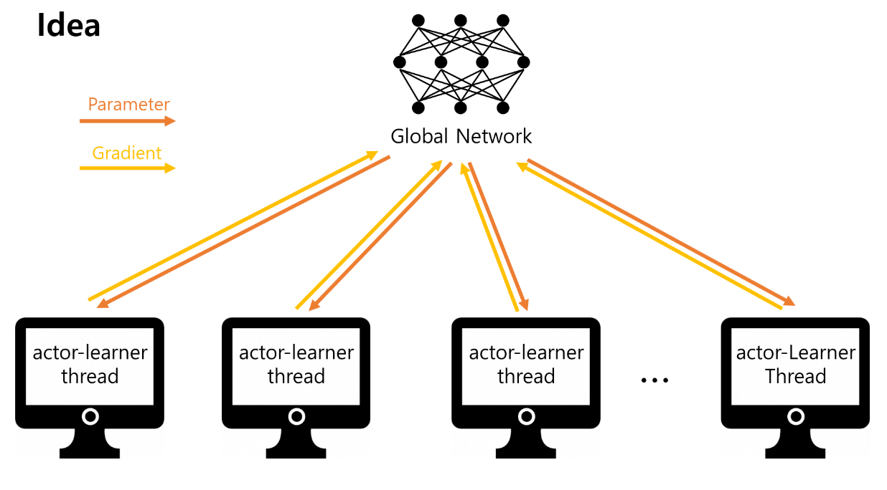
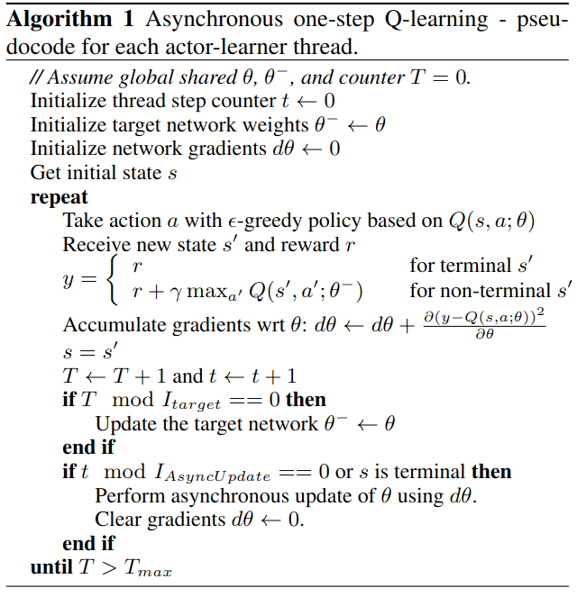
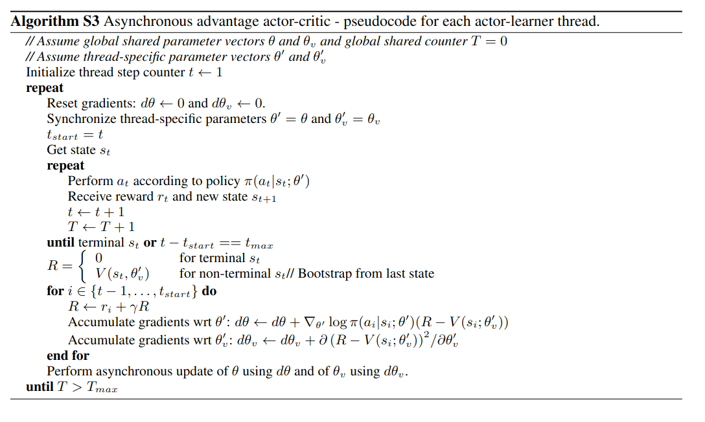
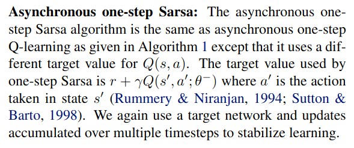
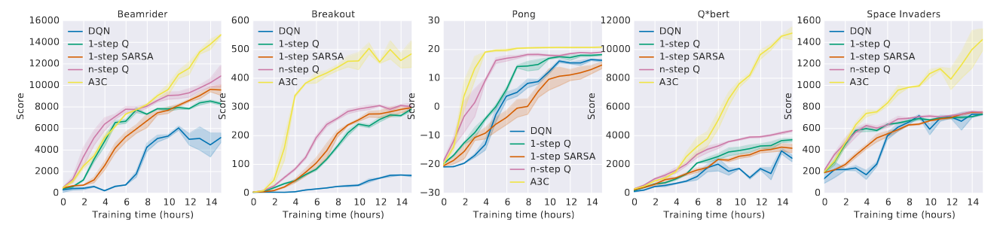
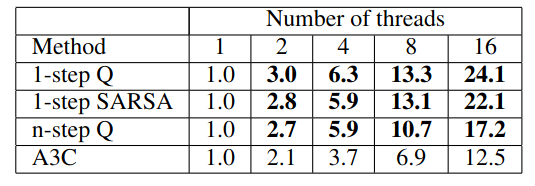
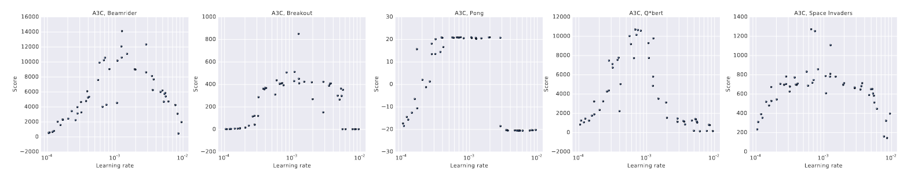
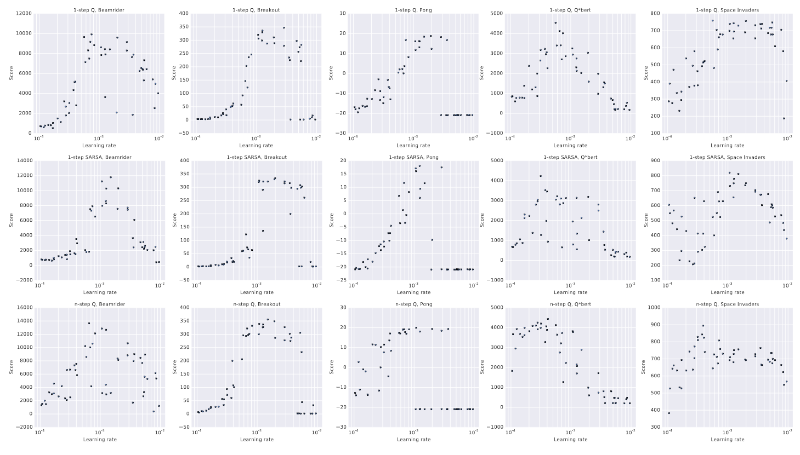

## Asynchronous Methods for Deep Reinforcement Learning
*PMLR(2016), 9860 citation*

[Intro](#intro) 
[Related Work](#related-work) 
[Method](#method) 
[Experiment](#experiment) 
[Conclusion](#conclusion) 

> Core Idea

<strong>"Asynchronous Algorithm Applicable to all Reinforcement Learning"</strong> 

***

### <strong>Intro</strong>
- Deep neural network 는 RL 이 효과적으로 수행되도록 풍부한 표현을 제공한다. 
- 하지만, online RL algorithm with deep neural network 는 근본적으로 unstable 하다. 
  - Online agent 가 관찰한 데이터의 sequence 는 non-stationary(target value 가 변동된다) 하며 time-correlation 이 강하다.
- 이 문제를 해결하고자 Agent 의 데이터를 experience replay buffer 에 저장함으로써, data 를 batch 로 묶을 수 있고 randomly sampling 할 수 있다.
  - 이런 방식은 non-stationarity 를 줄이고 correlation 을 끊을 수 있지만, 동시에 off-policy RL algorithm 으로 제한된다.
  - 또한, experience replay 방식은 몇가지 단점이 있다.
    1. 실제 상호 작용에 비해, 더 많은 메모리와 계산을 사용한다.
    2. Old policy 에서 생성된 data(target) 로 update 해야 한다.
- 본 논문에서는, experience replay 대신에 asynchronous update for multiple agents in parallel, on multiple instances of the environment 를 제안한다. 
- 병렬성은 agents 의 data 를 decorrelate 할 수 있고, 더욱 stationary process 가 된다.
   - 병렬적인 agent 들은 다른 state 에서 다양한 경험을 하기 때문에
  - 이 간단한 idea 는 on-policy (E.g., Sarsa, n-step method, actor-critic) 뿐만 아니라, off-policy (E.g., Q-learning) 에도 견고하게 적용된다.
- 마지막으로, 이전의 deep RL 은 주로 GPU 와 같은 특수 하드웨어 또는 대규모 분산 아키텍쳐에 의존했다. 그러나 본 논문에서는 표준 멀티코어 CPU 가 있는 단일 기기에서 실행된다. 그럼에도, GPU 기반 알고리즘보다 훨씬 빠른 시간에 더 나은 결과를 달성하며 대규모 분산 접근보다 적은 자원을 사용한다. 
- 성능이 가장 우수한 방법은 actor-critic 의 비동기 변형으로, 아타리 환경에서 SoTA 를 달성하면서도 GPU 대신 단일 다중 코어 CPU 에서 절반의 시간으로 훈련된다. 
***

### <strong>Related Work</strong>
1. General Reinforcement Learning Architecture (Gorila) 는 분산 환경에서 강화학습 에이전트를 비동기적으로 훈련
   - Replay Memory, learner 을 각각의 agent 마다 복제해서 학습했다. Gradient 값을 asynchronous 하게 중앙 서버로 보내어서 모델을 업데이트를 하고 이를 주기적으로 하위 learner 에 보내주는 방식
   - Gorila 에서 사용한 별도의 기계 및 매개 변수 서버 대신, 단일 기계의 여러 CPU thread 를 사용하는 것이 본 논문과 다른 점이다. 

***

### <strong>Method</strong>
- **A3C 는 A2C 에 asynchronous 를 적용시킨 것이고, 본 논문이 전달하고자 하는 것은 multiple CPU 로의 학습이다**
- Asynchronous update 를 사용해, 개념적으로 간단하고 가벼운 framework 를 제안한다.
- Sarsa, Q-learning, n-step Q-learning, advantage actor-critic 에 적용
- 서로 다른 actor-learner 가 환경의 서로 다른 부분을 탐색할 가능성이 높다. 따라서 다양성이 극대화된다.
- 병렬 actor-learner 를 사용하는 것은 
  1. 병렬 actor-learner 수에 비례해 선형인 훈련 시간 단축을 얻는다.
  2. Replay memory 에 의존하지 않으므로 Sarsa & actor-critic 과 같은 on-policy algorithm 에도 안정적으로 사용할 수 있다.

- Asynchronous one-step Q-learning pseudocode 
  - 여기서 중요한 점은 local network 를 쓰지 않는 것(A3C 와는 다르게)과 DQN 의 target network 를 쓴다는 것이다.
  - $\theta$: global network
  - $\theta^-$: fixed target network
  - $t \mod I_{AsyncUpdate} ==0$: 각 worker 가 global network 로 경험을 쌓고, 그 경험을 바탕으로 global network update
  - $T \mod I_{target} ==0$: fixed target network parameter 를 global network parameter 로 교체

- Asynchronous advantage actor-critic pseudocode 
    - $\theta, \ \theta_v$: global network
    - $\theta^{\`}, \ \theta_{v}^{\`}$: local network
    - td target 을 구할때, 1-step~5-step 까지의 reward 를 사용한다. 

- Asynchronous one-step Sarsa
  - target 만 바꾸면 된다. 이때, q-learning 과 마찬가지로 fixed target network 를 사용
  

***

### <strong>Experiment</strong>
- Atari $2600$ game 중 $5$ 개의 게임에 대해서 실험한 결과이다. 
  - DQN, 1-step Q-learning, 1-step Sarsa, n-step Q-learning, A3C 
  - 여기서 DQN 만 비교대상이다. 즉, DQN 을 제외한 나머지 method 는, 16 CPU core 를 (no GPU) 사용했다.
    - Q-learning 에서 replay memory & fixed Q-target 을 적용시킨게 DQN 이니까.
  - 모든 실험에서 4 가지 비동기 방법들이 DQN 보다 학습이 빠르게 진행되며, 성공적으로 훈련시킨 것을 볼 수 있다.

- Asyncronous actor-learner 수를 증가시킴에 따라 달성된 훈련 속도 향상을 보여준다. 
  - Value in table: average training speedup
  - Thread 16 까지는 super linear 인 것을 알 수 있다.

- 이 실험에서는 비동기 알고리즘의 안정성과 견고성을 분석할 수 있다.
  - 네 가지 알고리즘 각각에 대해 $50$ 개의 다른 학습률과 무작위 초기화를 사용하여 $5$ 개의 게임에서 모델을 훈련한 결과이다.
  - 각 방법과 게임 조합에 대해 좋은 점수를 얻는 학습률 범위가 일반적으로 있으며, 좋은 학습률이 있는 영역에 $0$ 점이 거의 없는 사실은, 모든 방법이 학습률과 무작위 초기화의 선택에 대해 상당히 견고하다는 걸 나타낸다.

***

### <strong>Conclusion</strong>
- RL algorithm 의 scale-up method 제시
  - Off/On policy & Vale/Policy based 모두에서 stable
  - Experience replay 대신 병렬적 actor 가 decorrelation 을 가능하게 해준다.
  - GPU 대신 CPU Thread 사용
  - Super Linear
- 4 가지 표준 강화 학습 알고리즘의 비동기 변형을 제시하고 병렬 actor-learners 에게 안정성을 부여한다.

***

### <strong>Question</strong>
- GPU 대신 다중 CPU 를 사용했는데, GPU + 다중 CPU or 다중 GPU or 다중 CPU 라면 어떨까.
- DQN 에 asynchronous parrarel 을 적용시키면 어떻게 될까.
