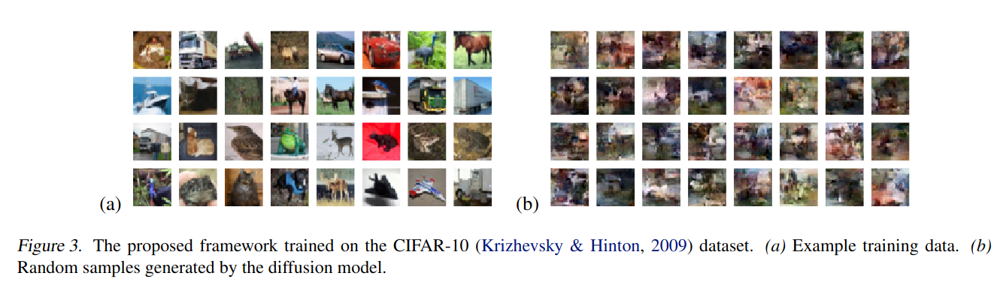
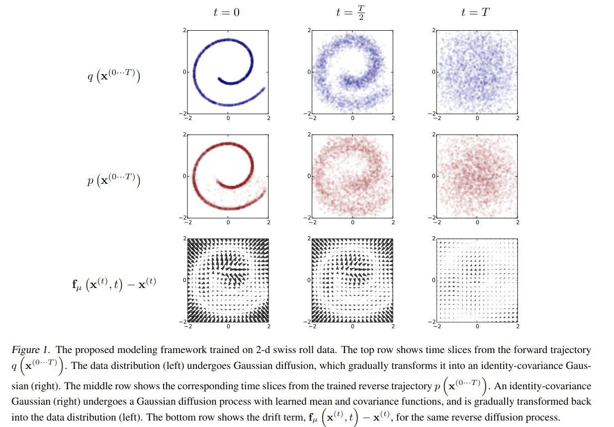
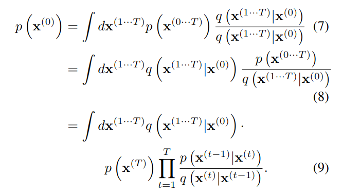

## Deep Unsupervised Learning using Nonequilibrium Thermodynamics
*PMLR(2015), 3787 citation, Stanford University, Review Data: 2024.4.3*

[Intro](#intro) 
[Related Work](#related-work) 
[Method](#method) 
[Experiment](#experiment) 
[Conclusion](#conclusion) 

> Core Idea

<strong>"test1"</strong> 

***

### <strong>Intro</strong>

- Non-equilibrium statistical physisc (비평형 통계 물리학) 에 영감을 받은 이 논문은, iterative forward diffusion process 를 통해 데이터 분포의 구조를 체계적으로 천천히 파괴한다. 
- 이후에, 데이터의 구조를 복원하는 reverse diffusion process 를 학습하여 데이터의 매우 유연하고 처리 가능한 생성 모델을 생성한다. 
- 학습된 모델에서 conditional probability 와 posterior probability 를 계산할 수 있다. 

- 역사적으로, 확률 모델은 tractability 와 flexibility 사이에서 tradeoff 를 겪고 있다. 
  - Tractability (취급하기 쉬움): gaussian distribution 을 사용하여 분석할 수 있고 쉽게 데이터에 맞출 수 있다. 하지만 이러한 모델은 풍부한 데이터 집합에서의 구조를 적절하게 설명할 수 없다. 
  - Flexibility (유연성): 임의의 데이터 구조에 맞게 바뀔 수 있다. 우리는 non-negative function $\phi(x)$ 를 통해, 유연한 분포 $p(x) = \frac{\phi(x)}{Z}$ 를 만들 수 있다. 하지만 normalization constant 를 구하는 것은 일반적으로 다루기 힘들다.

***

### <strong>Related Work</strong>

***

### <strong>Method</strong>

- Marcov chain 을 활용하여 distribution 을 내가 아는 distribution 으로 변환한다. (i.e., Gaussian distribution)
  - Marcov chain 의 마지막 지점을 확률 모델로 정의를 한다.
  - 각 step 이 해석 가능한 확률을 갖기 때문에 (계산 가능한) 전체 chain 도 해석적으로 평가할 수 있다. 
  - 이 framework 를 학습하는 것은 diffusion process 에 대한 작은 perturbation 을 추정하는 것을 포함한다. Small perturbation 을 추정하는 것은 전체 분포를 명시적으로 설명하는 것보다 더 추적 가능하다. 

- 2-d swiss roll data 에 대해서 보여준다.
  - 첫 번째 행은 실제 데이터에 perturbation 을 준 것
  - 두 번째 행은 학습된 모델을 통해 noise 로 부터 data 를 복원한 것
  - $t=T$ 시점은 identity-covariance Gaussian 이다. (즉, 다른 변수끼리 상관관계가 없는)
  - 평균과 분산을 모두 학습했다.
  - 세 번째 행은 같은 reverse diffusion process 에 대한 drift term 을 보여준다. 

- 본 논문의 목적은, 어떤 복잡한 data distribution 이라도 간단하고 분석가능한 (계산 가능한) distribution 으로 변환시키는 forward diffusion process 를 정의하는 것이다. 
  - 그런 다음, diffusion process 의 유한한 reverse process 를 학습하여 generative model 을 정의한다. 

- 먼저, 깨끗한 데이터 $X^{0}$ 에 perturbation 을 주어 내가 아는 분포인 $\pi$ 로 만드는 diffusion process 에 대해서 알아보자 

$\textsf{Diffusion Process}$

- $\pi(X^{t})$: $X^{0}$ 에서 $X^{t}$ 로 가는 내가 아는 분포 
- $q(X^{t}|X^{t-1}) = T_{\pi}(X^t | X^{t-1}; \beta_t)$: $X^{t-1}$ 에서 $X^{t}$ 로 가는 어떤 gaussian distribution 인데 markov 특성을 가진다. 이때 $\beta$ 는 diffusion rate 로 얼마나 perturbation 을 주는 지. 
- $\beta$: $t$ 가 작으면 크게, $t$ 가 크면 작게

$\textsf{Model Probability}$

- 초기의 $X^0$ 의 확률 $p(X^0)$ 를 구하기 위해, time step $t=1$ 부터 $T$ 까지의 모든 $X$ 에 대한 결합 확률 밀도 함수 $p(X^{0...T})$ 를 적분한다. 즉, $t=1$ 부터 $T$ 까지의 모든 가능한 $X$ 의 확률을 고려하여 초기 $X^0$ 의 확률을 계산하는 것이다. 
- 결합확률분포를 time step $T$ 부터 $0$ 까지 Marginalize 한다고 생각해보면 식은 쉽다. 
- 사건 A, B, C 에 대해서 $p(A)$ 를 구하고자 할 때, 결합확률분포 $p(A, B, C)$ 가 주어진 상황에서 모든 B, C 에 대해서 적분하면 $p(A)$ 만 남는다.  

$$ p(X^0) = \int p(X^{0...T})dX^{1 ... T} $$

그리고 나서 Marcov chain 을 가정했으니 다음과 같이 정의할 수 있다. 

$\textsf{Training}$

- 학습은 실제 분포와 학습된 분포의 거리를 재는 cross-entropy 를 minimize 하는, 여기서는 log likelihood 를 maximize 하는 것이다. 
  - Minimize 하면 실제 분포값과 같아진다. 그게 lower-bound 여서

***

### <strong>Experiment</strong>

- Two-dimensional: swiss roll, binary sequence, handwritten digit (MNIST)
- Natural image: CIFAR-10, bark, dead leaves

***

### <strong>Conclusion</strong>

***

### <strong>Question</strong>

