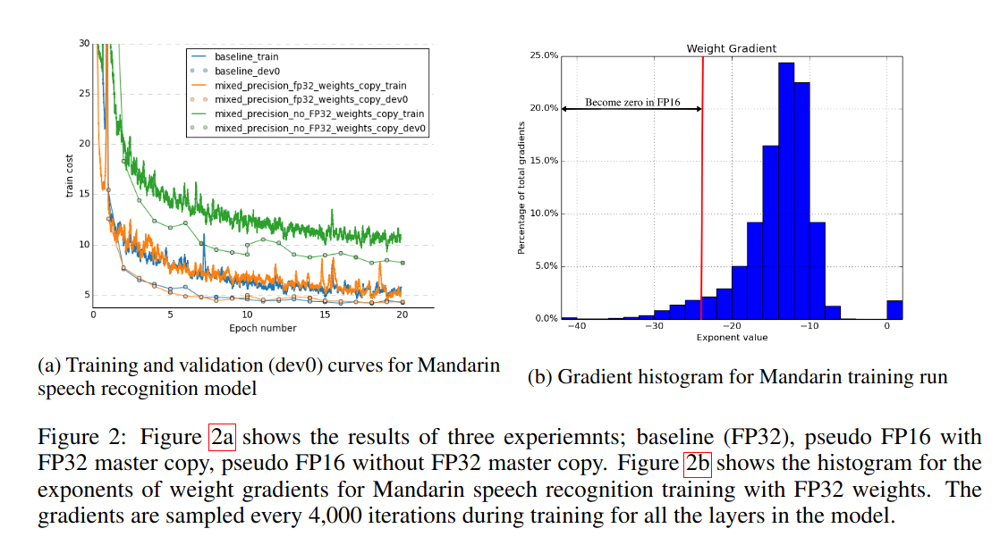

## MP: Mixed Precision Training
*arXiv(2017), 1505 citation*

[Intro](#intro) 
[Related Work](#related-work) 
[Method](#method) 
[Experiment](#experiment) 
[Conclusion](#conclusion) 

> Core Idea

<strong>"While Maintain Accuracy, Train FP 16"</strong> 

***

### <strong>Intro</strong>

- 일반적으로, NN 의 size 를 키우면 성능을 올라가지만 memory/compute requirements for training 도 올라간다. 

- Model weight 는 float point $32$ 로 이루어져 있기 때문에, 일반적으로 우리는 fp $32$ 로 학습을 진행한다. 
- 학습이 이루어진 weight 값은 매우 작고 update 양 또한 값이 매우 작다. 만일, fp $16$ 이나 $8$ 등으로 model weight 를 바꿔서 학습을 진행하게 되면, 그 작은 값들을 표현할 수 없기 때문에 값의 손실로 인해 정밀하게 모델이 학습되지 않는다. 
- 본 논문에서는, IEEE fp $16$ 으로 학습을 하면서 accuracy 를 잃지 않는 방법을 소개한다. 

***

### <strong>Related Work</strong>

***

### <strong>Method</strong>

- Process
  - 1. Master weight (FP $32$) 로부터 copy weight (FP $16$) 을 만든다. (copy)
  - 2. Input 을 FP $16$ 으로 만든다. (casting)
  - 3. Forward pass
  - 4. Forward pass 로부터 계산된 prediction 값을 FP $32$ 로 casting.
  - 5. FP $32$ 로 casting 된 값을 가지고 Loss 를 계산한다. 
  - 6. Loss 에 scaling factor 를 곱한다. 
  - 7. FP $32$ loss 를 FP $16$ 으로 casting.
  - 8. Scaled FP $16$ loss 를 이용하여 backward (gradient 계산)
  - 9. 계산한 gradient 를 FP $32$ 로 casting 하고, 이를 다시 scaling factor 로 나눈다.
  - 10. FP $32$ gradient 를 이용해 FP $32$ weight 를 update 한다. 

- Loss scale value 를 찾는 것은 많은 노력을 필요로 한다. 추후에, NVIDIA 에서 Automatic Mixed Precision 을 발표하면서 loss scale 을 자동으로 찾아주는 algorithm 을 요즘엔 많이 사용한다. 

***

### <strong>Experiment</strong>

- (a): FP $32$ 로 학습한 것과 mixed precision (Ours) 로 학습한 것은 성능이 비슷한 반면, FP $16$ 으로 학습하면, 성능이 떨어진다. 즉, mixed precision 은 FP $16$ forward/backward 를 하면서 memory/computation 을 아끼는 동시에 학습 성능은 FP $32$ 와 동일하다.
- (b): FP $32$ 로 model 을 학습할때의 histogram of weight gradients 를 보면, 그 값들이 대부분 FP $16$ 으로 표현할 수 없는 값들이다. 즉, 이 표현할 수 없는 값들을 활용해야한다. (by loss scaling)

- 학습하는 동안의 histogram of activation gradient 이다. 마찬가지로, FP $16$ 으로 표현되지 않는 값들이 매우 많다. 

- Mixed precision vs Baseline (FP $32$)
  - 성능이 떨어지지 않을 뿐더러, 오히려 올라간 사례도 있다.

- Loss scaling 을 너무 적게 하면 값의 손실이 여전히 크다.

***

### <strong>Conclusion</strong>

***

### <strong>Question</strong>

<a href="">link</a>

> 인용구
