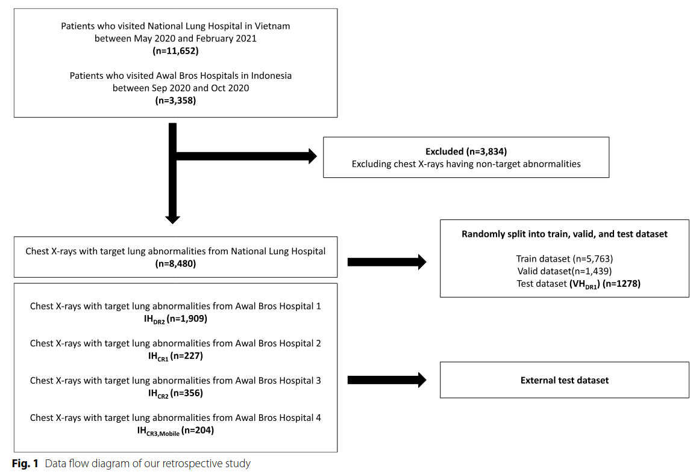
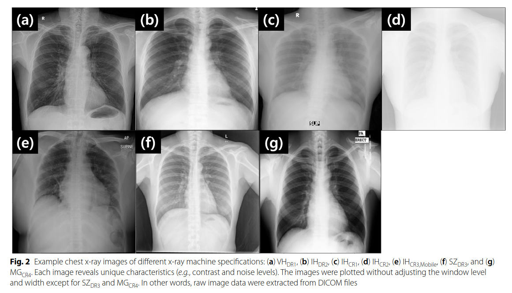
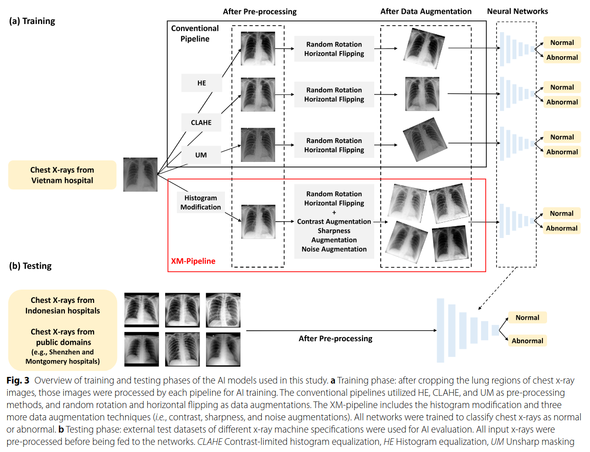

## Pulmonary abnormality screening on chest x-rays from different machine specifications: a generalized AI-based image manipulation pipeline
*European radiology experimental(2023), 1 citation, RadiSen, Review Data: 2025.01.08*

[Intro](#intro) 
[Related Work](#related-work) 
[Method](#method) 
[Experiment](#experiment) 
[Conclusion](#conclusion) 

> Core Idea

<strong>"Introduces a New Image Processing Pipeline to Address the Generalization Problem"</strong> 

***

### <strong>Intro</strong>

$\textbf{Background}$

- Chest x-ray (흉부 x-ray)는 pulmonary abnormality screening (폐 이상 검사)에 흔히 사용된다. 
- 하지만, x-ray의 이미지 특성이 machine specifications (기계 사양)에 매우 의존하기에 임상적으로 다양한 기계에 적용했을 때, 특정 장비에 대해 개발된 AI는 보통 실패한다. 
- X-ray 기계는 대체로 detector (e.g., 컴퓨터 방사선 촬영 (CR) 및 디지털 방사선 촬용 (DR))과 generator (e.g., 이동식 또는 고정식)으로 구성된다. 
  - 예를 들어, **DR 감지기**에서 촬영한 흉부 x-ray 이미지는 동일한 방사선량에서 CR 감지기에서 촬영한 이미지보다 일반적으로 **더 좋은 이미지 품질**을 보인다.
  - 또한, **이동식 x-ray 기계**에서 촬영한 흉부 x-ray 이미지는 제한된 최대 전력으로 인해 **고정식 기계보다 더 많은 노이즈**를 포함하는 경우가 많다.
- 이러한 문제를 극복하기 위해 본 논문은 image manipulation pipeline을 제안한다. 

$\textbf{Methods}$

- 2020년 5월 ~ 2021년 2월까지 5개의 기관에서 다른 generators/detectors로 $15,010$ x-ray 사진을 수집했다. 
- 본 논문은 single system에서 x-ray를 사용해 폐 이상을 분류하기 위해 AI model을 개발했다.
- 그 후, 다양한 기계 사양에 chest x-ray의 성능을 외부적으로 실험했다. 
- 본 논문에서 제안한 manipulation pipeline (XM-pipeline)의 AUC (수신자 조작 특성 곡선 아래 면적) (the area under the receiver operating characteristics curve)와; 기존의 이미지 처리 파이프라인 (histogram equalization [HE], contrast-limited histogram equalization [CLAHE], and unsharp masking [UM] with common data augmentations)을 사용하여 개발된 AI 모델의 AUC를 비교했다.

> AUC는 모델이 양성과 음성을 얼마나 잘 구분하는 지를 측정하낟. 값은 0에서 1사이로, 1에 가까울수록 좋은 성능을 의미한다.
> > x축이 FPR (FP / (FP + TN)) y축이 TPR (TP / (TP + FN)) = recall로, recall이 중요한 task이므로 1에 가까워야 한다.

$\textbf{Results}$
- XM-pipeline model은 다른 기계 사양의 모든 데이터셋에 대해 가장 높은 성능을 보여줬다. 
  - Chest x-ray: n = 356, AUC 0.944 for XM-pipeline versus 0.917 for HE, 0.705 for CLAHE, 0.544 for UM, p ≤ 0.001, for all
  - Mobile x-ray generator: n = 204, AUC 0.949 for XM-pipeline versus 0.933 for HE, p = 0.042, 0.932 for CLAHE (p = 0.009), 0.925 for UM (p = 0.001)

***

### <strong>Related Work</strong>

***

### <strong>Method</strong>

$\textbf{Image collection and manipulation}$

- 베트남과 인도네시아 병원에서 흉부 x-ray 이미지를 수집했다.
  - 2020년 5월부터 2021년 2월까지 베트남 폐 병원에서 총 $11,652$장을 수집했다.
  - 2020년 9월부터 10월까지 인도네시아 $4$개 지역에 위치한 Awal Bros 병원에서 $3,358$장을 수집했다. 
  - 각 병원은 서로 다른 x-ray 기계사양을 사용했다. 
  
- 방사선과 전문의의 주석을 바탕으로 $3,834$장은 제외했다. 
- 베트남 병원에서 수집된 흉부 x-ray이미지는 train (5,763), validation (1,439), and test (1,278)으로 무작위 분할했다.
- 또한, 인도네시아 병원에서 수집된 이미지는 각 x-ray 기계와 병원에 따라 외부 test 데이터셋으로 $4$ 개의 데이터셋으로 분할했다.

$\textbf{Train models}$

- EfficientNet-B6를 사용하고 1) 전통적인 이미지 처리 파이프라인, 2) 본 논문에서 제안한 XM-pipeline, 3) 이미지 처리없이 (=baseline) $5$개의 모델을 훈련시켜 normal/abnormal로 분류했다. 
  - 각 파이프라인은 전처리와 data augmentation으로 구성된다. 
  - 모든 흉부 x-ray 이미지는 전처리 후 $512 \times 512$로 크기가 조정됐다. 

$\textbf{Conventional image processing pipeline}$

- 전통적인 이미지 전처리에는 HE, CLAHE, UM을 사용했다. 
- 증강 기법으로는 일반적으로 사용되는 무작위 회전(각도 범위 [-15, 15])과 수평 플리핑(확률 0.5)을 적용했다.

$\textbf{XM-pipeline}$

- 전처리: 히스토그램을 수정하여 밝기를 정규화하고 폐 영역 내의 정보를 최대화했다. 

***

### <strong>Experiment</strong>

***

### <strong>Conclusion</strong>

- Data pre-processing & Data augmentation 기법을 적절하게 사용하여 모든 기계에 사용할 수 있게 일반화 성능을 올린다.

***

### <strong>Question</strong>

<a href="">link</a>

> 인용구
