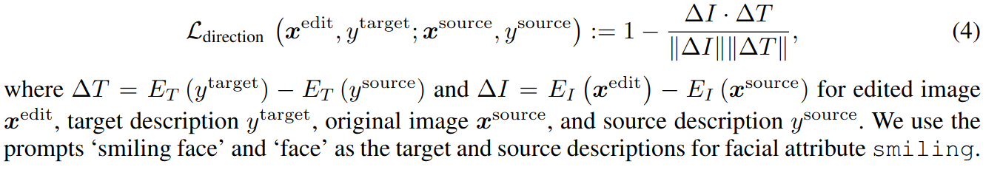
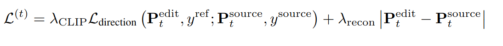

## Asyrp: Diffusion Models Already Have A Semantic Latent Space
*ICLR(2023),  145 citation, Yonsei University, Review Data: 2024.07.15*

[Intro](#intro) 
[Related Work](#related-work) 
[Method](#method) 
[Experiment](#experiment) 
[Conclusion](#conclusion) 

> Core Idea

<strong>"test1"</strong> 

***

### <strong>Intro</strong>

$\textbf{이 주제의 정의 및 요구사항과 중요한 이유}$

- Diffusion model은 다양한 분야에서 놀라운 생성 능력을 달성했다. 하지만, 생성 과정을 조작하는데 필수적인 semantic latent space는 부족하다. 

$\textbf{이 주제의 문제점과 기존의 노력들}$

- 단순하게 latent variable (i.e., intermediate noisy images)을 수정하는 건 성능이 저하된다. 
- Classifier guidance는 classifier의 gradient를 이용하여 target class와 일치하게끔 reverse process를 수행한다. 이는 latent variable에 대해서 추가적인 classifier를 학습시켜야한다. 
- 한편, GAN은 latent space에서 직관적인 이미지 편집을 본질적으로 제공한다. 그러나 실제 이미지가 주어졌을 때, 정확한 latent vector를 찾는 것은 종종 어려우며 예상치 못한 외형 변화를 초래한다. 

$\textbf{본 논문에서 해결하고자 하는 문제와 어떻게 해결하는지, 그 결과들}$

- frozen pretrained diffusion model에서 semantic latent space를 발견하여 Asymmetric Reverse Process (Asyrp)를 제안한다. 
  - *h-space*라는 본 논문의 semantic latent space는 semantic image manipulation을 달성하는데 좋은 특성을 가지고 있다: 균질성, 선형성, 견고성, 시간 단계 간의 일관성 
  - 추가로, 다양한 편집과 품질 향상을 위한 생성 과정의 원칙적인 설계를 제안한다: 간격의 편집 강도와 시간 단계에서의 품질 결함을 정량화 할 수 있는 기준이다. 

- *h-space* 에서의 동일한 shift는 모든 이미지에서 동일한 attribute 변화를 가져온다. 
  - Linear change는 linear change를 유도한다. 변형된 이미지는 quality의 저하가 없다. 
  - 원하는 attribute에 대해 timestpe 전체에 걸쳐, 변화가 거의 동일하다. 

***

### <strong>Related Work</strong>

***

### <strong>Method</strong>

$\textbf{Background}$

- DDIM

- Image manipulation with CLIP
  - Cosine distance를 이용한 directional loss는 mode collapse없이 균등한 편집을 달성합니다. 
  - 본 논문에서는 얼굴의 특성 중 하나인 **smiling**에 대한 수정을 할 때, *smiling face* 와 *face* 를 prompt로 사용한다.

$\textbf{Methodolgy}$

- DDIM의 reverse process에서 predicted $x_0$을 $\epsilon_t^{\theta}$에서 $\tilde\epsilon_t^{\theta}$로 shift한다. 
  - Direction pointing to $x_t$는 보존 

- Blended Diffusion와 같이 수정된 $\tilde\epsilon_t^{\theta}$로 만든 $P_t^{edit}$과 CLIP loss를 통해 $\Delta \epsilon$을 찾는다. 
  - $\Delta \epsilon$이 $x_0^{edit}$의 attribute를 표현함에도 불구하고, $\epsilon$ space는 diffusion model에서의 semantic latent space의 필요한 특성이 부족하다. 

- *h-space*: $\epsilon_t^{\theta}$를 조절하기 위한 bottleneck in U-Net의 feature space이다.
  - $h_t$는 time step $t$에서의 bottleneck feature map
  - $h_t$는 더 작은 해상도를 가지지만 $\epsilon_t^{\theta}$보다 high-level semantics를 가지고 있다.

- $\tilde\epsilon_t^{\theta}$ 대신에 $\epsilon_t^{\theta}(x_t | \Delta h_t)$를 사용한다. 
  - $\Delta h_t$는 $L^{(t)}$를 최소화하는 gradient이고, 이는 original feature map $h_t$에 더해진다. 
  - 본 논문에서는 다른 latent vector들이 가지지 못하는 다음의 특성들을 관찰했다. 
    1. 같은 $\Delta h$는 다른 sample에 대해서 동일한 효과를 가져온다.
    2. 선형적인 $\Delta h$의 scaling은 attribute change의 크기를 조절한다. 
    3. 여러개의 $\Delta h$를 더하는 것은 동시에 여러개의 동일한 attribute를 조작한다.
    4. $\Delta h$는 저하없이 생성되는 이미지의 결과를 보존한다.
    5. $\Delta h_t$는 모든 timestep에 걸쳐 일관성 있다. 

***

### <strong>Experiment</strong>

***

### <strong>Conclusion</strong>

***

### <strong>Question</strong>

<a href="">link</a>

> 인용구
