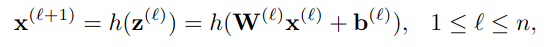
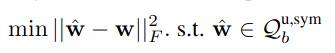
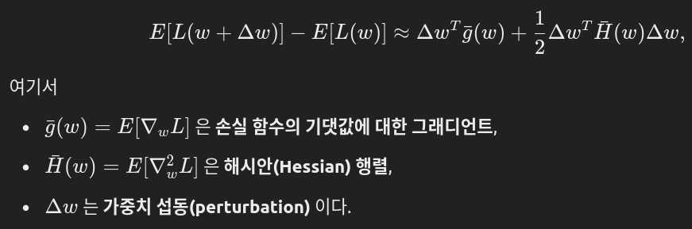
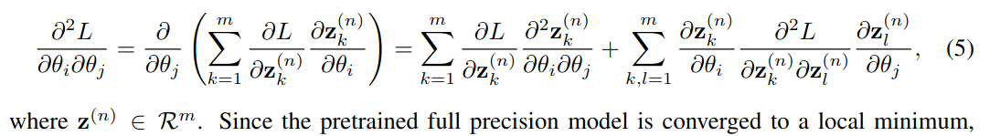
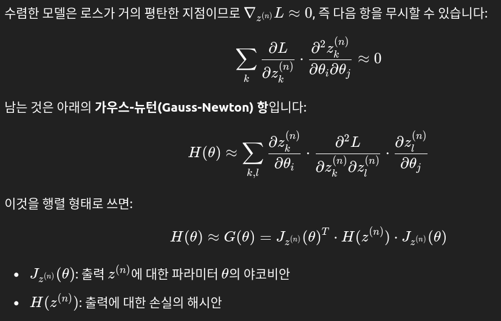
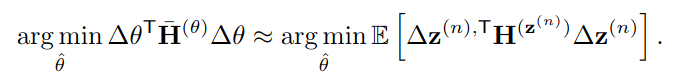
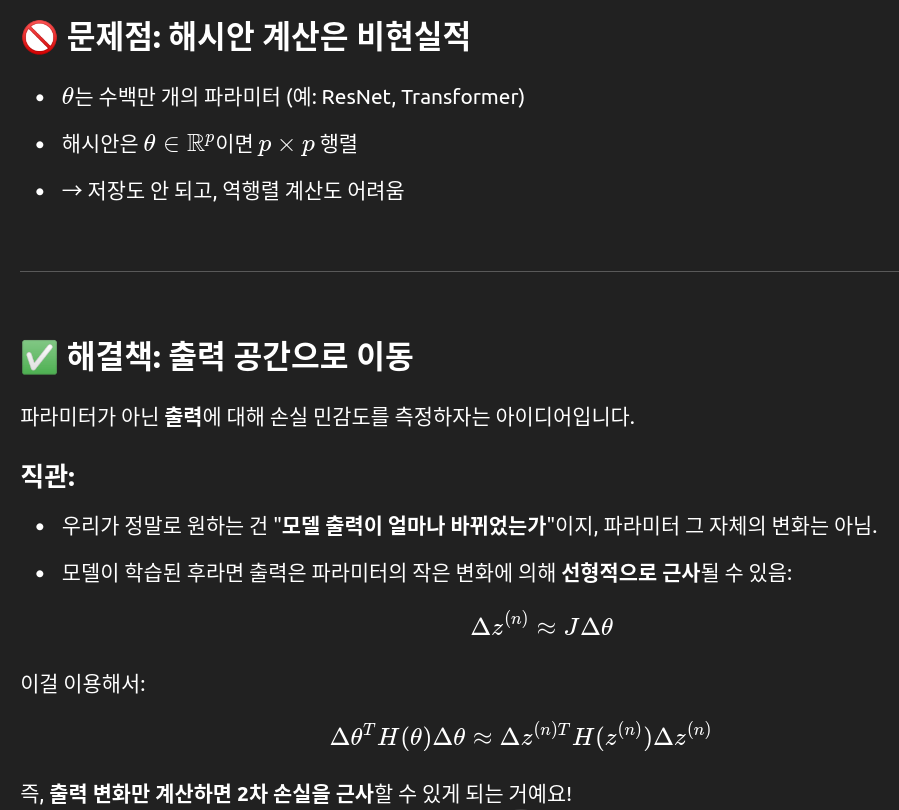

## BRECQ: Pushing The Limit of Post-Training Quantization by Block Reconstruction
*arXiv(2021), 478 citation, University of Electronic Science and Technology of China, Review Data: 2025.04.03*

[Intro](#intro) 
[Related Work](#related-work) 
[Method](#method) 
[Experiment](#experiment) 
[Conclusion](#conclusion) 

> Core Idea

<strong>"test1"</strong> 

***

### <strong>Intro</strong>

$\textbf{이 주제의 정의 및 요구사항과 중요한 이유}$

- QAT는 전체 훈련 데이터셋과 대량의 연산 자원이 필요하며, end-to-end 역전파를 수행해야 하므로 압축된 모델의 생산 주기가 크게 지연된다. 
  - 또한, 프라이버시 문제를 고려하면 항상 훈련 데이터를 즉시 사용할 수 있는 것은 아니다. 
  - 따라서 재훈련 없이 신경망을 양자화하는 사후 훈련 양자화(PTQ, Post-training Quantization) 기법에 대한 산업적 수요가 증가하고 있다.

- PTQ는 일반적으로 더 적은 학습 데이터를 필요로한다. 하지만 QAT보다는 덜 강력한 quantized model을 생성한다.
  -  예를 들어, DFQ(Nagel et al., 2019)는 ResNet-18을 8비트로 양자화할 때 정확도 손실 없이 $69.7$ %의 top-1 정확도를 유지하지만, 4비트 양자화에서는 정확도가 $39$ %까지 급락한다. 
  -  이는 파라미터 공간에서의 근사가 모델 공간에서의 근사와 일치하지 않으며, 따라서 최종 작업 손실을 최적화할 수 없기 때문이다.

$\textbf{이 주제의 문제점과 기존의 노력들}$

- 최근 연구 (AdaRound)에서는 이 문제를 인식하고, 테일러 급수 전개를 통해 정확도 저하를 분석하였다. 
  - 2차 오류 항에 대한 분석 결과, 각 계층의 출력을 재구성하면 작업 손실의 저하를 근사할 수 있음을 보였다. 
  - 그러나 해당 연구는 가중치를 INT2로 더 낮추는 것이 어렵다. 
  - 이는 weight의 perturbation이 충분히 작지 않을 때, 해시안 행렬(Hessian matrix)에서 계층 간 종속성을 무시할 수 없을 정도로 커지기 때문이다.
    - 즉, weight를 다시 `quan - dequan` 했을 때 실제 weight와의 차이가 크다면 layer간 독립을 가정할 수 없다.
    - AdaRound에서는 첫 번째 목적 함수 $\mathbf{H}^{(w)}$ task loss를 설정할때, 해시안 행렬의 block diagonal 즉, layer간 독립을 가정했다. (계산 복잡도 문제를 해결하기 위해)

$\textbf{본 논문에서 해결하고자 하는 문제와 어떻게 해결하는지, 그 결과들}$

- 본 연구에서는 가우스-뉴턴(Gauss-Newton) 행렬을 기반으로 2차 오류를 분석하고, 이를 네트워크의 최종 출력으로 변환할 수 있음을 보인다. 
  - 그러나 이러한 방식은 일반화 성능이 저하되는 한계가 있다. 최적의 균형을 달성하기 위해, 우리는 중간 선택지로 블록 재구성(block reconstruction) 방식을 채택한다.

- 본 논문에서는 새로운 PTQ framework (BRECQ)를 제안한다.
  - 최초로 PTQ에서 bit-width 한계를 INT2까지 낮춘다. 
  - Basic building block에 대해 이를 각각 reconstruction한다.
  - 2차 오류에 (second-order error) 대한 이론적 연구를 통해, BRECQ가 계층 간 종속성과 일반화 오류 사이에서 (cross-layer dependency and generalization error) 균형을 효과적으로 달성함을 보인다. 
  - 또한, 양자화의 성능을 더욱 활용하기 위해, 계층 간 및 계층 내 민감도를 근사하여 혼합 정밀도 기법을 프레임워크에 통합한다.

- 다양한 수작업 및 탐색된 신경망 아키텍처를 대상으로 이미지 분류 및 객체 탐지 작업에 대한 광범위한 실험을 수행하였다. 
  - 추가적인 기법 없이도 PTQ가 4비트 ResNet 및 MobileNetV2에서 QAT에 필적하는 성능을 달성할 수 있으며, 양자화된 모델을 240배 더 빠르게 생성할 수 있음을 증명한다.

$\textbf{본 논문의 주요 기여점}$

- 2차 오류 분석을 기반으로, 재구성 단위(reconstruction units)를 정의하고 블록 재구성이 최적의 선택임을 이론적·실험적 근거로 입증한다. 또한, 피셔 정보 행렬(Fisher Information Matrix) 을 활용하여 재구성 과정에서 각 사전 활성화 값(pre-activation)에 중요도를 할당한다.

- 유전 알고리즘(genetic algorithm)과 정밀하게 정의된 블록 내 민감도 측정 방법을 도입하여, 지연(latency)과 모델 크기(size)를 보장하는 혼합 정밀도(mixed precision) 양자화 신경망을 생성한다. 이 기법은 전문 하드웨어(FPGA)와 범용 하드웨어(ARM CPU) 모두에서 성능을 향상시킨다.

- 광범위한 실험을 수행하여 제안된 방법의 효과를 검증한다. 실험 결과, 본 방법은 다양한 작업과 모델에 적용 가능함을 확인하였다. 또한, 사후 훈련 양자화(PTQ) 방식으로도 INT2 수준의 양자화를 수행하면서도 정확도 손실을 최소화할 수 있음을 최초로 증명한다.

***

### <strong>Related Work</strong>

***

### <strong>Method</strong>

$\textbf{Notations and Background}$

- $\mathbf{x}^{(l)}$: $l$ layer의 activation
- $\mathbf{z}^{(l)}$: $l$ layer의 weighted sum (pre-activation)
- $h()$: ReLU activation
- $n$ layers

- Objective function
  - $q()$: Quantization function
  - Rounding-to-nearest

- Taylor Expansion
  - 양자화로 인한 손실 저하 (loss degradation)을 정량적으로 분석하기 위해 테일러 급수 전개를 사용하여 다음과 같이 근사했다.
  - 학습이 잘 된 모델은 수렴을 할테니, 그때의 Gradient는 $0$으로 간주할 수 있다.

- 그러나 대규모의 전체 해시안을 활용하여 최적화하는 것은 메모리 측면에서 비효율적이다. 해시안 행렬 전체를 저장하려면 테라바이트(TB) 단위의 메모리 공간이 필요하기 때문이다.

- 이 문제를 해결하기 위해, 연구진은 다음 두 가지 가정을 추가적으로 도입하였다:
  - 각 레이어는 서로 독립적(mutual-independent)이며, 따라서 해시안 행렬(Hessian)은 레이어별 대각선 형태(layer-diagonal)이다.
  - Pre-activation $\mathbf{z}^{(l)}$에 대한 second-order derivative (해시안)은 상수 대각 행렬이며, 이는 입력 데이터와 독립적이다. (엄청 강력한 가정이다)
    - $\mathbf{H}^{(z^{(l)})} = c \times \mathbf{I}$ 

- 결국 objective는 실용적인 근사 신호 (feature-maps: $\mathbf{z} = \mathbf{W}\mathbf{x}$ )로 변환된다.
  - Layer끼리 독립적이니, layer별 feature map reconstruction으로 quantized model이 구해지기 때문이다.
  - 최근 연구들(예: Bit-Split (Wang et al., 2020), AdaQuant (Hubara et al., 2020))도 레이어별 목표(layer-wise objective) 를 활용하여 사후 훈련 양자화(PTQ) 성능을 개선하려 했다. 그러나 이러한 방법들은 가중치를 INT2로 양자화하는 데 실패했다.
  - 본 논문은 그 근본적인 원인이 $\Delta \mathbf{w}$ 값이 커질수록 기존의 가정이 유지되지 않으며, 보다 정확한 신호(accurate signal)가 필요하기 때문이라고 본다.
  - 직관적으로, 각 layer를 quantization할 때, original FP value를 입력으로 받을텐데 perturbation이 커지면 original FP value와 `quan - dequan` weight간의 차이가 커져서 layer간의 독립성이 깨지기 때문이다. 

$\textbf{Cross-Layer Dependency}$

- NN output을 $\mathbf{z}^{(n)} = f(\theta)$라고 정의하면, loss function은 다음과 같이 표현할 수 있다. $L(f(\theta))$.
  - 이때 $\theta$는 $n$개의 layer들에 대한 weight $\mathbf{w}$의 전체 집합이다. 

- 수렴한 모델은 $\nabla_{\mathbf{z}^{(n)}}L = 0$에 가까우므로 첫 번째 항은 제거가능하다. 
- 따라서, 다음과 같이 표현할 수 있다.

- 야코비안 $J$은 계산량이 너무 커서 직접 계산하기 어렵기 때문에, 1차 테일러 근사로 표현한다.
  - $\mathbf{z}^{(n)} = f(\theta)$로 정의한 것을 기억하자.

$$ f(\theta + \Delta \theta) = f(\theta) + f'(\theta)\Delta \theta $$

$$ \hat{\mathbf{z}}^{(n)} = \mathbf{z}^{(n)} + \frac{\partial\mathbf{z}^{(n)}}{\partial\theta}\Delta \theta $$

$$ \Delta\mathbf{z}^{(n)} = \hat{\mathbf{z}}^{(n)} - \mathbf{z}^{(n)} \approx \mathbf{J}_{\mathbf{z}^{(n)}}(\theta) \Delta \theta $$

- 1차 테일러 근사를 통해 처음의 목적 함수를 다음과 같이 표현할 수 있다.
  - 파라미터 공간에서의 2차 손실을 출력 공간에서의 2차 손실로 변환한 것이다.
  - 수식을 변환한 핵심은 실용적인 계산 효율성과 근사적 최적화의 필요성이다.
  - 기존의 목적함수를 계산하려면 파라미터 공간에서 계산해야 했기에 너무 크고 현실적으로 계산이 불가능했다. 
  - 하지만 변형된 목적함수는 출력 변화만 계산하면 되기에 훨씬 간편하다.

$\textbf{Block Reconstruction}$

- 비록 **네트워크 전체 출력 재구성(network-wise reconstruction)**이 **2차 오차(second-order error)**를 정확히 추정할 수는 있지만, 실제로는 **PTQ(Post-Training Quantization)**에서 사용하는 **레이어별 재구성(layer-by-layer reconstruction)**보다 성능이 떨어지는 것으로 나타났다.
  - 그 주요 원인은 전체 네트워크를 1024개의 보정 데이터 샘플만을 가지고 최적화할 경우, **과적합(overfitting)**이 쉽게 발생하기 때문이다. Jakubovitz et al. (2019)이 설명했듯이, 모델 파라미터 수가 학습에 사용되는 데이터 수보다 많아지면 네트워크는 완벽한 표현력을 가질 수는 있지만, **학습 오차(training error)**가 낮다고 해서 **테스트 오차(test error)**까지 낮아진다는 보장은 없다.
  - 실제로 레이어 단위 재구성이 일종의 정규화 역할을 하며, 각 레이어의 출력 분포를 정렬시켜 일반화 오차를 줄이는 데 도움을 준다는 것을 발견했다.
  - 즉, **레이어 단위(layer-wise)**와 네트워크 단위(network-wise) 재구성 방식 모두 각각의 한계가 존재하며, **중간 수준의 재구성 단위(granularity)**를 선택함으로써 바이어스-분산 절충(bias-variance trade-off) 측면에서 더 나은 결과를 얻을 수 있다.

- 레이어 단위 최적화는 **레이어-대각 해시안(layer-diagonal Hessian)**에 해당하고 (Fig. 1b의 파란색 부분), 네트워크 단위 최적화는 **전체 해시안(full Hessian)**에 해당한다 (Fig. 1b의 녹색 부분). 이와 유사하게, 우리는 중간 단계로 **블록 대각 해시안(block-diagonal Hessian)**을 정의할 수 있다.

- 이러한 블록 대각 해시안은 **블록 간 상호작용(inter-block dependency)**은 무시하고, **블록 내부 상호작용(intra-block dependency)**만 고려하여 일반화 오차를 줄일 수 있다. 따라서 본 논문은 **중간 출력(intermediate output)**을 블록 단위로 재구성한다.
  - 마지막으로, 본 논문은 이 분석이 재구성 단위의 최적 구성을 제시하는 것은 아님을 밝혔다. 블록 단위 선택은 실험적 결과에서 도출되었다.

***

### <strong>Experiment</strong>

***

### <strong>Conclusion</strong>

***

### <strong>Question</strong>

<a href="">link</a>

> 인용구
