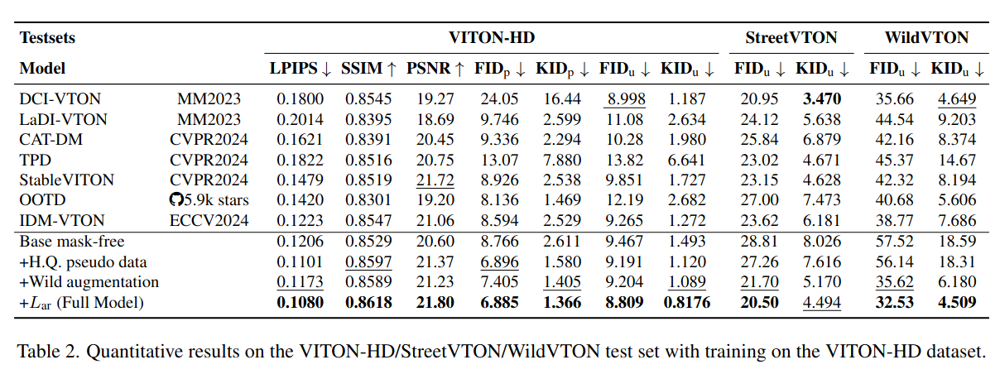

## BooW-VTON: Boosting In-the-Wild Virtual Try-On via Mask-Free Pseudo Data Training
*arXiv(2024), 0 citation, TianjIn University * Alibab Group, Review Data: 2024.08.19*

[Intro](#intro) 
[Related Work](#related-work) 
[Method](#method) 
[Experiment](#experiment) 
[Conclusion](#conclusion) 

> Core Idea

<strong>"Synthesize Wild Try-On Images While Preserving Background/Foreground of Image Without Precise Inpainting Mask"</strong> 

***

### <strong>Intro</strong>

$\textbf{이 주제의 정의 및 요구사항과 중요한 이유}$

- Image-based virtual try-on은 점점 인기가 많아지고 있고 특정 사람의 realistic try-on image를 생성하는 중요한 task이다. 

$\textbf{이 주제의 문제점과 기존의 노력들}$

- 기존의 방법론들은 source image에서의 original garment를 지우기 위해, 정확한 mask를 사용했고, diffusion model에 기반하여 간단하고 간편한 현실적인 이미지를 생성하는 것을 달성했다. 
- 하지만, 다양한 전경 (foreground) occlusion과 person pose를 포함하는 complex wild try-on data에 대한 정밀한 inpainting mask를 구하는 것은 쉽지 않다. 
- 이 어려움은 실제 환경에서 poor performance를 초래한다.
  - 즉, train과 inference in wild try-on 간의 정확한 inpainting mask의 차이라고 볼 수 있다.

- Wild Try-on vs Shop Try-on
  - Wild와 비교해서 shop은 비교적 간단한 mask를 포함한다. 
  - 본 논문은 non-try-on area content (inpainting mask외의 영역)를 보존하면서 human parsing feature의 의존성을 줄인다. 

$\textbf{본 논문에서 해결하고자 하는 문제와 어떻게 해결하는지, 그 결과들}$

- 추가적인 inpainting mask를 필요로 하지 않는 wild scenario로부터 large-scale의 unpaired training data를 얻는 효율적인 data augmentation method를 제안한다. 
- 게다가 try-on localization loss는 더 합리적인 try-on 결과를 구하기 위해 더 정확한 try-on area를 지역화한다. 
  - 오직 reference cloth image, source pose image, source person image만을 필요로 한다. 
  - 이는 기존의 방법론과 비교해서 cost-effective하고 user-friendly하다. 

***

### <strong>Related Work</strong>

- Mask-based virtual try-on
- Mask-free virtual try-on
- In-the-wild virtual try-on

***

### <strong>Method</strong>

$\textbf{Novel Training Paradigm}$

- 먼저, powerful pre-trained try-on model (i.e., IDM-VTON: mask-based model)을 이용해 simple in-shop scenario에서 전통적인 가상 착용 파이프라인을 수행한다. (Unpaired setting)
  - 이때의 주요한 input은 source person image, source cloth image이다.
- 그런 다음, 생성된 try-on image (person image)와 source cloth image를 (unpaired) training pair로 구성하고 source person image를 ground truth of try-on으로 가정한다. 이렇게 되면, mask-free의 wild try-on를 달성할 수 있다. 
- Wild scenario에서의 model's try-on capability를 강화시키기 위해, Layer Diffusion으로 합성된 더 현실적이고 다양한 background 및 foreground를 가지게끔 데이터를 증강한다.

- 추가로 try-on model이 inpainting mask가 없어도 정확하게 clothing change area을 인지할 수 있도록 localizaiton loss를 설계했다. 
- 이로써, 더 복잡한 wild scenario에서도 전경과 배경의 복잡한 content를 보존하면서도 고품질의 착용 이미지를 생성할 수 있다. 

- 즉, 일반적인 try-on model training (paired setting + simple background/foreground)과는 다르게 unpaired setting으로 학습을 진행하는데 background/foreground를 채워서 더 복잡한 환경에서 생성을 잘 할 수 있게 설계했다.

$\textbf{Localization Loss}$

- Non-try-on region에 대한 content (e.g., background and foreground)를 보존하면서 정확하기 try-on area를 식별하는 데 도움을 주기 위해 try-on localizaiton loss를 도입했다. 

- 식은 매우 간단한데, 학습 중에 warped clothing mask를 이용한다.
  - Warped clothing mask를 반전시킨 후, 각각의 attention map과 multiplication을 진행한다. 
  - 즉, non-try-on region에 해당하는 attention score들의 평균값을 줄이는 방향으로 학습이 진행된다.
  - 이로써, attention score가 inpainting mask region안에 있도록 장려하는 방법이다. **하지만 이는 구체적인 위치를 정해주지 않기 때문에 geometric-aware semantic correspondence를 달성하지는 못하는 게 한계점이다.**

***

### <strong>Experiment</strong>

$\textbf{Baselines}$

- GP-VTON, DCI-VTON, LaDi-VTON, StableVITON, TPD, OOTD, LDM-VTON
  - Pre-trained checkpoint를 사용했다. 

$\textbf{Datasets}$

- VITON-HD, DressCode dataset에 독립적으로 학습시켰다. 
- 그리고 cross-dataset validation으로는 in-the-wild dataset인 StreetVTON과 WildVTON을 사용했다. 

$\textbf{Evaluation Protocol}$

- FID, KID만을 사용한다.
  - 학습 시에, unpaired setting으로 가정하고 학습했기에 그런거 같다.

***

### <strong>Conclusion</strong>

***

### <strong>Question</strong>

<a href="">link</a>

> 인용구
