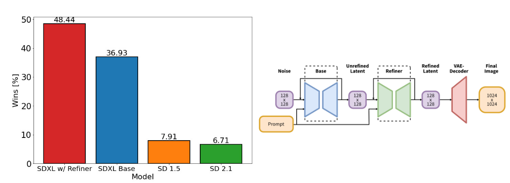
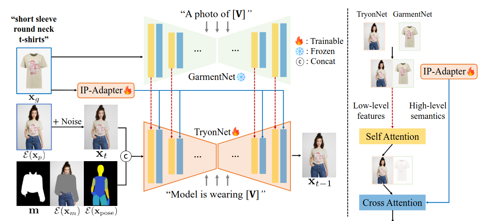
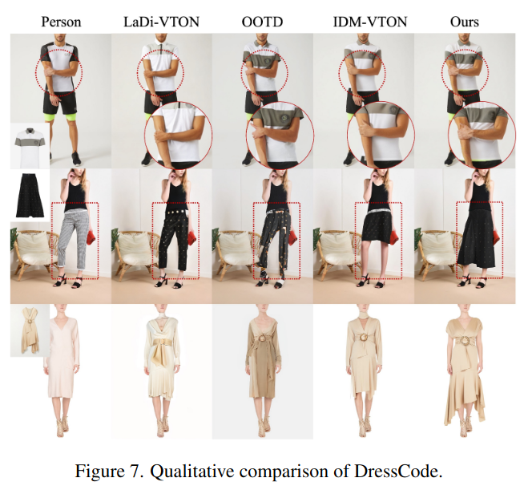
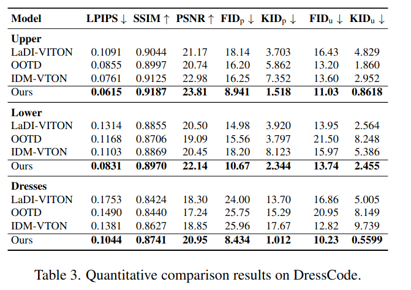

## BooW-VTON: Boosting In-the-Wild Virtual Try-On via Mask-Free Pseudo Data Training
*arXiv(2024), 5 citation, TianjIn University * Alibab Group, Review Data: 2025.04.01*

[Intro](#intro) 
[Related Work](#related-work) 
[Method](#method) 
[Experiment](#experiment) 
[Conclusion](#conclusion) 

> Core Idea

<strong>"Synthesize Wild Try-On Images While Preserving Background/Foreground of Image Without Precise Inpainting Mask"</strong> 

***

### <strong>Intro</strong>

$\textbf{이 주제의 정의 및 요구사항과 중요한 이유}$

- Image-based virtual try-on은 점점 인기가 많아지고 있고 특정 사람의 realistic try-on image를 생성하는 중요한 task이다. 

$\textbf{이 주제의 문제점과 기존의 노력들}$

- 기존의 VITON model들은 image mask-inpaint mask로써 person image를 masking하는 것이 필요하고 상당한 spatial information 손실을 야기한다.  
- 특히, in-the-wild try-on scenarios with complex poses and occlusions에 대해서 mask-based method는 종종 눈에띄는 artifact는 발생시킨다. 

- 아래 그림에서 볼 수 있듯이, 대부분의 방법은 편집할 영역을 나타내는 마스크를 사용하며, {마스크가 적용된 인물 이미지, 목표 의류 이미지, 실제 인물 이미지} 샘플을 이용해 모델을 학습한다.
  - 그러나 마스크를 사용하면 인물 이미지의 콘텐츠와 공간 정보가 손실되며(그림의 깊이 맵 참조), 전경과 배경의 일관성이 깨지고, 몸의 포즈 정보를 보완하기 위해 추가적인 파서(parser)가 필요하다는 문제가 발생한다.
  - 이러한 결함은 깔끔한 인물 사진이 대부분인 쇼핑몰 착용(try-on) 환경에서는 크게 문제되지 않지만, **복잡한 가림(occlusion)과 다양한 포즈가 존재하는 실제 환경(real-world try-on)**에서는 **생성된 결과에 눈에 띄는 아티팩트(artifacts)**를 초래한다.

- 최근 일부 가상 착용 연구들은 이러한 문제를 완화하려는 시도를 해왔다. 예를 들어, **TPD**는 2단계 추론 프레임워크를 도입하여 보다 정확한 마스크를 먼저 예측한 후 이를 활용해 착용 과정을 수행합니다. 그러나 이 방식은 여전히 쇼핑몰 환경에 국한되며, 마스크 영역에서 인물 이미지 정보가 손실되는 문제를 해결하지 못한다.

- 한편, **PFDM**은 마스크 없이 동작하는 parser-free diffusion model을 제안하여 마스크 의존성을 줄이는 접근을 시도했다. 이는 초기 GAN 기반 parser-free 방법(PFAFN)과 유사하게, 기존 마스크 기반 모델에서 마스크 없는(student) 모델을 직접 학습(distill)하는 방식을 따른다. 그러나 이러한 접근법은 마스크 없이 동작하는 형태만 제공할 뿐, 실제 성능은 여전히 마스크 기반 모델의 한계에 갇혀 있어 복잡한 실환경 착용 시나리오(in-the-wild try-on)에서는 일반화되지 못하는 한계가 있다.

- 본 논문은 non-try-on area content (inpainting mask외의 영역)를 보존하면서 human parsing feature의 의존성을 줄인다. 

$\textbf{본 논문에서 해결하고자 하는 문제와 어떻게 해결하는지, 그 결과들}$

- 본 논문은 original person image로부터 spatial and lighting information을 전부 이용할 수 있는 mask-free approach을 제안한다.
- 결과적으로 mask-free try-on diffusion model에 대한 새로운 train paradigm을 제안한다.
  - 고품질의 pseudo-data를 생성하여 모델이 마스크 없이 착용(try-on)할 수 있는 능력을 보장하며, 효과적인 자연 환경(in-the-wild) 데이터 증강을 통해 복잡한 공간 정보를 처리하는 능력을 더욱 향상킨다.
  - 또한, 착용 영역에 집중하면서 비착용 영역에서 의류 특징을 억제하는 착용(localization) 손실을 설계하여, 의류의 정밀한 렌더링과 전경/배경의 보존을 보장한다.
  - 최종적으로, BooW-VTON이라는 마스크 없는 가상 착용(diffusion-based virtual try-on) 모델을 제안하며, 이는 의상 분석(parsing) 과정 없이도 SoTA 수준의 착용 품질을 제공한다.

- 본 논문은 **사전 학습된 잠재 확산 모델(latent diffusion model)**을 마스크 없는(pseudo) 데이터로 미세 조정(fine-tune)하여, 보다 복잡한 실환경에서도 강건한 성능을 발휘할 수 있도록 하는 방법을 제안한다.
  - 사전 학습된 모델의 강력한 이미지 이해(image understanding) 능력을 활용하여, 착용하지 않는(non-try-on) 영역은 보존하면서도 의류를 자연스럽게 합성할 수 있도록 한다.

- 핵심 아이디어는 다음과 같다.
  - 고품질의 가짜 (pseudo) 실환경 데이터 (wild data) 생성
    - 먼저, 강력한 마스크 기반 착용 모델을 이용하여 **고품질 가짜 인물 이미지(pseudo person image)**를 생성한다.
    - 이후, 다양한 배경 및 전경을 합성(synthesize)하는 생성 모델을 활용하여 학습 데이터 {가짜 인물 이미지, 실제 인물 이미지}를 증강(augmentation) 한다.
    - 이러한 과정은 낮은 비용으로 복잡한 실환경에서도 의류 변경 영역을 정확히 학습할 수 있도록 고품질 가이드를 제공한다.
  - 착용(localization) 손실(try-on localization loss) 설계
    - 비착용 영역 (Non-try-on areas)에서 의류 특징(garment features)을 억제하고, 착용 영역에서는 보다 정확한 의류 합성을 유도한다.

***

### <strong>Related Work</strong>

- Mask-based virtual try-on
  - 이미지 기반 가상 착용 방법은 마스크 기반(mask-based)과 마스크 프리(mask-free) 두 가지 접근 방식으로 나뉜다.
  - 이 두 접근법의 가장 큰 차이는 추론 시 이진 마스크(binary mask)를 사용하여 착용이 적용될 영역과 유지될 영역을 명시하는지 여부에 있다.
  - 초기 연구들은 전용 이미지 warping module을 사용하여 의류 이미지를 착용 영역에 맞게 변형했다.
  - 이 과정에서 human pose parsing 정보를 활용하여 정확한 피팅을 수행했다. (mask가 human pose를 가리기 때문에)
  - 하지만 이러한 기법들은 정확한 인체 자세 정보가 필수적이며, parsing하는 과정에서 오류가 발생할 경우 변형이 비정상적으로 이루어질 가능성이 크다.
  - 최근에는 diffusion model이 이미지 생성에서 급격히 발전함에 따라, pre-trained encoder를 사용하여 의류 이미지와 인체 포즈를 잠재 공간에서 정렬한 후, 마스크된 영역을 보완하는 방식을 채택했다.
  - 그러나 이 방법 또한 마스크로 인해 원본 이미지 contents가 손실되는 문제가 있으며, human pose parsing에 크게 의존한다는 한계가 있다.
  - TPD는 추가적인 마스크 예측 단계를 도입하여 마스크 영역을 줄임으로써, 정보 손실을 완화하려 했지만 예측된 마스크 품질이 불안정하여 마스크로 인해 발생하는 근본적인 문제를 완전히 해결하지는 못했다.

- VITON-HD

- Mask-free virtual try-on
  - 추론 시 마스크를 입력으로 사용하지 않으며 parser에 의해 발생하는 부작용을 줄이는 데 초점을 맞춘다.
  - 이러한 방법들은 먼저 마스크 기반 교사 모델(teacher model)을 학습한 후, 이를 기반으로 마스크 프리 학생 모델(student model)을 증류(distillation)하여 학습하는 방식을 따른다.
  - 하지만 지식 증류(knowledge distillation) 방식은 마스크 기반 모델의 결함을 그대로 학생 모델에 전이할 뿐만 아니라, 학생 모델의 일반화 성능을 제한하여 복잡한 환경(in-the-wild)에서의 적응력이 부족하다는 한계를 가진다.
  - 본 연구에서는 기존 방식과 달리,
    - 마스크 기반 방법의 결함을 필터링하는 최적화된 추론 방식(optimized inference approach)을 적용하고,
    - 데이터 증강(data augmentation)과 새로운 손실 함수(loss function)를 활용하여 모델이 마스크 없이도 본질적인 착용 개념(try-on concept)을 학습할 수 있도록 설계했다.
- In-the-wild virtual try-on
  - 실제 소비자 환경(consumer scenarios)을 위한 in-the-wild 가상 착용 연구가 점점 주목받고 있지만,
복잡한 환경에 최적화된 성숙한 모델은 아직 부재한 상황이다.
  - **StableVITON과 IDM-VTON**은 확산 모델(diffusion model)의 강력한 이미지 복원(image restoration) 기능을 활용하여 복잡한 환경에서도 배경을 보존하는 방법을 제안했다.
  - 그러나 마스크 기반 접근법의 한계로 인해, 원본 이미지에서 마스크된 영역의 정보를 유지하지 못하고, 사용자의 액세서리, 피부, 의류 주변 요소까지 왜곡되는 문제가 발생했습니다.

***

### <strong>Method</strong>

- High-quality in-the-wild mask-free try-on model을 위해 training pipeline을 제안한다.
  - 먼저, 학습동안 mask에 대한 model의 dependancy를 제거하기 위해 pseudo-triplet data를 사용한다.
  - 그리고, in-the-wild data augmentation을 이용하여 complex scene에 대한 model의 try-on capability를 강화시킨다. 
  - 마지막으로, try-on region을 효과적으로 배우기위해 loss function을 도입한다. 

$\textbf{Mask-free Try-On Diffusion Model: (b-ii)}$

- 본 눈문은 pseudo-triplet { $P', G, P$ }를 사용하여 model의 mask 의존성을 없애면서 학습한다. 
  - 즉, 기존의 paired setting에서의 학습을 하지않고 unpaired setting의 dataset을 만들어서 학습한다.
  - 구체적으로 **SDXL**을 try-on U-Net with pre-trained **IP-adapter**으로 사용하고 **SDXL-Reference Net**을 garment encoder로 제공한다. 
  - IP-adapter에 의해 encoding된 garment feature는 cross-attention layer를 통해 try-on U-Net으로 삽입되는 반면에 Reference Net에 의해 encoding된 feature는 self-attention layer를 통해 삽입된다. 
  - 다른 task에 대해서 model의 확장성을 유지하기 위해 본 논문에서는 IP-adapter의 prompt input interface를 유지하면서 garment category에 대한 prompt를 "upper/lower/dresses"로 제한했다. 
  - Try-on U-Net의 입력은 $Z_t = Noise(\mathcal{E}(P))$와 $\mathcal{E}(P')$을 concat해서 넣는다.
  - Attention layer에서는 model이 human body feature (U-Net input)와 garment featrue (IP-adapter and Reference U-Net)간의 상관관계에 기반하여 garment content를 수정한다.
  - 학습에서는 try-on U-Net만 학습한다.

- SDXL
  - 이전 SD 보다 $3$ 배는 큰 UNet backbone: 더 많아진 Attention block 과 더 큰 cross-attention context (SDv1.5: $768 \rightarrow$ SDXL: $2048$)
  - 두 개의 text encoder 를 사용한다: text encoder의 마지막 전 단계 출력을 채널 축에 따라 연결한다.
  - image-to-image 를 통해 visual fidelity 를 향상시키는 refinement model (독립적인 모델, SDEdit으로 노이즈 추가해 중간부터 denoising)

- IP-Adapter

- Animate Anyone: Reference Net as a garment encoder

- Notation

$\textbf{High-Quality Pseudo Data Prepare: (a)}$

- Mask-free model training을 위한 pseudo triplet { $P', G, P$ }을 구하기위해 mask-based model을 사용한다: $P, G' \rightarrow P'$
  - 즉, unpaired setting을 만든다.
  - 본 논문은 **IDM-VTON**을 mask-based model로 사용하며 입력은 { $P, D, M, G'$ } 로 구성된다.
  - 하지만 mask-based model이 생성한 결과는 마스크로 인한 결함을 포함하며, 이는 마스크 없는 모델의 성능을 제한한다.
  - 이를 해결하기 위해, 상대적으로 단순한 in-shop 시나리오에서 두 단계 추론(two-stage inference) 방식을 적용하여 고품질 의사 데이터를 생성한다.
    - 먼저, 보다 유연한 조정을 위한 coarse mask $M_{\text{coa}}$를 사용하여 중간 결과 $P_{\text{mid}}$를 생성한다. 
    - $P_{\text{mid}}$에서 의류 영역 $M_{mid}$를 추출하고, 기존 의류 영역 $M_p$와 합집합 (Union) 연산을 수행하여 보다 정교한 마스크 $M$을 생성한다. 
    - 최종적으로 $M$과 { $P, G, P$ }를 사용하여 try-on을 수행하여 고품질의 unpaired dataset을 생성한다.

$\textbf{In-the-Wild Data Augmentation: (b-i)}$

- 방금 얻은 pseudo data는 in-shop에서 생성했기에 일반적으로 간단한 착용 샘플이다. 
  - 마스크 없는 착용 모델의 장점을 최대한 활용하고 다양한 시나리오에서 성능을 향상시키기 위해, pseudo triplet에 in-the-wild data augmentation을 적용한다. 
    - 배경이 없는 사람 이미지를 활용하여 **T2I model (SDXL)**을 통해 배경 $B$를 생성한다.
      - 빈 배경을 prompt (e.g., "A woman {prepostion} {scene}" in Figure)를 사용하여 채워, 사람과 배경이 결합된 이미지를 얻는다.
      - 그 후, prompt templete을 "Nothing {preposition} {scene}"으로 수정하고 결합된 이미지에서 사람의 영역을 다시 채워 깨끗한 배경 이미지 $B$를 얻는다.
    - 전경 이미지 $F$는 GPT-40를 사용하여 개별 객체에 대한 일련의 프롬프트를 얻는다.
      - 이 prompt들은 **LayerDiffusion에** 입력으로 들어가 투명한 배경을 가진 객체 이미지를 직접 생성한다. (SAM)
    - 각 훈련에서 { $P', P$ }에 대해 $F, B$를 사용하여 실제 환경 데이터 증강을 적용한다.
      - 배경 - 사람 - 전경 순으로 stacking한다.

- Background prompt

- IDM-VTON

- LayerDiffusion: text prompt, noise, mask using SAM으로 생성

$\textbf{Try-On Localization Loss}$

- Non-try-on region에 대한 content (e.g., background and foreground)를 보존하면서 정확하게 try-on area를 식별하는 데 도움을 주기 위해 try-on localizaiton loss를 도입했다. 

- 식은 매우 간단한데, 학습 중에 warped clothing mask를 이용한다.
  - Warped clothing mask with foreground를 반전시킨 후, 각각의 attention map과 multiplication을 진행한다. 
  - 즉, 모든 attention map이 non-try-on region에 해당하는 attention score들의 평균값을 줄이는 방향으로 학습이 진행된다.
  - 이로써, 모든 attention map의 attention score가 inpainting mask region안에 있도록 장려하는 방법이다. **하지만 이는 구체적인 위치를 정해주지 않기 때문에 geometric-aware semantic correspondence를 달성하지는 못하는 게 한계점이다.**

***

### <strong>Experiment</strong>

$\textbf{Baselines}$

- DCI-VTON, LaDi-VTON, CAT-DM, StableVITON, TPD, OOTD, IDM-VTON
  - Pre-trained checkpoint를 사용했다. 

- 30 DDIM sampling steps

$\textbf{Datasets}$

- VITON-HD, DressCode dataset에 독립적으로 학습시켰다. 
- 그리고 cross-dataset validation으로는 in-the-wild dataset인 StreetVTON과 WildVTON을 사용했다. 

$\textbf{Evaluation Protocol}$

- Unpaired: FID, KID
- Paired: LPIPS, SSIM, PSNR

$\textbf{Qualitative Results}$

- 기존 방법들과 비교하여, BooW-VTON은 다양한 착용 시나리오에서 뛰어난 성능을 발휘한다. 
  - 그림의 첫 번째 행에서는 VITON-HD의 복잡한 포즈에 대한 착용 결과를 보여주며, 팔이 가려져 기존 방법들이 어려움을 겪는 상황을 다룬다. 
  - BooW-VTON은 의류를 성공적으로 렌더링하면서 손과 팔 세부 사항을 보존하여 기존 모델들을 크게 능가한다. 
  - 두 번째 행에서는 StreetVTON 데이터셋을 사용하여 의류 착용감과 액세서리를 유지하는 모습을 보여준다. 
  - 기존 방법들과 달리, 원본 의류의 영향을 받지 않고, 원본과 목표 의류 간의 차이를 정확히 조정하여 누락된 부분을 채우고 손과 액세서리 세부 사항을 보존하여 더욱 현실적인 결과를 만든다. 
  - 세 번째 행에서는 BooW-VTON이 문신과 전경 세부 사항을 보존하는 능력을 강조하며, 원본 이미지 콘텐츠를 유지하면서 더 정확한 의류 렌더링을 달성한다. 
  - 마지막으로, 애니메이션 스타일 샘플에 대한 학습 없이도, 우리의 방법은 의류 특성을 효과적으로 보존하고 원본 스타일에 맞춰 정렬됨을 보여준다.

- 그림에서는 DressCode 데이터셋에서 BooW-VTON의 성능을 보여준다. 
  - 첫 번째 행에서는 우리의 방법이 근육 세부 사항을 보존하고 압축에 의한 의류 주름을 렌더링하여 현실감을 높이는 것을 보여준다. 
  - 두 번째 행에서는 BooW-VTON이 원본 바지의 착용감에 영향을 받지 않고 치마의 특성을 정확히 재현하는 모습을 보여준다. 
  - 세 번째 행에서는 우리의 방법이 드레스에서 세밀한 직물 질감을 보존하는 능력을 보여준다.

$\textbf{Quantitative Results}$

- DCI-VTON은 StreetVTON에서 KID 메트릭에서 BooW-VTON보다 더 좋은 성능을 보이는데, 이는 마스크를 활용하여 비착용 영역의 픽셀 보존을 향상시키기 때문이다. 
  - 그러나 이 방법은 전체 이미지의 일관성을 간과하여, 우리의 방법에 비해 시각적으로 열등한 착용 결과를 초래한다.

$\textbf{Ablation Study}$

- Mask-Free Pseudo Data Training의 Ablation Study. 
  - VITON-HD, StreetVTON, WildVTON 데이터셋에 대해 ablation 실험을 진행했다. 전통적인 mask-free 방법을 시작으로 IDM-VTON에서 지식을 증류하여 기준선을 설정한 후, 점진적으로 개선을 적용했다. 
  - 표 2에서 보듯, mask-based 모델을 mask-free 모델로 변환하는 것은 인샵 착용 시나리오에서는 성능을 개선하지 않으며, 야외 시나리오에서는 성능이 저하된다. 
  - 그림 8-Left는 단순한 증류가 인샵 착용 작업에서 과적합을 초래하여 모델의 일반화 능력을 크게 감소시킨다는 것을 보여준다. 고품질의 pseudo data(H.Q.)는 인샵 성능을 개선하지만, 모델은 여전히 야외 시나리오에서 어려움을 겪는다. 
  - 실제 환경 데이터 증강을 적용한 후, 모델의 실제 환경 착용 능력이 크게 향상되었습니다. 표 2에서 보듯, StreetVTON과 WildVTON 테스트 세트에서 FID와 KID 점수가 감소했다. 
  - 그러나 강력한 데이터 증강으로 인해 인샵 성능에서 약간의 감소가 있었으며, 이는 느린 수렴에 의한 것으로 보인다. 
  - 그림 8-Left는 비착용 콘텐츠가 잘 보존된 것을 보여준다. 착용 지역화 손실을 추가하여 attention layers를 정규화하면 성능이 크게 향상되며, 시각적 아티팩트를 줄이고 전경 세부 사항을 더 잘 보존하는 결과를 얻을 수 있다. 이는 그림 8-Left의 빨간색 박스에서 확인할 수 있다.

- Try-on Localization Loss의 효과. 
  - Try-on localization loss의 효과를 분석하기 위해 $35$번째 attention block의 self-attention layer를 시각화했다. Diffusion 모델의 효율성 분석에 따라, DDIM denoising에서 30단계 중 $1$, $15$, $30$단계의 self-attention 맵에 집중했다. 그림 8-Right에서 보듯, try-on localization loss를 적용한 후, attention이 착용 지역에 더 집중되며, 전경의 섬세한 세부 사항 보존이 향상됐다.

$\textbf{Application}$

- 그림 9-Left에서 보듯, 프롬프트를 조정하여 특정 의류 항목에 대한 착용 스타일을 제어할 수 있으며, 이를 통해 패션 디자인에 유용한 다양한 의류 렌더링을 생성할 수 있다. 
- 그림 9-Right에서 나타낸 바와 같이, 전체 신체 착용 훈련 없이도 우리 방법은 자연스럽고 현실적인 전체 신체 착용 결과를 생성할 수 있다.

$\textbf{Limitation}$

- 우리 방법은 가상 착용을 더 일반적인 야외 시나리오로 확장하지만, 여전히 사용자 제어에 제한이 있어 소비자 응용에는 한계가 있다. 
  - 그림 10에서 보듯, 드레스를 입은 여성이 티셔츠를 착용할 때, 하의에 대한 참조가 부족하여 하체가 임의로 생성되어 원하는 의상 스타일과 일치하지 않을 수 있다. 
  - 유사한 문제가 하의 착용 시에도 발생한다. 따라서 사용자가 원하는 의상 스타일을 맞추도록 하려면 상의와 하의 또는 액세서리의 매칭을 포함하여, 사용자 맞춤형 착용이 가능하게 하는 것이 향후 연구의 주요 과제이다.

***

### <strong>Conclusion</strong>

***

### <strong>Question</strong>

