## CAM: Learning Deep Features for Discriminative Localization 
*IEEE conference on computer vision and pattern recognition(2016), 9821 citation*

[Intro](#intro) 
[Related Work](#related-work) 
[Method](#method) 
[Experiment](#experiment) 
[Conclusion](#conclusion) 

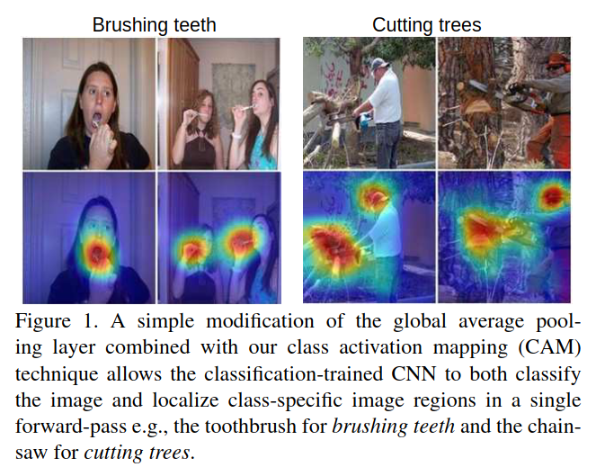

> Core Idea

<strong>"Class Activation Map(CAM)"</strong> 

***

### <strong>Intro</strong>
- Bounding box annotation 은 비싸다
  - Class labeling 은 덜 비싸므로, class label 로만 object localization 을 진행하겠다!!
- 저자들은 global average pooling layer 에 대해서 이미지에 대한 CNN 의 암시된 attention 을 드러내는 포괄적인 localizable deep representation 을 만들어낼 수 있다고 생각했다. 
- Global average pooling 의 단순함에도 불구하고, 본 논문의 저자들은 어떠한 bounding box annotation 을 이용한 학습을 하지 않고도 ILSVRC 2014 object localization 에 대해서 $37.1$% top-5 error 를 달성할 수 있었다.
- Convolutional layers 가 object 의 위치를 알아낼 수 있는 놀라운 능력을 가지고 있음에도 불구하고, 이러한 능력은 classification 을 위해 사용되는 fully-connected layer 가 존재할 때 잃는다.
- 본 논문의 저자들은 실험을 통해 global average pooling 의 이점이 단순히 regularizer 의 역할을 수행하는 것 이상으로 확장될 수 있다는 사실을 발견했다.
  - 즉, network 의 구조를 약간 수정하면, network 가 놀라운 localization ability 를 마지막 layer 까지 보유할 수 있다

***

### <strong>Related Work</strong>

***

### <strong>Method</strong>

- Global average pooling 은 feature map 의 집약체로 볼 수 있다. 그 집약체에 weight 를 곱한 값으로 결국 classification 을 진행하게 된다. 
- 이때, 본질적으로 각 class node 로 향하는 weight 는 해당 class 에 대한 feature map 의 중요도라고 볼 수 있다.
- 각 class node 에 할당된 weight 와 feature 을 이용하여 visualization 을 진행한 것이 CAM 이라고 볼 수 있다.

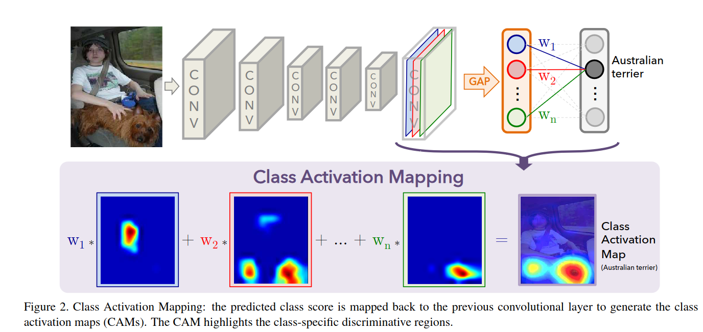

- 예시를 들어서 설명해보자면, 다음과 같이 주어진 이미지(e.g., cat)에 대해서 $f_k(x,y)$ 는 spatial location $(x,y)$ 에서의 last convolutional layer 의 channel $k$ 의 activation 을 나타낸다.
- Last convolutional layer 의 output size 를 $(batch \ size,3,4,4)$ 라고 가정한다면, $k$ 는 $3$ 까지 존재하는 것이다.
- 그리고, $3$ 번째 channel 의 $(1,1)$ 위치는 $f_3(1,1)$ 로 표현할 수 있다.

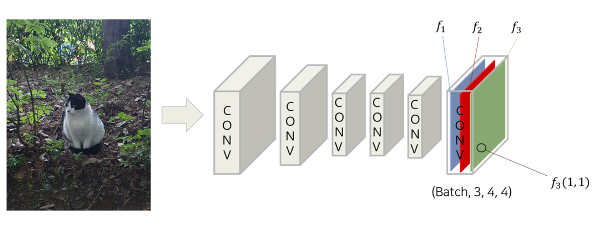

- channel $k$ 에 대해, global average pooling 을 수행한 결과인 $F^k$ 는 다음과 같다. (상수 값은 제외)

$$ F^k = \Sigma_{x,y}{f_k(x,y)} $$

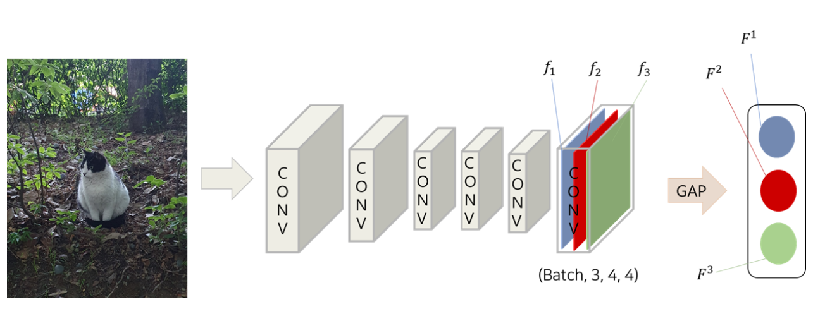

- 그 후, 각 channel $k$ 에 대해 global average pooling 을 취한 값들을 주어진 class $c$ node 에 연결(즉, softmax 의 input)하면 다음과 같다.
  - 단순히 dog, cat classification task
  - $w_k^c$ 는 feature map $k$ 에 GAP 한 값과 class node $c$ 를 연결하는 weight
  - 예시에서의 $S_1 = F^1 \times 0.3(=w_1^1)+F^2 \times 0.5 + F^3 \times 0.1$

$$ S_c = \Sigma_k{w_k^c F_k}$$

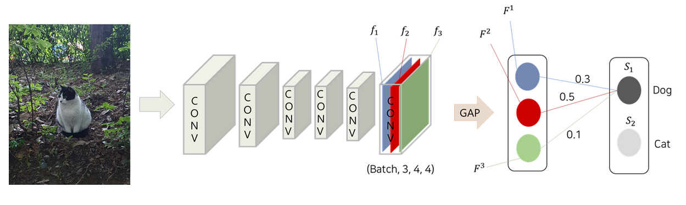

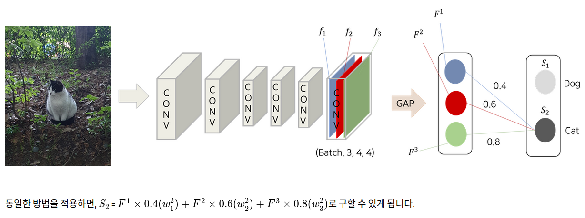

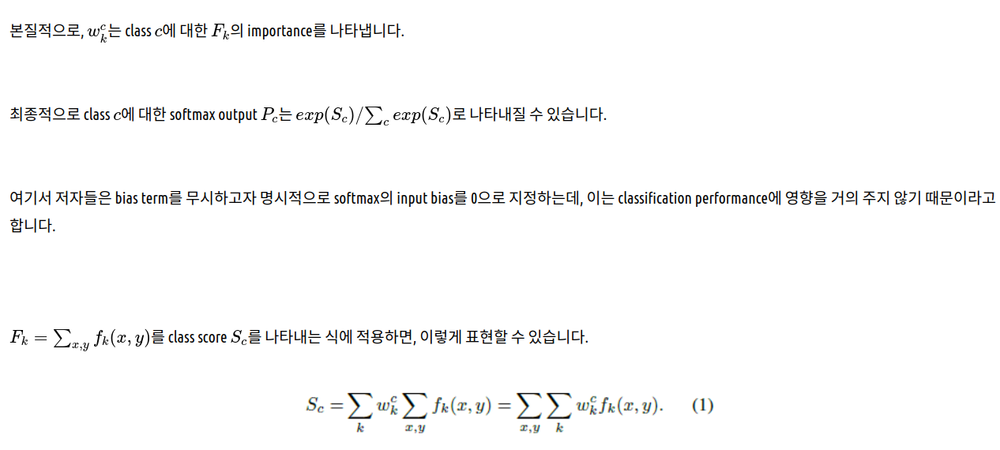

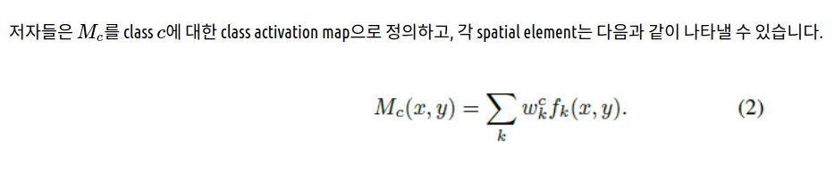

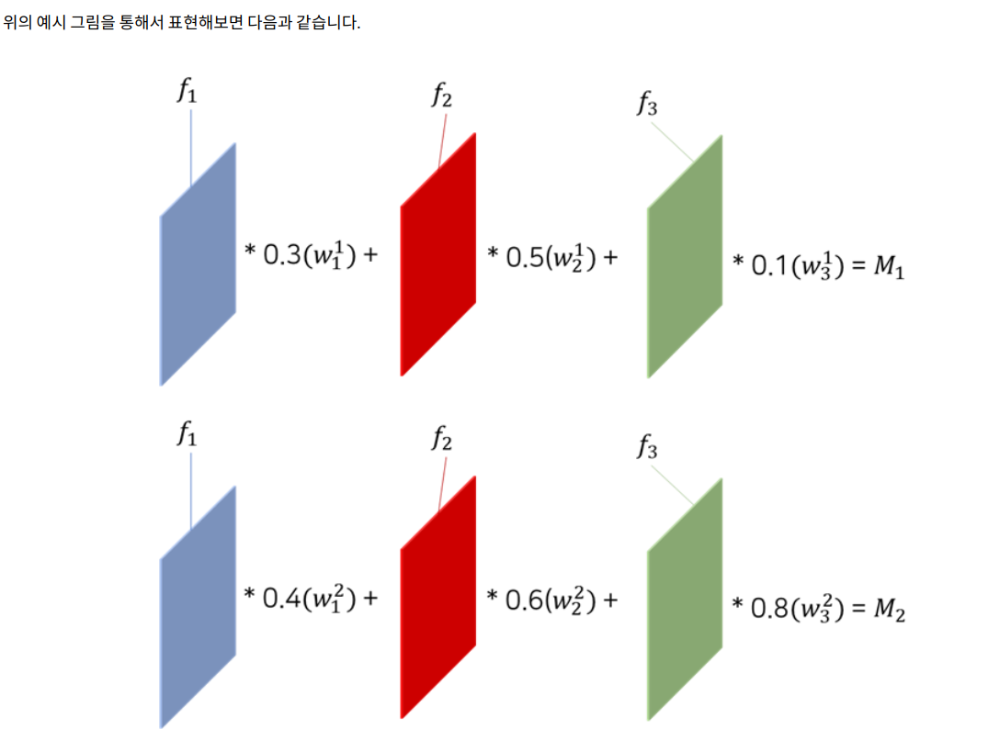

- 직관적으로, 본 논문의 저자들은 각 feature map 이 receptive field 내에서 어떤 visual pattern 에 의해 활성화되는 것을 기대했다.
- 따라서, $f_k$ 는 이러한 visual pattern 의 존재에 대한 map 이 된다.
- Class activation map 을 input image size 로 upsampling 해줌으로써, 특정한 category 와 가장 관련이 있는 image region 을 식별할 수 있게 해준다. 

***

### <strong>Experiment</strong>

- 사람에 집중하는 것이 아니라 행동 자체에 집중하는 것을 알 수 있다.

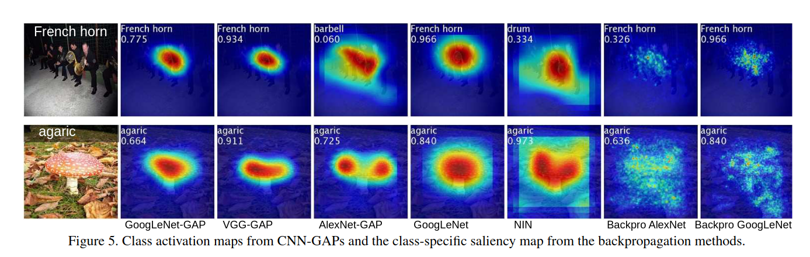

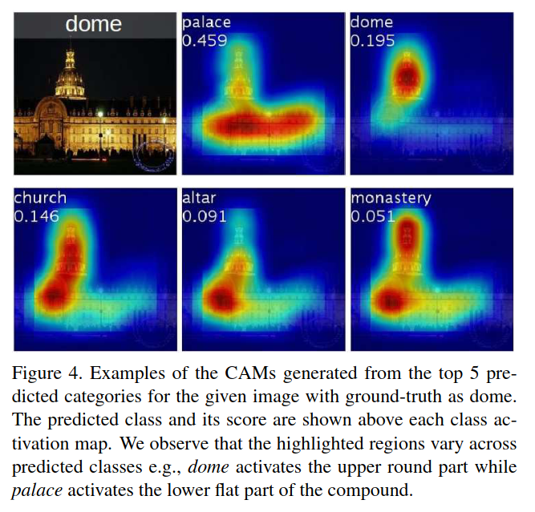

***

### <strong>Conclusion</strong>

***

### <strong>Question</strong>

