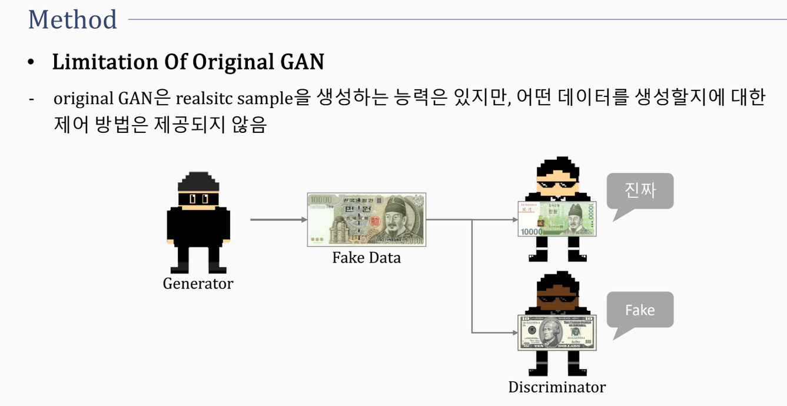
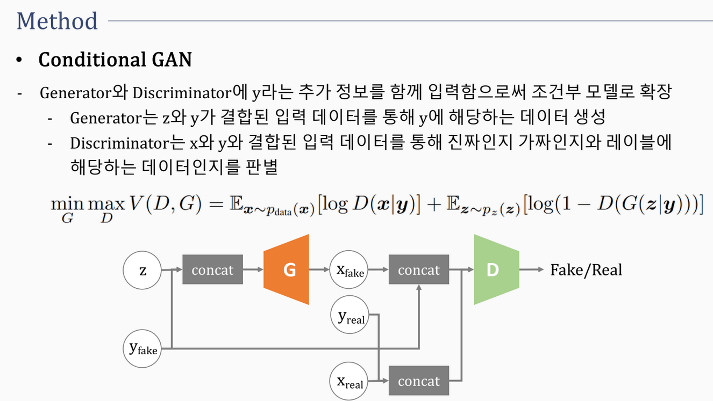
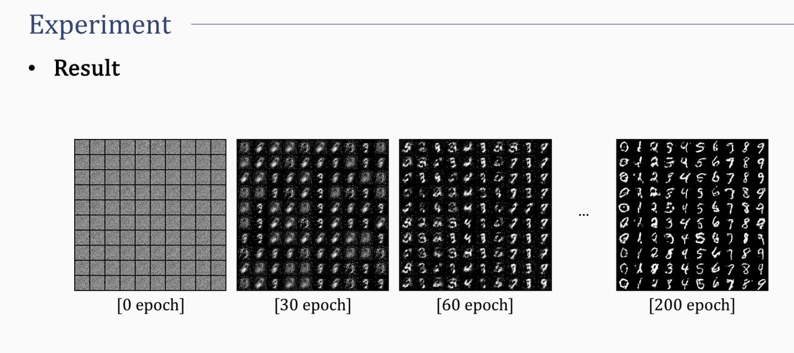
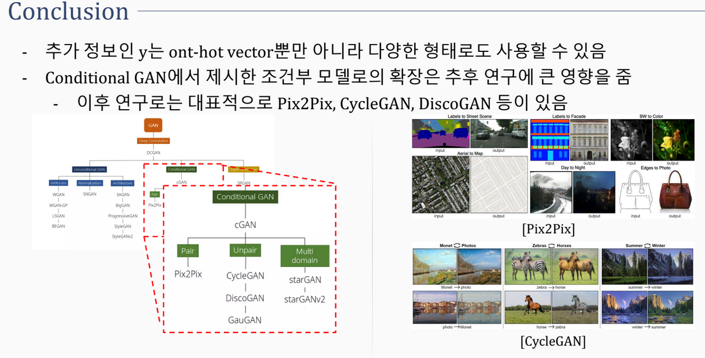

## Conditional Generative Adversarial Nets
*arXiv(2014), 11664 citation*

[Intro](#intro) 
[Related Work](#related-work) 
[Method](#method) 
[Experiment](#experiment) 
[Conclusion](#conclusion) 

> Core Idea

<strong>"Add Condition in GAN"</strong> 

***

### <strong>Intro</strong>

***

### <strong>Related Work</strong>

***

### <strong>Method</strong>

***

### <strong>Experiment</strong>

***

### <strong>Conclusion</strong>

***

### <strong>Question</strong>

