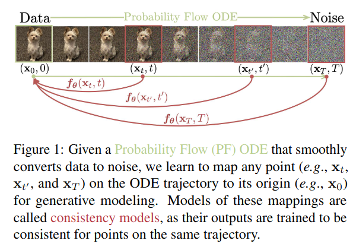

## CM: Consistency Models
*arXiv(2023), 144 citation*

[Intro](#intro) 
[Related Work](#related-work) 
[Method](#method) 
[Experiment](#experiment) 
[Conclusion](#conclusion) 

> Core Idea

<strong>"Given Any Point on the ODE Trajectory, Models Generates Its Origin"</strong> 

***

### <strong>Intro</strong>

***

### <strong>Related Work</strong>

***

### <strong>Method</strong>

***

### <strong>Experiment</strong>

***

### <strong>Conclusion</strong>

***

### <strong>Question</strong>
