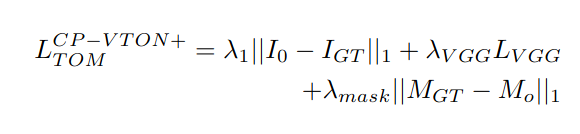

## CP-VTON+: Clothing Shape and Texture Preserving Image-Based Virtual Try-On
*CVPR(2020), 98 citation, 과기대 (Seoul National University of Science and Technology)*

[Intro](#intro) 
[Related Work](#related-work) 
[Method](#method) 
[Experiment](#experiment) 
[Conclusion](#conclusion) 

> Core Idea

<strong>"test1"</strong> 

***

### <strong>Intro</strong>

- CP-VTON 과는 다른 저자 (China) 들이다. 
- 최근에 제안된 image-based VTON 접근법들은 몇 가지 어려움이 있다. 
  - 1. Clothing warping networks 는 종종 매우 왜곡되고 align 되지 않은 warped cloth 를 생성하는데, 이는 잘못된 clothing agnostic human representation (의류 영역이 masking 된 사람), clothing-human matching 을 위한 input image 의 불일치, 부적절한 regularization transform parameter 때문이다.
  - 2. 잘못된 human 의 representation 과 composition-mask generation 에 대한 부적절한 training loss 로 인해 blending network 가 remaining clothes 를 보존하지 못한다. 
- 본 논문에서 제안된 CP-VTON+ 는 이런 문제들을 해결하고자 했다. 

- $3$ D model based approaches 의 어려움과 high cost 로 인해 $2$ D image-based VTON 이 유명해졌다. 
  - 일반적인 processing pipeline 은 two stage 를 가진다.
    - 1. Geometric Matching Module (GMM): warp clothes to align with the target human
    - 2. Try-On Module: blend warped clothing into the target human image
    - 본 논문에서도 같은 setting 이다. 
- 본 논문에서 CP-VTON 과 다른 점은 다음과 같다.
  - 1. Better input representation
    - 1. 잘못된 clothing-agnostic human representation 을 수정했다. 
    - E.g., wrong labeling of the chest area in human parsing maps, omission of clothing from reserved areas in the human representation
  - 2. Use improved training cost functions 
    - 1. Problem of clothing warping network: unbalanced geometric matching inputs and training cost functions 
    - 2. Improve the composition mask using the input clothing mask and a concrete loss function 

***

### <strong>Related Work</strong>

- VITON: first proposed the system setting and dataset of an in-shop clothing and a target human image, first used the two stage architecture
- CP-VTON

***

### <strong>Method</strong>

- CP-VTON 의 pipeline structure 를 토대로 하기에 CP-VTON+ 이다. 
  
$\textsf{Clothing Warping Stage}$

- GMM stage 의 향상은 $3$ 가지 측면에서 이루어졌다. 
  - 1. Dataset 에 대한 문제: Complete target body silhouette area from the target human image
    - 하지만, VITON dataset 에서 목이나 노출된 가슴 영역이 배경으로 잘못 labeling 되어있거나
    - Hair occlusion 으로 인한 왜곡이 종종 발생한다. 
  - 2. Loss 적용 대상: colored texture from colored clothing 는 geometric matching 에 도움이 되지 않으니, clothing mask 에 loss 를 적용시키자.
  - 3. Loss 의 개선: 종종 generated warped cloth 가 심하게 왜곡되는 현상이 발생한다.
    - 해당 논문에서는 그 이유를 분명하게 정의하지는 못했지만, TPS parameter 의 추정에 regularization 이 필요하다고 판단했다. 
    - 따라서, grid warping regularization loss 를 정의하여 이전 grid 와 다음 gird 간에 너무 많은 다른 왜곡이 발생하지 않도록 한다. 

- GMM stage 의 최종 loss 및 regularization loss

  
$\textsf{Blending Stage}$

- Try-on module 의 개선 사항도 $3$ 가지이다. 
  - 1. target clothing area 이외의 다른 인체 구성 요소를 보존하기 위해 e.g., face, hair, lower clothes (하의), legs 와 같은 모든 다른 영역을 human representation 에 추가한다. 
  - 2. Loss 함수의 mask loss term 에서, composition mask 대신 strong alpha mask 에 대한 supervised ground truth 를 사용한다.  
  - 3. Network input 에 warped clothing binary mask 를 추가했다. 흰색 의류 영역을 배경으로 인식할 수 있기 때문이다. 

***

### <strong>Experiment</strong>

$\textsf{Implementation Details}$

- CP-VTON 에서 확장시켰다.
- $\lambda_1 = \lambda_{vgg} = \lambda_{mask} = 1, \lambda_{reg} = 0.5$
- VITON dataset 을 모두 사용
- $200$ K steps with batch size $4$
- Adam, $\beta_1 =0.5, \beta_2 = 0.999$
- Fixed LR = $0.0001$ for $100$ K steps and then linearly decays to zero for remaining steps

$textsf{Metric}$

- IoU, SSIM and LPIPS

***

### <strong>Conclusion</strong>

***

### <strong>Question</strong>

<a href="">link</a>

> 인용구
