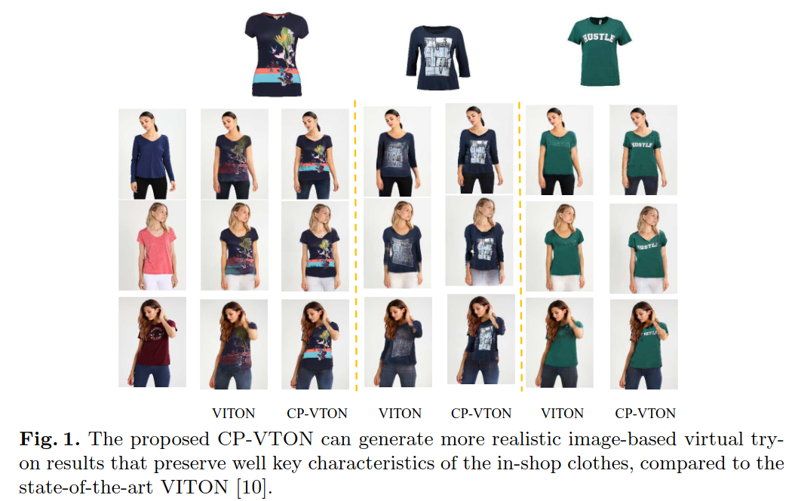
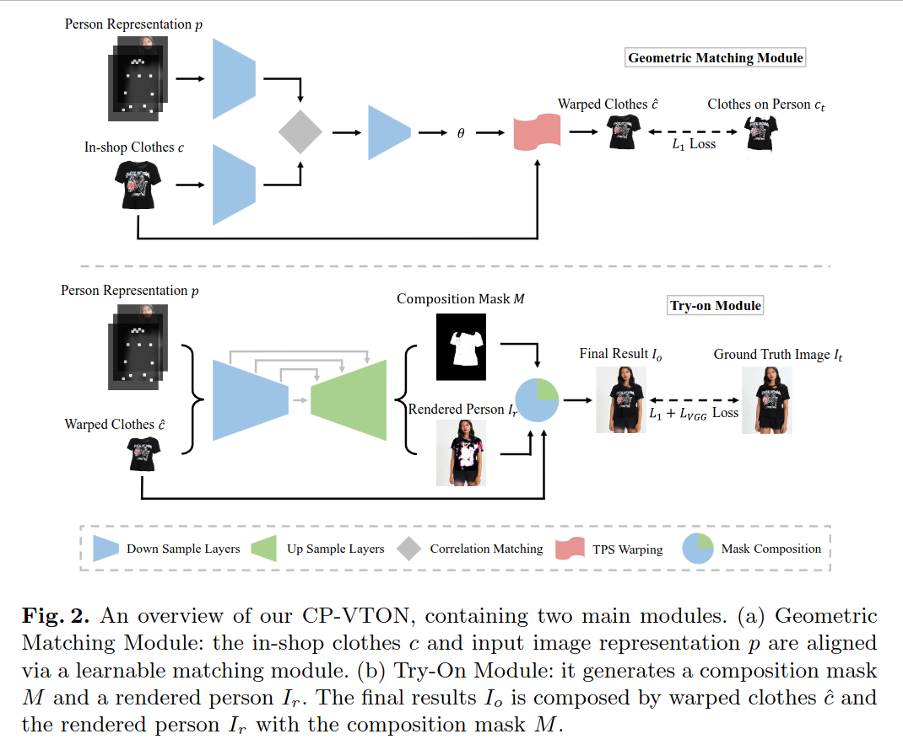
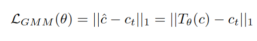
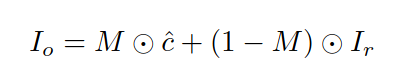
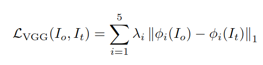
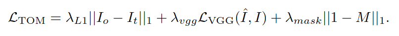
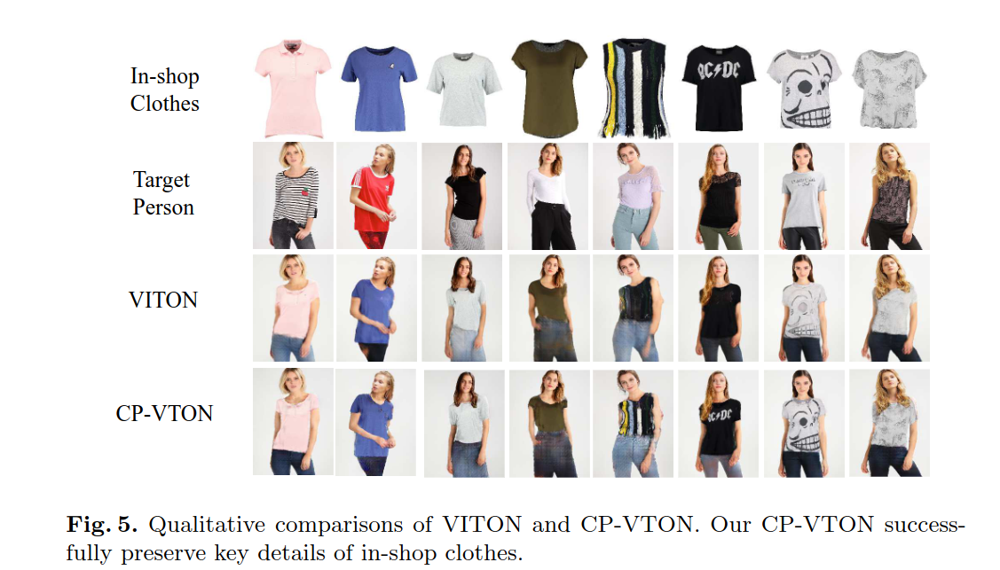

## CP-VTON: Toward Characteristic-Preserving Image-Based Virtual Try-On Network
*ECCV(2018), 352 citation*

[Intro](#intro) 
[Related Work](#related-work) 
[Method](#method) 
[Experiment](#experiment) 
[Conclusion](#conclusion) 

> Core Idea

<strong>"Use Learnable TPS"</strong> 

***

### <strong>Intro</strong>

- Desirable (바람직한) pipeline 은 target cloth 를 shape 에 맞춰서 변환시킬 뿐만 아니라, 생성된 이미지에서의 cloth identity 를 보존해야 한다. 
  - 즉, original cloth 를 묘사하는 key characteristics (e.g., texture, logo, embroidery (자수, 자수품)) 를 잘 보존해야 한다. 
- 하지만, 이전의 image-conditioned generation works 는 input image 와 target cloth 사이의 spatial misalignment 를 다루지 못해서, 이런 중요한 요구사항들을 만족시키지 못했다.  
- 이전의 연구들은 shape context matching 을 사용하여 명시적으로 spatial deformation 을 다루고자 했다. 하지만, coarse-to-fine strategy 로 인해 clothing detail 을 보존하는데 실패했다. 
- 본 연구에서는, real-world challenge 를 다루기 위해 새로운 fully-learnable Characteristic-Preserving Virtual Try-On Network (CP-VTON) 을 제안한다. 
  - 1. CP-VTON 은 new Geometric Matching Module (GMM) 을 통해 cloth 를 target person shape 에 맞추기 위해 thin-plate spline transformation 을 학습한다. 
    - 이전의 연구에선, interest point 의 correspondence 를 계산했다. (Hand-crafted shape context matching)
    - 여기서의 thin-plate spline transformation 은 full learnable 이다. 
  - 2. warped cloth 의 boundary artifacts 를 완화하고, 현실적인 결과물을 위해 warped cloth 와 rendered image 를 통합하는 composition mask 를 학습하는 Try-On Module 을 사용한다. 

***

### <strong>Related Work</strong>

- Image Synthesis
  - GANs: Conditional GAN
    - 종종 blurry image 를 만드는 $L_1, L_2$ loss 와는 다르게 adversarial loss 는 많은 image-to-image task 에서 사용된다. 
    - 하지만 adversarial loss 는 high-resolution image 를 생성할 때 unstable 
  - VITON: 마찬가지로 thin-plate spline (TPS) transformation 을 계산한다. 하지만, shape context 는 hand-craft feature 이고 time-comsumed
    - 게다가, 계산된 TPS transformation 은 predicted mask 에 취약하다. 
    - 본 논문에서는 TPS transformation 을 CNN 으로 설계했기 때문에, interest point 의 명시적인 correspondence 가 없다. 

- Person Image Generation
- Virtual Try-On System

***

### <strong>Method</strong>

- Overall Architecture

- Person Representation (Ref. VITON paper)
  - Pose heatmap: $18$ channel feature map, drawn as an $11 \times 11$ white rectangle 
  - Body shape: $1$ channel feature map, blurred binary mask
  - Reserved regions: RGB image, regions to maintain the identity of a person, including face and hair
  - $p$: All of feature maps are all scaled to a fixed resolution $256 \times 192$ and concatenated together, $\mathbb{R}^{k=22}$

- Geometric Matching Module
  - new Geometric Matching Module (GMM): given $c$ and $p$, transform $c$ into warped clothes $\hat{c}$ which is roughly aligned
  - 1. Extract high-level features of $p$ and $c$ via two networks 
  - 2. Correlation layer: combine two features into a single tensor
  - 3. Regression network: spatial transformation parameters $\theta$ 를 예측
  - 4. Thin-Plate Spline (TPS) transformation module $T$: generate warped image $\hat{c} = T_{\theta}(c)$
  - Pixel-wise $L_1$ loss

- Try-on Module 
  - Geometric Matching Module 로 생성된 warped cloth $\hat{c}$ 가 roughly align 됐다는 것에 주목해야한다. 
  - 간단한 방법으로는, 직접적으로 $\hat{c}$ 를 target person image 에 붙여넣어서 warped cloth 를 모두 보존시킬 수 있겠지만, 이런 방식은 자연스럽지않고 hair, arm 에 의해 사람의 몸이 가려졌을 때에는 오히려 바람직하지 않다. 
  - 따라서, 본 논문에서는 $p$ 와 $\hat{c}$ 를 concat 하고 UNet 구조를 통해 person image $I_r$ 과 composition mask $M$ 을 동시에 출력한다. 
  - 그 후, $\hat{c}, I_r, M$ 을 통해 마지막 출력인 $I_o$ 를 만든다. 
  - Loss 는 $L_1$ loss 와 VGG perceptual loss, $M$ 에 대한 $L_1$ regularization loss 의 combiantion.
    - utilize 'conv1_2', 'conv2_2', 'conv3_2', conv4_2', 'conv5_2'
    - Characteristic preserving 을 위해 $L_1$ regularization loss 를 사용한다. Network 의 출력으로 나온 $M$ 의 모든 원소가 $1$ 에 가깝도록 학습된다는 얘기는 옷의 정보를 잘 보존한다는 얘기가 된다. 

***

### <strong>Experiment</strong>

$\textsf{Dataset}$

- VITON dataset: $14221/2032$
- Metric: IS, TV (total variation) Norm
  - IS 만으로는 세부 사항이 보존되었는지를 반영할 수 없다. 
  - TV 로는 세부 사항 풍부도 (detail richness of a clothing image) 를 측정하는데, VITON datset 이 배경이 순수한 색상이며 TV norm 은 옷 자체에만 영향을 미치기 때문이다. 
  - Characteristic-preservation 을 평가하기 위해서 가장 큰 clothing TV norm 을 가진 $50$ 개의 test pair 를 추출하여 **LARGE** 라고 하고, 반대로 가장 작은 norm 을 가진 $50$ 개의 pair 를 **SMALL** 이라고 명명했다.

$\textsf{Implementation Details}$

- Training Setup: 
  - $L_1, L_{vgg}, mask$ 의 coefficient 는 $1$
  - GMM, Try-on Module: $200$ K steps with batch size $4$
  - Adam: $\beta_1 = 0.5, \beta_2 = 0.999$
  - Resol. $256 \times 192$

- Feature extraction: 각각 $2$ 개의 스트라이드 다운샘플링 합성곱 레이어가 $4$ 개와, $1$ 개의 스트라이드 다운샘플링 합성곱 레이어가 두 개, 이들의 필터 수는 각각 $64, 128, 256, 512, 512$ 이다. 
- Regressor Network: 두 개의 $2$ 스트라이드 합성곱 레이어, 두 개의 $1$ 스트라이드 레이어 및 하나의 완전 연결 출력 레이어를 포함하고 있다. 필터 수는 $512, 256, 128, 64$ 이다. 완전 연결 레이어는 TPS 앵커 포인트의 $x$ 및 $y$ 좌표 오프셋을 예측하므로 출력 크기는 $2 \times 5 \times 5 = 50$ 이다. 
- Try-On Module: $12$ 개의 레이어 UNet

***

### <strong>Conclusion</strong>

***

### <strong>Question</strong>
