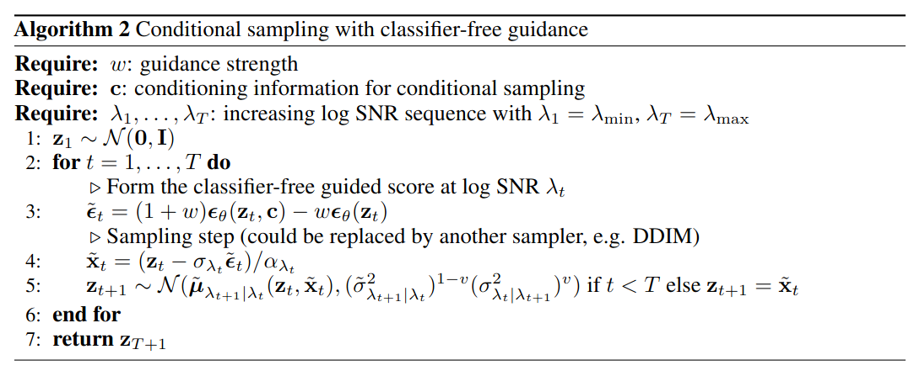
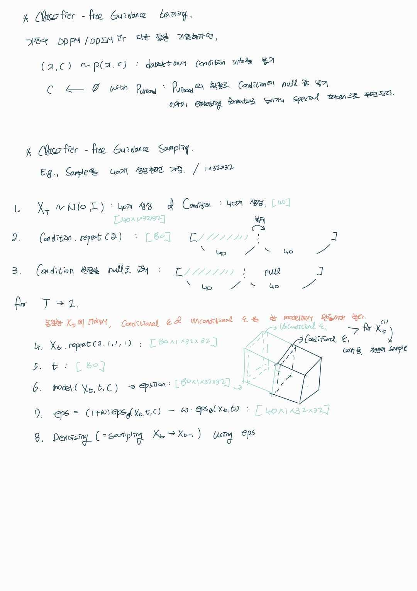

## Classifier-Free Diffusion Guidance
*arXiv(2022), 937 citation*

[Intro](#intro) 
[Related Work](#related-work) 
[Method](#method) 
[Experiment](#experiment) 
[Conclusion](#conclusion) 

> Core Idea

<strong>"Guidance without Additional Classifier"</strong> 

***

### <strong>Intro</strong>

***

### <strong>Related Work</strong>

***

### <strong>Method</strong>
- 다음의 식을 이용한다. <a href='../../딥러닝 이론/Score-based-generative-model/Score-based-generative-model.md'>reference</a>

$$ \nabla_x \log{p_{\sigma_i}(x)} \approx s_\theta^{*}(x_t,t\ or \ \sigma) = - \frac{1}{\sqrt{1-\bar\alpha_t}}\epsilon_\theta(x_t, t\ or \ \sigma) $$

- Condition $y$ 를 given 으로 $y$ 를 반영해서 이미지를 생성하고 싶다면 다음과 같이 식이 전개된다.($\sigma$ 생략)

$$ \nabla_x \log{p(x_t|y)} = \nabla_x \log{\frac{p(x_t)p(y|x_t)}{p(y)}}  $$ 

$$ = \nabla_x \log{p(x_t)} + \nabla_x \log{p(y|x_t)} - \nabla_x \log{p(y)} $$

- $x$ 에 관한 함수가 아닌, $\nabla_x \log{p(y)}$ 는 소거된다.

$$ \nabla_x \log{p(x_t|y)} = \nabla_x \log{p(x_t)} + \nabla_x \log{p(y|x_t)} $$

- $\nabla_x \log{p(x_t)}$ 을 좌항으로 넘기면, 다음과 같이 만들어진다.
  
$$ \nabla_x \log{p(x_t|y)} - \nabla_x \log{p(x_t)}  = \nabla_x \log{p(y|x_t)} $$

- 위의 수식을 Classifier guidance 의 수식인 $\gamma\nabla_x \log{p(y|x_t)}$ 에 대입하게 되면, <a href='../Classifier_guidance/Classifier_guidance.md'> reference </a>

$$ \nabla_x \log{p(x_t|y)} = \nabla_x \log{p(x_t)} + \gamma\nabla_x \log{p(y|x_t)} $$

$$ \nabla_x \log{p(x_t|y)} = \nabla_x \log{p(x_t)} + \gamma(\nabla_x \log{p(x_t|y)} - \nabla_x \log{p(x_t)})$$

$$ =  \gamma\nabla_x \log{p(x_t|y)} + (1-\gamma)\nabla_x \log{p(x_t)} $$

- 우측 항에 존재하는 텀들은 모두 model(parameter) 로 근사하는 값이기에 $\theta^*$ 를 찾으면 식이 동일하게 된다. 
  - 하지만, $\theta^*$ 는 찾기가 어려우므로 결국 우측 항에 있는 텀들은 좌측 항으로 넘길 수 없게 되고
  - $1-\gamma = -w$ 로 치환하게 되면, $\gamma = 1+w$ 이므로, 

$$ (1+w)\nabla_x \log{p(x_t|y)} + (-w)\nabla_x \log{p(x_t)} $$

$$ = (1+\gamma)\epsilon_\theta(x_t, c) - \gamma\epsilon_\theta(x_t) $$

$$ \therefore \tilde{\epsilon_\theta}(x_t, c) = (1+\gamma)\epsilon_\theta(x_t, c) - \gamma\epsilon_\theta(x_t) $$

- 따라서, conditional score model 을 학습 시키되 $p_{uncond}$ 의 확률로 condition 에 $null$ 값을 주면서 학습시키면 $\epsilon_\theta(x_t, c), \epsilon_\theta(x_t)$ 을 동시에 구할 수 있게 된다.
- $w$ 는 조절 가능한 가중치이다. 논문에서는 $w=0.1$ or $0.3$ 일때 best FID result 를 얻었다고 한다. 
- IS 의 경우, $w >= 4$, 즉 trade-off 관계이다. 

- 결론적으로, 하나의 모델을 사용하되 unconditional model 의 경우 null token 을 조건 $c$ 로 주게 된다. 

- 학습을 할때의 algorithm. DDPM 에서, condtion $c$ 를 넣는 것과 $p_uncond$ 의 확률로 condition $c$ 를 null 로만 바꿔주는 code 를 추가해주면 된다. 

- Sampling algorithm

- Summarization 
    - 중요하게 봐야 될 건, Conditional 과 Unconditional 을 조합할 때, 같은 noisy input 을 입력으로 받아서 $\epsilon$ 을 prediction 했다는 것이다.

***

### <strong>Experiment</strong>

***

### <strong>Conclusion</strong>
- 하나의 model 로 condtional model 과 unconditional model 을 동시에 학습시킬 수 있는 방법이다.
- 이 기법은 추후에 Latent Diffusion Model 에서도 사용된다. 

***

### <strong>Question</strong>
