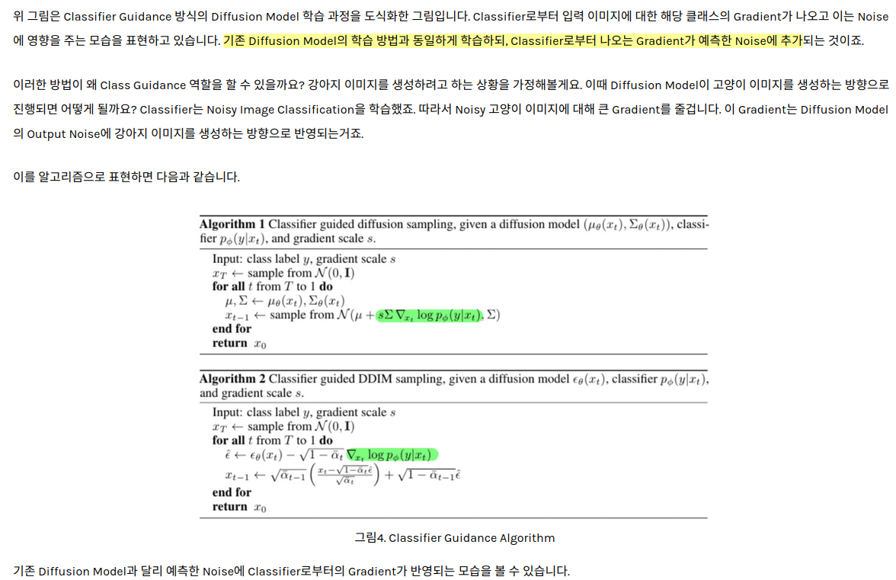

## Diffusion Models Beat GANs on Image Synthesis
*neurips(2021), 2514 citation*

[Intro](#intro) 
[Related Work](#related-work) 
[Method](#method) 
[Experiment](#experiment) 
[Conclusion](#conclusion) 

> Core Idea

<strong>"Conditional DDPM with Guidance"</strong> 

***

### <strong>Intro</strong>

***

### <strong>Related Work</strong>

***

### <strong>Method</strong>
- 다음의 식을 이용한다. <a href='../../딥러닝 이론/Score-based-generative-model/Score-based-generative-model.md'>reference</a>

$$ \nabla_x \log{p_{\sigma_i}(x)} \approx s_\theta^{*}(x_t,t\ or \ \sigma) = - \frac{1}{\sqrt{1-\bar\alpha_t}}\epsilon_\theta(x_t, t\ or \ \sigma) $$

- Condition $y$ 를 given 으로 $y$ 를 반영해서 이미지를 생성하고 싶다면 다음과 같이 식이 전개된다. ($\sigma$ 생략)

$$ \nabla_x \log{p(x_t|y)} = \nabla_x \log{\frac{p(x_t)p(y|x_t)}{p(y)}}  $$ 

$$ = \nabla_x \log{p(x_t)} + \nabla_x \log{p(y|x_t)} - \nabla_x \log{p(y)} $$

- $x$ 에 관한 함수가 아닌, $\nabla_x \log{p(y)}$ 는 소거된다. ($\gamma$ 로 강도 조정)

$$ \nabla_x \log{p(x_t|y)} = \nabla_x \log{p(x_t)} + \nabla_x \log{p(y|x_t)} $$

- 이때, 우측 항에 존재하는 텀들은 model(parameter) 로 근사하는 텀이 된다. 즉, $\theta^*$ 를 찾으면 성립하게 된다. 

$$ \therefore \nabla_x \log{p(x_t|y)} = \nabla_x \log{p(x_t)} + \gamma\nabla_x \log{p(y|x_t)} $$

- $\nabla_x \log{p(x_t|y)}$ 를 보면 이 score function 을 우리는 $s_\theta(x_t,t\ or \ \sigma)$ 로 근사했고 given $y$ 로 condition 을 받는다고 생각해보자.
    - 결국, $\nabla_x \log{p(x_t|y)}$ 도 $- \frac{1}{\sqrt{1-\bar\alpha_t}}\epsilon_\theta(x_t, t\ or \ \sigma)$ 의 꼴을 가지게 된다. $\nabla_x \log{p(x_t)}$ 와 $\beta$ 가 상수이기에 다른 점은 $\epsilon$ 뿐이다.
    - 따라서 noise 는 다음과 같이 수정된다.

$$ \hat{\epsilon}(x_t, t) = \epsilon_\theta(x_t, t) - \gamma\sqrt{1-\bar\alpha_t}\nabla_x \log{p(y|x_t)} $$

- 추가적으로 noisy image & time step 을 입력으로 받는 classifier model 을 학습시켜야 한다.

***

### <strong>Experiment</strong>

***

### <strong>Conclusion</strong>

***

### <strong>Question</strong>

