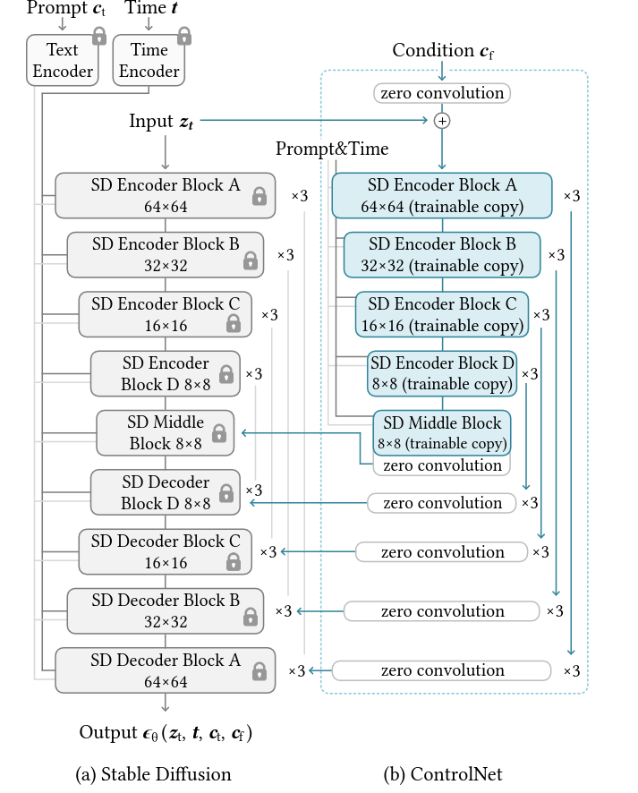

## ControlNet: Adding Conditional Control to Text-to-Image Diffusion Models
*CVPR(2022), 441 citation*

[Intro](#intro) 
[Related Work](#related-work) 
[Method](#method) 
[Experiment](#experiment) 
[Conclusion](#conclusion) 

> Core Idea

<strong>"Trainable Copy and Zero Convolution"</strong> 

***

### <strong>Method</strong>

- Zero Conv 가 SD encoder Block 마다 있다는 걸 유념해야 한다. 
  - E.g., SD Encoder Block A 가 $3$ 개가 있다면 zero conv 도 $3$ 개가 있다. 
  - Concat 이나 cross-attetion 이 아닌 add 이다.

- Stable Diffusion 의 $12$ 의 encoding block 과 $1$ 개의 middle block 의 trainable copy 를 만든다. 
  - $12$ 개의 block 은 각각 $3$ 개의 block 을 갖는 $4$ 개의 해상도 ($64 \times 64, 32 \times 32, 16 \times 16, 8 \times 8) 로 이루어져 있다. 
  - 출력은 U-Net 의 skip connection $12$ 개와 middle block $1$ 개에 추가 된다.  

