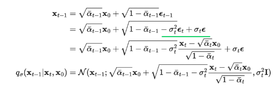
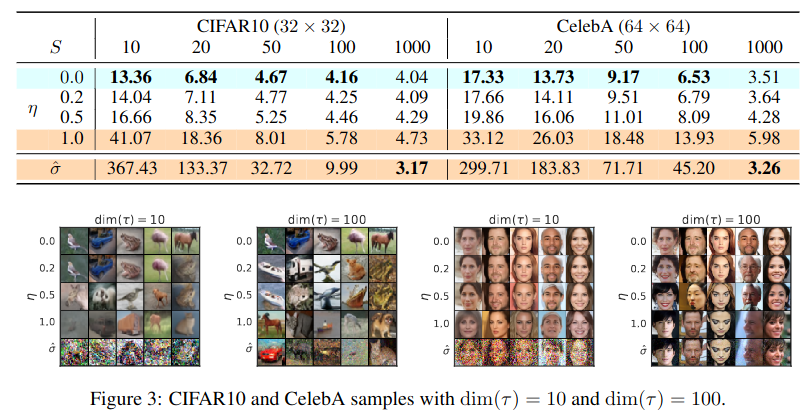
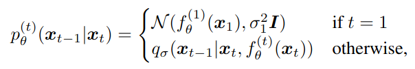

## DDIM: Denoising Diffusion Implicit Models
*ICLR(2021), 1610 citation*

[Intro](#intro) 
[Related Work](#related-work) 
[Method](#method) 
[Experiment](#experiment) 
[Conclusion](#conclusion) 

> Core Idea

<strong>"Non-Marcovian 으로 접근해, Loss 를 다른 방식으로 전개. Sampling 속도가 빠른 DDPM"</strong>
 
1. Marvov property 에 의해 sampling speed 가 느리다. 
2. 성능 저하의 원인인 Marcov 를 깬다. 
3. Loss 를 non-Marcov 로 전개. 

***

### <strong>Intro</strong>
- DDPM 은 adversarial training 없이, high quality image generation 을 할 수 있지만, sampling 을 하기 위해 많은 time step 의 Marcov chain 을 필요로 한다.
- 본 논문에서는, non-Markovain diffusion process 를 통해 DDPM 을 일반화한다. 따라서, deterministic 한 sampling 을 가능하게 하므로 time step t 에 대한 noisy image $X_t$ 가 $X_0$ 에서 온 것을 명시해줌으로써 이전 state 에만 의존했던 방법을 벗어날 수 있다.
- $X_0$ 를 인지하고 있는 deterministic sampling 을 사용하기 때문에, 굳이 noisy sample 을 만들기 위해, forward process $T=1000$ 을 모두 거치지 않아도 된다. 즉, 부분 집합인 $T_{sub}$ 를 거쳐 sampling 해도 큰 손상 없이 이미지를 생성할 수 있다.
- 실험적으로 DDIM 은 DDPM 에 비해 10배에서 50배 빠르게 sampling 을 할 수 있다.
- DDPM 이 Marcov-chain 을 사용하는 곳은 ELBO 로 전개한 Loss 를 쉽게 풀어쓰는 과정에서 사용한다. DDIM 도 마찬가지로 Loss 를 자기들만의 방식으로 풀어쓰기 위해서 non-Marcovian 으로 가정하고 풀어쓴 것과 동일하다. 이때, Loss 에 맞춰서 전개하기 때문에 reverse 는 그대로 Marcov-chain 으로 가정하는 거 같다. 
***

### <strong>Method</strong>
#### 수식
- Forward process: $X_0$ 가 주어졌을 때 $X_T$ 까지 noise 를 더하는 process  
    $$q(X_{1:T}|X_0) = \frac{q(X_1)}{q(X_0)} \frac{q(X_2, X_1, X_0)}{q(X_1, X_0)} \frac{q(X_3, X_2, X_1, X_0)}{q(X_2, X_1, X_0)} \cdots \frac{q(X_T \cdots X_0)}{q(X_{T-1} \cdots X_0)}$$
  - In DDPM, using Marcov Chain: $t$ 시점은 $t-1$ 에만 의존한다. 
    $$q(X_{1:T}|X_0) = \frac{q(X_1)}{q(X_0)} \frac{q(X_2, X_1)}{q(X_1)} \frac{q(X_3, X_2)}{q(X_2)} \cdots \frac{q(X_T, X_{T-1})}{q(X_{T-1})} = \prod_{t=1}^{T}q(X_t|X_{t-1})$$
  - In DDIM, using non-Marcovian: $t$ 시점은 $t-1$ 과 $0$ 에 의존한다. 
    $$q(X_{1:T}|X_0) = \frac{q(X_1)}{q(X_0)} \frac{q(X_2, X_1, X_0)}{q(X_1, X_0)} \frac{q(X_3, X_2, X_0)}{q({X_2, X_0})} \cdots \frac{q(X_T, X_{T-1}, X_0)}{q(X_{T-1}, X_0)} = q(X_1|X_0) \prod_{t=2}^{T}q(X_t|X_{t-1},X_0) = q(X_1|X_0)q(X_2|X_1, X_0)q(X_3|X_2, X_0) \cdots q(X_T|X_{T-1}, X_0),\ \ \ where \ q(X_t|X_{t-1}, X_0) = \frac{q(X_{t-1}|X_t, X_0)q(X_t|X_0)}{q(X_{t-1}|X_0)}$$

    $$So, q(X_1|X_0) \frac{q(X_1|X_2, X_0)q(X_2|X_0)}{q(X_1|X_0)} \frac{q(X_2|X_3, X_0)q(X_3|X_0)}{q(X_2|X_0)} \cdots \frac{q(X_{T-1}|X_T, X_0)q(X_T|X_0)}{q(X_{T-1}|X_0)}$$ 
    $$Then, \cancel{q(X_1|X_0)} \frac{q(X_1|X_2, X_0)\cancel{q(X_2|X_0)}}{\cancel{q(X_1|X_0)}} \frac{q(X_2|X_3, X_0)\cancel{q(X_3|X_0)}}{\cancel{q(X_2|X_0)}} \cdots \frac{q(X_{T-1}|X_T, X_0)q(X_T|X_0)}{\cancel{q(X_{T-1}|X_0)}}$$
    $$q(X_1|X_2, X_0)q(X_2|X_3,X_0)q(X_3|X_4,X_0) \cdots q(X_{T-1}|X_T,X_0)q(X_T|X_0) = q(X_T|X_0) \prod_{t=2}^{T}q(X_{t-1}|X_t,X_0)$$

  - Forward process 를 정의를 했으니, DDPM 에서 전개했던 것 처럼 $X_0$ 에서 $X_t$ 로 가는 수식은 다음과 같다.
    - 먼저 고려해야 될 건, DDPM 에서의 조건들은(except for Marcov chain) 모두 가지고 온다는 것이다.
      1.  최종적인 noise $X_T$ 는 standard gaussian distribution 을 따른다. $P(X_T) \sim N(X_T;0,I)$ 
      2.  Data 에 noise 를 주입하는 정도를 결정하는 $\beta$ 는 상수이다.
      3.  Noise $\epsilon$ 은 $N(0,I)$ 의 분포를 따른다.
      4.  Image 의 normalization [-1,1] 은 $X_T$ 의 평균이 0으로, 분산이 1로 가기 위한 수렴성 보장 용도이다.
      5.  Image 는 다변량 가우시안 분포이다. 즉, 각 pixel 이 가우시안 분포를 따르고 각 pixel 은 독립이다.
      6.  Forward process 는 non-Marcovian 의 성질을 가진다. 즉, $X_t$ 는 $X_{t-1}, X_0$ 에 의해서 결정된다.
    
    - 따라서, $q(X_t|X_{t-1}) := N(X_t;\sqrt{1-\beta_t}X_{t-1}, \beta_tI)$ 를 여전히 만족한다. 
      - 해당 수식은 Marcov-chain 에 의해서 결정되는 수식이 아닌, $\beta$ 를 통해 $X_T$ 가 표준 정규 분포를 따르게 하려고 설정한 것이다.
    
    - $q(X_t|X_{t-1}) := N(X_t;\sqrt{1-\beta_t}X_{t-1}, \beta_tI)$ 를 여전히 만족한다는 얘기는 다음의 수식도 만족한다고 얘기할 수 있다. *(자세한 수식은 DDPM pdf 에 있다)*
  
$$ X_t = \sqrt{\bar{\alpha_t}}X_0 + \sqrt{1 - \bar{\alpha_t}}\epsilon $$

- Reverse process: DDPM 과 똑같이 marcov-chain 을 따른다.

$$ p_\theta(X_{0:T})= p_\theta(X_T)\prod_{t=1}^{T}p_\theta(X_{t-1}|X_t) $$

- Loss 
  - 우리가 찾고 싶은 확률 분포는 다음과 같다.

$$ p(X_0) $$ 
  - 하지만, 해당 분포를 알 수 없으니 베이지안 룰을 사용해 알 수 있는 값들로 표현한다.

$$ p(X_0) = \frac{p(X_0|X_T)p(X_T)}{p(X_T|X_0)} $$
  - VAE 에서 사용했던 ELBO 를 그대로 적용해 보면 아래의 term 이 나오고, 이 term 을 minimize 하면 된다.

$$ -\log{\frac{p_\theta(X_{0:T})}{q(X_{1:T}|X_0)}} $$
  - 분자는 reverse process 이고, 분모는 forward process 이다.

$$ forward: \ q(X_T|X_0)\prod_{t=2}^{T}q_\theta(X_{t-1}|X_t, X_0) $$

$$ reverse: \ p_\theta(X_T)\prod_{t=1}^{T}p_\theta(X_{t-1}|X_t)$$
  - 그대로 풀어써보면, 우리는 이미 표준 정규 분포를 가정했고 수식도 그렇게 만들었기에 삭제되는 텀이 있고, 영향력이 적은 텀도 삭제한다.

$$ \log{q(X_T|X_0)} + \Sigma_{t=2}^{T}\log{q(X_{t-1}|X_t,X_0)} - \Sigma_{t=1}^{T}\log{p_\theta(X_{t-1}|X_t)} - \log{p_\theta(X_T)} $$

$$ = \cancel{\log(q(X_T|X_0))} + \Sigma_{t=2}^{T}\log{q(X_{t-1}|X_t,X_0)} - \Sigma_{t=1}^{T}\log{p_\theta(X_{t-1}|X_t)} - \cancel{\log{p_\theta(X_T)}} $$

$$ = [\Sigma_{t=2}^{T}D_{KL}(q(X_{t-1}|X_t,X_0) || p_\theta(X_{t-1}|X_t)) - \log{p_\theta(X_0|X_1)}] $$

$$ = \Sigma_{t=2}^{T}D_{KL}(q(X_{t-1}|X_t,X_0) || p_\theta(X_{t-1}|X_t))$$
  - 결국, $q(X_{t-1}|X_t,X_0)$ 의 분포(평균과 분산)를 알면 된다. 
  - **원래는 Bishop 의 pattern recoginition 책의 2절 115번 공식을 토대로(가우시안 분포, 조건부 확률에서 특정 변수에 대한 marginal 을 구하는 방법) $q(X_{t-1}|X_t,X_0)$ 의 분포(평균과 분산)를 먼저 계산하고 special case in forward process 로 가야됨. [<a href='https://junia3.github.io/blog/ddim'>reference link</a>]**
    - 하지만 그 공식이 이해가 안되니, special case in forward process 를 토대로 역으로 가보면, reparameterization trick 을 사용해 2번째 term 처럼 표현한다. 그리고 $\epsilon$ 을 $X_T, X_0$ 에 대한 식으로 바꿔주면, $q(X_{t-1}|X_t,X_0)$ 를 표현할 수 있다.

$$ X_{t-1} = \sqrt{\bar\alpha_{t-1}}X_0 + \sqrt{1-\bar\alpha_{t-1}} \epsilon_{t-1},\ [forward\ process] $$

$$ \epsilon_t = \frac{X_t - \sqrt{\bar\alpha_t}X_0}{\sqrt(1-\bar\alpha_t)}, \ using\ forward\ process $$

- 여기서 $q(X_{t-1}|X_t,X_0)$ 의 분포를 한 번에 유추할 수 있다는 걸 알 수 있다.  
    - 이때, inference 과정에서는 $X_0$ 를 알 수 없기 때문에 2번째 term 을 사용할 것 이다. 
    - 2번째 term 에도 $X_0$ 가 있어서, 이 $X_0$ 는 forward process 의 수식을 이용해 $X_t$ 로 대체한다.

$$ where,\ X_0 = \frac{X_t - \sqrt{1-\bar\alpha_t}\epsilon_\theta(X_t)}{\sqrt{\bar\alpha_t}} $$

$$ X_{t-1} = \sqrt{\bar\alpha_{t-1}}(\frac{X_t - \sqrt{1-\bar\alpha_t}\epsilon_\theta (X_t)}{\sqrt{\bar\alpha_t}}) + \sqrt{1-\bar\alpha_{t-1} - \sigma_t^2}\epsilon_\theta (X_t) + \sigma_t\epsilon_t $$
- 여기서 $\sigma$ 는 아래의 식과 같고(DDPM 과 동일), 이 값에 $\eta$ 를 곱해 조절한다.

$$ \sigma^2 = \tilde{\beta_t} = \frac{1-\bar\alpha_{t-1}}{1-\bar\alpha_t}\beta_t $$
- $\eta$ 가 1 이면 DDPM, 0 이면 DDIM 이다. 

DDPM 에서는 $L_{t-1}$ term 을 gaussian distribution 으로 분해해서 평균과 분산을 구했다

DDIM 에서는 $L_{t-1}$ term 을 바로 정의
***

### <strong>Experiment</strong>
- DDIM 이 전체적으로 FID score 가 낮으며, sampling 수가 적을수록 극대화된다. 
  - $S$ : number of sampling 

***

### <strong>Conclusion</strong>
- DDIM 은 consistency property 가 DDPM 보다 우수하다. 따라서 같은 initial latent variable 에서 생성을 시작했다면, generated sample 들은 비슷한 high-level feature 를 갖게 된다. 이러한 특징으로 인해 semantically meaningful image interpolation 이 가능하다.
- 요즘 트렌드는 DDPM 으로 학습시킨 모델을 DDIM 의 sampling 방식으로 이미지를 생성한다. 
- DDPM 에서 단순하게 sampling 수를 줄이는 건 Marcov-Chain 에 의해 정의를 했기 때문에 성능이 떨어지지만, DDIM 은 non-Marcovian 이여서 건너뛰어도 된다. 

- 건너뛸때의 가장 중요한 점은 이전 time step 도 같이 고려해야 된다는 것이다. 즉, 바로 전 step 이 아니라 건너 뛴 만큼의 time step 이 이전 time step 이 되는 꼴이다.
- 학습 과정 등 모두 똑같이 setting 하고, 아래 식에서 $\sigma = 0$ 으로 하고 sampling 을 하면 된다.

$$ X_{t-1} = \sqrt{\bar\alpha_{t-1}}(\frac{X_t - \sqrt{1-\bar\alpha_t}\epsilon_\theta (X_t)}{\sqrt{\bar\alpha_t}}) + \sqrt{1-\bar\alpha_{t-1} - \sigma_t^2}\epsilon_\theta (X_t) + \sigma_t\epsilon_t $$ 

$$ \sigma(\eta) = \eta\sqrt{\tilde{\beta_t}} = \eta\sqrt{\frac{1-\bar\alpha_{t-1}}{1-\bar\alpha_t}\beta_t} $$

- $t=1$ 일때 다음과 같은 식으로 sampling 해야 된다. ($\eta=0$ 이니까)

$$ X_{t-1} = \frac{X_t - \sqrt{1-\bar\alpha_t}\epsilon_\theta (X_t)}{\sqrt{\bar\alpha_t}} $$ 
***

### <strong>Question</strong>
- Forward process 는 non-Marcov 로 전개했는데, reverse process 는 왜 Marcov 로 전개했는가.
    - Loss form 에 맞추기 위해 reverse process 는 그대로 둔 거 같다.
- DDIM 은 무슨 근거로 time step 을 건너뛸 수 있는가.
  - $q(X_t|X_0)$ 이 고정되어 있는 한 denosing objectvive Loss 는 특별한 forward procedure 에 의존하지 않기 때문에 $T$ 보다 작은 step 에 대한 forward process 를 고려할 수 있다.
- Q. 많은 블로그나 영상에서 모든 time step 에서의 $q$ 의 distribution 은 분산이 1이다. 그것을 보장해주기 위해서 image normalization 을 [-1,1] 로 해준다. 라고 하는데, 제 생각엔 image normalization 은 마지막 $X_T$ 의 평균이 0 분산이 1 로 가기 위한 수렴성 보장 용도이고 (즉, [-1,1] 로 하든 [0,1] 로 하든 상관없다), 마지막 time step에서의  $X_T$ 의 분산만 1이라고 생각이 듭니다. 혹시 그룹장님의 의견을 들어볼 수 있을까요? (김세훈 그룹장. 카카오브레인)
  - A. DDPM 이나 SDE 나 결국 noise 를 많이 줬을 때 표준 정규 분포를 따른다. [-1, 1] 이 더 좋긴 함. 그래서 latent 로 보냈을 때 범위가 [-무한대, 무한대] 니까 더 자유도가 크다. loss term 에 regularization term 이 존재해서 극단적인 거는 막아줌 
- Q. 그럼 그룹장님 의견은 모든 time step 에서의 q의 distribution의 분산은 1이다라는 말씀이신가요?
  - A. 1은 아니다. 
- Q. DDIM sampling 결과를 보여주셨는데, DDPM 으로 학습 후, DDIM sampling 시에, sampling 수식만 바꿔주면 된다고 들었는데 다른 고려 사항은 없을까요? (time step 을 1000으로 학습했으면 DDIM sampling 시에는 20 → 19 → … → 0 이 아닌, 1000 → 980 → … → 0 으로 뛰어야 한다. 등)
  - A. 다른 고려 사항은 없다. 
- loss 를 보면 왔다갔다 하면서 model 학습이 안되는 것처럼 보이지만, 학습이 되는 것이다. time step 마다 예측해야 하는 noise 양이 많아서
- sequential 하게 학습하지 않는 이유는, 모든 t 에 대해서 학습을 하면 computation cost 가 많이 들어서 그렇다.