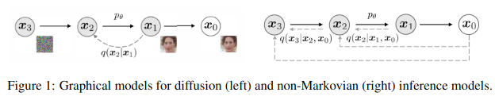

## DDIM: Denoising Diffusion Implicit Models
*ICLR(2021), 1610 citation*

[Intro](#intro) 
[Related Work](#related-work) 
[Method](#method) 
[Experiment](#experiment) 
[Conclusion](#conclusion) 

> Core Idea

<strong>"asd"</strong> 

***

### <strong>Intro</strong>
- DDPM 은 adversarial training 없이, high quality image generation 을 할 수 있지만, sampling 을 하기 위해 많은 time step 의 Marcov chain 을 필요로 한다.
- 본 논문에서는, non-Markovain diffusion process 를 통해 DDPM 을 일반화한다. 따라서 좀 더 deterministic 한 generative process 를 학습시킬 수 있다.
- 실험적으로 DDIM 은 DDPM 에 비해 10배에서 50배 빠르게 sampling 을 할 수 있다.

***

### <strong>Related Work</strong>

***

### <strong>Method</strong>
#### 수식
- Forward process: $X_0$ 가 주어졌을 때 $X_T$ 까지 noise 를 더하는 process  
    $$q(X_{1:T}|X_0) = \frac{q(X_1)}{q(X_0)} \frac{q(X_2, X_1, X_0)}{q(X_1, X_0)} \frac{q(X_3, X_2, X_1, X_0)}{q(X_2, X_1, X_0)} \cdots \frac{q(X_T \cdots X_0)}{q(X_{T-1} \cdots X_0)}$$
  - In DDPM, using Marcov Chain: $t$ 시점은 $t-1$ 에만 의존한다. 
    $$q(X_{1:T}|X_0) = \frac{q(X_1)}{q(X_0)} \frac{q(X_2, X_1)}{q(X_1)} \frac{q(X_3, X_2)}{q(X_2)} \cdots \frac{q(X_T, X_{T-1})}{q(X_{T-1})} = \prod_{t=1}^{T}q(X_t|X_{t-1})$$
  - In DDIM, using non-Marcovian: $t$ 시점은 $t-1$ 과 $0$ 에 의존한다. 
    $$q(X_{1:T}|X_0) = \frac{q(X_1)}{q(X_0)} \frac{q(X_2, X_1, X_0)}{q(X_1, X_0)} \frac{q(X_3, X_2, X_0)}{q({X_2, X_0})} \cdots \frac{q(X_T, X_{T-1}, X_0)}{q(X_{T-1}, X_0)} = q(X_1|X_0) \prod_{t=2}^{T}q(X_t|X_{t-1},X_0) = q(X_1|X_0)q(X_2|X_1, X_0)q(X_3|X_2, X_0) \cdots q(X_T|X_{T-1}, X_0),\ \ \ where \ q(X_t|X_{t-1}, X_0) = \frac{q(X_{t-1}|X_t, X_0)q(X_t|X_0)}{q(X_{t-1}|X_0)}$$

    $$So, q(X_1|X_0) \frac{q(X_1|X_2, X_0)q(X_2|X_0)}{q(X_1|X_0)} \frac{q(X_2|X_3, X_0)q(X_3|X_0)}{q(X_2|X_0)} \cdots \frac{q(X_{T-1}|X_T, X_0)q(X_T|X_0)}{q(X_{T-1}|X_0)}$$ 
    $$Then, \cancel{q(X_1|X_0)} \frac{q(X_1|X_2, X_0)\cancel{q(X_2|X_0)}}{\cancel{q(X_1|X_0)}} \frac{q(X_2|X_3, X_0)\cancel{q(X_3|X_0)}}{\cancel{q(X_2|X_0)}} \cdots \frac{q(X_{T-1}|X_T, X_0)q(X_T|X_0)}{\cancel{q(X_{T-1}|X_0)}}$$
    $$q(X_1|X_2, X_0)q(X_2|X_3,X_0)q(X_3|X_4,X_0) \cdots q(X_{T-1}|X_T,X_0)q(X_T|X_0) = q(X_T|X_0) \prod_{t=2}^{T}q(X_{t-1}|X_t,X_0)$$

  - Forward process 를 정의를 했으니, DDPM 에서 전개했던 것 처럼 $X_0$ 에서 $X_t$ 로 가는 수식은 다음과 같다.
    - 먼저 고려해야 될 건, DDPM 에서의 조건들은(except for Marcov chain) 모두 가지고 온다는 것이다.
      1.  최종적인 noise $X_T$ 는 standard gaussian distribution 을 따른다. $P(X_T) \sim N(X_T;0,I)$ 
      2.  Data 에 noise 를 주입하는 정도를 결정하는 $\beta$ 는 상수이다.
      3.  Noise $\epsilon$ 은 $N(0,I)$ 의 분포를 따른다.
      4.  Image 의 normalization [-1,1] 은 $X_T$ 의 평균이 0으로, 분산이 1로 가기 위한 수렴성 보장 용도이다.
      5.  Image 는 다변량 가우시안 분포이다. 즉, 각 pixel 이 가우시안 분포를 따르고 각 pixel 은 독립이다.
      6.  Non-Marcovian 의 성질을 가진다. $X_t$ 는 $X_{t-1}, X_0$ 에 의해서 결정된다.
    
    - 따라서, $q(X_t|X_{t-1}) := N(X_t;\sqrt{1-\beta_t}X_{t-1}, \beta_tI)$ 를 여전히 만족한다. 
      - 해당 수식은 Marcov-chain 에 의해서 결정되는 수식이 아닌, $\beta$ 를 통해 $X_T$ 가 표준 정규 분포를 따르게 하려고 설정한 것이다.
    
    - $q(X_t|X_{t-1}) := N(X_t;\sqrt{1-\beta_t}X_{t-1}, \beta_tI)$ 를 여전히 만족한다는 얘기는 다음의 수식도 만족한다고 얘기할 수 있다. *(자세한 수식은 DDPM pdf 에 있다)*
  
$$ X_t = \sqrt{\bar{\alpha_t}}X_0 + \sqrt{1 - \bar{\alpha_t}}\epsilon $$

- Reverse process: forward process 를 반대로 보고 학습을 진행한다 
  Reverse process 는 forward process 를 이용하여 다음과 같은 수식으로 정의할 수 있다.

$$ X_{t-1} = \sqrt{\bar{\alpha}_{t-1}}X_0 + \sqrt{1 - \bar{\alpha}_{t-1}}\epsilon_{t-1},\ [forward\ process] $$ 

$$ \sqrt{\bar{\alpha}_{t-1}} $$

$$ X_{t-1} = \sqrt{\bar{\alpha}_{t-1}}X_0 + \sqrt{1 - \bar{\alpha}_{t-1}}\epsilon_{t-1},\ [forward\ process] $$

$$ \sqrt{\overline{\alpha}_{t-1}} $$

X_t, X_0 를 given 으로 주는 non-marcovian 으로 바꾸면 loss에서 바로 구할 수 있다.

DDPM 에서는 $L_{t-1}$ term 을 gaussian distribution 으로 분해해서 평균과 분산을 구했다

DDIM 에서는 $L_{t-1}$ term 을 바로 정의
***

### <strong>Experiment</strong>

***

### <strong>Conclusion</strong>

***

### <strong>Question</strong>

<a href="">link</a>

> 인용구
