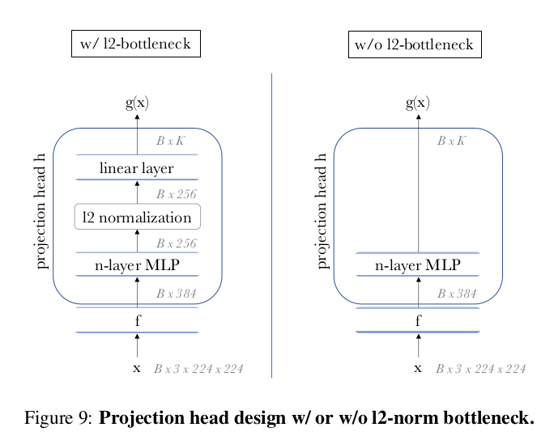
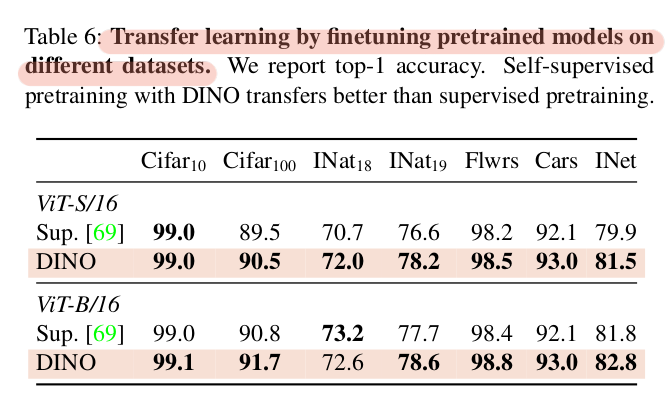
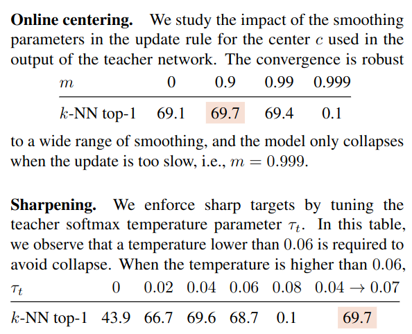

## DINO: Emerging Properties in Self-Supervised Vision Transformers
*ICCV(2021), 3060 citation, Facebook AI Research*

<a href='https://daebaq27.tistory.com/121'>Reference blog</a>

[Intro](#intro) 
[Related Work](#related-work) 
[Method](#method) 
[Experiment](#experiment) 
[Conclusion](#conclusion) 

> Core Idea

<strong>"Self-Distillation with no labels "</strong> 

***

### <strong>Intro</strong>

- 본 논문에서의 movivation 은 다음과 같다. 
  1. Vision Transformer 는 convnet 과 비교해서 우수한 성능을 달성할 수 있지만, ViT 는 계산량과 더 많은 training dataset 을 필요로 하면서 독특한 특성을 나타내지도 않는다.
     1. Transformer 의 독특한 특성이라 함은 attention map 을 뽑을 수 있는데 이는 CNN 에서도 마찬가지로 CAM 을 통해 attention map 을 뽑을 수 있다. 
  2. 하지만, NLP 분야에서는 transformer architecture 가 성공을 거뒀는데 주요 요인이 self-supervised learning (pretext tasks) 임을 발견했다.
     1. BERT 의 next-sentence prediction & masked language model 
     2. GPT 의 next-token prediction
  3. 따라서, 본 논문도 ViT 에 초점을 맞춰서 효과적인 self-supervised learning 을 적용시켜보고자 했고 ViT 에 self-supervised learning 이 잘 작동하는 걸 넘어서서, 다음과 같은 관찰 결과를 얻었다. 
     1. Self-supervised ViT feature 는 image 의 semantic segmentation (scene layout: object boundaries) 에 대한 명시적인 정보를 가지고있다. (위의 figure 참고)
        1. 이는, convnets 이나 supervised learning 으로 학습된 ViT 에서는 나타나지 않는다. 
     2. 이러한 특성은 훌륭한 KNN classifier 이기도 하다.
        1. Samll ViT 에서도 ImageNet dataset 에 대해 $78.3$ % top-1 을 달성했다. 
     3. Momentum encoder, multi-crop training, ViT 의 small patch 가 중요하다.

- ViT 에 본 논문의 method 인 DINO 를 적용시켜, ViT-Base 에서 $80.1$ % top-1 on ImageNet in linear evaluation 을 달성했다.
- ViT 에 DINO 를 적용하면 계산량이나 memory 적으로도 효과적이다.
  - $8$ - GPU 가 달린 server $2$ 개를 사용해서 $3$ 일 학습하면 ImageNet linear benchmark 에 $76.1$ % 를 달성할 수 있다. 

- Contribution 
  - EMA: teacher 의 성능이 student 보다 좋다. 
  - Knowledge distillation: teacher 의 성능이 더 좋기 때문에 distillation 이 가능하다. 
    - 본 논문에서는 multi-crop augmentation 을 통해, student network 가 local-to-global correspondence 를 달성한다고 표현했다. 
    - Use sharp label ( $0 < \tau < 1$ )
    - Sharpening 을 사용하는 것은 output distribution (모든 노드에 대한 분포) 이 uniform 한 것을 막아주지만, 반대로 one dimenstion 에 dominate 될 수 있다. (collapse)
  - Centering: 배치에 대해서 각 노드의 평균 값을 빼주어, output distribution 이 uniform 하게끔 장려한다. 
    - 반대로, one dimension 에 dominate 될 수 있다. (collapse)
  - Multi-crop augmentation, small patch in ViT  

***

### <strong>Related Work</strong>

- Self-supervised learning
- Self-training and knowledge distillation

***

### <strong>Method</strong>

- 본 논문의 접근법은 self-supervised approache 와 전체적인 구조는 동일하지만, knowledge distillation 과도 유사하다. 
  - Multi-crop 으로 $2$ 개의 global view ($224^2$, greater than $50$ %) 와 몇 개의 local view ($96^2$, less than $50$ %) 를 만든다.
  - Student model 은 모든 view 를 input 으로 받고, student model 은 global view 만 input 으로 받는다. 
    - Local-to-global correspondence: local 의 더 적은 정보를 가지고도 더 넓은 정보 from global view 의 representation 이 되게끔 학습한다. 
  - EMA update: 학습 단계에서 봤던 student model 들의 parameter 의 평균이 되는 것과 유사한데, 이는 모델의 앙상블 효과를 가져올 수 있다. 
    - Teacher model 은 gradient descent 를 하지 않고 EMA update 로 model 의 parameter 를 update 한다. 
    - EMA 로 update 한 teacher model 의 성능이 항상 좋음.
    - EMA 의 $\lambda$ 값은 $[0.996,1]$ 의 cosine schedule 이다.
  - Centering: 각 노드에 들어오는 batch 의 값들을 확률변수로 보고 확률 변수의 평균값을 빼준다. 
    1. 각 노드의 평균 값을 빼주고 다른 노드들과의 상대적인 차이만 본다. 즉, 모든 노드의 평균이 $0$ 이라고 볼 수 있다. 
    2. 표준편차가 작고 평균이 다른 노드들의 분포를 가진다면, 이는 uniform 한 output distribution 을 가질 수 있다. 
    3. 반면에 표준편차가 크다면, 이는 uniform 한 output distribution 을 만들지는 못해도 one dimension 이 dominate 하는 효과는 막을 수 있다. 
    4. 하지만 softmax 의 결과값들을 uniform distribution 으로 만들기 때문에 이는 collapse 를 불러일으킨다.
    5. Uniform distribution 이 되는게 collapse 를 불러일으키는 이유는 어떤 값이 input 으로 들어와도 똑같은 값을 계속 뱉어내기 때문이다. 최종 output 값이 항상 같기에 student model 이 제대로 학습을 할 수가 없다. 
    6. Centering 을 안하게 되면, 각 노드의 분포들이 각자의 평균값을 가진다는 얘기이고 이는 한 노드가 지배적으로 큰 값을 항상 배출할 수도 있다. 따라서, 모든 data 에 대해서 그 노드의 값이 항상 크다면 softmax 를 거친 값이 항상 하나의 노드 값만 $1$ 이 된다는 걸 의미하고 이는 학습을 망치는 요인이 된다. 
    7. 또한, centering 을 first-order batch statistic 을 사용하는 구조로 teacher 에 bais term 을 더해주는 방식으로 해석할 수도 있다. 이는 moving average 로 update 되기 때문에 배치 사이즈에 상관없이 잘 작동한다. 
  - Sharpening: output distribution 이 sharp 해진다. 이는 uniform distribution 이 되는 걸 막아주는 동시에, one dimension 이 dominate 되는 효과를 가져올 수 있다. 
    - Sharpening 이 없으면, centering 에 의해 uniform distribution 이 될 것이다. 
    - Uniform distribution 이라는 말은 softmax 의 output 값이 항상 동일하게 나온다는 말이 되고 (e.g., $5$ 개의 노드: $0.2/0.2/0.2/0.2/0.2$) 입력 데이터에 따라 값의 변화가 없으니 학습이 진행되지 않는다. 

- Pseudocode without multi-crop

- Softmax in knowlege distillation

- Cross-entropy: teacher 의 지식을 배워야하기 때문에, $a$ 가 teacher 이 확률값이 된다. 
  - Student model 와 teacher model 의 입력이 같은 global view 라면, cross-entropy 계산은 하지 않는다.  
  - Student model 의 paramter 만 update 한다. 
  - $\min_{\theta_s} - p_t(x)\log p_s(x)$
  - Knowledge distillation 을 해야하기에, 모든 dimension 에 대해서 cross-entropy 를 한다. 
    - 일반적으로는, ground truth label 에 대해서만 계산한다. 

- Projector
  - $3$ layer MLP: hidden dimension $2048$, $L_2$ normalization and a weight normalized fully connected layer with $K$ dimensions
  - GELU activations
  - Last layer 는 GELU 없이

- ViT 에는 batch normalization 이 안쓰이기 때문에, ViT 를 backbone 으로 사용하면 projector 에도 쓰지 않는다. 
  - Batch-norm 을 안 써서, batch 에 의존적인 구조는 아니다. 
  - *Entirely BN-free*
  - Batch norm 이 중요한 요소는 아니다라는 걸 보여준다. 

- Avoid collapse
  - 다른 self-supervised learning 에서는 collapse 를 피하기 위해, contrastive loss, clustering constraints, predictor, batch normalization 을 사용한다.
  - 본 논문에서는, teacher model 의 centering 과 sharpening 을 통해 collapse 를 피한다. 

***

### <strong>Experiment</strong>

$\textsf{Implementation Details}$

- Train ImageNet dataset without labels
- AdamW optimizer with batch size $1024$
- ViT-S/16 - $16$ GPUs
- $\tau_s = 0.1$
- $\tau_t = 0.04 \sim 0.07$: linear warm-up during the first $30$ epochs
- BYOL 의 augmentation 을 그대로 사용: color jittering, Gaussian blur, solarization, multi crop with a bicubic interpolation

$\textsf{Evaluation Protocols}$

- Linear Evaluations
  - Learn linear classifier on frozen features
  - Apply random resize crops and horizontal flips augmentation during training
- Fineuning Evaluations
  - Finetune the features 
  - Initialize networks with the pretrained weights and adapt them 

- K-NN
  - Train dataset 을 self-supervised learning 으로 학습한 model 로 representation 을 뽑아서 저장
  - Validate data 의 representation 을 뽑아서 주위의 K 개만큼 보고, classification 을 진행한다.
  - 본 논문에서는 $20$ 으로 실험했다. 
  - 추가적인 학습이나 hyper-parameter tuning, data augmentation 이 필요없어서 효과적이다. (위의 두 개의 evaluation protocol 은 hyperparameter 에 민감하다.)

- Linear and $k$ -NN classification on ImageNet
  - Top-1 accuracy: validation set of ImageNet 
  - im/s: throughput (NVIDIA V $100$ GPU with $128$ samples per forward)
  - 먼저, ResNet-50 과 ViT-small architecture 에 초점을 맞췄다. 
    - DINO 가 ResNet 에도 잘 작동하는 것을 알 수 있다. 
  - Across architecture
    - ViT-B/16 DION: 다른 baseline 보다 param 수도 적고 throughput 도 좋은데 성능도 우수하다. 
    - 가장 좋은 성능을 낸 건 ViT 의 patch size 가 $8$ 이다. 

- Segmentations
  - Supervised 로 학습한 ViT 모델은 object segmentation 의 능력이 현저히 떨어진다.
  - 반면, DINO 로 학습한 ViT 모델은 segmentation 능력이 우수하다. 

- Transfer learning on different datasets
  - Top-1 accuracy
  - DINO 가 supervised learning 보다 성능이 좋다. 

- Ablation study

- Patch size 가 작은 게, 성능이 더 좋다. 
  - K-NN eval
  - $5 \times 5$: throughput 이 굉장히 비싸다. $44$ im/s vs $180$ im/s for $8 \times 8$ patches.

- Teacher model vs Student model / Update approach of Teacher model 
  - EMA 로 update 한 teacher model 의 성능이 항상 student model 보다 좋다.
  - Teacher model 의 parameter update 방식은 EMA 가 좋다.
    1. Student copy: 항상 student 와 같음
    2. Previous iter: 이전 iter 의 student param
    3. Previous epoch: 이전 epoch 의 student param
    4. Momentum: EMA update 

- Networks configuration
  - im/s: forward 당 $128$ 개의 sample 의 inference time on a NVIDIA V $100$ GPU
  - 당연하게도 ResNet 이 더 많은 sample 을 처리할 수 있다. 
  - Parameter 개수가 동일해도, ViT 의 Patch 가 작을 수록 더 많은 계산량을 필요로 한다. 

- Collapse study
  - sharpening 과 centering 하나만 적용하면 collapse 가 일어나는 반면, 같이 쓰면 조화를 이룬다. 
  - Cross-entropy $-p_t(x) \log p_s(x)$ 를 다음과 같이 쓸 수 있다. $-p_t(x) \log p_t(x) + p_t(x) \log \frac{p_t(x)}{p_s(x)}$
    - 앞의 텀이 target entropy, 뒤의 텀이 KL divergence 이다. 
  - Centering 만 있다면, output distribution 이 uniform distribution 으로 장려된다. 이 말은 target entropy 가 $\sum_k - \frac{1}{K} \log \frac{1}{K} = \log \frac{1}{K},$ $K=4096$ 이라면 target entropy 값은 $8.31776616672$ 이 된다. 
  - Sharpening 만 있다면, output distribution 이 one dimension 만 $1$ 이고 나머지는 $0$ 이기 때문에 target entropy 는 $0$ 이다. 
    - $-x \log_e x$ 그래프를 보면 $x=0/1$ 일 때 값이 $0$ 인 것을 확인할 수 있다.
  - 이번엔 KL divergence 값을 보면, centering 이나 sharpening 만 존재할 때 배치에 상관없이 항상 값이 일정하기 때문에 KL divergence 가 $0$ ($0$ 이란 말은 student 의 output 값과 teacher 의 output 값이 동일하여 완벽하게 따라하는 것이다) 으로 학습이 안된다. 

- Final output dimensionality $K$ 에 대한 실험 

- Centering 값 $c$ 는 다양한 batch size 에서도 잘 작동한다. 즉, centering 은 batch size 에 독립적이다. 
  - $128$ batch size 는 오직 하나의 GPU 만으로도 동작한다. 
  - $8$ batch size 로도 실험을 했는데, $50$ epoch 이후에, $35.2$ % 를 달성했다. 이는 GPU 당 하나의 이미지를 학습하는 것과 효율이 좋지 않은 large model 을 학습하는 가능성을 보여준다. 

- Centering 과 Sharpening 의 hyper-parameter 실험 
  - $m=0$ 이면, 현재 batch 에 의존적이다.
  - $m \rightarrow 1$ 이면, center $c$ 의 update 가 매우 느려서 모델 collapse 가 발생한다. 
  - Sharpening 도 학습 초기엔 shaprness 를 최대한으로 하고 점점 smooth 한 방향으로 해야 효율이 좋다. 

- Self-attention heads form the last layer
  - 서로 다른 head 의 [CLS] token 으로 뽑은 attention map
  - Query for the different heads in the last layer 

***

### <strong>Conclusion</strong>

***

### <strong>Question</strong>

- Student 의 softmax 에서는 왜 temperature 값이 $0.1$ 로 $1$ 보다 작은 값을 설정하여 sharpening 을 진행했을까? 
  - 기본적인 distillation 에서 같은 temperature 값을 사용하기에 비슷하게 설정한 것 같다. 구체적인 값은 경험적으로 찾아서 teacher 보다 항상 높게 설정한 거 같다. 

- Inference 에서 사용하는 model 은 teacher 인가 student 인가
  - Teacher 와 student model 모두 동일한 구조인데, 성능은 teacher 의 성능이 항상 높으니 아마 teacher model 을 사용하지 않을까