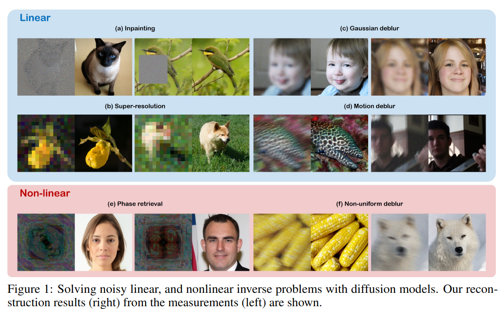
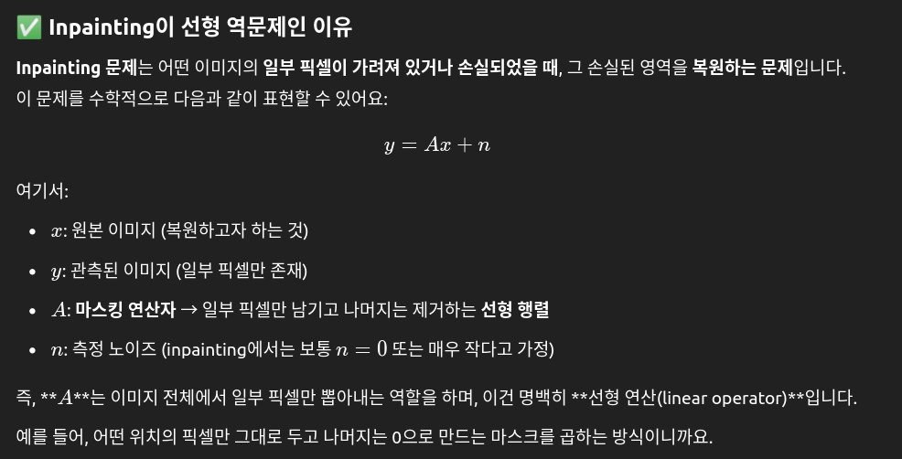
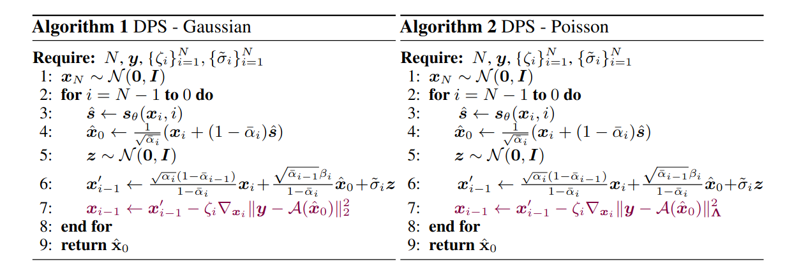
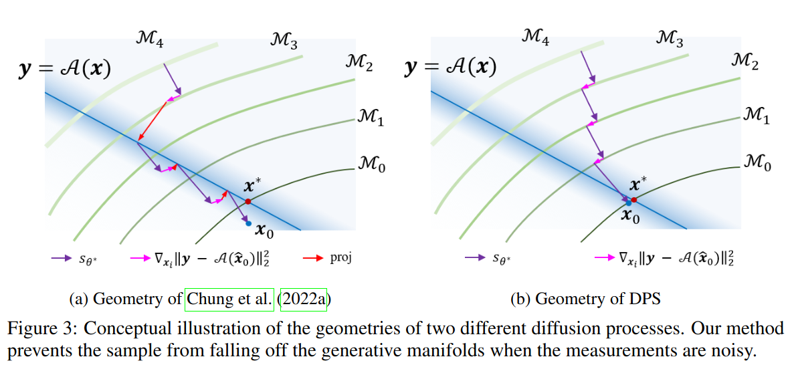

## Diffusion Posterior Sampling for General Noisy Inverse Problems
*ICLR(2023), 752 citation, KAIST, Review Data: 2025.04.10*

[Intro](#intro) 
[Related Work](#related-work) 
[Method](#method) 
[Experiment](#experiment) 
[Conclusion](#conclusion) 

> Core Idea

<strong>"test1"</strong> 

***

### <strong>Intro</strong>

$\textbf{이 주제의 정의 및 요구사항과 중요한 이유}$

- 확산 모델(Diffusion models)은 최근 고품질 복원 성능과 기존 반복 기반 해법과의 결합이 용이하다는 장점 덕분에 강력한 생성 기반 역문제 해결 기법으로 주목받고 있다. 

$\textbf{이 주제의 문제점과 기존의 노력들}$

- 하지만 대부분의 기존 연구들은 잡음이 없는 환경에서의 단순한 선형 역문제 해결에 초점을 맞추고 있어, 실제 현실 세계의 복잡성을 충분히 반영하지 못합니다.
  1. Measurement에 noise가 포함된 경우: 노이즈가 조금만 있어도 해가 바뀌기에 inverse problem이 본질적으로 잘 정의되지 않았기에, 생성 과정 중에 잡음이 증폭되는 경향이 있다.
     1. 예시로, noise가 포함된 Meaurement라면 projection을 해도 noise가 있는 결과이기에 복원시에 잘못된 결과가 나올 수 있다.
  2. Measurement process가 nonlinear인경우: 단순 투영 방식이 제대로 작동하지 않는다.

$\textbf{최근 노력들과 여전히 남아있는 문제들}$

- 위의 문제를 해결하기 위한 한 가지 접근법은 spectral domain에서 확산 과정을 실행하는 것이다. 
  - 이 방식은 SVD를 통해 측정 도메인의 잡음을 스펙트럼 도메인으로 옮겨서 다룬다. 
  - 하지만 계산 비용이 매우 크기에 사실상 사용할 수 없다. 

- 확산 모델은 다양한 역문제에도 적용된다. 
  - E.g., Inpainting, Super-resolution, Colorization, CS-MRI, CT
  - 그러나 지금까지의 연구는 linear inverse problem에만 초점을 맞췄으며, non-linear inverse problem에 대해서는 충분히 탐구되지 않았다. 

- 최근에 제안된 MCG (Manifold Constrained Gradients) 기법은 사실상 이 논문의 noisyless한 특수 사례임을 밝혀ㅇ냈다. 또한, 기하학적 관점에서 분석한 결과, 본 논문의 방법이 잡음 환경에서 이전 접근 방식보다 더 바람직한 샘플 경로를 생상할 가능성이 높음을 보였다. 

$\textbf{본 논문에서 해결하고자 하는 문제와 어떻게 해결하는지, 그 결과들}$

- 이 논문에서는 확산 기반 해법(Diffusion solvers)을 확장하여, 일반적인 잡음이 있는 (비)선형 역문제를 효과적으로 해결할 수 있도록 사후 분포 근사 샘플링(posterior sampling) 방식으로 접근한다. 
  - 흥미롭게도, 제안된 사후 분포 샘플링 방식은 측정 일치(measurement consistency)를 강제로 투영하는 단계를 포함하지 않으면서, 확산 샘플링과 다양체 제약이 있는 그래디언트를 결합한 형태로 작동한다. 이를 통해 기존 연구들보다 잡음이 있는 환경에서 더 바람직한 생성 경로(generative path) 를 제공한다.

- 본 방법은 확산 모델이 가우시안(Gaussian), 포아송(Poisson) 과 같은 다양한 측정 잡음 통계도 포함할 수 있으며, 푸리에 위상 복원(Fourier phase retrieval), 비균일 복원(non-uniform deblurring) 과 같은 비선형 역문제도 효율적으로 처리할 수 있음을 보여준다.

***

### <strong>Related Work</strong>

***

### <strong>Method</strong>

- 공식적으로, 일반적인 형태의 순방향 모델은 다음과 같이 표현될 수 있다. 
  - $A$: forward measurement operator
  - $n$: measurement noise

$$ y = A(x_0) + n $$

- DPS 기하학적 해석 및 MCG(Manifold Constrained Gradient)와의 연결
  - 흥미롭게도, 가우시안 측정의 경우에서 본 방법은 Chung et al. (2022a)에서 제안된 manifold constrained gradient (MCG) 단계와 동일하다.
  - 하지만 Chung et al. (2022a)에서는 업데이트 단계인 식 (16) 이후에 **측정 서브스페이스(measurement subspace)**에 대한 **사영(projection)**을 추가로 수행하는데, 이는 완벽한 데이터 일관성에서 벗어난 오차를 보정하는 단계로 해석할 수 있다.

- Chung et al. (2022a)의 diffusion model 해석을 차용하여, 우리는 생성 과정을 기하학적으로 비교한다
  - diffusion model의 맥락에서는, model​을 통한 **한 번의 노이즈 제거 단계(denoising step)**는 **데이터 매니폴드(data manifold)**에 대한 **직교 사영(orthogonal projection)**에 해당하며, gradient method는 현재 매니폴드에 **접하는 방향(tangent)**으로 이동하는 단계로 해석된다.

- 노이즈가 있는 역문제의 경우, Chung et al. (2022a)처럼 각 그래디언트 단계 이후 측정 서브스페이스에 반복적으로 사영할 경우, 샘플이 **매니폴드에서 벗어나 누적된 오차로 인해 잘못된 해(solution)**에 도달할 수 있으며, Fig. 3a에서 그 사례를 확인할 수 있다. 이는 무노이즈(noiseless) 측정 상황에 적합한 과도한 데이터 일관성(data consistency) 강요 때문입니다.

- 반면, 본 방법은 측정 서브스페이스에 대한 사영을 수행하지 않기 때문에 노이즈가 있는 측정 상황에서는 이러한 단점을 피할 수 있다 (Fig. 3b 참조). 따라서 측정 서브스페이스에 대한 사영은 Chung et al. (2022a)이 다룬 무노이즈 역문제에서는 유용하지만, 우리가 다루는 노이즈가 있는 역문제에서는 오히려 성능을 악화시키는 원인이 된다.

***

### <strong>Experiment</strong>

***

### <strong>Conclusion</strong>

***

### <strong>Question</strong>

<a href="">link</a>

> 인용구
