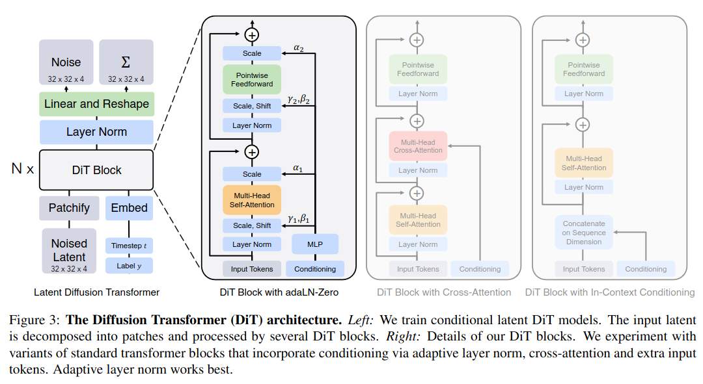
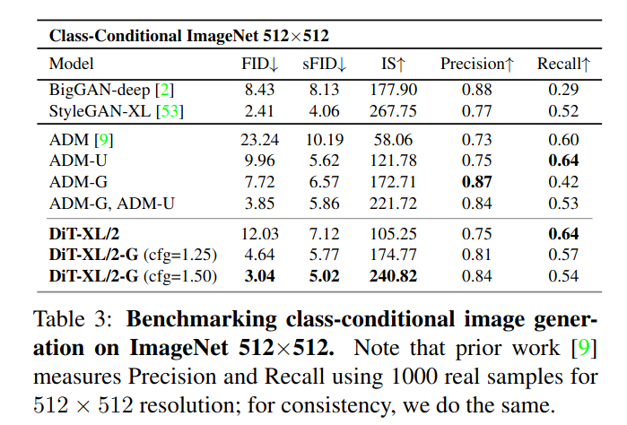

## Scalable Diffusion Models with Transformers
*ICCV(2023), 441 citation, UC Berkeley & New York University, Review Data: 678*

[Intro](#intro) 
[Related Work](#related-work) 
[Method](#method) 
[Experiment](#experiment) 
[Conclusion](#conclusion) 

> Core Idea

<strong>"Replace U-Net backbone with Transformers in diffusion models"</strong> 

***

### <strong>Intro</strong>

$\textbf{이 주제의 정의 및 요구사항과 중요한 이유}$

- 지난 $5$년 동안, NLP, vision, 그리고 다른 domain에서의 neural architecture는 transformer가 주였다. 

$\textbf{이 주제의 문제점과 기존의 노력들}$

- 하지만, image generation에서의 최근 발전의 앞선이였던 diffusion model은 여전히 convolutional U-Net architecture를 backbone 표준으로써 적용하고 있다. 
  - De-facto choice of backbone
- DDPM에서 처음으로 U-Net backbone의 diffusion model을 제안했다. 

$\textbf{본 논문에서 해결하고자 하는 문제와 어떻게 해결하는지, 그 결과들}$

- U-Net의 inductive bias가 diffusion model의 성능에 필수적이지 않으며, 이를 transformer로 대체할 수 있음을 보여준다. 
- 흔히 사용되는 U-Net backbone이 아니라 Transformer architecture에 기반하여 latent diffusion model을 학습시켰다.
- Gflops에 의해 측정된 forward complexity lens를 통해 본 논문에서 제안한 DiT의 scalablility를 분석했다. 
- Transformer depth/width 또는 input token 수 증가를 통해 Gflops는 높아지지만, 일관되게 더 낮은 FID를 달성한다. 
  - 확장성, 견고성, 효율성 등 유리한 특성을 유지하면서도 그 이점을 누릴 수 있게 됩니다. 
  - ViT를 따르며, ViT는 전통적인 convolutional network (e.g., ResNet)보다 시각적 인식에서 더 효과적으로 확장될 수 있음을 입증했다. 
  - Conditional ImageNet $512 \times 512$ 와 $256 \times 256$ benchmarks로 학습된 DiT-XL/2 model은 기존의 diffusion model 성능을 뛰어넘고 FID $2.27$을 달성했다. 

> 초당 부동소숫점 연산량을 의미한다. 이 값이 커지면 초당 처리해야되는 연산이 많다는 걸 의미한다. 네트워크 복잡도.
> FLOPS: FLoating point Operations Per Second 
> GFLOPS: GPU FLoating point Operations Per Second

- 원의 크기는 diffusion model의 flops를 나타낸다. 
  - Left figure: DiT끼리의 비교이다. 같은 model 구조에서 bubble area의 크기 변화가 있는 걸 보면, 아마 patch size를 조정하여 flops의 변화가 있는 거 같다. 
    - 실제 실험 figure: scaling the DiT model improves FID at all stages of training에서 보면 $p = 2, 4, 8$로 동일하게 $3$가지 version이 있고 $p$가 클수록 $T$가 작아지므로 flops는 작아지고 성능은 낮다. 
    - 예를 들면, DiT-XL에서의 가장 작은 원은 $p=8$ 가장 큰 원은 $p=2$라고 할 수 있다. 
  - Right figure: Best DiT model과 다른 SoTA model들과의 비교이다. 
    - ADM은 pixel-space model이다. 
    - 다른 LDM 모델과 비교해봐도 성능이 좋다. 

***

### <strong>Related Work</strong>

- Transformers 
- DDPMs
- Architecture complexity
  - 이미지 생성 분야에서 architecture complexity를 평가할 때, 일반적으로 # of parameter를 사용하는 것이 관행이다. 하지만 # of params는 이미지 모델의 복잡성을 나타내는 데 있어 적절하지 않는 지표입니다. 
  - 예를 들어, 이미지 해상도는 성능에 큰 영향을 미치지만 # of params는 이를 반영하지 못합니다. 

***

### <strong>Method</strong>

- Conditional latent DiT model architecture이다. 
  - ViT처럼 patchify를 하는데 이는 latent space상에서 이뤄지기 때문에 latent input을 patch화 시켜야 한다. 
  - Patch size $p$가 클수록 network가 처리해야 하는 양이 적어지기에 Gflops는 작아지고 성능은 저하된다. (일전에 Gflops와 performance와의 상관관계를 보여줌-반비례 > 이는 scalability와도 연관이 있다)
  - Conditional DiT model의 경우, adaLN-Zero의 block 성능이 가장 좋았다고 한다. 
  - 일반적으로 diffusion model은 simple loss 즉, $\epsilon$ 예측만 진행하는데 이 논문의 경우, covariance $\Sigma_{\theta}$까지 학습하여 full $\mathcal{D}_{KL}$ term도 최적화한다. 
  - 자세한 loss는 "Improved Denosing Diffusion Probabilistic Models"를 참고하자 

$\textbf{Patchfy}$

- Latent code $z \in \mathbb{R}^{I \times I \times C}$, patch size $p \times p$
- 일반적으로 latent code $z \in \mathbb{R}^{32 \times 32 \times 4}$
- (1) 한 patch size는 $p \times p \times C$
- (2) Flatten: $p^2C$
- (3) 한 patch token $\in \mathbb{R}^{p^2C}$이 $\frac{I}{P}\frac{I}{P} (=T)$개 존재한다. 
- (4) Linear embedding: $T \times d$
- 최종적인 input token size는 $T \times d$: $d$의 latent embedding이 $T$개의 token만큼 있다. 
- $p=2,4,8$

$\textbf{Embed}$

- Input timestep을 embedding하기 위해, $2$ 개의 MLP로 구성되는데 SiLU activation을 사용하고 각 hidden layer의 dim은 transformer의 hidden size와 동일하다. 마지막 output dim은 $256$이다. 

$\textbf{DiT Block Design}$

- Conditional information은 noise timesteps $t$와 class labels $c$

- In-context conditioning
  - $t, c$의 vector embedding을 concatenate 
  - ViT의 CLS token과 매우 비슷하다. 
  - Final block에서 conditioning token을 제거한다. 
- Cross-attention block 
  - $t, c$를 concatenate해서 붙이고 image token과의 cross-attention
  - 이는 $15$ %의 Gflops overhead를 불러 일으킨다. 가장 많은 Gflops
- Adaptive layer norm (adaLN) block 
  - 차원별 scaling 및 shift param $\gamma, \beta$를 직접 학습하는 대신 $t, c$의 embedding vector의 sum으로부터 regression한다. 
  - 최소한의 Gflops 
  - 즉, 각 block마다 $4$개의 embedding vector가 MLP로 출력된다.
  - 이 MLP는 $t, c$의 embedding vector의 합을 input으로 받는데 SiLU nonlinearity와 linear layer를 적용한다. Transformer hidden size의 $4$배에 해당하는 vector를 출력한다. 
- adaLN-Zero block
  - ResNet에 대한 이전 연구들에서는 각 residual block을 항등 함수로 초기화하는 것이 유익하다는 것을 발견했다. Diffusion U-Net 모델은 유사한 초기화 전략을 사용하여 residual 연결 전에 각 블록의 최종 convolution layer를 $0$으로 초기화한다. $\gamma, \beta$를 회귀하는 것 외에도 DiT 블록 내의 residual 연결 직전에 적용되는 차원별 scaling 파라미터 $\alpha$도 회귀한다. 모든 $\alpha$에 대해 영벡터를 출력하도록 MLP를 초기화한다. 이는 전체 DiT 블록을 항등 함수로 초기화한다. adaLN 블록과 마찬가지로 adaLNZero는 무시할 수 있는 Gflops를 모델에 추가한다.
  - 이 경우, $6$개의 output vector가 MLP로 출력된다. 
  - $\alpha$가 $0$이기 때문에 학습 초기에 input token만 살아남는다. 즉, 처음 DiT block은 identity function이다. 
  - 이 MLP는 $t, c$의 embedding vector의 합을 input으로 받는데 SiLU nonlinearity와 linear layer를 적용한다. Transformer hidden size의 $6$배에 해당하는 vector를 출력한다. 

$\textbf{Transformer Decoder}$

- DiT block이후에, noise prediction 및 diagonal covariance prediction을 위해서 image token sequence를 decode해야 한다. 
- LayerNorm을 적용하고 Linear와 reshape을 통해 각 patch마다 $p \times p \times 2C$만큼의 output을 출력한다. 
***

### <strong>Experiment</strong>

- DiT-XL/2: XLarge config, $p=2$
- Final linear layer는 zero
- AdamW 
- Constant LR: $1 \times 10^{-4}$
- Batch size: 256
- Data augmentation: horizontal flips
- Exponential moving average (EMA): decay of $0.9999$ 

- 학습의 안정성과 확장성을 보여준다.
  - 성능과 Gflops의 상관관계도 확인할 수 있다. 

***

### <strong>Conclusion</strong>

- Conditional information을 class label로만 평가를 해서 그렇지, text conditioning을 사용하면 cross-attention DiT block도 좋아지지 않을까라는 생각을 한다. 

***

### <strong>Question</strong>

<a href="">link</a>

> 인용구
