## DiffQRCoder: Diffusion-based Aesthetic QR Code Generation with Scanning Robustness Guided Iterative Refinement
*arXiv(2024), 0 citation, National Taiwan University, Review Data: 2024.11.6*

[Intro](#intro) 
[Related Work](#related-work) 
[Method](#method) 
[Experiment](#experiment) 
[Conclusion](#conclusion) 

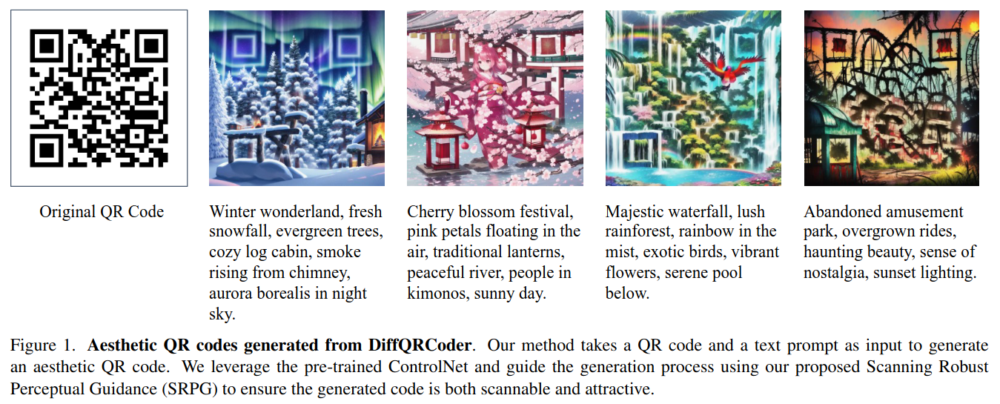

> Core Idea

<strong>"test1"</strong> 

***

### <strong>Intro</strong>

$\textbf{QR code란?}$

- Quick Response Code의 약자로써, 일반적으로 정사각형 모양의 격자로 표시되는 그래픽의 $2$ 차원 바코드이다. (일본에서 발명하여 초기에는 자동차 회사에서 사용했다.)
  - QR code tyep: URL, Text, Social Media, Email, Wi-Fi, Application, etc.
  - 최신 버전인 $40$은 $177 \times 177$ pixel로 이루어져 있다. 이는 숫자를 최대 $7089$ 자까지 저장할 수 있다. 
  - QR code는 상당한 크기의 ECC가 들어있다. 최초 QR code 생성 시에 이 오류 정정 코드의 양을 정할 수 있으며 7% ~ 30% 까지 데이터를 복구할 수 있다. 이 부분 때문인지 동일한 내용의 QR code를 생성해도 생성기마다 미묘하게 다른 결과가 나온다.
  - 단순히 url을 전달하는 역할로서는 QR코드 데이터가 꽤 남는 편이라서, 오류 정정 코드를 믿고 가운데에 회사 로고 등을 넣는 경우도 많다.

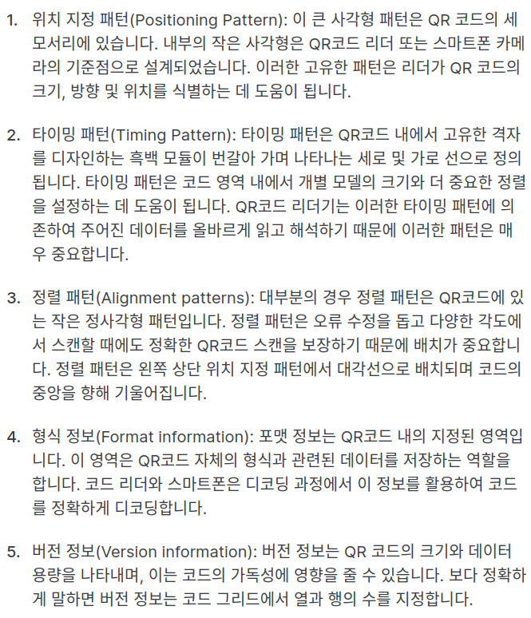

- QR 코드는 일상적인 거래, 정보 공유 및 마케팅에서 널리 사용되며, 스마트폰의 보편화와 빠른 판독성을 바탕으로 널리 퍼졌다. 그러나 표준 흑백 QR 코드는 시각적 매력이 부족하다. 미적 QR 코드는 사용자 주목을 끌고, 제품 디자인과 원활하게 통합되며 사용자 경험을 향상시키고 마케팅 효과를 증대시키는 해결책을 제공한다. 시각적으로 매력적인 QR 코드를 통해 기업은 브랜드 참여도를 높이고 광고 효과를 증대할 수 있어, 기능성과 디자인 모두에서 가치 있는 도구가 된다. 미적 QR 코드의 상업적 가치를 인식하여, 다양한 미화 기술이 개발됐다.

- 이를 위해 일부 연구들은 QR 코드 패턴과 스타일 텍스처를 혼합하는 스타일 전이 기반 기법 (ArtCoder, CVPR, 2021)을 통해 미적 QR 코드를 생성하려고 시도했으나, 이러한 방법들은 유연성이 부족하고 스캔 안정성을 저하시킬 수 있다..

- 대신, 현재 상업적으로 널리 사용되는 제품 (monster labs에서 발표한 SDv1.5 QR code monster)들은 주로 ControlNet과 같은 생성 모델을 활용해 스타일화된 QR 코드를 생성하며, 주로 classifier-free guidance(CFG) 가중치를 조정하여 시각적으로 만족스러운 QR 코드를 생성하는 방식을 채택한다. 그러나 CFG 가중치를 선택하는 데 있어 스캔 가능성과 시각적 품질 간의 균형을 맞춰야 하는 문제가 있다(Fig. 2). 실제 응용에서는 스캔 불가능한 코드를 수정하기 위해 수작업 후처리가 종종 필요하지만, 이는 시간 소모가 크고 노동집약적이다. 따라서, 시각적 매력과 스캔 안정성의 균형을 갖춘 미적 QR 코드를 생성하는 것은 여전히 해결되지 않은 과제이다.

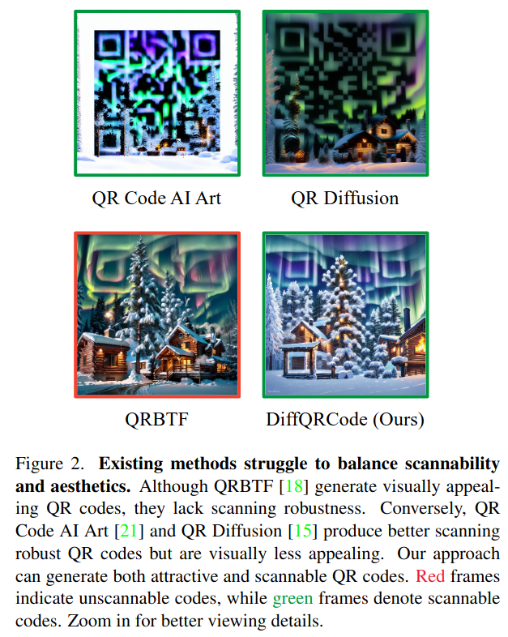

- Image generation 분야에서의 diffusion model의 성공과 함께 aesthetic (미적) Quick Response (QR) code generation도 변화를 겪었다. 하지만 미적인 code generation에도 불구하고 그들의 scannabilities는 여전히 끔찍했고 real-world scenarios에서 사용하기에는 부족하다.
- 이 문제를 해결하기 위해 (aesthetic QR code + Scannabilities) 본 논문은 DiffQRCoder (Diffusion-based QR Code generator)를 제안한다. 
  - Scanning-Robust Perceptual Guidance (SRPG): denoising process 동안 미적 요소를 유지하면서 GT QR code를 복제하는 것을 보장한다.
  - Scanning Robust Manifold Projected Gradient Descent (SR-MPGD): post-processing technique으로써, iterative latent space optimization을 통한 scanning robustness를 강화한다. 
  - 본 논문에서 제안한 DiffQRCoder는 Scanning Success Rate (SSR)와 CLIP aesthetic score를 통해 성능이 우월함을 보였다.
  - 마지막으로, 서로 다른 스캔 각도와 가장 엄격한 오차 허용 설정에서도 DiffQRCoder는 $95$ % 이상의 SSR을 견고하게 달성하며, 실제 응용에 대한 가능성을 입증했다.
  - 본 논문에서 제안된 프레임워크는 훈련이 필요 없으며 기존 확산 모델과 호환된다.

***

### <strong>Related Work</strong>

- Image DIffusion Models
  - GAN과 비교해 좋다. 
  - CFG의 등장으로 control이 가능하다.

- Non-generative-based Models
  - 미적 QR 코드에 대한 기존 연구들은 모듈 변형, 모듈 재배치, 스타일 전이의 세 가지 주요 기법에 중점을 뒀다. 모듈 변형 방법인 Halftone QR code (ACM graph, 2013)와 같은 방법은 코드 모듈을 변형하고 확장하여 스캔 안정성을 유지하면서 참조 이미지를 통합한다. Qart (2012)에서 도입한 모듈 재배치는 가우스-조르단 소거법을 사용해 참조 이미지와 픽셀 분포를 맞추기 위해 코드 모듈을 재배열하여 디코딩 정확도를 보장한다. 또한 관심 영역 (Art-up, ACM TOMM, 2021), 중심 주목도 (Efficient qr code beautification with high quality visual content, IEEE Transactions on Multimedia, 2015), 전역 그레이 값 (Stylized aesthetic qr code, IEEE Transactions on Multimedia, 2019)과 같은 이미지 처리 기술이 시각적 품질을 향상시키기 위해 개발됐다. Stylized aesthetic qr code는 스타일 전이 기반 기술을 사용한 SEE (Stylized aEsthEtic) QR 코드를 제안했으나, 픽셀 클러스터링으로 인해 시각적 왜곡이 발생했다. ArtCoder는 스타일, 콘텐츠 및 코드 손실을 공동으로 최적화하여 이러한 왜곡을 줄였지만 일부 왜곡이 여전히 남아 있다. Q-art code (ACMMM, 2021)은 모듈 기반 변형 컨볼루셔널 메커니즘(MDCM)을 통해 미적 측면을 더욱 향상시켰다. 그러나 이러한 기법들은 참조 이미지가 필요해 유연성과 변형의 한계가 있다.

- Generative-based Models
  - Diffusion-based image manipulation 및 conditional control techniques 발전과 함께, QR Diffusion, QR Code AI Art 및 QRBTF와 같은 기존 연구들은 확산 모델의 생성 능력을 활용해 미적 QR 코드를 생성했으며, 주로 ControlNet을 통해 가이드를 제공한다. 그러나 QR 코드의 고유한 메커니즘에 맞춘 보다 세밀한 가이던스는 아직 연구되지 않았다. Non-open-source method인 Text2QR은 먼저 ControlNet을 사용해 스캔 불가능한 QR 코드를 생성하고, 확산 과정과 독립적인 최적화 기술을 통해 스캔 가능성을 높이는 세 단계 파이프라인을 소개했다.

- 이에 비해, 본 논문의 목표는 확산 과정에서 스캔 가능성을 생성 초기부터 통합하며, 훈련이 필요 없는 세밀한 가이던스를 설계하여 확산 디노이징 과정을 강화하는 것이다.

***

### <strong>Method</strong>

- DiffQRCoder는 text prompt $p$와 $m \times m$ module로 구성된 (각 module은 $s \times s$ pixel로 구성) target QR code $y$가 주어지면, 인식가능하고 매력적인 QR code를 생성하도록 설계됐다.
  - Moduel: one square area

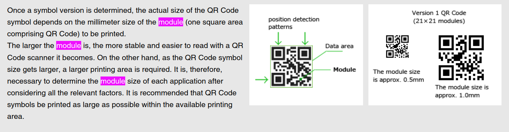

- Overall architecture of DiffQRCoder
  - Stage-1: 본 논문에서 제안된 guidance 없이, Controlnet을 사용하여 시각적으로 매력적이지만 스캔할 수 없는 QR code를 생성한다.
  - Stage-2: 가우시안 노이즈를 추가하여 Stage-1에서 생성한 QR code $\hat x$를 latent representation으로 변환하고 Qart를 사용하여 $y$를 $\hat x$와 더 유사한 패턴을 갖는 $\tilde y$로 변환한다. 
    - 이후, latent representation과 변환된 코드를 ControlNet에 Scanning Robust Perceptual Guidance (SRPG)와 함께 넣는다. 가이드 손실 함수에는 인식 손실(perceptual loss)과 제안한 스캔 견고 손실(Scanning Robust Loss, SRL)이 포함되어 있어 생성된 QR 코드가 스캔 가능하고 매력적임을 보장한다. 또한 스캔 견고성을 높이기 위해 스캔 견고 매니폴드 인식 그래디언트 하강법(Scanning Robust Manifold Perceptual Gradient Descent, SR-MPGD)이라는 후처리 기법을 제안한다.

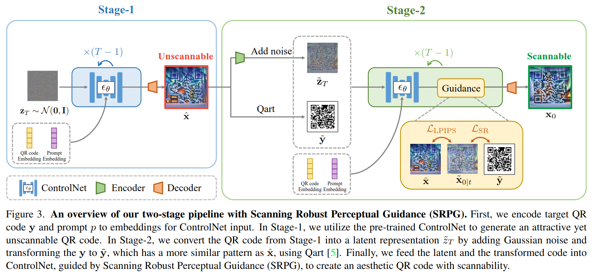

$\textbf{Scanning Robust Loss}$

- 각 이미지의 color channel은 $255$ 로 나눠서 $[0,1]$로 정규화시켰다.
- Target QR code에 대해서 미화된 QR code의 스캔 가능성을 평가하고, **module level** **에서 이미지 조작에 대한 지침 신호를 제공하기 위해 설계됐다. 
  - 아래의 figure는 module $5 \times 5$를 보여준다.
- 이 과정은 target code와 grayscale image 간의 픽셀 값 차이를 평가하는 error matrix에서 시작한다. 
- 다음으로 QR code 내의 다양한 스캔 확률을 고려하여 행렬을 re-weighting한다. 
- 이후 각 모듈의 중심 서브모듈을 추출하여 디코딩에서의 중요성을 반영한다.
- 또한, 과도한 최적화를 방지하기 위해 조기 중지 (early-stopping)가 구현된다.

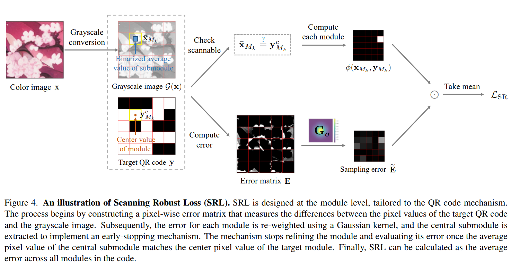

Pixel-wise Error Matrix

- Target QR Code $y$의 각 pixel값이 $0$일 때: Grayscale image의 pixel값이 0에 가까우면 $< 1/2$ Error는 없다고 판단
  - 반대로 QR code의 pixel 값이 $1$일 때, Grayscale image의 pixel값은 $1/2$ 이상이어야 error가 없다.
  - 즉, error matrix $E$에서 흰색일수록, $1$에 가까운 값일수록 그 pixel에서의 Target QR code $y$와 Grayscale image의 pixel 값 차이가 많이 난다는 걸 의미한다.

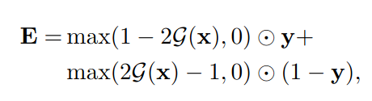

Re-weighting

- 모든 pixel이 동일하게 scan될 확률을 가지고 있지 않다. ART-UP에 따르면, 각 모듈 내 픽셀의 스캔 확률은 가우시안 분포를 따른다. 즉, 각 모듈의 중심에 가까운 픽셀이 더 중요하다는 것을 의미한다. 
- 따라서, 모듈 에러 $M_k$를 다음과 같이 재가중화한다.
- 위에서는 pixel별로 error matrix를 만들었다면 여기에서는 pixel을 통합하여 module별로 error matrix를 만드는 개념이다.

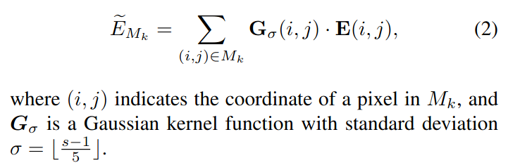

Central Submodule Filter

- ZXing이라는 인기 있는 바코드 스캔 라이브러리에 따르면, QR 코드를 디코딩할 때 각 모듈의 중심 픽셀만이 중요하다. Halftone qr code (SIGGRAPH, 2013)에 따르면, 각 모듈은 $3 \times 3$ 서브모듈로 나뉜다. 그들은 QR 코드가 **중심 서브모듈의 이진화된 평균 픽셀 값이 목표 모듈의 중심 픽셀 값과 일치하는 경우 여전히 스캔 가능함을 관찰했다.** 이 관찰은 주변 서브모듈에서 시각적 변화를 허용한다.
- Fig. 4를 보면, Grayscale image에서의 파란색 영역의 평균 값과 Target QR code의 갈색 pixel 값이 같아야 된다는 얘기이다. 
- $\mathbb{I}$: $1/2$이 넘으면 $1$
- $\phi$ 값이 $0$이어야 error가 없다는 의미이다.

- Central submodule을 추출하기 위해 central submodule fileter $F$를 적용한다.
  - QR code의 각 모듈에서 중앙 픽셀 값을 추출하는 필터이다.
  - ⌈: 소수점 이하를 올림하여 가장 가까운 정수로 나타낸다. 

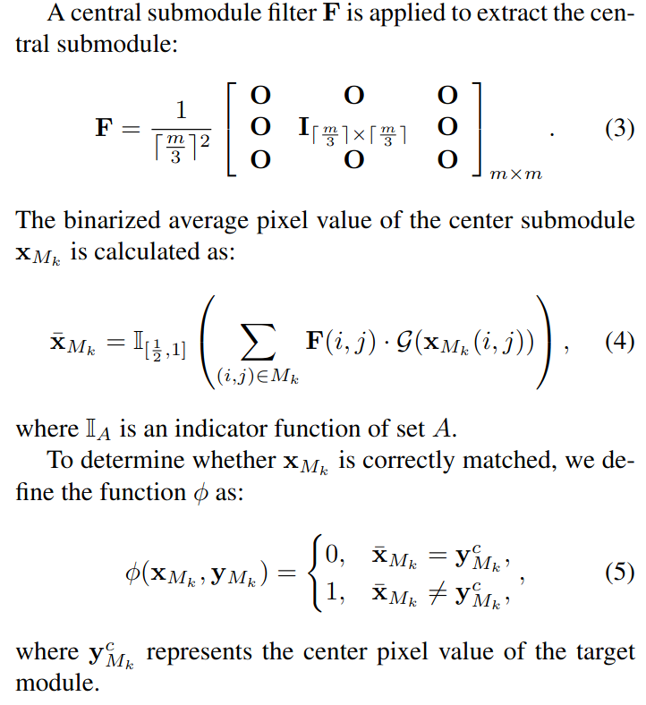

$\textbf{Early-stopping Mechanism}$

- 과도한 최적화를 방지하기 위해 모듈 수준에서 조기 중지 메커니즘을 사용한다. 이 메커니즘은 모듈이 올바르게 디코딩될 수 있을 때(즉, $\phi(x_{M_k},y_{M_k})=0$ ) 조정을 중단한다. $\phi$는 $x_{M_k}$​​를 업데이트할지 여부를 결정하는 스위치 역할을 하며, 그라디언트는 $x_{M_k}$를 업데이트하는 데 사용되지 않는다. 따라서 이 항을 계산 그래프에서 분리하기 위해 정지 그라디언트 연산자 sg[⋅]를 사용한다. $L_{SR}$은 다음과 같이 표현한다:

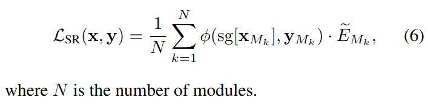

$\textbf{Stage-2}$

- DDIM sampler를 사용하여 time step $t$에서 predicted $x_0$를 계산한다.

- Scanning Robust Perceptual Guidance (SRPG)로 generation process를 보정한다. 
  - Learned Perceptual Image Path Similarity (LPIPS) 와 $L_{SR}$을 결합한 손실 함수이다.
  - 미적 요소와 강건함사이의 balance를 보장한다.
  - LPIPS와 $L_{SR}$이 pixel space에서 동작하기에, pre-trained decoder를 사용해 $\tilde z_{0|t}$를 pixel space로 복원한다.
- Optimization 대상은 $\tilde z_t$이다.

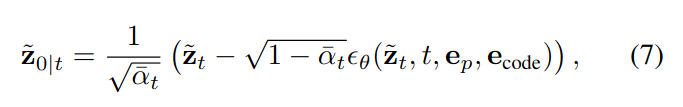

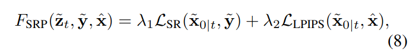

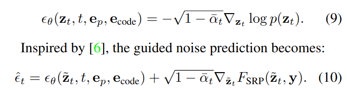

***

### <strong>Experiment</strong>

***

### <strong>Conclusion</strong>

***

### <strong>Question</strong>

<a href="">link</a>

> 인용구
