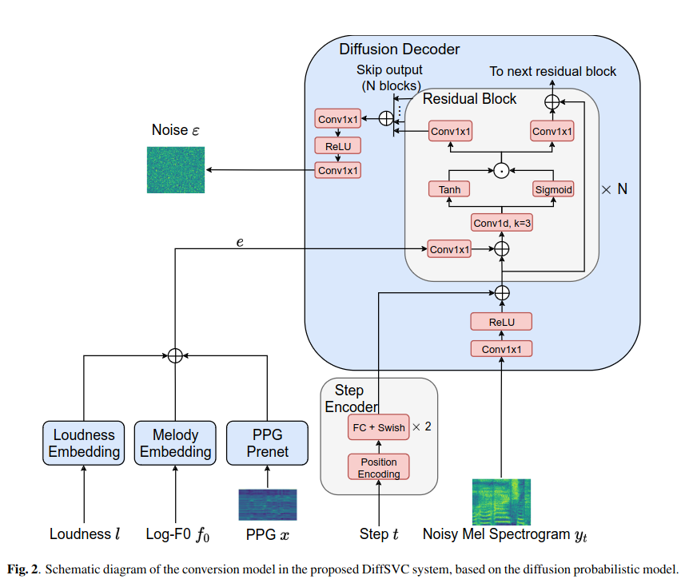
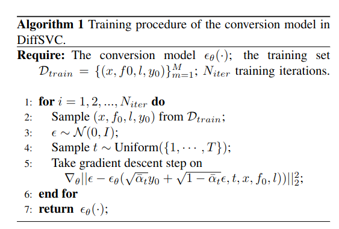
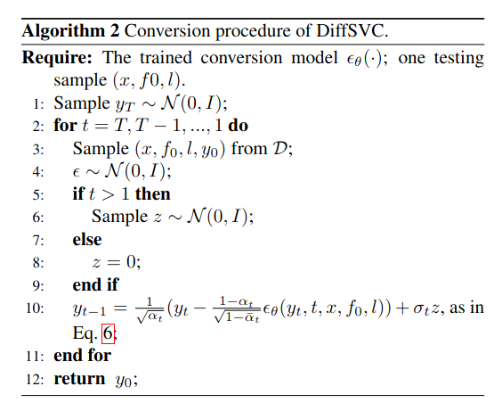

## DiffSVC: A Diffusion Probabilistic Model for Singing Voice Conversion
*2021 IEEE Automatic Speech Recognition and Understanding Workshop (ASRU)(2021), 29 citation*

[Intro](#intro) 
[Related Work](#related-work) 
[Method](#method) 
[Experiment](#experiment) 
[Conclusion](#conclusion) 

> Core Idea

<strong>"test1"</strong> 

***

### <strong>Intro</strong>
- SVC task 에 처음으로 diffusion probabilistic modeling 을 제안했다.
  - Destroyed Mel-Spectrogram 을 generation
- Naturalness and Voice similarity 측면에서 좋은 성능을 달성했다. 
- 본 논문은 Non-parallel SVC 중 any-to-one task 를 해결하고자 한다. 
- Content, Melody, Loudness 를 중요한 요소로 봤다.

- *Most recent SVC systems training*
  - Content encoder 와 Conversion model 로 구성
  - Content encoder
    - in: source singing signal
    - out: content feature (e.g., PPGs)
  - Conversion model
    - in: content feature
    - out: acoustic feature/waveform

- *Train Approach*
  - 1. Auto-encoder 로 content encoder & conversion model 을 동시 학습
  - 2. 각각 학습. 
    - 이 경우, content encoder 로 Automatic Speech Recognition (ASR) model 을 사용한다.
      - ASR
        - End-to-end model
        - Hybrid HMM-DNN model
    - Conversion model 은 generative model 을 사용한다.
      - GAN: content feature 로 부터 직접 waveform 생성
      - Regression model: content feature 를 spectral feature 로 변환하고 (e.g., Mel-Spectrograms) 추가적으로 학습된 vocoder 로 waveform 생성
      - Diffusion-based model: regression model 처럼 진행하되 generative model 을 diffusion-based 로 진행.

#### Definition of Words 
- PPGs: 음성 신호의 음성 정보 (Content feature)
  - Singing signal 로부터 content feature 인 Phonetic posteriorgrams(PPGs) 추출
- Parallel (one-to-one) SVC: 특정 가수의 노래를 다른 특정 가수로만 변환할 수 있는 시스템을 나타낸다.
- Non-parallel SVC
  - Any-to-one: 누구의 소스 보컬이든 대상 가수의 것으로 변환
  - Any-to-many: 다양한 대상 가수의 것으로 여러 가수의 보컬을 변환
    - E.g., FastSVC
- Loudness: 소리의 크기 (음의 높낮이 x)
- Log-F0: logarithmic fundamental frequency feature

***

### <strong>Related Work</strong>

***

### <strong>Method</strong>
- Diffusion model 은 Mel-Spectrograms 을 recover 하는 model 이고 content, melody, loudness feature 를 condition 으로 받는다.

- PPGs: content feature
  - PPGs 를 추출하는 model 은 Deep-FSMN (DPFSMN)-based ASR acoustic model 을 사용
    - Train ASR model with frame-wise cross-entropy loss using phonemes (i.e., initials and finals with tone) for Mandarin Chinese SVC
    - PPG $218$ dim
  - PPG prenet: simple fully-connected layer
- Log-F0 $f_0$ (Melody): fundamental frequency contour in logarithmic scale
  - Hop size: $240$
  - Robustness 를 위해 $3$ 개의 F0 estimator 를 사용했다.
    - DIO, REAPER, SPTK
    - 이 $3$ 개의 median results 를 사용
- Loudness: A-weighting mechanism of a singing signal's power spectrum 
  - FFT size, window size, hop size: $2048, 2048, 240$

- Log-F0 와 loudness 는 같은 방식으로 처리된다.
  - 각 feature 를 256 bins 으로 quantization $\rightarrow$ 각 embedding table 을 거친다. 
- Log-F0 & loudness & processed PPG feature 는 element-wise 로 더해진다. (conditioner $e$)
  - 더할 때의 size 는 $256$ dlek.
- Step encoder: sinusoidal position encoding
- DiffSVC: bidirectional residual convolutional architecture proposed in DiffWave/WaveNet
  - Residual block 은 $20$ 개
  - $T$: 100
  - $\beta$: $1 \times 10^{-4} \sim 0.06$
  - Adam optimizer and $0.0002$ constant LR
  - Trained with an internal dataset: audio format is 16-bit PCM with a sample rate of $24$kHZ
  - Mel-Spectrograms have $80$ frequency bins, and are computed with $1024$-point fast Fourier transform (FFT), $1024$-point window size and $240$-point hop size (i.e., $10$ ms)
  - Mel-Spectrogram 은 $[-1,1]$ 로 normalization 
  - Raw waveform 이 아닌 Mel-Spectrograms 으로 작동하기에 Dialtion rate of $1$ 로 한다. 
- Mel-Spectrogram 을 raw waveform 으로 변환시켜 주는 vocoder 로는 Hifi-GAN model 을 사용했다.

- Algorithm 1. Training

- Algorithm 2. Inference
  - Sample ($x, f_0, l, y_0$) from $D$: $y_0$ 가 들어갈 필요가 있을까?

***

### <strong>Experiment</strong>

***

### <strong>Conclusion</strong>

***

### <strong>Question</strong>

