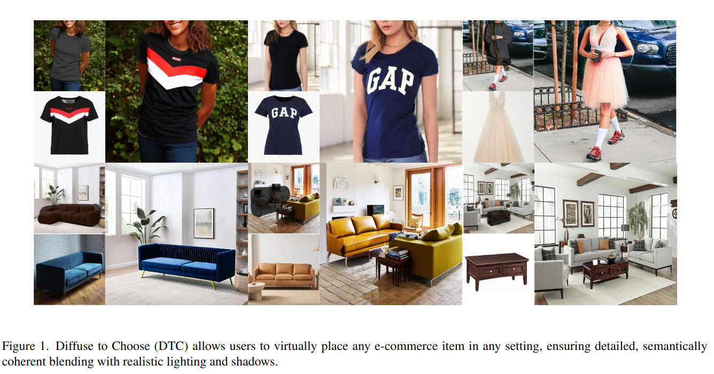
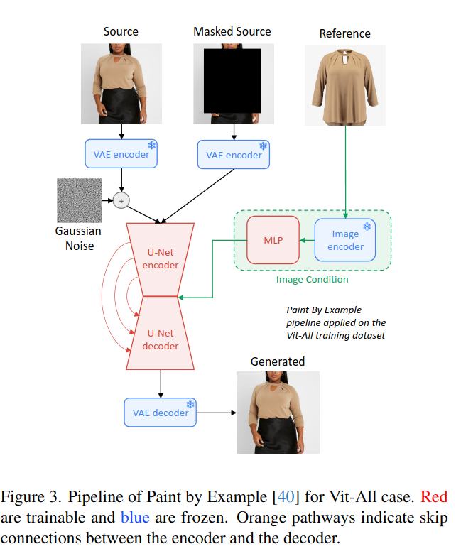
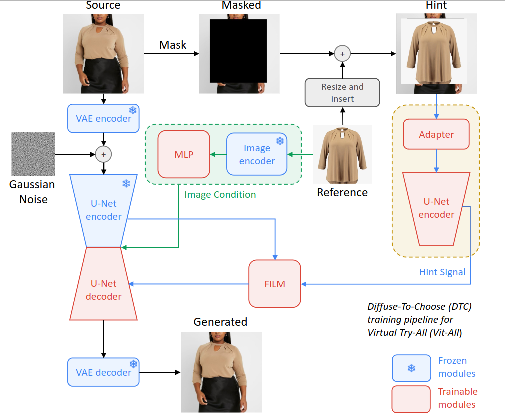
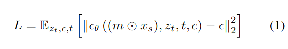
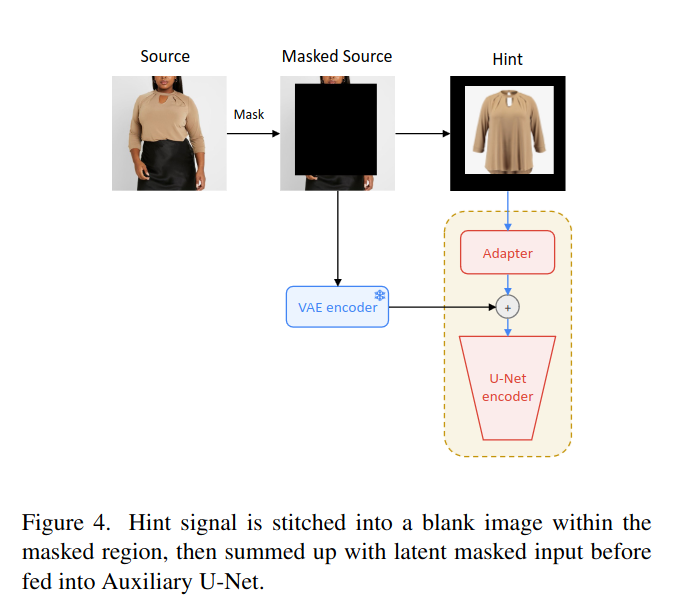
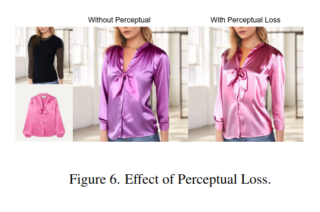
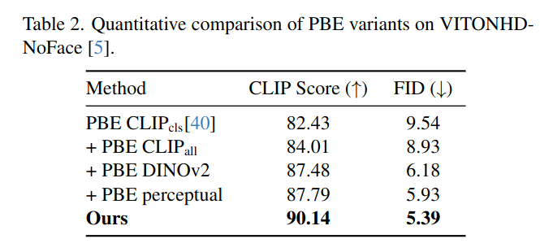
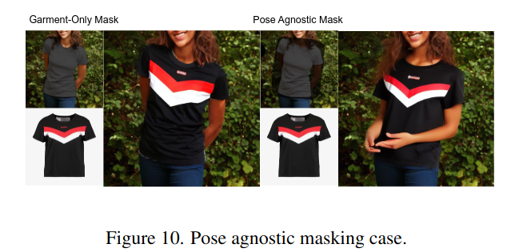

## Diffuse to Choose: Enriching Image Conditioned Inpainting in Latent Diffusion Models for Virtual Try-All
*arXiv(2024), 0 citation, Amazon*

[Intro](#intro) 
[Related Work](#related-work) 
[Method](#method) 
[Experiment](#experiment) 
[Conclusion](#conclusion) 

> Core Idea

<strong>"Generate Hint Signal"</strong> 

***

### <strong>Intro</strong>

- Image-based VITON 이자 diffusion-based image-conditioned inpainting model 을 제안한다. 
  - **Reference image 의 fine-grained feature 를 latent feature map 에 직접 통합**하는 것을 기반으로 한다.
  - **Reference item's detail 을 더 보존하기 위해서 perceptual loss** 를 함께 사용한다. 
  - 내부 및 공개 데이터셋에서 광범위한 test 를 실시하고 Diffuse to Choose 가 기존의 zero-shot diffusion inpainting method 뿐만 아니라 DreamPaint 와 같은 few-shot diffusion personalization algorithms 보다 우수함을 보여준다. 
    - 내부 학습 데이터와 small public dataset 인 VITON-HD-NoFace 를 사용하여 훈련했다. 

***

### <strong>Related Work</strong>

$\textsf{Virtual Try-On}$

- DreamPaint: Dreambooth 를 이용하여 text token 에 subject 를 binding 시키고 inpainting model 을 이용하여 Virtual try-on 을 하는 method 를 제안했다. 
  - Item 의 detail 을 잘 보존하지만 real-time application 에 최적화되어있지 않다. 

- Paint by Example 은 zero-shot setting 에서 작동하며 in-the-wild image 도 처리할 수 있다. 그러나 reference image 의 [CLS] token 만을 활용하는 conditioning process 에서 information bottleneck 이 발생합니다. 
  - 이 제약으로 인해, reference image 의 일반화가 지나치게 이루어지며, 필수적인 세밀한 세부 정보를 유지할 수 있는 모델의 능력이 저하됩니다.

- VITON: Two-step (synthesis and refinement process), 초기에 생성된 coarse image 와 desired clothing 을 이용하여 detaile 을 강화시키기 위해 refine 한다. 
- VITON-HD: higher-resolution image 에 초점을 맞췄고 misaligned parts 를 정렬시키기 위해 alignment-aware segment normaliaation 를 사용한다. 
- TryOnGAN: pose conditioning 을 사용하지만 purely latent model 에 의존하여 의류를 표현할 때 종종 세세한 세부 사항이 부족하다. 
- TryOnDiffusion: pixel-level diffusion model 에 dual U-Net 으로 접근했다. 가상 시착에 대해서는 인상적인 성능을 제공하지만 in-the-wild example 에는 어려움을 겪고있다. 상의만 지원하며, 실시간 사용에 적합하지 않다. 
- 실제 사용 사례에서 실시간 추론을 보장하기 위해서는 latent diffusion approach 가 필요하다.

- 본 논문에서는 ControlNet 에서 영감을 받아, 비어있는 이미지의 마스킹된 영역에 pixel-level 의 hint 를 통합하고 이후 얕은 합성곱 신경망을 통해 처리하여 차원을 일치시킨다. 
- 색상과 같은 기본적인 특성의 정렬을 더 향상시키기 위해 pre-trained VGG 모델을 사용하여 perceptual loss 를 적용한다. 

- Paint-by-Example for VITON task

***

### <strong>Method</strong>

$\textsf{Loss}$

- $X_s$: source image
- $m$: user-defined mask
- $z_t$: noise-added version of $X_s$
- $X_r$: reference image 
- $m \odot X_s$: Hint 
- $c$: embeddings of $X_r$ 

$\textsf{Reference} \rightarrow \textsf{Image encoder}$

- Paint-by-Example 에서 [CLS] token 을 사용하여 $c$ 를 만든다. 의도적으로 정보 병목 현상을 발생시키는 이유는 self-referencing 에 의존하며, 종종 복사 및 붙여넣기 artifacts 로 이어질 수 있기 때문이다. 
  - 그러나, VITON 에서는 동일한 옷이지만 source 와 reference 가 동일한 구성을 가지고 있지 않기 때문에 (e.g., 같은 옷이여도 warping 되어있다. 즉, 복사 및 붙여넣기가 안된다) 정보 병목 현상을 지울 수 있다. 
  - 따라서, 본 논문에서는 [CLS] token 뿐만 아니라 모든 CLIP patch 를 사용하고 더 큰 image encoer *DINOV2* 를 사용한다.

$\textsf{Source} \rightarrow \textsf{Hint} \rightarrow \textsf{U-Net encoder}$

- Overall framework 에서는 표시되지 않았지만 실제 process 는 다음과 같이 이루어진다. 
- ControlNet 에 영감을 받아, U-Net encoder (trainable copy) 를 사용한다. 하지만, trainable copy 가 직접 기존의 U-Net decoder 에 통합되어 spatial condition (layout) 을 제공하는 것과는 달리 본 논문에서는 reference image 로부터 강력한 pixel-wise 영향을 발휘함으로써 guide 를 제공한다. 
- Hint signal 을 생성하기위해 
  - 1. pixel value 가 $0$ 으로 된 이미지에서 시작 (source image 와 size 는 동일, $X_s \in \mathbb{R}^{H \times W \times 3}$)
  - 2. 이후에, reference image 를 삽입한다. (Hint image)
  - 3. 해당 마스크가 반전돼서 source image 에 적용되고 (Masked source)
  - 4. VAE encoder 에 의해 처리되어 $64 \times 64 \times 4$ 의 latent representation 을 생성한다. 
  - 5. 그 후, hint image 는 얕은 conv 로 구성된 adapter module 에 의해 처리되어 latent masked source image 와 차원을 맞춘다. 
  - 6. 마지막으로, latent masked source image 와 element-wise add 하여 U-Net 의 encoder 에 넣어준다.

$\textsf{U-Net encoder} \rightarrow \textsf{FiLM} \rightarrow \textsf{U-Net decoder}$

- Hint Encoder's output 을 main U-Net decoder 에 skip-connection 형태로 직접 추가하는 것은 종종 source image 와 공간적으로 일치하지 않는 Hint signal 로부터 뚜렷한 공간적 영향을 가져와서 부정적인 영향을 끼친다. 
  - 즉, hint signal 이 제대로 된 signal 이 아닐 수 있다. 
- 따라서, 본 논문에서는 총 $3$ 가지 방법 중에서 고민했다. (Direct addition, Feature-wise Linear Modulation (FiLM), cross attention)
  - FiLM 이 reference image 의 low-level detail 을 capture 하고 있어서 가장 효과적인 것으로 나타났다.

$\textsf{Hinting Strategies}$

- Hint signal 의 목표는 reference image 로부터 pixel-level 의 세밀한 세부 정보를 main U-Net 으로 전달하는 것이며, 이를 달성하기 위해서 여러 가지 방법을 실험했다.
  - 1. Canny Edge
  - 2. Holistically-Nested Edge Detection (HED)
  - 를 사용하여 high-frequency detail 에 집중하는 것이다. 
  - OpenCV: 임계값 $30$ 과 $140$ 으로 설정하여 Canny Edge 
  - 조금 더 부드러운 edge 를 위해 HED 모델을 사용했다.
- 하지만, 이런 방법들을 사용함에도 불구하고, reference image 를 직접 사용하는 것이 가장 효과적이었다. 
  - Reference image 를 직접 사용하는 것은 high-frequency 정보에만 초점을 맞추는 대신 detail 의 entire spectrum 을 전달하기 때문이다.
  - 따라서, high-frequency 정보만을 전달하기 위해 사전에 filtering 을 하는 대신, FiLM layer 에서 가장 중요한 channel 을 사용하는 게 더 나은 접근법이라고 볼 수 있다. 

$\textsf{Image Encoder}$

- DINOV$2$ 를 사용하며 이는 reference image 를 나타내기 위해 $256 \times 1536$ 차원의 임베딩을 출력하고, 이를 학습 가능한 MLP layer 에 의해 $256 \times 768$ 로 축소한다. 

$\textsf{Refinement Loss}$

- Pre-trained VGGNet 을 통해 perceptual loss 를 사용하낟. 
- 이는 첫 다섯 레이어의 feature map 을 source 및 generated image 에 대해 비교하여 계산한다. 
- 이를 통해 색상과 같은 기본적인 특성의 align 을 암묵적으로 보장한다. 

***

### <strong>Experiment</strong>

- 내부 데이터셋/VITONHD-NoFace
- SD V $1.5$
- Image resolution: $512 \times 512$
- LR: $1e-5$
- Train using DDPM sampler 
- Simple Augmentation: rotation and flip (Paint-by-Example 과 같은 strong augmentation 은 사용하지 않음)
  - Self-referencing 이 아니기 때문에 강력한 augmentation 을 사용할 필요가 없다. 
- Inference: guidance $5$, DDIM sampler
- Epoch: $40$, $8$ 개의 NVIDIA A $100$ $40$ G GPU

- VS Paint-by-Example Variants on VITONHD-NoFace
  - CLIP token 을 모두 쓰고
  - Image encoder 를 더 크게
  - Perceptual loss 를 사용하면 성능이 더 좋다. 

***

### <strong>Conclusion</strong>

$\textsf{Limitation}$

- detail info 를 주입하려는 노력에도 불구하고, 모델은 여전히 세밀한 세부 사항을 간과할 수 있다. 
  - 특히 옷에 있는 text 를 반영하지 못하는 건 Stable Diffusion 에 내재된 문제라고 볼 수 있다. 
  - 또한 모델은 자세를 고려하지 않기 때문에 인간의 자세가 변경될 수 있으며, 이는 자세에 중립적인 마스킹과 특히 전신을 포함하는 경우에 불일치를 초래할 수 있다. 
  - **Pose conditioning 을 도입하여 이를 완화할 수 있지만, 본 논문은 virtual try-all 이기 때문에 더 넓은 적용 가능성을 위해 task-specific auxiliary input 보다 일반적인 목적을 우선시했다.**

- Garment-Only mask: 의류만 masking 을 했을 땐 괜찮은데 
- Pose Agnostic maks: 몸 전체를 가려버리면 pose conditioning 이 없어서 제어할 수 없다. 

***

### <strong>Question</strong>

