## DiffusionCLIP: Text-Guided Diffusion Models for Robust Image Manipulation
*CVPR(2022), 465 citation, KAIST, Review Data: 2024.07.15*

[Intro](#intro) 
[Related Work](#related-work) 
[Method](#method) 
[Experiment](#experiment) 
[Conclusion](#conclusion) 

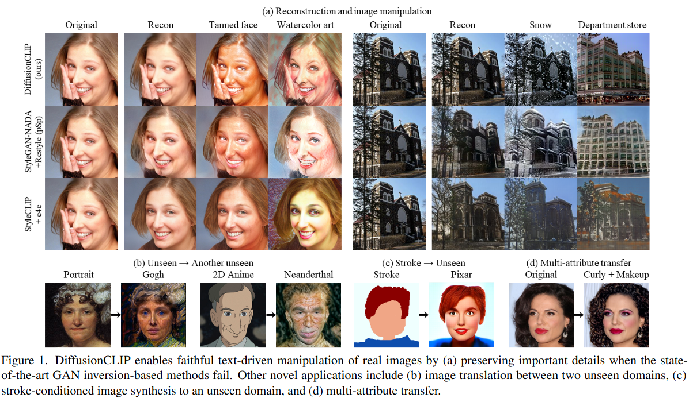

> Core Idea

<strong>"Perform Zero-Shot Image Manipulation with Diffusion Models Via CLIP Loss"</strong> 

***

### <strong>Intro</strong>

$\textbf{이 주제의 정의 및 요구사항과 중요한 이유}$

- Zero-shot image manipulation

$\textbf{이 주제의 문제점과 기존의 노력들}$

- CLIP과 결합된 GAN inversion method들은 text prompt에 의한 zero-shot image manipulation이 가능하다.
- 하지만, 제한된 GAN inversion capability로 인해 다양한 real image의 application으로는 여전히 어려움이 있다. 
- 구체적으로, 이런 접근법들은 종종 새로운 포즈, 시각, 물체 등의 재구성에 어려움이 있고 이는 training data와 비교해서 object identity를 바꾸거나 원하지 않는 image artifacts를 생성한다. 

$\textbf{본 논문에서 해결하고자 하는 문제와 어떻게 해결하는지, 그 결과들}$

- 이러한 문제들을 완화시키고 신뢰성있는 real image 조작을 위해 DiffusionCLIP을 제안한다. 
  - Unseen domain에도 잘 작동한다.
  - Novel noise combination: multi-attribute manipulation을 가능하게 한다.
  - Key idea: reverse diffusion process에서 text prompt에 기반한 생성된 이미지의 attribute를 조절할 수 있는 CLIP loss를 사용하여 score function을 fine-tune한다.  

***

### <strong>Method</strong>

- Latent diffusion model이 아닌 pixel diffusion model이다. 

$\textbf{CLIP loss}$

- CLIP loss: Global target loss $+$ local directional loss로 이루어져 있다. 
  - Global target loss: 생성된 이미지와 주어진 target text사이의 CLIP space상에서 cosine distance를 최소화한다. 
  - Local directional loss: 적은 다양성 및 adversarial attack의 민감성과 같은 global CLIP loss의 문제들을 완화하기 위해서 설계됐다. 
  - 참조 이미지와 생성된 이미지의 embedding사이의 방향을 유도한다. 

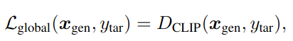

- 참조 이미지와 구별되는 이미지를 생성하면서도, 참조 텍스트와 target 텍스트 간의 방향을 정렬시켜야 되기 때문에 mode-collapse issue에 강건하다.

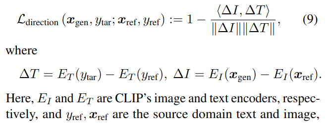

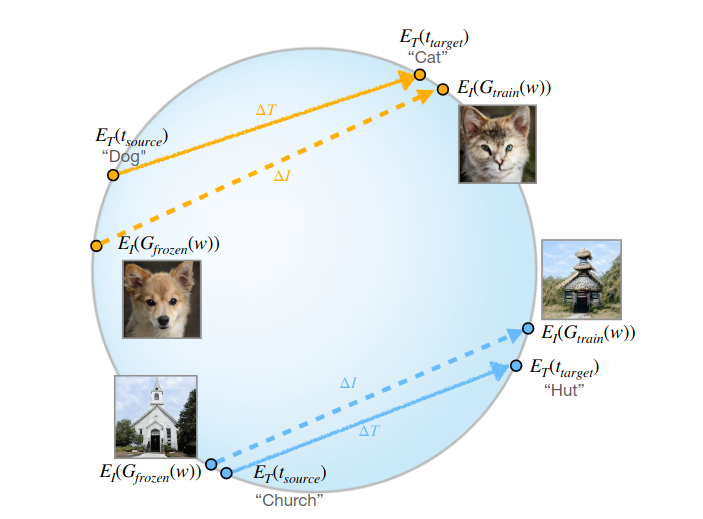

- Referenc image를 DDIM inversion으로 noisy image를 만들고, 다시 DDIM으로 생성을 한다. 

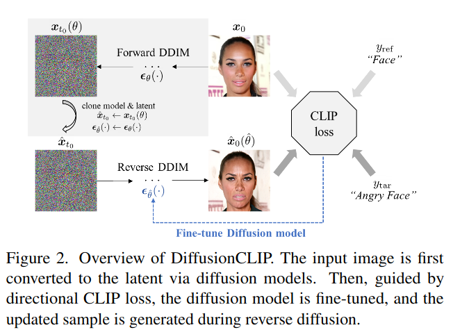

- 본 논문에서 사용하는 CLIP loss는 다음과 같다.
  - Global loss는 안 쓰는 거 같다.
  - $L_{id}$: object의 identity를 보존하고, 원하지 않는 변화를 방지하기 위해 사용한다. 

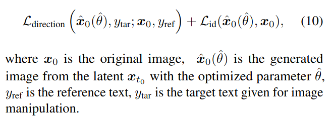

- $L_{face}$: face identity loss

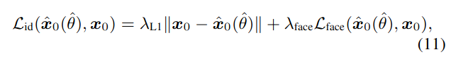

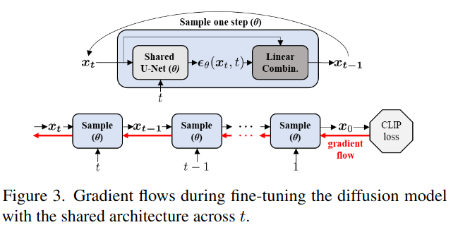

$\textbf{Fast sampling strategy}$

- Last time step $T$까지 forward diffusion을 수행하는 대신에, $t_0 < T$까지 한다. $t_0$를 return step이라고 부른다. 

$\textbf{Image translation between unseen domains}$

- Unseen domain에서 다른 unseen domain으로 translation을 할 수도 있고 unseen domain에서의 stroke-conditioned image synthesis도 가능하다. 
- SDEdit처럼 domain-related component는 blurry하게 (못 알아보게) 만들면서 identity/semantics of object는 보존하는 $t_0$를 찾는다. 

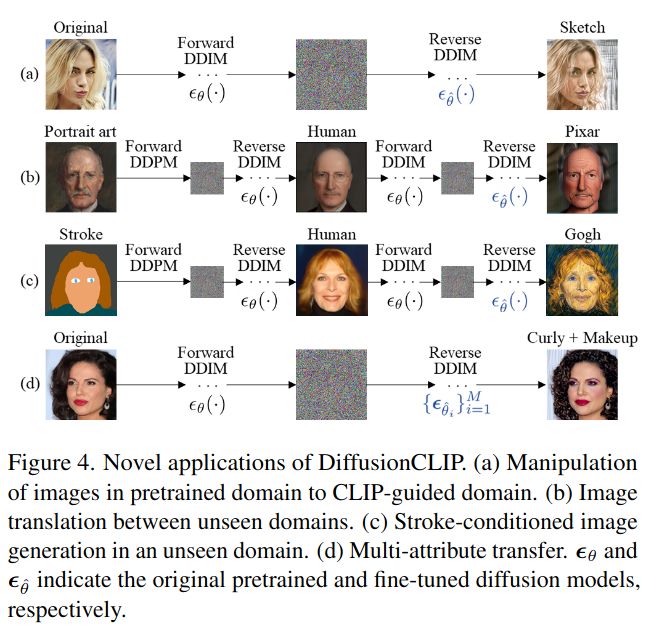

***

### <strong>Experiment</strong>

- $256^2$ size of images 
- CelebA-HQ, AFHQ-DOg, LSUN-Bedroom and LSUM-Church로 학습된 각각의 diffusion model을 사용한다. 
- $t_0$: $[300, 600]$

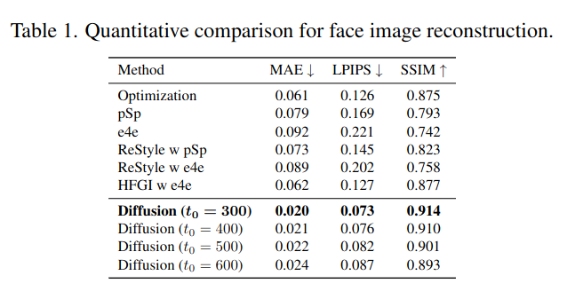

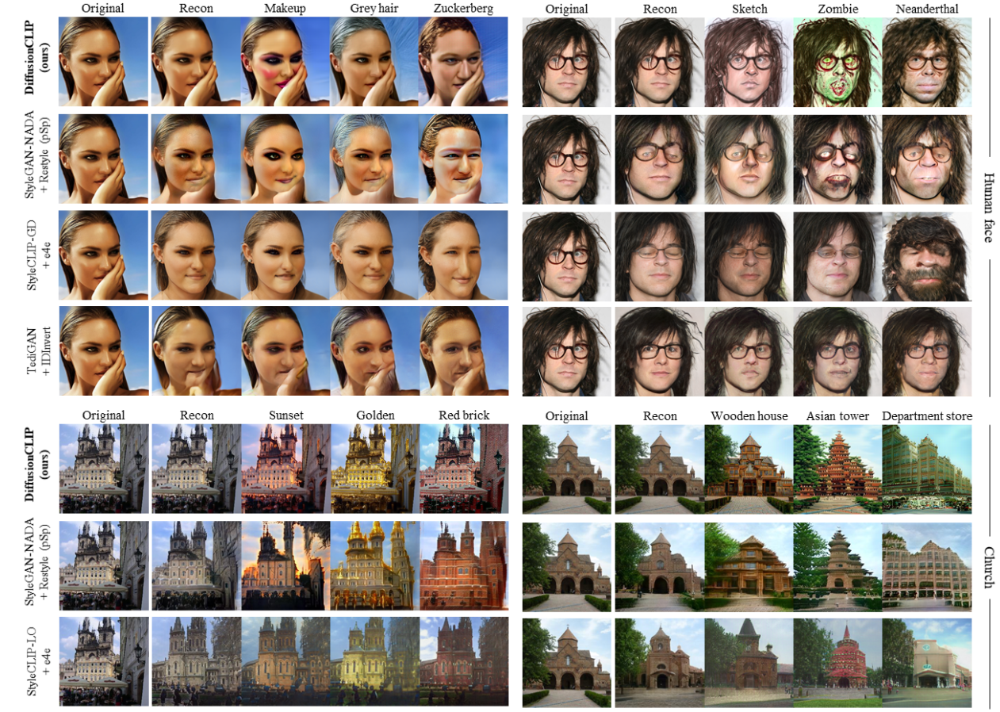

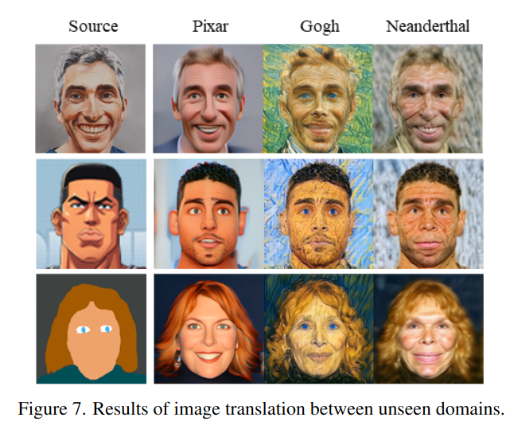

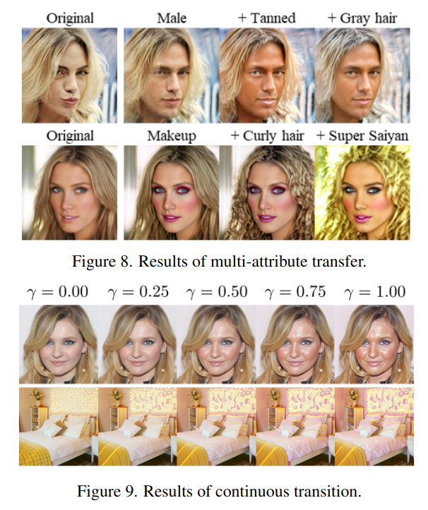

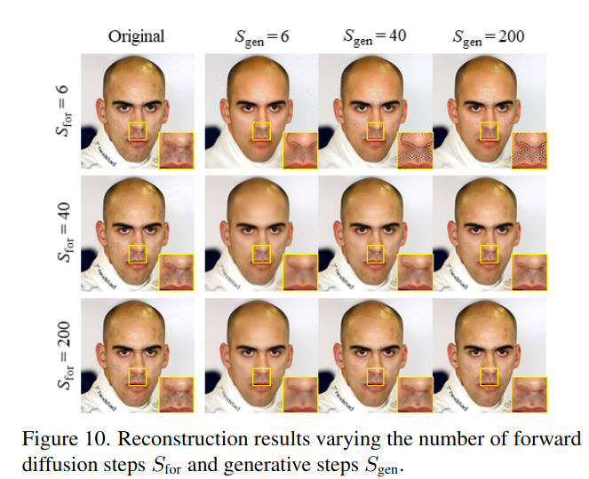

***

### <strong>Conclusion</strong>

***

### <strong>Question</strong>

