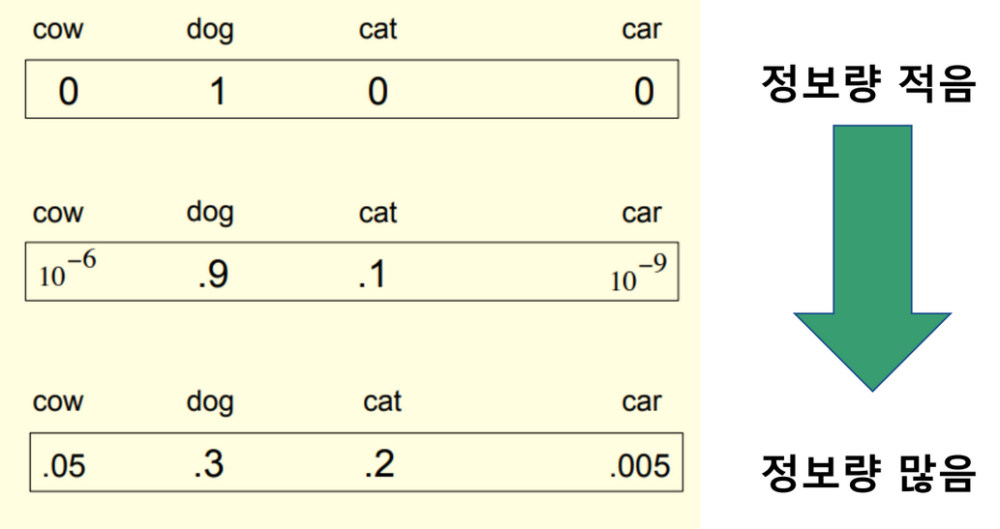

## Distilling the Knowledge in a neural newtork
*arXiv(2015), 16596 citation*

[Intro](#intro) 
[Related Work](#related-work) 
[Method](#method) 
[Experiment](#experiment) 
[Conclusion](#conclusion) 

> Core Idea

<strong>"Effectively Copy Teacher Model using Soft Target"</strong> 
(Use Logit Other Than the Highest Logit)

***

### <strong>Intro</strong>
- 현실에선, 복잡한 딥러닝 모델을 경량화된 디바이스에서 사용하기 위해, 낮은 메모리를 필요로 하면서 높은 정확도가 나오는 모델이 필요하다.
- 복잡한 딥러닝 모델(teacher model)은 많은 수의 파라미터를 가지고 있는 반면, 좋은 *Knowledge* 를 가지고 있다.
- 본 논문에서는, teacher model 의 knowledge 를 효과적으로 student model 에게 전달해주는 방식을 제공하고자 한다.

***

### <strong>Related Work</strong>

***

### <strong>Method</strong>
- Soft target 는 softmax function 에 temperature 를 도입해 확률 값이 극단적으로 나오는 걸 막아줄 수 있다.
- 이때, 확률 값이 smooth 가 되면서 정보량이 많아지는 효과가 발생하는데 이 많은 정보량을 바탕으로 student model 에게 전달해준다.
- 일반적으로 우리는 가장 높은 값을 가지는 logit 외에는 관심을 가지지 않는다. 하지만 *knowledge Distillation* 에서는 소외받는 logit 값들에 관심을 가진다. 
  - E.g., Car image 를 보고 model 이 트럭이라고 잘못 분류하는 것은 드물게 발생할 수 있다. 당근이라고 분류하는 것보다 상대적으로는 그 값이 높을 것이다. 이때, 트럭이 당근보다 더 높은 확률로 나온 이유가 있을 텐데 이 정보들을 유용하다고 가정하고 진행하는 것이다.
- Teacher model 과 student model 은 같은 데이터셋으로 학습한다. 

***

### <strong>Experiment</strong>
- MINST dataset 에 대해서 실험을 진행
  - Teacher model 은 $67$ 개의 오류, student model 은 $146$ 개의 오류를 냈다.
  - 그리고 teacher model 의 지식을 student model 에 증류했을 때, $74$ 개의 오류를 달성
  - 또한, MNIST dataset 에 대해서 학습을 할 때 (for classification), student model 은 숫자 $3$ image 를 학습 과정에서 사용하지 않았음에도 불구하고, test 시에 $3$ 을 $98.6$% 로 맞췄다.

- 심지어는 transfer set 에 숫자 $7$ 과 $8$ 만으로 증류했을 때는 $47.3$% 의 정확도를 달성했다.

***

### <strong>Conclusion</strong>
- 거대 모델의 지식을 단순하면서도 효과적으로 전이할 수 있는 방법이다.

***

### <strong>Question</strong>

