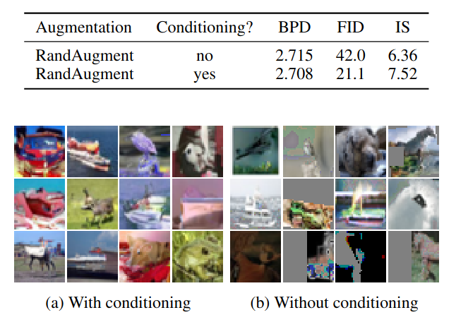

## Distribution Augmentation for Generative Modeling
*ICML(2020), 50 citation, Ilya Sutskever, Review Data: 2024.3.25*

[Intro](#intro) 
[Related Work](#related-work) 
[Method](#method) 
[Experiment](#experiment) 
[Conclusion](#conclusion) 

> Core Idea

<strong>"Aggressive Data Augementation for Generative Model even if Distribution Changes"</strong> 

***

### <strong>Intro</strong>

- Data augmentation 은 neural network train, 특히 discriminative, semi-supervised, and self-supervised vision task 에 꼭 필요한 도구이다.
- 하지만, data augmentation 은 pixel-level generative modeling 에 큰 역할을 제공하지 못하고 있다. 이는 생성 모델링에 데이터 증강을 적용하는 것의 어려움 때문이다. 
  - 공격적인 augmentation function 은 모델이 학습하는 데이터 분포를 변경하여 샘플을 왜곡시키고 log-likelihood 에 penalty 를 부여할 수 있다.
  - $t(x)$: transformation 
  - $t(x)$ 를 적용시켰을 때, 모든 $t(x)$ 는 원래 분포와 유사한 이미지를 생성해야 한다. 그러나 strong $t(x)$ 는 원래 분포에서는 매우 발생하기 어려운 이미지를 생성한다. 이러한 증강을 사용한다면, 원래 분포를 잘 반영하지 못하고 왜곡된 샘플을 생성할 수 있다. 

- 본 논문에서는 distribution augmentation (DistAug) 를 제안한다.
  - Generative model 을 regularization 하는 간단하면서도 강력한 방법이다.  
  - 일반적인 데이터 증강과 달리, **DistAug 는 target distribution 을 수정하는 함수의 사용을 허용하여** supervised and self-supervised learning 에서 흔히 볼 수 있는 공격적인 증강을 가능하게 한다. 
    - 이게 중요한 이유는, generative model 이 $p(x)$ 를 학습하는 과정에서 data augmentation 이 $p(x)$ 를 왜곡하여 잘못된 방향으로 학습할 수 있기 때문이다. 
  - Model architecture 나 domain 전반에 걸쳐 사용할 수 있다. 

- Data augmentation 을 적용시킨 likelihood 
  - Family of transformation functions $T$
  - A transformation $t \sim T$
  - Identity transformation $I$

***

### <strong>Related Work</strong>

***

### <strong>Method</strong>

- Some transformation $t$ 를 조건으로 주면서, $p_{\theta}(t(x)|t)$ density 를 학습하는 것이다. 
  - 이것은 마치 multi-task learning 과 유사한 unique data-dependent 와 model-dependent regularizer 로 해석될 수 있다. 
  - 즉, 어떤 변환에 의해 극적으로 왜곡되더라도, 훈련 프로세스에 특정 transformation 정보가 주어지면서 모델이 원래 샘플을 추정하는데 영향을 미치지 않을 수 있다는 걸 의미한다.

- 위의 Loss fucntion 을 다음과 같이 data-dependent and model-dependent regularizer 로 볼 수 있다. 
  - Model 은 transformed distributions 보다 original distribution 을 잘 modeling 한다면, penalty 를 부과받을 수 있다. 
  - $T$ 에 따라 정규화를 조절할 수 있다. 
  - Multi-task learning 관점으로는 transformed distribution 을 추가로 학습하는 것으로 볼 수 있다. 

***

### <strong>Experiment</strong>

- 본 실험에서는 몇 가지 주장에 대한 증거로써 제시한다. 
  1. DistAug 는 표준화된 regularization technique 보다 더 큰 모델에 적용될 수 있다.
  2. 심지어 작은 모델에 대해서도 특정한 분포 선택은 향상된 성능을 가져온다.
  3. Conditioning signal 은 적은 오차와 향상된 sample 을 초래한다. 

$\textsf{Dataset}$

- CIFAR-10, ImageNet-64

$\textsf{Model}$

- Sparse Transformer 
  - Transformation condition 을 주기 위해, sequence embedding vector 에 augmentation embeddings 을 더해준다. 
  - 추론 시에는, 모델에 회전 및 이동으로 이미지를 생성하도록 요청하는 경우 $4$ 가지 회전 임베딩과 $2$ 가지 이동 임베딩 중 하나씩 선택한다. 각 옵션은 균일하게 무작위로 선택된다. 

$\textsf{Data Augmentation}$

- Rotation, Spatial transposition, color swaping, jigsaw shuffling, and RandAugment 

***

### <strong>Conclusion</strong>

***

### <strong>Question</strong>

<a href="">link</a>

> 인용구
