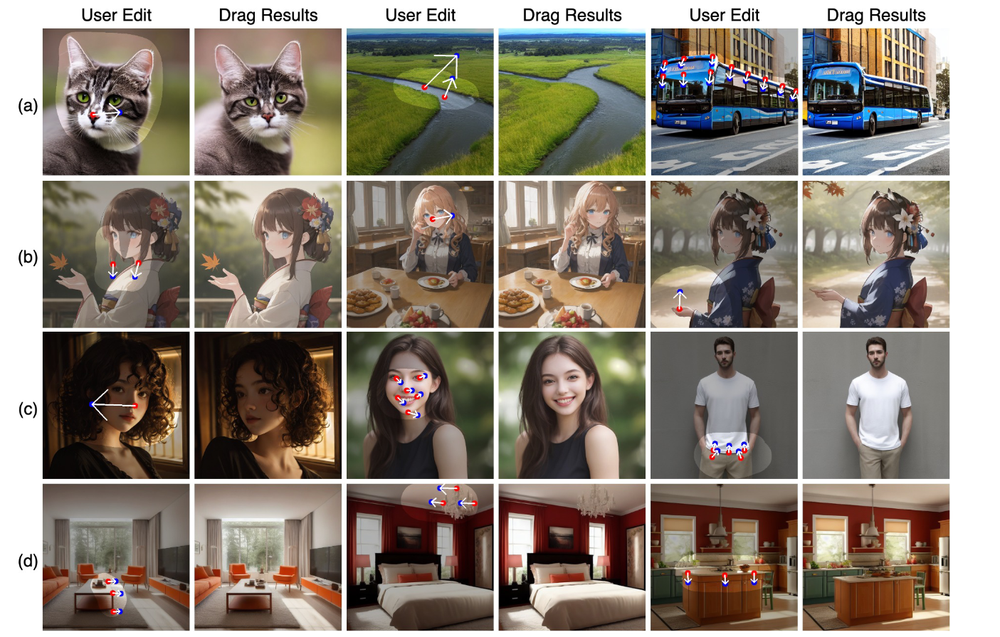

## DragDiffusion: Harnessing Diffusion Models for Interactive Point-based Image Editing
*arXiv(2023), 60 citation, National University of Singapore, Review Data: 2024.05.12*

[Intro](#intro) 
[Related Work](#related-work) 
[Method](#method) 
[Experiment](#experiment) 
[Conclusion](#conclusion) 

> Core Idea

<strong>"Extend Dragged Image Editing to Diffusion Models"</strong> 

***

### <strong>Intro</strong>

$\textbf{이 주제의 정의 및 요구사항과 중요한 이유}$

- Interactive point-based image editing: Image 를 user 가 정한 몇 개의 handle point 를 target point 로 움직여야 한다. 
- 이러한 user 의 요구사항을 만족시키기 위해, 이상적인 조절 가능한 이미지 합성 접근법은 다음의 특성을 갖춰야한다.
    1. Flexibility: model 은 생성된 물체의 layout, pose, position, expression, shape 등을 포함한 서로 다른 공간적 특성을 조절할 수 있어야 한다. 
    2. Precision: 높은 정확도로 공간적 특성을 조절해야 한다. 
    3. Generality: 특정 카테고리에만 제한되지 않고 다양한 카테고리에도 적용할 수 있어야한다. 

$\textbf{최근 노력들과 여전히 남아있는 문제들}$
- DragGAN 에서 pixel-level 의 우수한 precision 을 달성했지만, GAN model capacity 로 인해 generality 의 제한이 있었다. 
  - 즉, 다양한 카테고리에 대해선 작동하지 않음.
- Large-scale text-to-image diffusion models: various domain 에 대해 high quality image 를 생성하는 strong capabilities 를 갖췄다. 하지만 많은 diffusion-based editing method 들은 정확한 spatial control 을 달성하지 못했다. 
  - 대부분의 모델들이 text embedding 을 control 함으로써 editing 을 진행하기 때문이다. 
  - 즉, high-level semantic contents 와 style 을 수정하기에 제한적이다. 

$\textbf{본 논문에서 해결하고자 하는 문제와 어떻게 해결하는지, 그 결과들}$

- Generality 를 추가적으로 만족시키기위해, 본 논문은 editing framework 를 diffusion model 로 확장시킨다. 
  - Drag-based editng 을 지원하기 위해, 특정 time step 에서의 UNet 의 feature 가 충분한 의미적 (semantic) 그리고 기하학적 (geometric) 정보를 제공한다는 것을 관찰했다. 
  - 다른 diffusion-based editing method (multi step 에 대해서 guidance 를 제공하는) 와는 다르게 오직 한 time step 에 대해서만 최적화시킨다. 

- 특정 time step 에 대해서만 optimization 을 진행하는 이유는 경험적으로 다음과 같은 결과를 얻었기 때문이다. 
  - 구체적으로, video simulating 으로부터의 $2$ frame 이 주어졌을 때(original and dragged images) time-step 에 따른 UNet feature map 을 PCA 로 시각화를 하면 $t=35$ 일때, drag-based edting 을 하기에 충분한 semantic and geometric information 을 가지고 있다.

- 두 가지 추가적인 기술을 제안한다.
  - Identity-preserving fine-tuning
  - Reference-latent-control 

- Interactive point-based image editing method 를 평가할 수 있는 benchmark dataset (DragBench) 을 제안한다. 
  - Various object categories: indoor and outdoor scenes, realistic and aesthetic (심미적인) styles, etc.
  - 각 이미지는 drag instruction set 과 함께있다. (one or more pairs of handle and target points)

  

$\textbf{본 논문의 주요 기여점}$

- DragDiffusion 제안

- Interactive point-based image editing method 를 평가하기 위한, DragBench dataset 제공

- 다양한 실험을 제공
  - Images with multiple objects
  - Diverse object categories
  - Various styles 

***

### <strong>Related Work</strong>

- Generative Image Editing 
  - GAN: DragGAN
  - Diffusion: Instruct pix2pix, Imagic, SDEdit

- Imagic: using text embeddings

- InstructPix2Pix: text guidance

- Point-based editing
  - DragGAN

- LoRA in Diffusion models 
  - LoRA

***

### <strong>Method</strong>

- Overview of DragDiffusion

$\textbf{Identity-preserving Fine-tuning}$

- Image editing 을 하기전에 먼저, diffusion model 의 UNet 에 identity-preserving fine-tuning 을 해야한다.
  - Diffusion UNet 이 input image 의 feature 를 더욱 정확하게 encoding 하기 위함이다. 
  - Fine-tuning 전반에 걸쳐 이미지의 일관성을 용이하게 합니다. 이 미세 조정 과정은 LoRA로 구현됩니다. (모든 attention module 의 query, key projection matrices 에 적용. Rank $r=16$)

- 놀랍게도, LoRA fine-tuning 을 단지 $80$ step 만 해도 충분하다.
  - Subject-driven image generation 을 하는 DreamBooth 는 $1000$ step 정도가 필요한 것에 비해 대조적이다. 
  - A100GPU 로 $25$ 초면 된다.
    - 해당 task 는 아무래도 시간적 요소가 중요한데, GAN 모델과 비교해서 diffusion model 이 sampling 이 오래걸린다. 이때, 이 fine-tuning 조차 오래걸리면 너무 cost 가 크게 드므로 언급한거 같다. 

$\textbf{Diffusion Latent Optimization}$

- *Identity-preserving Fine-tuning* 을 한 후에, user instruction (i.e., handle points and target points) 에 따라서 diffusion latent 를 최적화한다. 
  - DragGAN 과 마찬가지로 mask 를 사용하여 mask region 밖은 보존하게끔 학습할 수 있다. 

- Real image (latent) $\mathbf{z}_0$에 대해 noise 를 추가하여 특정 time step $t$ 에서의 noisy latent $\mathbf{z}_t$ 를 구한다. 
  - 이제 motion supervision 과 point tracking 을 하면 된다. 

- Motion supervision
  - DragGAN 과 똑같다.
  - $\hat{\mathbf{z}}_t^k$: $t$ 에서의 noisy latent 를 $k$ 번 update 한 latent
  - $sg()$: stop gradient
  - $F$: resized feature map using bilinear interpolation
  - $h_i^k$: $F$ 의 handle point 의 pixel location
  - $i$: $i$ 번째 point pair
  - $g_i$: $i$ 번째 target point 

- Point tracking
  - DragGAN 과 동일하다. 

$\textbf{Reference-latent-control}$

- Diffusion latent 의 최적화가 끝나면, final editing results 를 구하기 위해 optimized latents 를 denoising 해야한다. 
  - 하지만, 순수하게 optimized latents 에 DDIM denoising 을 하면 원하지 않은 shift 나 quailty 상의 하락이 발생한다. 
  - 본 논문은 이런 문제가 denoising process 동안 원본 이미지의 적절한 guidance 가 없기에 발생한다고 가정했다. 
  - 이 문제를 완화하기 위해, self-attention module 에서 edited image $\hat{z}_t$ 의 key 와 value 를 original image 의 denoising process 중의 $z_t$ 의 key 와 value 를 대체한다. 
  - 이렇게 대체함으로써, $\hat{z}_t$ 의 query vector 가 $z_t$ 와 관련있는 content 와 texture 를 query 한다. 따라서 original 과 edited image 간의 일관성을 향상시킨다. 

***

### <strong>Experiment</strong>

- Stable Diffusion model v1.5 에 대해서 구현됐다. 
- 모든 attention module 의 query, key projection matrices 에 LoRA 적용. Rank $r=16$
  - $80$ steps, batch size: $4$
- DDIM $50$ steps 
- Don't apply CFG: 수치 오차를 증폭시킨다. 
- Optimization step: $80$
- $r_1 =1, r_2=3$
- $\lambda = 0.1$

$\textbf{Evaluation}$

- Image Fidelity (IF): original 과 edited image 간의 유사성을 측정; higher is best
- Mean Distance (MD): semantic context 가 target point 로 잘 이동했는지를 측정; lower is best

- Model capacity 에 의한 차이
  - 즉, 다양한 카테고리에 적용이 되는지에 대한 generality 를 보여준다. 

- SD v1.5 를 base 로 하는 다른 모델들 (style 이 다른)에 대해서도 적용가능성을 보여준다. 

- DragGAN 과의 비교
  - DragGAN 은 StyleGAN2 를 사용하고 이는 text-condition 을 받지 않으니, 여러개 생성해서 image 와 text description 과의 CLIP similarity 가 높은 거로 채택했다.
  - 왼쪽 위에 있을수록 좋다. 

- Ablation study: 다른 특정 $t$ 를 최적화시키면 어떻게 되는가?
  - $t \in [30,40]$ 이 가장 효과적이다. 

- Ablation study
  - 낮을수록 좋은 MD 가 빨간색, 클수록 좋은 IF 가 파란색이다.
  - (a): $t=35$ 로 선택
  - (b): 장기간의 미세 조정보단 적절한 균형을 맞추는 $80$ 으로 선택
  - (c): 어떤 block 에서 optimization loss 를 적용하는 것이 좋은가. UNet decoder 의 $3$ 번째 blcok 에서 진행. 초기 block 은 정확한 공간 제어를 위한 미세한 정보가 부족하고, 너무 상위 block ($4$) 은 editing 을 위한 의미적 및 기하학적 정보가 부족하다. 

- Fine-tuning step 에 따른 결과: $80$ 이상이면 artifacts 없이 잘 생성한다. 

- Block 에 따른 결과

***

### <strong>Conclusion</strong>

- Interactive point-based editing 을 large-scale pretrained diffusion models 에 대해서 적용해봤다. 

***

### <strong>Question</strong>

