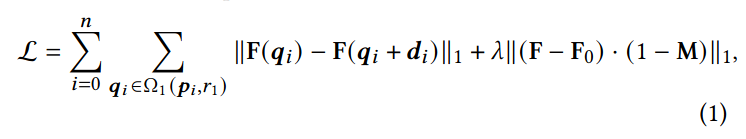

## Drag Your GAN: Interactive Point-based Manipulation on the Generative Image Manifold
*SIGGRAPH conference(2023), 94 citation, Max Planck Institute for Informatics (in Germany), Review Data: 2024.05.10*

[Intro](#intro) 
[Related Work](#related-work) 
[Method](#method) 
[Experiment](#experiment) 
[Conclusion](#conclusion) 

> Core Idea

<strong>"Image Manipulation via Optimizing Latent Code"</strong> 

***

### <strong>Intro</strong>

$\textbf{이 주제의 정의 및 요구사항과 중요한 이유}$

- User 의 요구를 만족시키는 시각적 content 를 합성하는 것은 pose, shape, expression, and generated object 의 layout 을 정확하고 유연하게 control 해야한다. 
  - Social-media user 는 사람/동물의 position, shape, expression, body pose 를 조절하기를 원한다. 
  - 자동차 디자이너는 자신의 작품의 형태를 쌍방향으로 수정하고 싶다. 
  - 이러한 user 의 요구사항을 만족시키기 위해, 이상적인 조절 가능한 이미지 합성 접근법은 다음의 특성을 갖춰야한다.
    1. Flexibility: model 은 생성된 물체의 layout, pose, position, expression, shape 등을 포함한 서로 다른 공간적 특성을 조절할 수 있어야 한다. 
    2. Precision: 높은 정확도로 공간적 특성을 조절해야 한다. 
    3. Generality: 특정 카테고리에만 제한되지 않고 다양한 카테고리에도 적용할 수 있어야한다. 

$\textbf{이 주제의 문제점과 기존의 노력들}$

- 기존의 접근법은 GAN 과 주석이 달린 training data 를 사용하는데, 오직 하나 또는 $2$ 개의 요구사항을 만족한다. (Flexibility, Precision, Generality)
- Prior $3$ D model 을 통한 GAN 의 조작이나 주석이 달린 train data 에 의존하는 supervised learning: 새로운 object category 에 대해서 일반화가 부족하여 종종 Flexibility 가 부족하다. 

$\textbf{최근 노력들과 여전히 남아있는 문제들}$

- 최근에는, text-guided image synthesis 가 주목을 받았지만 text guidance 는 precision 과 flexibility 가 부족하다. 
  - E.g., 특정 pixel 로의 움직임을 조절할 수 없다. 

$\textbf{본 논문에서 해결하고자 하는 문제와 어떻게 해결하는지, 그 결과들}$

- 따라서, Flexibility, Precision, Generality 을 모두 만족하는 DragGAN 을 제안한다. 
  - Handle point 를 "drag" 하여 target point 에 정확하게 도달하게 한다. 

- 이 접근법은 마치 UserControllableLT 와 비슷하다. 이것도 마찬가지로 dragging-based manipulation 이지만 이것과 비교하여, 본 논문은 더 어려운 문제를 해결하고자 한다.
  1. One point 뿐만 아니라 더 많은 point 조절 (이전에는 못했음)
  2. Target point 에 정확하게 도달하는 handle point (이전에는 못했음)

- 본 논문에서 해결할 문제는 다음과 같다.
  1. Handle point 를 target point 로 이동시키는 feature-based motion supervision
     1. Latent code 를 최적화시키는 shifted feature patch loss 제안
     2. 흥미가 있는 영역만 수정하는, region-specific editing 제안
  2. Generator feature 를 이용하여 handle point 의 위치를 추적하는 point tracking approach

- 다양한 dataset (animals: lions, dogs, cats, and horses / humans: face and whole body) 에 대해서 광범위한 평가를 진행했다. 
  - User-defined handle point 를 target point 로 효과적으로 옮긴다. 
  - 많은 obejct category 에 대해서 다양한 조작 효과를 달성한다. 

- GAN 의 학습된 generative image manifold (의미를 보존하는 공간) 에서 이러한 조작들이 수행된다.
  - Network 의 추가학습이나 주석이 달린 data 가 필요없다. 

***

### <strong>Related Work</strong>

- Generative models for interactive content creation 
  - 대부분의 방법들은 GAN 이나 diffusion model 을 사용한다. 
  - Unconditional GANs: GAN, StyleGAN
  - Conditional GANs: segmentation map 이나 3D variable 등을 condition 을 받는다. 
- Controllability using Unconditional GANs: input latent vector 를 조절함으로써 editing 한다. 
  - Supervised learning from annotations or prior 3D models
  - Unsupervised learning by computing the important semantic directions in the latent space 
- 3D-aware GANs
- Diffusion models: Text-conditioned diffusion model 은 fine-grained control 이 되지 않는다. 
  - Slow sampling 
- Point Tracking 
  - Optical flow 
  - RAFT

***

### <strong>Method</strong>

- StyleGAN Terminology
  - $512$ dimensional latent code: $z \in N(0,I)$ $\rightarrow$ intermediate latent code $\omega \in \mathbb{R}^{512}$ via mapping network 
  - $\omega$ 는 복사되어 generator $G$ 의 서로 다른 layer 에 보내진다. $\omega \in \mathbb{R}^{l \times 512}$, $l$ 은 layer 개수.
  - 본 논문에서는 서로 다른 layer 에 보내진 $\omega$ 를 최적화한다. 

$\textbf{Interactive Point-based Manipulation}$

- Latent code $w$ 와 StyleGAN 에 의해 image $I \in \mathbb{R}^{3 \times H \times W}$ 가 생성된다. 
- User 가 정한 handle point { $\mathbf{p_i} = (x_{p,i}, y_{p,i} | i=1, 2, ..., n)$ } 과 target point { $\mathbf{t_i} = (x_{t,i}, y_{t,i} | i=1, 2, ..., n)$ } 가 주어지면, handle point 에서 target point 로 정보가 이동해야 한다. 
- 이때, option 으로 binary mask $M$ 을 통해 $M$ 영역 밖은 그대로 유지하게 할 수 있다. 
- 본 논문의 방법은 $2$ 가지 optimization step 으로 이루어져있다.
  1. Motion supervision
     1. Latent code $\omega$ 를 target point 방향으로 이동시킨다.
  2. Point tracking 
     1. Handle point 의 위치를 update 한다. 
     2. Handle point 의 위치가 부정확하면 다음 motion supervision 에서 원하지 않는 결과가 나오기 때문이다. 
  3. 일반적으로 $30-200$ iteration 을 진행한다.

$\textbf{Motion Supervision}$

- Handle point 를 target point 로 움직이게 하는 loss 를 제안했다. 
  - StyleGAN2 의 $6^{\text{th}}$ feature maps $F$ 를 사용했다. 
  - 이 $F$ 를 bilinear interpolation $I$ 와 같은 size 로 resize 했다.
  - User 가 정한 $i$ 번째 handle point $p_i$ 를 $t_i$ 로 움직이기 위해 $p_i$ 주변 small patch 를 supervise 했다. 

- Pixel-level 의 $F$ 에서 handle point 주변 $r_1$ 반경만큼의 patch 들에 대해 loss 를 적용한다. 
  - 첫 번째 텀: $q_i$ 가 $p_i$ 에서 $t_i$ 로 가는 단위 벡터 $d_i$ 로 갔을 때의 feature map 과 $q_i$ 의 feature map 이 같도록 학습한다. 
    - 이때, $F(q_i)$ 로는 gradient 가 흐르지 않게 함으로써 $F(q_i + d_i)$ 가 $F(q_i)$ 가 되도록 한다.
    - Mask 영역 밖에에 대해서는 관심이 없는 영역이므로 기존 그대로 보존되어야 한다. 따라서 여러 번 최적화된 feature map 일지라도 처음 handle point 에서의 feature map $F_0$ 과 동일해야 한다. 

- Target point 방향으로 feature map 이 바꼈을때, 기존의 handle point 위치에서의 이미지와 다른 부분은 어떻게 잘 만들어졌는지에 대한 내용은 다음과 같이 볼 수 있다.
  -  기존의 latent code (e.g., 사자) 에서 특정 부분만 target point 로 조금 움직이는데, 이미 사자에 대한 정보가 기존의 latent code 에 잘 들어가있는 상태이므로 나머지도 잘 생성된다.  
  -  또한, 논문에서는 $6^{\text{th}}$ 의 feature map 에 대해서 loss 를 적용하는게 다른 appearance 가 잘 보존된다고 말하고 있다. 

$\textbf{Point Tracking}$

- 이전의 motion supervision 의 결과로서 새로운 latent code $\omega'$ 과 새로운 feature map $F'$, 새로운 이미지 $I'$ 이 만들어진다. 하지만 Motion supervision 은 handle point 를 tracking 하지 않는다. 

- 초기 handle point 의 feature map $f_i = F_0(p_i)$ 와 motion supervision 으로 바뀐 feature map 과 비교해서 가장 가까운 nearset neighbor $p_i$ 를 찾는다. 

***

### <strong>Experiment</strong>

$\textbf{Implementation Details}$

- Adam optimizer, $2e-3$ step size
- FFHQ, AFHQCat, and LSUN Car dataset 
- $\lambda = 20, r_1=3, r_2=12$
- Handle point 가 $5$ 개 이하라면 $d=1$ 아니라면 $d=2$

- Point Tracking 에 대한 평가이다. 
  - Update 한 handle point 와 target point 간의 평균 거리를 나타낸다. 

- 더 많은 handle point 를 다룰 수 있음을 보여준다.
  - 비슷한 이전 연구와의 차이점을 부각

- Point tracking 이 baseline 과 비교하여 정확하게 일치함을 보여준다. 
  - 비슷한 이전 연구와의 차이점을 부각

***

### <strong>Conclusion</strong>

***

### <strong>Question</strong>

