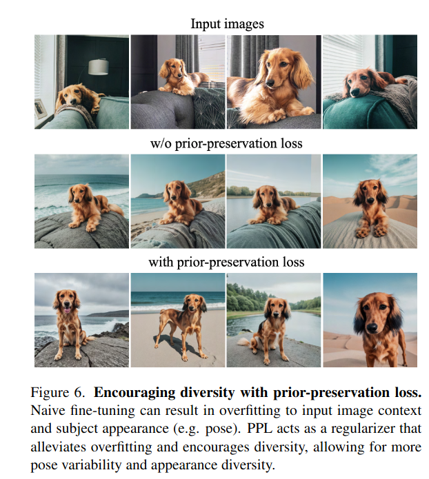
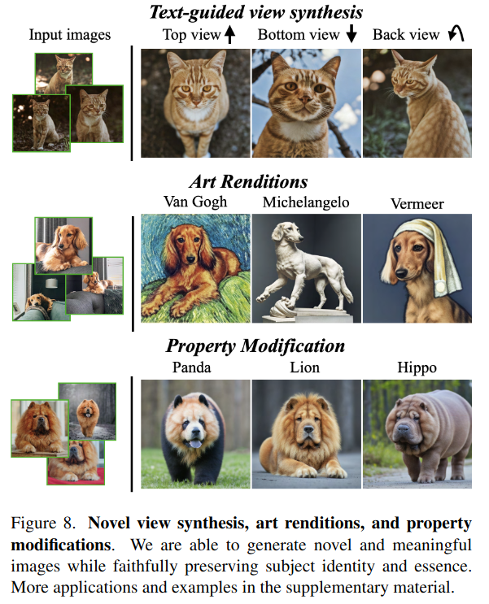

## DreamBooth: Fine Tuning Text-to-Image Diffusion Models for Subject-Driven Generation
*CVPR(2023), 598 citation*

[Intro](#intro) 
[Related Work](#related-work) 
[Method](#method) 
[Experiment](#experiment) 
[Conclusion](#conclusion) 

> Core Idea

<strong>"Fine Tuning Text-to-Image Diffusion Models with Few Images(typically 3-5) of a Subject"</strong> 

***

### <strong>Intro</strong>
- Large text-to-image models 은 엄청난 성과를 거뒀지만, 여전히 reference set 이 주어졌을 때 특정 subject 를 따라하는 능력은 부족하다.
- 본 논문에서는, text-to-image diffusion model 을 personalizing 하는 방법을 소개한다.
- 적은 이미지($3-5$) 만으로도, specific subject 를 unique token(e.g., zwx) 에 binding 할 수 있다. 
- 한 번 binding 시키면, inference 시에 unique token 으로 계속 specific subject 를 생성할 수 있다.
- class-specific prior preservation loss & class-specific prior image 를 활용해서 language dirft 및 overfitting 을 방지하는 방법도 소개한다.

- GAN 은 적은 이미지로 fine-tuning 시킬 시에 overfitting/mode-collapse 가 일어날 뿐만 아니라, target distribution 을 효과적으로 capture 하지 못한다.
- Fidelity 뿐만 아니라, 새로운 문맥에서도 잘 작동한다.

***

### <strong>Related Work</strong>
- Image Composition
- Text-to-Image Editing and Synthesis
- Controllable Generative Models

***

### <strong>Method</strong>
- Textual description 없이, few images($3-5$) 로 unique token 에 binding 시켜서 specific subject 를 capture 하는 방법이다. 

- $a \ [identifier] \ [class \ noun]$ 
    - Identifier 에 subject 가 연결된다. (e.g., 우리집 강아지)
    - Class noun 은 subject 에 대한 대략적인 클래스 설명자이다. (e.g., dog)
    - 잘못된 class noun 이나 class noun 을 사용하지 않는 것은 성능을 감소시킨다.
    - Rare-toekn identifier(e.g., zwx) 를 사용하지 않고 기존에 존재하던 단어에 binding 을 시키는 것은 최적이 아니다. 원래의 의미에서 벗어나 내가 제공한 specific subject 를 다시 학습해야 되기 때문이다. 

- Class-specific Prior Preservation Loss
  - $a \ [identifier] \ [class \ noun]$ 로 학습을 진행하게 되면, 기존에 class noun 이 가지고 있던 general 한 의미는 사라지게 된다. 학습 중에 class noun 이 few images 에 영향을 받기 때문이다. 
  - Class noun 이 기존에 가지고 있던 의미를 잃어버리는 문제를 본 논문에서는, *Language Drift* 라고 정의한다. 
  - 이 문제가 발생하면, diversity 를 잃어버리고 specific subject 만 생성할 수 있다. 
    - E.g., $a \ [zwx] \ [dog]$ (zwx: 우리 집 강아지) 로 학습을 하고 $a \ dog$ 을 생성해보면, 우리 집 강아지가 나온다. 즉 다양성을 잃어버림
  - 이 문제를 해결하기 위해, *Class-specific Prior Preservation Loss* 를 도입한다.

- Class noun 을 다시 재학습함으로써 기존의 의미를 보존한다.
  - 이때, *class-prior image* 는 freezed diffusion model 에서 생성하거나 직접 이미지를 넣어줄 수 있다.
  - $\lambda = 1$ 로 하는 게 일반적이다.
 

***

### <strong>Experiment</strong>

- Class prior preservation loss 를 도입했을 때, 더 다양한 이미지를 얻을 수 있다. 

- Art Renditions: 예술적 렌더링을 생성할 수 있다. 
  - 소스 구조가 보존되고 스타일만 전송되는 style transfer 와 달리, 예술적 스타일에 따라 의미있고 새로운 변형을 생성할 수 있으며 동시에 주체 식별(subject identity) 를 보존할 수 있다.
- Property Modifictaion: subject 의 특성을 수정할 수 있다.
  - *A cross of a [V] dog and a [target species]*
  - 개의 정체성이 종이 변경되더라도 잘 보존되는 것을 확인할 수 있다.

***

### <strong>Conclusion</strong>
- 적은 이미지만으로도 충분히 신뢰성 있고 다양한 이미지를 생성할 수 있다.
- Text-to-Image diffusion model 을 사람에 기호에 맞게 수정할 수 있는 개인화 방법을 제시했다.
- 그러면서도 기존에 존재하던 token 들의 의미를 보존할 수 있다.

***

### <strong>Question</strong>

