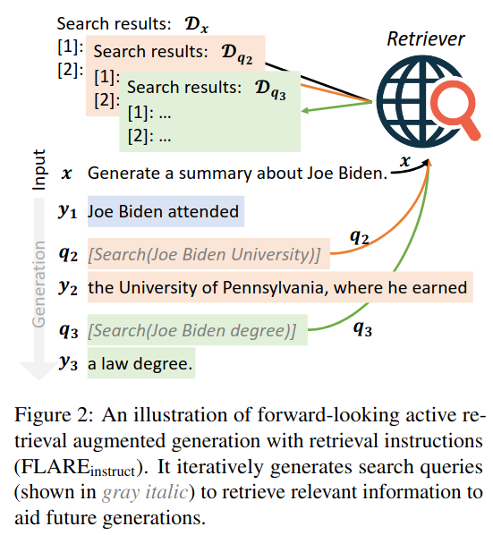
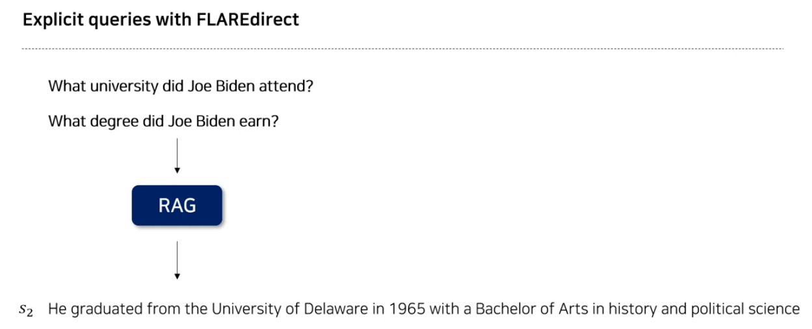
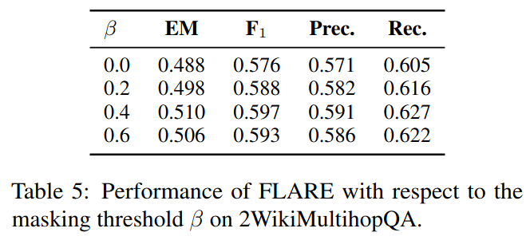

## FLARE: Active Retrieval Augmented Generation
*arXiv(2023), 330 citation, Carnegie Mellon University, Review Data: 2024.12.04*

[Intro](#intro) 
[Related Work](#related-work) 
[Method](#method) 
[Experiment](#experiment) 
[Conclusion](#conclusion) 

> Core Idea

<strong>"When Model Requires more Information, Proceed Retrieval"</strong> 

***

### <strong>Intro</strong>

$\textbf{이 주제의 정의 및 요구사항과 중요한 이유}$

- LM은 언어를 이해하고 생성하는 뛰어난 능력을 가졌지만, 종종 환각 (hallucination)을 일으켜 사실과 다른 출력을 생성하는 경향이 있다. 

- Parametric method
  - BART, GPT-3와 같이 large corpus로 많은 양의 지식을 학습한 모델들은 구축된 파라미터를 확장, 수정, 해석이 어렵기 때문에 parameterize 되었다고 한다. $\rightarrow$ 생성에 특화
  - 반대로 Non-parametric method는 모델 외부에서 접근할 수 있는 knowledge base를 활용한 방법론이다. 질문에 대해 답변하기 위해 Wikipedia에서 관련 knowledge를 가져오기에 확장, 수정, 해석이 가능하다. $\rightarrow$ 검색에 특화

- Retrieval Augmented Generation (RAG)
  - Parametric & Non-parametric method의 장점을 합친다.

$\textbf{이 주제의 문제점과 기존의 노력들}$

- Limitation of RAG-based method
  - Single-time retrieval: 정보를 한 번만 수집하여, 지속적인 수집을 요구하는 long-text generation task에 부적합하다. 
    - $y = \text{LM}([\mathcal{D_x}, x])$
    - 특정 주제 (e.g., Joe Biden)에 대해 요약문을 생성하기 위해, 초기 retrieval은 모든 측면과 세부사항을 다루지 못 할수 있다. 이는 생성 과정에서 추가적인 정보를 검색하는 것을 필요로 한다. (e.g., Joe Biden's education history, the date of Joe Biden's presidential campaign announcement)
  - 해당 한계를 극복하고자 여러 번 정보를 수집하는, Multi-time retrieval으로 발전.

$\textbf{최근 노력들과 여전히 남아있는 문제들}$

- Multi-time retrieval
  - Previous window: 고정된 길이의 window size를 query로 사용하여 retrieval 진행.
  - Previous sentences: 이전 문장을 query로 사용하여 retrieval 진행.
  - Question decomposition: 전체 질문을 하위 질문으로 분해하여, 각 하위 질문이 추가 정보를 retrieval하여 가져옴.

- Limitation of Multi-time retrieval
  - Previous methods
    - LM이 미래에 생성할 내용이나 검색할 내용을 정확하게 반영하지 못할거나 부적절한 시점에 검색을 수행할 수 있다. 
    - 고정된 간격으로 정보를 검색하는 것은 부적절한 시점에 발생할 수 있어 비효율적일 수  있다.
  - Question decomposition: task별 prompt engineering이 필요하므로 새로운 task에서 일반화가 힘들다.

$\textbf{본 논문에서 해결하고자 하는 문제와 어떻게 해결하는지, 그 결과들}$

- 생성 과정 동안 언제, 무엇을 검색할지 능동적으로 결정하는 일반적인 retrieval augmented LM을 만들자. (다양한 긴 형태의 생성 작업에 적용가능한) **즉, retrieval을 효율적으로 하는 방법론을 제시하는 것이다.**
- Multi-time retrieval의 한계를 극복하고자 본 논문에서는 다음과 같이 제안한다.
  - 이전에 생성된 정보 $\rightarrow$ 향후 생성할 정보
  - 고정된 간격 $\rightarrow$ 유연한 간겨
  - Task별 prompt $\rightarrow$ 범용적인 prompt 
  - 즉, long-form generation task에 적용할 수 있는 생성 과정에서 언제, 무엇을 검색할 지 능동적으로 결정하고 추가 정보를 검색하여 재생성하는 FLARE 방법론을 제안한다. 

- FLARE는 추가 훈련 없이 추론 시에 기존 LM에 적용이 가능하다. 

***

### <strong>Related Work</strong>

$\textbf{Multi-time retrieval}$

- Retrieval 시에 query를 언제, 어떻게 구성하는지에 따라 달라진다. 
  - 기존의 방법들은 과거에 구성, 본 논문은 현재 시점에서 query를 만든다.

- Previous window (<a href='https://arxiv.org/pdf/2112.04426'>RETRO</a>, DeepMind, 2022, 1004 citation)
  - LM의 많은 양의 파라미터를 학습하는 데 소요되는 비용 문제를 완화하기 위해, large retrieval dataset 정보를 활용한다.
  - 상대적으로 적은 모델 파라미터로 초대형 모델에 준하는 성능을 달성했다.
  - Encoder: Input sequence와 가까운 text chunk를 검색하여 augmented encoder input으로 활용
  - Decoder: Input sequence embedding과 retrieved embedding 간 chunked cross-attention 수행.
  - 즉, **input sequence의 token 단위의 정보를 활용하여 retrieval한다는 점에서 previous window method이다.**
  - Window size $l$이 주어지면, input sequence에서 $l$개의 token만큼 query로 사용한다. (default $l: 16$)

$$ q_t  = y_{t-1} (2 \leq t), \\ y_t = [w_{(t-1)l + 1}, ..., w_{tl}] $$

- Previous sentences (IR-CoT)
  - Retrieval <-> Reason (Chain-of-Thought)의 상호작용
  - 마지막 CoT 문장을 기반으로 $K$ 개의 passage를 retrieval하고, Query-passage-Thought의 형태로 reasoning을 진행한다.
  - Query로써 이전 문장을 사용한다. 

$$ q_t = y_{t-1} \\ y_t = s_t $$

- Question decomposition (Self-Ask)
  - 복잡한 질문을 하위 질문으로 분해하는 prompt를 구성하여, 메인 질문의 답변을 추론하는 능력을 향상시키는 목적을 가진다.
  - Self-Ask <-> Search engine 간 상호작용을 통해 답변을 prompt에 추가 후 최종 답변을 생성한다.  
  - 즉, LM이 output을 생성하는 동안 decomposed sub-question을 생성하도록 안내하기 위해, 수동으로 주석이 달린 작업별 예시를 사용한다. 

- Few-shot prompt를 제시한다.

- Self-Ask + Search Engine

- Limitation of Multi-time retrieval
  - Previous methods: **이 방법론은 query를 생성하는 게 전부 이전 output을 활용한다.**
    - LM이 미래에 생성할 내용이나 검색할 내용을 정확하게 반영하지 못할거나 부적절한 시점에 검색을 수행할 수 있다. 
    - 고정된 간격으로 정보를 검색하는 것은 부적절한 시점에 발생할 수 있어 비효율적일 수  있다.
  - Question decomposition: task별 prompt engineering이 필요하므로 새로운 task에서 일반화가 힘들다.

- **본 논문은 쿼리를 생성하는 시점이 현재진행이다. 즉, output을 생성하면서 헷갈리면 중지하고 바로 query 생성 후 다시 재생성.**
  1. Instruction에 query 만드는 방법을 알려주고 모델이 알아서 query (단어)를 생성
  2. 모델이 생성한 문장에 confidence가 낮은 단어를 i) masking 하거나 ii) 그 단어를 바탕으로 질문을 생성해서 쿼리로 넣거나이다.

***

### <strong>Method</strong>

$\textbf{Notations and Definitions}$

- User input $x$
- Document corpus $\mathcal{D} =$ { $d_i$ }$_{i=1}^{|\mathcal{D}|}$ (e.g., all Wikipedia articles)
- Answer generated by LM $y = [s_1, s_2, ..., s_m] = [w_1, w_2, ..., w_n]$
  - $m$ sentences or $n$ tokens
- Retrieved documents for query $q$: $\mathcal{D}_q = \text{ret}(q)$
- Retrieval query at time $t$: $q_t = qry(x, y_{<t})$
  - $t >=1$
  - $y_{<t} = [y_0, ..., y_{t-1}]$
  - $q_1 = x (y_{t<1} = \emptyset)$
  - $y_t =\text{LM}( [ \mathcal{D}_{q_{t}}, x, y_{<t} ] )$
- 이전에 검색된 documents는 버리고 오직 $t$에서 검색된 document만을 사용한다. 이는 LM의 input length limit에 도달하지 않기 위해서다.

$\textbf{FLARE: Forward-Looking Active Retreival Augmented Generation}$

- 본 논문의 직관은 다음과 같다.
  1. LM은 추가적인 지식이 필요할 때만 정보를 검색해야한다. 이를 통해 불필요하거나 부적절한 검색을 피할 수 있다.
  2. 검색 쿼리는 미래 생성의 의도를 반영해야 한다. 

- 긴 형식의 생성은 복잡한 정보를 요구하기 때문에 생성 과정에 여러 knowledge 수집이 필요하다.
  - 이는 인간이 논문, 에세이, 책을 만들 때 정보를 지속적으로 수집하는 것과 유사하다.

- 두 가지 forward-looking active retrieval augmented generation (FLARE) 방법을 제안한다.
  - $\text{FLARE}_{\text{instruct}}$
  - $\text{FLARE}_{\text{direct}}$

$\text{FLARE}_{\text{instruct}}$

- LM이 retrieval-encouraging instructions을 사용하면서 답변을 생성하는 동안, 검색이 필요할 때 검색 쿼리를 생성하는 방법이다. 

- Retrieval-encouraging instructions
  - Few-shot prompting을 통해 검색을 유도한다.
  - Skill 1: search queires를 생성하기 위한 지침과 예시
  - Skill 2: downstream task (e.g., multihop QA)를 수행하기 위한 지침과 예시

- 실제 예시

- LM이 "[Search(query)]"를 생성하면, 생성을 멈추고 쿼리 용어를 사용하여 관련 문서를 검색한 뒤, 그 문서를 user input 앞에 추가하여 생성을 돕는다. 
  - 이 과정은 다음 i) search query가 생성되거나 ii) 끝에 도달할 때 까지 계속된다.

$\text{FLARE}_{\text{direct}}$

- LM의 output을 검색 쿼리로써 직접적으로 사용하는 방법으로, 이는 future topic에 대한 통찰을 얻기 위해 반복적으로 다음 문장을 생성하고, 불확실한 토큰이 있을 경우 관련 문서를 검색하여 다음 문장을 재생성한다.

- 먼저, 검색된 문장에 의존하지 않고 임시 다음 문장 (temporary next sentence) $\hat s_t = \text{LM}([x, y_{<t}])$ 를 생성한다. 
  - 이후, 검색을 trigger할지 여부를 결정한다. ( $\hat s_t$ 가 신뢰성이 낮다면 문장 $s_t$ 을 재생성)
  - Temporary next sentence를 기준으로 trigger를 하는 이유는 구나 문단처럼 너무 짧지도 길지도 않은 의미 단위로써 중요하기 때문이다. 물론 구나 문단을 basis로 할 수도 있다. 

- 문장에서 각 token의 confidence 값이 하나라도 $\theta$ 이하면 문장을 재생성한다. 
  - 이때의 쿼리는 $\hat s_t$를 기반으로 만든다.

- Next sentence를 사용하여 query를 구성하는 이 방법론은 이전 문맥을 사용하는 것보다 훨씬 더 좋은 결과를 얻었다고 한다.
  - 그러나 이러나 접근법은 해당 문장에 포함된 오류를 지속시킬 위험이 있다.
    - e.g., "Joe Biden attended the University of Pennsylvania"(조 바이든이 펜실베이니아 대학교에 다녔다)
    - 라는 문장을 LM이 생성했을 때, 문장이 틀리다면 오해를 불러일으키는 정보를 검색할 가능성이 있다. 
    - 따라서, **implicit query** 와 **explicit query** 를 제안한다.

- Implicit query
  - $\hat s_t$에서 confidence 값이 $\beta \in [0,1]$ 이하라면 해당 token을 masking하는 것이다. 이를 통해 문장에서 잠재적인 방해 요소를 제거할 수 있다.

- Explicit query
  - $\hat s_t$에서 confidence 값이 낮은 부분을 대상으로 명시적인 질문을 생성하는 것이다. 
  - E.g., "the University of Pennsylvania"에 대해 확신을 하지 못한다면 "Joe Biden이 다닌 대학교는 어디인가요?" 라는 query를 생성할 수 있다. 
  - 구체적으로 $\hat s_t$에서 확률인 $\beta$ 이하인 모든 구간을 추출하고, 추출된 각 구간 $z$에 대해 gpt-3.5-turbo를 사용해 해당 구간을 답변할 수 있는 질문 $q_{t,z}$를 생성하도록 요청한다.

----

- 마지막 문장의 기준은 "So, Final answer is ..."처럼 형식화된 문장이 있다.

***

### <strong>Experiment</strong>

- Implementation details
  - Wikipedia dump (복사한 것)를 사용하고 검색은 BM25를 사용한다.
    - BM25: TF-IDF 계열의 검색 알고리즘 중 SoTA이다.
  - OpenWeb은 Bing 검색 엔진을 사용한다. 
  - FLARE는 특별히 언급되지 않으면 $\text{FLARE}_{\text{direct}}$ 를 의미한다.
  - 각 단계 $t$에서 $64$개의 token을 생성하며, 이느 대부분의 문장보다 길게 설정한 값이다. 이후 생성된 텍스트에서 첫 번째 문장을 추출하고 나머지는 NLTK 문장 토크나이저를 사용해 삭제한다.

- Multihop QA: 정보 검색과 추론을 통해 복잡한 질문에 답을 해야한다.
  - 2WikiMultihop dataset을 사용
  - 위키백과 문서에서 발췌한 2단계 복합 질문을 포함하고 있다. 
  - E.g., "Versus의 창립자는 왜 사망했나요?"
  - EM, $F_1$, precision, and recall

- FLARE에서 사용한 few-shot example

- Commonsense reasoning: 상식 추론 문제
  - StrategyQA dataset을 사용
  - 예/아니오 형태의 질문으로 구성
  - E.g., "배는 물에 가라앉을까요?"
  - EM

- FLARE에서 사용한 few-shot example

- Long-form QA: 복잡한 질문에 대해 포괄적인 답변을 생성
  - ASQA
  - 입력은 여러 해석이 가능한 모호한 질문이고, 출력은 이를 모두 다뤄야 한다.
    - E.g., "Philadelphia Eagles는 어디에서 홈 경기를 하나요?" 는 도시, 스포츠 단지, 경기장 중 어떤 것을 묻는지 알기 어렵다.
  - 인간조차 질문의 모호한 측면을 식별하기 어려우므로 답변 생성 시 LMs가 올바른 방향을 유지하도록 간단한 힌트를 제공하는 설정 (ASQA-hint)를 추가로 만들었다. 
    - E.g., 위 질문은 특정 위치나 장소를 지칭하는지에 대한 모호성이 있다.
    - EM, RoBERTa-based QA score (Disambig-F1), ROUGE, DR (Disambig-F1과 ROUGE를 결합)

- FLARE에서 사용한 few-shot example

- Open-domain summarization: 웹에서 정보를 수집하여 주제에 대한 포괄적인 요약을 생성
  - WikiAsp: 위키백과의 20개 도메인에 걸쳐 엔티티에 대한 측면 기반 요약을 생성하는 것이 목표
    - E.g., "Echo School (Oregon)에 대해 학업, 역사와 관련된 요약을 생성하세요"
  - ROUGE, named entity-based $F_1$, 사실적 일관성을 측정하는 UniEval

- FLARE에서 사용한 few-shot example

$\textbf{Experimental Results}$

- Overall results
  - FLARE는 모든 baseline을 능가하며 FLARE가 생성 과정에서 추가 정보를 효과적으로 검색할 수 있는 일반적인 방법임을 보여준다. 
  - 여러 task 중, multihop QA에서 가장 큰 성능 향상일 나타났다. 이는 이 task가 명확한 정의와 2단계 추론 과정을 통해 최종 답변을 생성한다는 구체적인 목표를 가지고 있어, LMs가 주제에 맞는 출력을 생성하기 더 용이하기 때문이다. 
  - 반면, ASQA와 WikiAsp는 보다 개방형으로, 생성과 평가 모두가 더 어렵다. ASQA-hint에서의 향상은 ASQA보다 더 크게 나타났는데, 이는 hint를 제공하여 LMs이 주제를 벗어나지 않도록 돕기 때문이다.

- Multihop QA
  - FLARE라는 미래 지향적 (active retrieval) 검색 방식이 매우 효과적임을 확인시켜준다.
  - Previous-sentence의 성능 향상이 상대적으로 작은데, 이는 주로 이전 문장이 2WikiMultihopQA에서 다음 문장과 다른 entity나 관계를 설명하는 경우가 많기 때문이라고 가정했다. 

- 모든 baseline 중에 가장 높은 성능을 보인 것은 question decomposition approach이다. 
  - 이는 수작업으로 주석이 달린 분해된 하위 질문들이 LMs가 미래 생성물의 주제나 의도에 맞는 하위 질문을 생성하도록 유도하기 때문이다. 즉, task-specific한 instruction을 주니 더 잘한다.
  - FLARE는 이 방법론을 능가하며, 수작업으로 예시를 주석 처리할 필요가 없음을 보여준다. 
  - $\text{FLARE}_{\text{instruct}}$는 오히려 성능이 떨어지는데, 이는 일반적인 검색 지침과 예시를 사용해 LMs에게 검색 쿼리를 생성하도록 가르치는게 어렵다는 것을 시사한다.

- Other datsaets
  - ASQA에서 previous-window를 사용한 검색은 single-time retreival보다 낮은 성능을 보이는데, 이는 previous-window가 미래 의도를 정확히 반영하지 못했기 때문이라고 가정한다.

$\textbf{Ablation Study}$

- 2WikiMultihopQA와 ASQA-hint에서 FLARE에서 제안한 masking이나 question generation없이 previous-sentence와 next-sentence를 비교한 실험이다. 이는 next sentence를 사용하는 게 더 효과적임을 다시 한 번 보여준다.

- Importance of active retreival
  - Active retrieval threshold $\theta$의 효과를 검증했다.
  - $\hat s_t$에서 $\theta$보다 작은 token에 대해 query를 구성하는 방식이다.
  - $\theta=0$이면 검색을 아예 안하는 것, $1$이면 생성할 때마다 retrieval하는 것이다.
  - 2WikiMultihopQA에서 검색 비율이 $\theta =0.6$을 초과하면 성능이 정체되며, 이는 $LMs$가 충분히 확신할 때는 검색이 필요하지 않음을 보여준다.
  - StrategyQA에서는 검색 비율이 $\theta=0.5$를 초과하면 성능이 저하되며, 이는 불필요한 검색이 잡음을 유발하고 원래 생성 과정을 방해할 수 있음을 나타낸다. 
  - 일반적으로 $40 \sim 80$ %에 대해 검색을 트리거하면 대부분의 작업에서 우수한 성능을 보여준다.

- Ablation of Implicit query formulation
  - $\beta$ 값보다 token의 confidence 값이 작으면 masking
  - $\beta=0$이면 모든 문장을 그대로 query로 사용하는 것이다.
  - $\beta$ 값을 증가시켜서 신뢰성이 낮은 token은 masking을 하는 것이 성능이 좋다. 이는 신뢰도가 낮은 오류 토큰이 검색기를 방해할 수 있다는 가설을 확인시켜준다.

- Comparison between Implict and Explicit
  - 두 방법 모두 정보 요구를 효과적을 반영함을 알 수 있다.

***

### <strong>Conclusion</strong>

- Limitation: 다음의 $2$ dataset에 대해서는 유의미한 성능 향상을 제공하지 못했다.
  - Wizard of Wikipedia: 지식 중심의 대화 생성 데이터셋으로 평균 출력 길이가 약 $20$ token으로 짧기 때문에 여러 다양한 정보를 검색하는 것이 필요하지 않다.
  - ELI5: 심층적인 답변이 요구되는 QA이다. 검색 기반 생성 및 평가의 어려움 때문에 single-time, FLARE 모두 검색을 사용하지 않은 경우와 비교해서 유의미한 성능 향상을 제공하지 못했다. 

***

### <strong>Question</strong>

<a href="">link</a>

> 인용구
