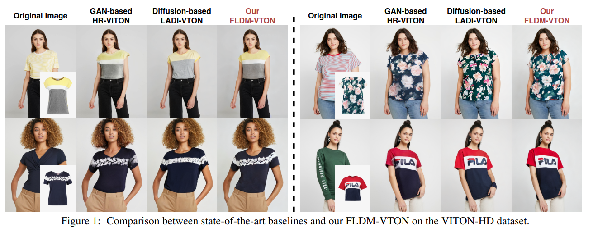
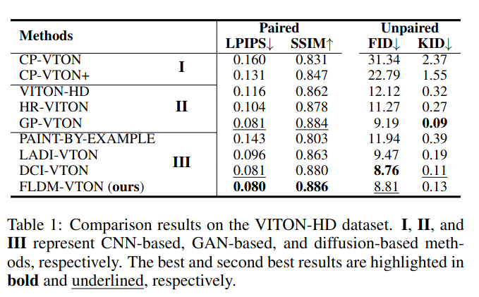

## [paper]
*IJCAI(2024), 0 citation, Fudan University(China), Review Data: 2024.06.12*

[Intro](#intro) 
[Related Work](#related-work) 
[Method](#method) 
[Experiment](#experiment) 
[Conclusion](#conclusion) 

> Core Idea

<strong>"Provide Cloth Prior and Preserve Cloth Detail using Flattening Network"</strong> 

***

### <strong>Intro</strong>

$\textbf{이 주제의 정의 및 요구사항과 중요한 이유}$

- Image-based VTON 은 사람과 옷의 detail (e.g., style, pattern, and text) 을 모두 보존하면서 사람의 body 에 옷을 옮기는 것이다. 이는 user 와 online shopping 사이에 차이를 연결해줌으로써, user 의 shopping 경험을 향상시킬 훌륭한 가능성이 있다. 

$\textbf{이 주제의 문제점과 기존의 노력들}$

- 이전의 방법들은 GAN 에 굉장히 의존적이다.
- 일반적으로 thin plate spline (TPS)-based 또는 appearance flow-based algorithm 을 사용하여 옷을 사람에 몸에 맞게 변형시켰다. 그 후, GAN 을 사용하여 재조정했다. 
- 그럼에도 불구하고, model collapse issue (Seeing What a GAN cannot generate, ICCV, 2019)로 인해 GAN-based method 들은 photo-realistic try-on 을 생성하거나 정확하게 복잡한 옷의 세부사항을 capture 하는 데 실패했다. 

$\textbf{최근 노력들과 여전히 남아있는 문제들}$

- 최근에는, diffusion model 이 다양한 task 를 넘나드는 놀라운 생성 능력을 보여주면서 (e.g., image inpainting, image editing, segmentation) GAN 과 비교하여 더 안정적이고 직접적인 likelihood estimation 을 할 수 있게 됐다. 
- 하지만, diffusion model 은 high-resolution image 생성에 대해선 computational resource 에 제한이 있다. 따라서, LDM 을 사용한다. 
- LDM 의 성공적인 발전에도 불구하고, Latent diffusion model-based VTON 은 여전히 옷에 대한 충실도가 부족하다. **I.e., style, pattern, and text**

$\textbf{본 논문에서 해결하고자 하는 문제와 어떻게 해결하는지, 그 결과들}$

- 이러한 문제의 원인을: diffusion 의 확률적인 특성과 latent supervision (noise 를 예측하여 간접적으로 이미지를 생성하는 loss 를 의미하는 것 같다.)으로 인해 발생하는 문제로 봤다. 

- 확률적인 특성: sampling 과정에서 도입된 초기 가우시안 noise 와 각 시간 단계에서 추가되는 가우시안 noise 로 인해 의류 세부 사항을 보존하기가 어렵다. 
- Latent supervision: 세부 의류 디테일에 대한 image-level supervision 을 제공하기에 부족하다. 

- $3$ 가지 주요 측면에서, 전통적인 latent diffusion process 를 향상시켰다. 
  1. Warped cloth 를 starting point 와 local condition 으로 모두 제공한다. (cloth prior)
     - Starting point: warped cloth 를 U-Net 의 input 으로 제공
     - Local condition: clothing agnostic map 에 warped cloth 를 overlay 하여 U-Net 의 input 으로 제공 
     - 확률성을 줄인다. 
  2. 새로운 clothes flattening network 를 도입하여, network 가 cloth image 를 생성하게 한다: clothes-consistent faithful supervision 
     1. 세부 의류 디테일을 보존하기 위해서 사용.
  3. Faithful inference 를 위해, clothes-posterior sampling 을 고안하여 기존의 옷에 구애받지 않는 gaussian sampling 에 비해 모델 성능을 향상시킨다. 

***

### <strong>Related Work</strong>

$\textbf{Image-based virtual try-on}$

- 수많은 VTON 연구들은 clothing 을 person's body 에 입히면서 high-resolution image 를 생성하는 것을 조사하고 있다. 
- 대부분의 VTON 연구는 $2$ stage 로 구성된다. (GAN-based: pre-warping and refining)
  - Pre-warping state: thin plate spline (TPS)-based or appearance flow-based 
  - Appearance flow-based 
    - ClothFlow: A flow-based model for clothed person generation, ICCV, 2019
    - Style-based global appearance flow for virtual try-on, CVPR, 2022

$\textbf{Diffusion models}$

***

### <strong>Method</strong>

$\textbf{Try-on Diffusion with Clothes Priors}$

- Clothes faithful priors: diffusion stochastic process 에서의 확률적인 요소를 줄이기 위해 cloth 정보를 prior 로 제공한다. 
  - 중요한 점은 main starting point $T$ 와 prior starting point $C^\omega$ 가 동시에 들어가는 것이 아니라, 둘 중 하나만 입력으로 사용되는 것이다. 
  - $m^r$ : down-sampled inpainting (agnostic) mask 

- Self-supervised visual encoder 로써, DINOv2 를 사용한다. 
  - Cross-attention 을 통해 U-Net layer 에 global controller 로써 제공된다. 

$\textbf{Clothes-consistent Faithful Supervision}$

- Cloth prior 가 input 으로부터 충실함을 강화시키는 데 도움을 주긴 하지만, 여전히 fine detail (e.g., pattern, text)을 보존하기에는 어려움이 있다. 
- 이는 학습 과정에서 오직 latent feature 로써 cloth 정보가 제공되기 때문이다. 
- Fine datail 의 충실도를 더욱 향상시키기 위해 clothes-consistent faithful supervision 을 도입한다. 
- 즉, clothes flattening network $F$ 를 도입하여 original clothing 을 복원할 수 있도록 한다. 

- Clothes flattening network
  - Take-off step 과 flatten-out step 으로 구성되어 있다. 
  - Take-off step: 생성된 이미지를 pre-paresd cloth mask $m^C$ 를 이용하여 masking out 한다. 즉, 옷 영역만 추출 
  - Flatten-out step: U-Net 구조로 이루어져 있다. (Feature Pyramind Network)
    - Clothing mask $m^{cp}$ 가 network 에 concat 되어 정보가 제공된다. 
  - $L_1$ loss 와 perceptual loss $L_{per}$ 를 사용한다. 
  - The second-order smooth loss $L_{sec}$ 와 total variation loss $L_{TV}$ 를 사용한다. 
  - 먼저 이 flattening network 를 학습시킨 후에, U-Net 학습할 때는 freeze 한다. 
  - 그리고 나서 U-Net 이 잘 복원할 수 있게 생성하도록 유도한다. 

- 차례대로 $0.2, 0.01, 6.0$

$\textbf{Faithful inference}$

- 추론할 때, 전통적인 diffusion model 은 standard gaussian distribution 으로부터 sampling 한다. 이는 clothing 과 전혀 관계없는 noise 이다. 
- 초기에 상당한 확률적 변동성이 도입돼서 생성된 의류 세부 사항의 정확성에 부정적인 영향을 미친다. 이를 위해 clothes-posterior sampling 을 도입했다. 
- 구체적으로, 아무 관계없는 가우시안 노이즈를 뽑지 않고, warped clothing image $C^\omega$ 를 encoder 에 통과시키고 (noise 는 latent space 상에서 더해지니까) 이 feature vector 에 forward process 를 적용시켜 proir latent feature vector 를 만든다. 
  - 개인적인 의문은 warped clothing image 에 forward process 를 $T$ 만큼 적용시킨 거니까, 결국 원본의 정보는 모두 손실되는 거 아닌가 싶기도 하다.
  - Ablation study 에서는 당연히 성능이 올라갔다. 

***

### <strong>Experiment</strong>

$\textbf{Datasets}$

- $2$ 개의 유명한 high-resolution VTON benchmark 에 대해서 실험을 했다: VITON-HD dataset, Dress Code dataset 

$\textbf{Implementation details}$

- $1,000$ step 으로 학습, sampling 은 DPM solver 로 $50$ steps 
- LPIPS, SSIM, FID, KID

- VITON-HD dataset 

- DressCode dataset
  - VITON-HD 에 있던 모든 모델들에 대해서 하지 않았다.

- Real-world data 에 대해서도 적용
  - Robustness 를 보여준다. 

- Ablation study
  - CLIP vs DINOv2 한 게 의미있는 거 같다. 

- Flattening network 로 생성한 결과를 볼 수 있다. 
  - $\hat C$ 가 생성된 결과

- Appendix

***

### <strong>Conclusion</strong>

***

### <strong>Question</strong>

- Limitation
  - Inference 과정에도 warped clothing 이 필요해진다. 
