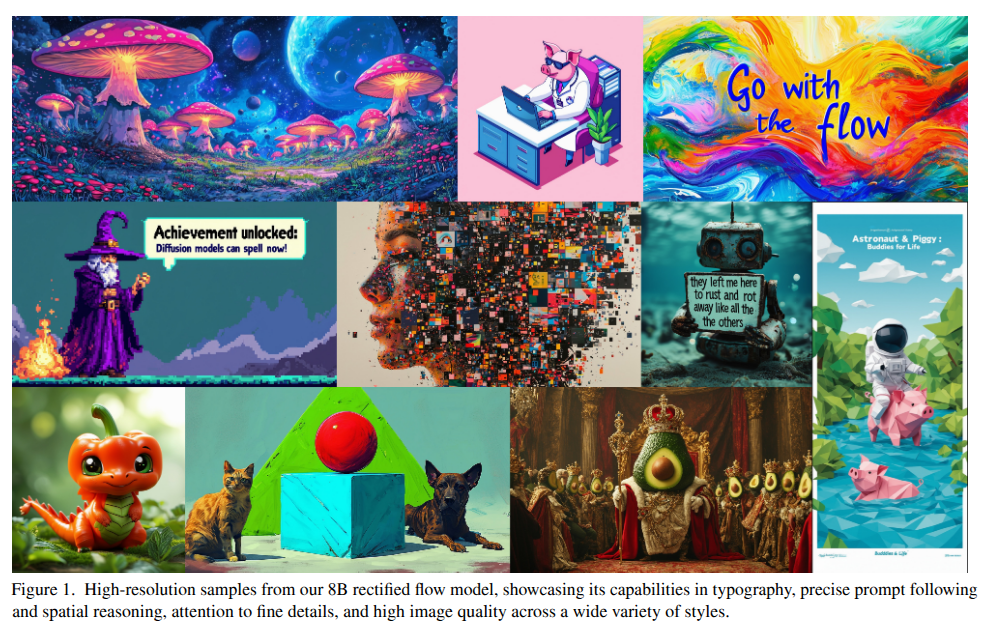
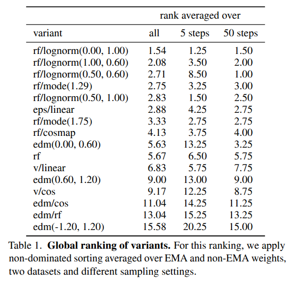
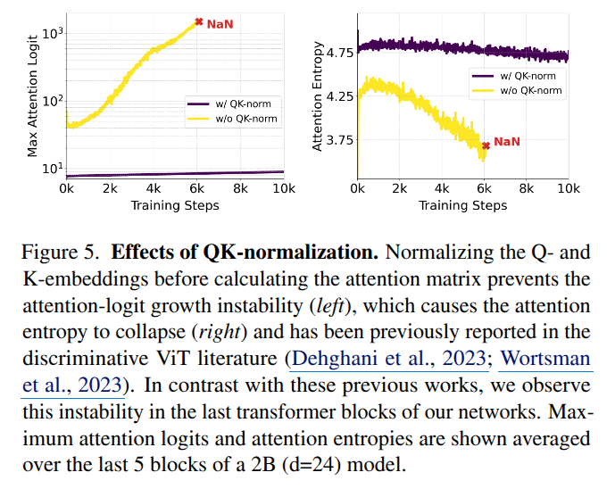

## Flow Matching

> Flow matching -> Rectified FLow -> DiT -> SDv3 순으로 진행한다. 

***

## Flow Matching For Generative Modeling

- Paper: [Flow Matching For Generative Modeling, 2022, arXiv, 2296 citation](https://arxiv.org/abs/2210.02747)

- Reference Youtube-1: [Flow Matching and Diffusion Models](https://www.youtube.com/watch?v=NEqHBKiMA0k)
- Reference Youyube-2: [Guide of Flow Matching](https://www.youtube.com/watch?v=YFZbFr3cjpA)

$\textbf{Notation}$

- Flow $\psi_t$: Flow는 simple prior density (e.g., pure noise)에서 더 복잡한 분포로의 vector의 location을 나타내는 함수이다. Ordinary differential equation (ODE)로 정의된 Flow는 미분 가능하고 역함수가 존재한다. 

- Vector field $v_t$: $t$ 시점의 data가 어디로 향할 지를 나타내 주는 함수이다. 

$$ \frac{\partial}{\partial t}\psi_t(x) = v_t(\psi_t(x)) $$

- Probability density paths $p_t$: t시점에서의 데이터 분포
  - $p_0$: noise distribution (i.e., standard Gaussian distribution)
  - $q_1$: more complex distribution 

- Non-diffusion probability path: FM은 결정론적 방법 (deterministic framework of Continuous Normalizing Flow)이다.

$\textbf{Objective}$

- Unknown data distribution $q(x_1)$ 를 따르는 분포에서 random variable $x_1$을 하나 가정한다. 우리는 실제 데이터 분포인 $q(x_1)$에 접근할 수 없으니, probability path를 설계해야한다. 
  - $p_0 = p: simple distribution e.g., standard normal distribution $p_0(x) = \mathcal{N}(x|0,I)$
  - $q$: data distribution인데, $p_1$를 $q$와 거의 동일한 distribution이라고 가정한다. $p_1(x) \approx q(x)$

- Probability path 및 flow를 연속적인 변환 (ODE의 형태)로 확장한다. 이게 바로 vector field이다. 데이터가 시간에 따라 어떻게 이동하는지를 정의한다. 

- Objective: regress vector fields $u_t$ of fixed conditional probability paths
  - CNF vector field model $v_t$
  - $t \sim \mathcal{U}[0,1]$
  - $x \sim p_t(x)$

$$ \mathcal{L}_{\text{FM}}(\theta) = \mathbb{E}_{t, p_t(x)} \parallel v_t(x) - u_t(x) \parallel^2 $$

- vector field $u_t$를 학습하는 neural network $v_t$를 학습한다. 하지만, 이는 적절한 $p_t$와 $u_t$가 무엇인지에 대한 prior knowledge가 없기 때문에 intractable하다. 따라서, conditional probability path와 이를 marginaling하여 probability path $p_t(x)$를 표현한다.
  - 즉, CNF target vector field를 명시적으로 알 수 없기 때문에, 각 샘플(즉, 조건)에 따라 달라지는 conditional vector field를 per-sample formulation으로 설계한다.

$\textbf{Notation2}$

- Conditional probability path $p_t(x|x_1)$
  - $p_1(x|x_1)$ at $t=1$ to be a distribution concentrated around $x= x_1$, e.g., $p_1(x|x_1) = \mathcal{N}(x|x_1, \sigma^2I)$ with a sufficiently small standard deviation

> 왜 표준편차가 0이 아니라 0에 가까운 값일까
>> 표준편차가 0인 정규분포는 한 점에 모든 확률 질량이 집중되는 '디랙 델타 함수(Dirac delta function)' 형태로, 평균일때 확률값이 무한대이다. '실제 함수'가 아니므로 표준적인 적분, 미분 등의 연산에 바로 적용할 수 없다. 즉, 이론적인 확률밀도 함수로 다루기 어렵다는 의미이다. 머신러닝이나 최적화에서 모델 출력이 이런 '초함수'가 되면 경사도 계산, 확률 계산 등 수치적으로 무한대가 되어 불안정성과 계산 불가능 문제가 발생할 수 있다.

> 이에 대해 실용적인 머신러닝 구현은 '0에 근접한 아주 작은 양'으로 근사하여 거의 델타함수처럼 동작하도록 한다. 

- 이 conditional probability path $p_t(x|x_1)$ 를 $q(x_1)$ 에 대해 marginaling하여 marginal probability path $p_t(x)$를 표현한다.

$$ p_t(x) = \int p_t(x|x_1)q(x_1)dx_1 $$

- Where in particular at time $t=1$,

$$ p_1(x) = \int p_1(x|x_1)q(x_1)\,dx_1 \approx q(x). $$

- 또한, marginal vector field를 정의할 수도 있다. 

$$ u_t(x) = \int u_t(x|x_1) \frac{p_t(x|x_1)q(x_1)}{p_t(x)} \,dx_1 $$

- 불행하게도, marginal probability path와 vector field에 있는 intractable integral로 인해 여전히 $u_t$를 계산할 수 없다. 이에 대응하기 위해, 본 논문은 Conditional Flow Matching (CFM)이라는 더 단순한 목표 함수를 제안한다.
  - 개별 데이터 샘플 $x_1$에 대해 조건부 확률 경로 $p_t(x|x_1)$과 조건부 벡터 필드 $u_t(x|x_1)$를 정의하여 이 조건부 구성 요소들에 대해 학습하는 방식을 사용한다. 
  - 이 방식은 기댓값 측면에서 기존의 목표 함수와 동일한 기울기를 갖지므로 CFM을 최적화하는 것이 FM의 최적화와 동치임을 의미한다. 

$$ \mathcal{L}_{\text{CFM}}(\theta) = \mathbb{E}_{t,q(x_1),p_t(x|x_1)} \left\| v_t(x) - u_t(x|x_1) \right\|^2 $$

$\textbf{Conditional Probability Path and Vector Fields}$

- 다음과 같은 form으로 고려한다. 
  - Set $\mu_0(x_1) = 0$ and $\sigma_0(x_1) = 1$: standard Gaussian noise distribution으로 수렴하도록 한다. $p_0(x|x_1) = \mathcal{N}(x|0,I)$
  - Set $\mu_1(x_1) = x_1$ and $\sigma_1(x_1) = \sigma_{\text{min}}$: 충분히 작은 $\sigma_{\text{min}}$으로 설정하여 $p_1(x|x_1)$이 concentrated Gaussian distribution centered at $x_1$을 따르도록 한다. 

$$ p_t(x|x_1) = \mathcal{N}(x | \mu_t(x_1), \sigma_t(x_1)^2 I) $$

- 실제로는 다음과 같이 시간에 따라 linear하게 바뀌는 path를 정의한다. 

$$ \mu_t(x) = tx_1, \quad \text{and} \quad \sigma_t(x) = 1 - (1 - \sigma_{\text{min}})t $$

$$ p_t(x_t|x_1) \sim \mathcal{N}(x_t | tx_1 , (1 - (1 - \sigma_{\text{min}})t)^2I) $$ 

- 그렇다면 flow도 정의할 수 있다.

$$ \psi_t(x) = \mu_t(x_1) + \sigma_t(x_1)x_0 \quad \text{where,} \quad x_0 \sim \mathcal{N}(0,I) $$

$$ \psi_t(x) =  tx_1 + (1 - (1 - \sigma_{\text{min}})t)x_0 $$

- Vector field를 다음과 같이 계산하면, 

$$ \frac{d}{dt} \psi_t(x) = u_t(\psi_t(x) | x_1) $$

$$ u_t(\psi_t(x) | x_1) = x_1 - (1 - \sigma_{\text{min}})x_0 $$

- Loss는 다음과 같이 바뀐다. 

$$ \mathcal{L}_{\text{CFM}}(\theta) = \mathbb{E}_{t,q(x_1),p(x_0)} \left\| v_t(\psi_t(x_0)) - \frac{d}{dt} \psi_t(x_0) \right\|^2 $$

$$ \mathcal{L}_{\text{CFM}}(\theta) = \mathbb{E}_{t,q(x_1),p(x_0)} \left\| v_t(\psi_t(x_0)) - (x_1 - (1 - \sigma_{\min})x_0) \right\|^2 $$

- 시간에 따라 linear하게 바뀌는 linear interpolation path를 정의함으로써, conditional flow는 Optimal Transport (OT) displacement map이 된다. 이는 기존의 DM path의 일종이면서도, 더 빠르고 효율적인 학습과 샘플링, 그리고 더 나은 일반화를 제공한다.

- OT 경로는 확률 분포 간 최소 비용으로 질량을 이동시키는 최적 수송 문제의 해답인 displacement interpolation 경로이다. Flow Matching에서는 조건부 확률 경로의 평균과 표준편차를 선형 함수로 설정하여 OT displacement interpolation 경로를 구성한다. 이 OT 경로는 sample이 직선 경로로 움직이고 일정한 속도를 유지하므로 diffusion 경로 대비 더 단순하고 해석적으로 우수한 특성을 보인다.

$\textbf{Conclusion}$

- Setting 

$$ \mu_t(x) = tx_1, \quad \text{and} \quad \sigma_t(x) = 1 - (1 - \sigma_{\text{min}})t $$

- Conditional probability path

$$ p_t(x_t|x_1) \sim \mathcal{N}(x_t | tx_1 , (1 - (1 - \sigma_{\text{min}})t)^2I) $$ 

- Flow

$$ \psi_t(x) =  tx_1 + (1 - (1 - \sigma_{\text{min}})t)x_0 $$

- Conditional vector field

$$ u_t(\psi_t(x) | x_1) = x_1 - (1 - \sigma_{\text{min}})x_0 $$

- Loss funciton
  
$$ \mathcal{L}_{\text{CFM}}(\theta) = \mathbb{E}_{t,q(x_1),p(x_0)} \left\| v_t(\psi_t(x_0)) - (x_1 - (1 - \sigma_{\min})x_0) \right\|^2 $$

$\textbf{Special Instances of Gaussian Conditional Probability Paths}$

- 본 논문에서 정의한 probability path는 일반적이며, 원하는 조건을 만족하는 모든 미분 가능한 함수로 설정할 수 있다. 따라서, 이전에 사용된 diffusion process에 해당하는 확률 경로를 복구하는 특수한 경로를 논의할 수 있다. 
  - 구체적으로 **score-based generative model** 과 **DDPM** 에 대해서 다룬다. 

- 이를 위해선 flow mathcing의 관점으로 바라봐야 한다. 즉, vector field를 어떻게 구성하는지에 따라서 방법론을 나눌 수가 있다. 

$$ u_t(x_t|x_1) = \frac{\partial}{\partial t}\psi_t(x_0) = \frac{\partial}{\partial t}\psi_t(\psi_t^{-1}(x_t)) = \frac{\sigma_t'(x_1)}{\sigma_t(x_1)}(x_t - \mu_t(x_1)) + \mu_t'(x_1) $$ 

$$ \text{where,} \quad \frac{\partial}{\partial t}\psi_t(x_0) = \sigma_t'(x_1)x_0 + \mu_t'(x_1) \\  \psi_t^{-1}(x_t) = \frac{x_t - \mu_t(x_1)}{\sigma_t(x_1)} $$

- 따라서 본 논문의 flow matching & OT의 vector field는 다음과 같다.

$$ u_t(x|x_1) = \frac{x_1 - (1 - \sigma_{\text{min}})x}{1 - (1 - \sigma_{\text{min}})t} $$

**Score-based**

- Path

$$ x_t \sim \mathcal{N}(x_t | x_1, \sigma_t^2 I) $$

- Flow

$$ x_t = x_1 + \sigma_t \epsilon  $$

**DDPM**

- Path

$$ x_t \sim \mathcal{N}(x_t | \sqrt{\bar \alpha_t}x_1 , (1- \bar \alpha_t)I) $$

- Flow

$$ x_t = \sqrt{\bar \alpha_t}x_1 + \sqrt{1 - \bar \alpha_t}\epsilon $$

### Experiment 

- OT 경로가 보다 빨리 데이터 패턴을 반영하고 학습이 안정적이다.

- 동일 초기 노이즈에서 diffusion vs OT 경로를 사용한 샘플링 단계별 생성 이미지이다. OT 경로 모델은 샘플이 더 일찍 이미지 패턴을 형성해 노이즈가 빠르게 감소한다.

- 학습 반복(epoch) 수에 따른 FID 점수 변화.
  - Flow Matching(특히 OT 경로)이 기존 확산 모델 대비 훨씬 빠르고 안정적으로 좋은 품질을 달성함.

- ImageNet $32 \times 32$ 모델에 대한 기능 평가 횟수 대비 샘플 품질 및 ODE 오차 비교
  - Flow Matching+OT가 적은 계산량으로도 높은 품질과 낮은 수치 오차를 달성.
  - 기존 diffusion 모델 대비 효율적 샘플링 가능.

## Flow Straight and Fast: Learning to Generate and Transfer Data with Rectified Flow

- Paper: [Flow Straight and Fast: Learning to Generate and Transfer Data with Rectified Flow, 2022, arXiv, 1496 citation](https://arxiv.org/abs/2209.03003)

- Reference Youtube-1: [Basic concept of rectified flow](https://www.youtube.com/watch?v=ZZt3jfTVzFQ)

- Trajectory of Rectified Flow
  - $\pi_0$와 $\pi_1$은 각각 출발점 분포(예: 표준 가우시안 노이즈)와 목표 분포(예: 고양이 얼굴 이미지)를 나타낸다.
  - Euler method로 ODE를 수치해석할 때, step size가 $1/N$이고 $N$단계의 시뮬레이션을 수행한다.
  - "1-rectified flow"는 처음에 데이터로부터 학습된 정류 흐름 모델이다. 이는 주로 곡선형태의 경로로 first row를 보면 곡선으로 인해 다른 고양이의 형태를 잠깐 보여주고 있다.
  - 1-rectified flow는 $N$이 2 이상일 때 적은 수의 단계만으로도 좋은 이미지를 생성할 수 있음을 보여준다.
  - "2-rectified flow"는 1-rectified flow에서 다시 학습하여 흐름 경로가 거의 직선이 되도록 한 모델이다.
  - 2-rectified flow는 거의 직선 경로를 갖기 때문에 오직 한 번의 Euler discretization step(즉, N=1)으로도 좋은 이미지 생성 결과를 얻을 수 있다.
  - 이 방법의 장점은 직선 궤적 덕분에 수치해석 시 많은 분할 단계를 필요로 하지 않아 빠르면서도 고품질 결과를 낼 수 있다는 점이다.

- Objective: 가능한 많이, $\pi_0$ (noise distribution)와 $\pi_1$ (data distribution)에서 추출된 점들이 straight path를 따르도록 ODE를 학습하는 것이다.

- 처음 flow matching은 임의의 노이즈에서 샘플링해서 임의의 데이터에 mapping을 시킨다. 이렇게 학습을 진행하면, 학습이 완료된 model은 임의의 $t$ 시점에서 정해진 vector field를 가진다는 얘기다.
  - 하지만, 학습 과정에서 다른 노이즈가 다른 데이터로 갈 때, 그 경로가 겹쳐서 벡터 필드가 제대로 학습이 안돼서 겹치는 포인트에서의 방향이 잘못된 방향이라 결국 샘플링 경로가 직선이 아닌 곡선으로 된다.
  - Rectified flow는 이 점을 발견하고, reflow라는 과정을 통해 다시 벡터 필드 모델을 수정한다. 구체적으로, 임의의 노이즈를 뽑아서 샘플링을 하고 그 결과로 뽑은 이미지를 한 pair로 묶는다. 이 과정에서 특정 노이즈와 특정 데이터가 mapping되는 것이다. 모든 임의의 노이즈에 대해서 이 과정을 진행하고, pair 쌍끼리 생성하도록 생성을 진행하면 그 샘플링 경로는 더 이상 곡선이 아니라 직선이 된다.

- Effect of rectified flow
  - (A): 학습 시의 linear intepolation으로 설계하고 학습할때 랜덤으로 data pair를 묶고 학습하기에 직선으로 학습되지만 cross 형태의 학습도 포함된다.
  - (B): 학습이 완료된 후의 sampling 경로를 보여준다. 교차된 지점은 학습 과정에서 평균화로 인해 곡선 경로를 구성한다. 
  - (C), reflow: (B)의 경로를 따라 생성한 특정 $x_0, x_1$을 train pair로 재학습하면 source와 destination이 동일한 상태에서 학습을 진행하니 곡선은 비효율적임을 모델이 알고 직선으로 다시 바꾼다. 우리는 linear interpolation으로 source - destination으로 loss function을 설정했기 때문이다. 
  - (D): reflow를 통해 재학습된 경로는 곡선 경로를 직선 경로로 수정하기에 학습이 완료된 (D)의 sampling은 직선이다.

- Reflow, straightening, fast simulation
  - Red point: sample of $\pi_0$
  - Puple point: sample of $\pi_1$
  - (a): 초기 ODE 경로
  - (b), (c): 점진적으로 reflow를 거치면서 경로들이 점점 더 곧고 깔끔해진다. 

## DiT: Scalable Diffusion Models with Transformers

- Paper: [DiT: Scalable Diffusion Models with Transformers, ICCV, 2023, 3808 citations](https://openaccess.thecvf.com/content/ICCV2023/papers/Peebles_Scalable_Diffusion_Models_with_Transformers_ICCV_2023_paper.pdf)

- [Paper Review](../DiT/DiT.md)

- Model architecture
  - AdaLN-Zero
    - 각 DiT 블록을 항등 함수로 초기화한다. 

## SDv3: Scaling Rectified Flow Transformers for High-Resolution Image Synthesis

- Paper: [SDv3: Scaling Rectified Flow Transformers for High-Resolution Image Synthesis, ICML, 2024, 2098 citations](https://arxiv.org/pdf/2403.03206)

### Introduction

- 이 논문의 기본 지식을 쌓기 위해 지금까지의 논문 리뷰를 해왔다고 해도 무방하다.
  - 본 논문은 rectified flow를 large-scale model (DiT)에 적용시켜 high-resolution text-to-image synthesis를 위한 diffusion model을 제안한다.

- Diffusion model은 반복적인 특성과 계산 비용, 추론 중 긴 샘플링 시간으로 인해 이러한 모델의 보다 효율적인 훈련 및/또는 더 빠른 샘플링을 위한 공식에 대한 연구가 증가했다. 
  - 데이터를 노이즈로 보내는 순방향 경로를 지정하면 효율적인 훈련이 가능하지만, 어떤 경로를 선택해야 하는지에 대한 의문도 제기된다.
  - 이 선택은 샘플링에 중요한 영향을 미칠 수 있다. 예를 들어, 데이터에서 모든 노이즈를 제거하지 못하는 순방향 프로세스는 훈련 및 테스트 분포의 불일치로 이어져 회색 이미지 샘플과 같은 인공물이 발생할 수 있다. 
  - 중요한 것은 순방향 프로세스의 선택이 학습된 역방향 프로세스에 영향을 미치므로 샘플링 효율성에도 영향을 미친다는 것이다. 곡선 경로는 프로세스를 시뮬레이션하는 데 많은 통합 단계가 필요한 반면, 직선 경로는 단일 단계로 시뮬레이션할 수 있으며 오류 누적 가능성이 적다.

- Recified flow는 데이터와 노이즈를 직선으로 연결한다. 이 모델 클래스가 더 나은 이론적 속성을 가지고 있지만, 실제로는 아직 결정적으로 확립되지 않았습니다. 지금까지 소규모 및 중간 규모 실험에서 몇 가지 장점이 경험적으로 입증되었지만 이는 대부분 클래스 조건부 모델에 국한된다. 본 연구에서는 noise prediction diffusion model과 유사하게 Rectified Flow 모델에서 노이즈 스케일의 재가중치를 도입하여 이를 변경한다. 

- 고정된 텍스트 표현이 모델에 직접 입력되는 텍스트-이미지 합성을 위한 널리 사용되는 접근 방식 (e.g., cross-attention)은 이상적이지 않으며, 이미지 및 텍스트 토큰 모두에 대해 학습 가능한 스트림을 통합하는 새로운 아키텍처를 제시한다. 

### Simulation-Free Training of Flows

- 먼저 이전 논문들과 notation이 달라지기에 이를 먼저 숙지해야 한다.
  
- Notations
  - $x_1, p_1$: noise sample and noise distribution 
  - $x_0, p_0$: data sample and data distribution 
  - $z_t$: noisy sample at $t$
  - $p_t(z_t|z_0) \sim \mathcal{N}(z_t|\mu_t(x_0), \sigma_t(x_0)^2I) = \mathcal{N}(z_t|a_tx_0, b_t^2I)$
  - Vector field: $\frac{\partial}{\partial t}\psi_t(x_0|\epsilon) = z_t' = u_t(z_t|\epsilon \ \text{or} \ x_1)$

- Flow $\psi_t$

$$ z_t = a_tx_0 + b_t \epsilon \quad \text{where,} \quad \epsilon \sim \mathcal{N}(0,I) $$

- Vector field를 더 자세히 풀어보면,

$$ z_t' = u_t(z_t|\epsilon \ \text{or} \ x_1) = a_t'x_0 + b_t'\epsilon = a_t'\psi_t^{-1}(z_t|\epsilon) + b_t'\epsilon$$

- Where $\psi_t'(z_t|\epsilon) = \frac{z_t - b_t\epsilon}{a_t}$,

$$ u_t(z_t | \epsilon) =  \frac{a'_t}{a_t} z_t - \epsilon b_t \left( \frac{a'_t}{a_t} - \frac{b'_t}{b_t} \right) $$

- 여기서 SNR을 다음과 같이 고려하면 (flow coefficient 참고), 
  - SNR을 갑자기 정의하는 이유는 추후에 나오는 Flow trajectory들을 모두 표현하는 general한 formulation으로 만들기 위함이다.

$$ \lambda_t \coloneqq \log \frac{a_t^2}{b_t^2} $$

$$ \lambda_t' = 2\big( \frac{a_t'}{a_t} - \frac{b_t'}{b_t}   \big) $$

- 다음과 같이 축약해서 쓸 수 있다. 

$$ u_t(z_t | \epsilon) =  \frac{a'_t}{a_t} z_t - \frac{b_t}{2}\lambda_t'\epsilon $$

- 위의 vector field를 재정리한 수식을 사용하면 목적함수를 다음과 같이 noise-prediction objective로 표현할 수 있다. 
  - $\epsilon_\theta \coloneqq \frac{-2}{\lambda_t' b_t}(v_{\theta} - \frac{a_t'}{a_t}z_t)$

$$ \mathcal{L}_{\text{CFM}} = \mathbb{E}_{t, p_t(z|\epsilon), p(\epsilon)} \left\| v_\theta(z_t, t) - \frac{a'_t}{a_t} z_t + \frac{b_t}{2} \lambda'_t \epsilon \right\|_2^2 
\\ 
= \mathbb{E}_{t, p_t(z|\epsilon), p(\epsilon)} \left( -\frac{b_t}{2}\lambda'_t \right)^2 \left\| \epsilon_{\theta}(z_t,t) - \epsilon \right\|_2^2 $$

- For a unified analysis of different approaches, provide a time-weighted weighting.
  - $w_t = -\frac{1}{2}\lambda_t' b_t^2$

$$ \mathcal{L}_w(x_0) = - \frac{1}{2} \mathbb{E}_{t \sim \mathcal{U}(t), \epsilon \sim \mathcal{N}(0, I)} \left[ w_t \lambda'_t \left\| \epsilon_\Theta(z_t, t) - \epsilon \right\|^2 \right] $$ 

### Flow Trajectories

- 여러 flow trajectory가 소개되지만, 본 논문에서 실제로 사용하는 **Rectified Flow**에 대해서만 정의한다. 
  - $w_t = \frac{t}{1-t}$ 가 된다.

$$ z_t = (1 - t)x_0 + t\epsilon $$

- 목적 함수는 모든 timestep에 대해서 균일하게 vector field를 학습한다. 하지만, 직관적으로 $[0,1]$ 구간에서 중간 시간대에서의 훈련이 더 어렵기에 균일 분포로 학습하는 것이 효율적이지 않을 수 있다. 
  - 따라서 기존의 균일 분포 $\mathcal{U}(t)$ 대신 샘플링 밀도 $\pi(t)$ 를 도입하여 중간 시간대를 더 자주 샘플링하여 가중치를 부여하는 방법을 사용한다. 

$$ w_t^\pi = \frac{t}{1-t} \pi(t) $$

- 여러 샘플링 밀도 $\pi(t)$를 설명하지만, 실제로 사용하는 **Logit-Normal Sampling** 을 다룬다.
  - $\text{logit}(t) = \log \frac{t}{1-t}$
  - Location parameter: $m$ and $s$

$$ \pi_{\text{ln}}(t; m, s) = \frac{1}{s\sqrt{2\pi}} \frac{1}{t(1-t)} \exp\left(-\frac{(\text{logit}(t) - m)^2}{2s^2}\right) $$

- 실제로는 변수 $u$를 평균 $m$, 표준편차 $s$인 정규분포 $u \sim \mathcal{N}(u;m,s)$ 에서 샘플링하고, 이 $u$값을 standard logitstic function (표준 로지스틱 함수) 에 넣어 $[0,1]$ 내의 값으로 변환한다. 이를 통해 $t$값이 logit-noraml 분포를 따르게 한다. 
  - 표준 로지스틱 함수는 보통 Sigmoid 함수이다

$$ \sigma(u) = \frac{1}{1 + e^{-u}} $$

- Timestep sampling distribution at training 
  - Left: scale factor $s$에 따라 분포의 형태가 달라진다. $s$가 음수일 경우 양 끝단의 가중치가 집중되고, 양수일 때는 중앙 부근에 가중치가 집중된다. 
  - Right: 위치 파라미터 m과 스케일 파라미터 s에 따라 타임스텝 샘플링이 중간 값에 집중되거나 분산되는 형태를 나타낸다.

### Text-to-Image Architecture

- Text-conditional sampling of image를 위해 text와 image 모두의 modalities를 가져야 한다. 본 논문에서는 pretrained model을 사용하여 적절한 representation을 가져온다. 

- Pretrained autoencoder를 사용하여 image $(H \times W \times 3)$를 latent space로 보낸다. $(h \times w \times d)$ 이때의 down sampling factor는 $8$이고, 실험에서 $d$를 바꾸면서 성능을 측정한다. 
- Diffusion model architecture는 DiT를 사용했다. timestep $t$와 $c_{\text{vec}}$를 modulation mechanism에 대한 입력으로 사용한다. 하지만 pooled text representation은 오직 coarse-grained information만을 유지하므로, model은 sequence representation $c_{\text{ctxt}}$를 추가로 입력받는다.

- 이미지 임베딩을 생성하기 위해, latent pixel representation $x \in \mathbb{R}^{h\times w \times c}$을 $2\times 2$의 patch로 나누고 각각의 $2\times 2$ patch를 flatten한다. 
  - 이렇게 하면 패치 단위의 임베딩 시퀀스 길이를 $\frac{h}{2} \times \frac{w}{2}$로 줄이면서, 각 패치를 토큰처럼 처리할 수 있다. 
  - 이후에 위치 인코딩을 추가한다. 

- Text와 image embedding은 개념적으로 다르기에, $2$개의 분리된 weight set을 사용한다. 

### Experiments

- rf/lognorm(0.00, 1.00): 두 데이터셋, 두 메트릭에서 모두 고른 성능을 기록하며 안정적으로 좋은 결과를 냈다.

- 시각적으로도 RF 계열이 다른 모델들에 비해 샘플링 스텝 축소 시에도 성능 저하가 적은 것으로 나타났다. 이는 RF 모델들이 특히 적은 수의 샘플링 스텝에서도 효율적임을 의미한다.

- Improved Autoencoder 
  - $d$는 latent 채널 수로, 이 값이 클수록 더 많은 정보를 담을 수 있어 복원 성능(재구성 품질)이 향상됩니다.
  - 하지만 채널 수가 많아질수록 예측 난이도가 올라가므로, 모델의 용량(capacity)도 반드시 커져야 합니다.  
  - 실험 결과 $d=16$일 때 기존보다 좋은 FID 성능을 보여주어, 이후 실험에서는 $d=16$을 사용합니다.

- 캡션(텍스트 주석)의 품질과 혼합
  - 기존 데이터셋에는 주로 간략하고 피사체만을 언급하는 인간이 작성한 캡션들이 많아서, 이미지의 배경이나 디테일 정보가 부족합니다.  
  - 이를 보완하기 위해 CogVLM이라는 최신 Vision-Language 모델을 활용해 합성 캡션을 생성했습니다.  
  - 합성 캡션과 원본 캡션을 50:50 혼합하여 훈련했으며, 이렇게 하면 모델이 놓치기 쉬운 다양한 세부 정보를 학습할 수 있습니다.  
  - 실제로 GenEval이라는 벤치마크에서 이 혼합 방식이 원본 캡션만 사용할 때보다 성능이 향상됨을 확인했습니다.

- 그래프는 네 가지 모델(DiT, CrossDiT, MM-DiT 두 세트, MM-DiT 세 세트, 그리고 UViT)의 학습 단계별 검증 손실(validation loss), FID 점수, 그리고 CLIP 점수를 보여줍니다.
  - Left: MM-DiT (2 sets)가 가장 낮은 검증 손실을 기록하며 가장 우수한 성능을 보임.
  - Right: MM-DiT (2 sets)가 가장 낮은 FID 점수와 가장 높은 CLIP 점수를 보이며 전체적으로 최고 성능을 기록.
  - 2 sets: 이미지 토큰과 텍스트 토큰 각각에 대해 별도의 두 세트의 가중치를 사용합니다.
  - 3 sets: 이미지 토큰뿐 아니라, 두 종류의 텍스트 임베딩(CLIP, T5와 같은 복수의 텍스트 인코더 기반) 각각에 대해 독립된 가중치를 사용합니다.

- QK 정규화와 학습 안정성
  - 그림은 QK-normalization(QK-norm) 사용 여부에 따른 학습 과정에서 최대 Attention logits(좌측)과 Attention Entropy(우측)의 변화를 보여줌.
  - w/ QK-norm (보라색 선)은 학습 과정에서 Max Attention Logit이 일정하게 유지되고 Attention Entropy도 안정적으로 유지됨.
  - w/o QK-norm (노란색 선)은 학습 후반부(약 6천 스텝)에서 Attention Logit이 급격히 상승하며 NaN에 도달하고 Attention Entropy는 급락 후 NaN으로 발생, 즉 학습 불안정 현상 발생.
  - 본 논문에서는 RMSNorm을 이용해 Q와 K 임베딩을 정규화하여 이 문제를 해결하고, Mixed Precision 학습에서 안정성을 확보함.
  - 결과적으로 QK-normalization은 대규모 Transformer 기반 모델의 안정적 학습과 고정밀 이미지 합성 지원에 중요한 역할을 함.

## Flux Github

- [Github](https://github.com/black-forest-labs/flux?tab=readme-ov-file)

- Black Forest Labs가 개발한 Flow matching 오픈 소스 이미지 생성 model이다. 
  - Stability AI 출신 연구원들이 설립한 회사가 Black Forest Labs이다. 

- Pro > Dev > Schnell
  - Dev: Pro에서 필요한 지식과 기능만 골라낸 경량 모델.
  - Schenell: 가장 빠른 모델로, 로컬 개발 환경과 개인적인 사용을 위해 설계된 모델. 누구나 무료로 사용할 수 있도록 Apache 2.0 라이센스를 가지고 있다.
  - Dev, Schenell 모두 23GB VRAM을 사용한다. Schenell이 Dev와 동일하게 사용되는 이유는 빠른 sampling을 만족시키기 위해 resource를 그 만큼 사용하기 때문이다.