## Generative Adversarial Nets
*Neurips(2014), 62818 citation*

[Intro](#intro) 
[Related Work](#related-work) 
[Method](#method) 
[Experiment](#experiment) 
[Conclusion](#conclusion) 

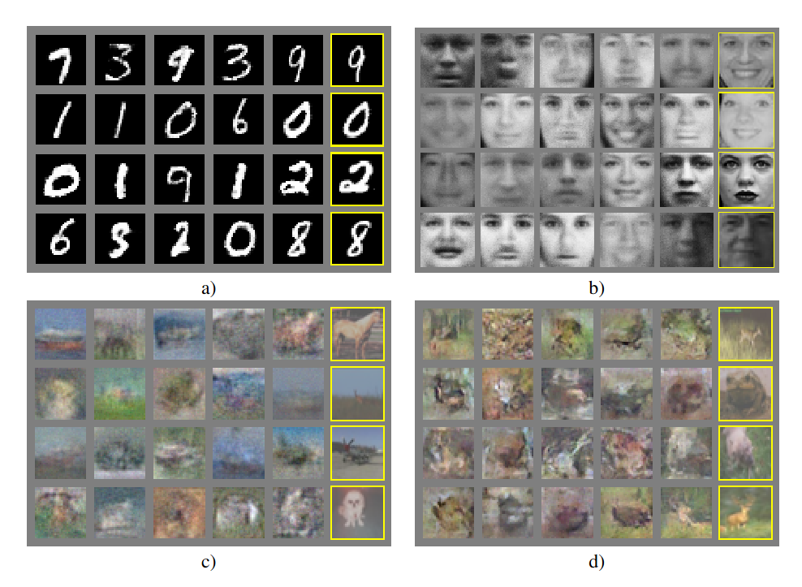

> Core Idea

<strong>"Adversarial Training with Discriminator and Generator"</strong>
 
(Min-Max Game)

***

### <strong>Intro</strong>

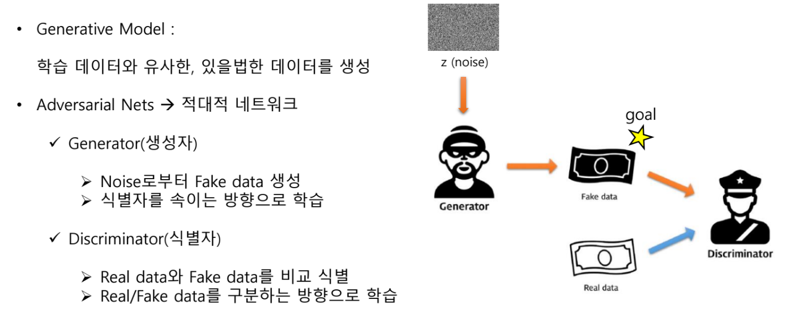

***

### <strong>Related Work</strong>

***

### <strong>Method</strong>

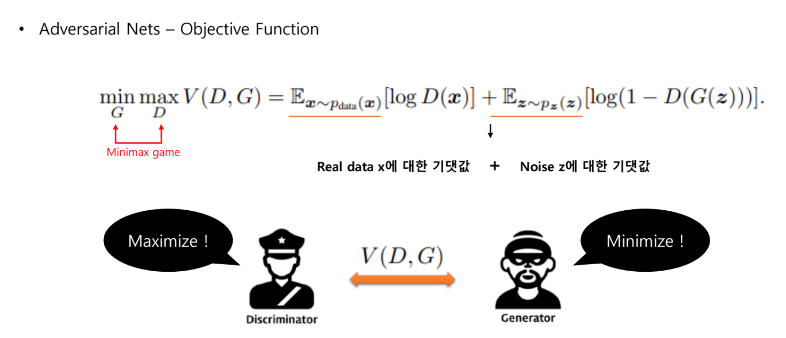

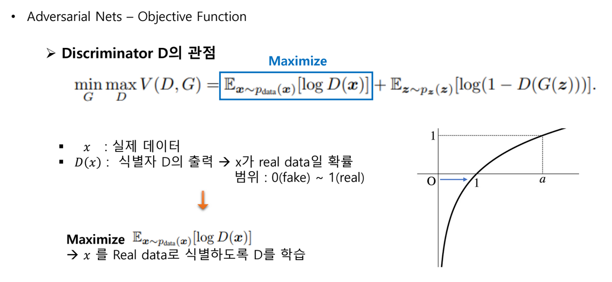

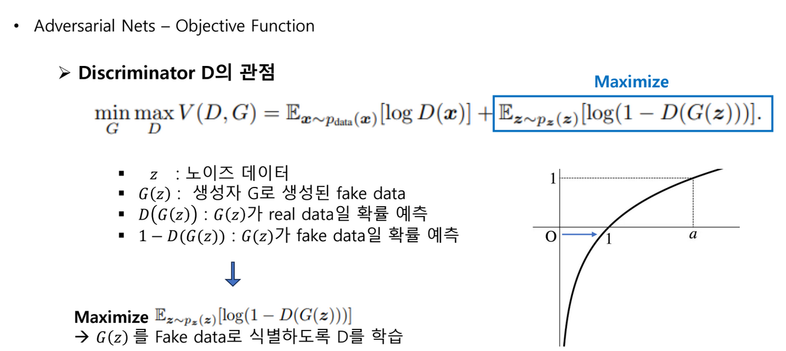

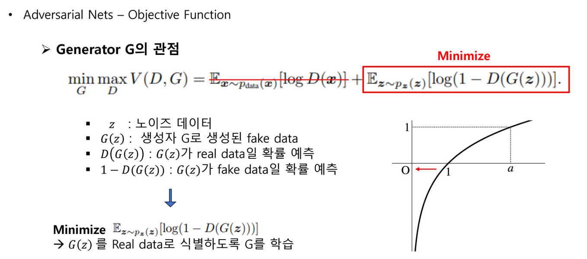

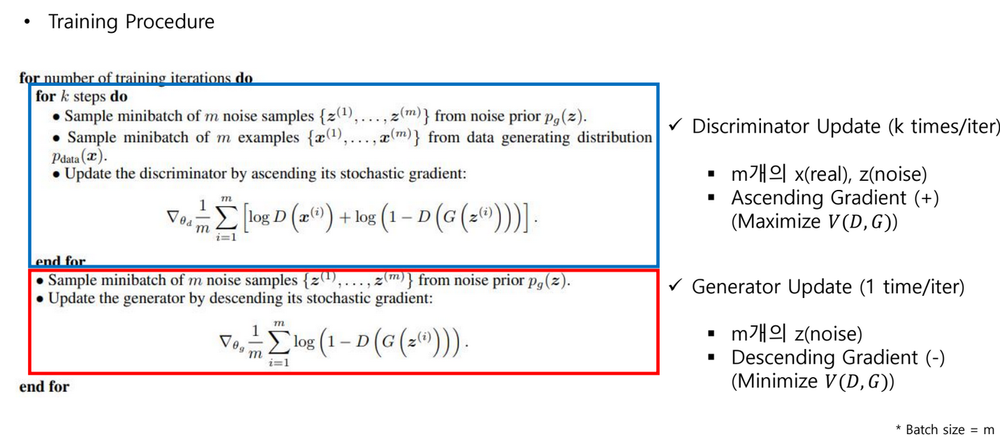

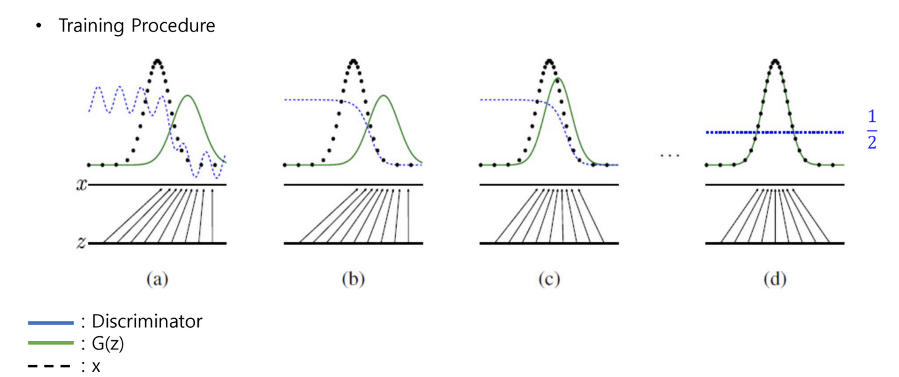

- **Optimal 한 상황을 가정하면, Discriminator 와 Generator 는 각각 어떤 값에 수렴하는가에 대한 증명**

- Discriminator 에 대해서 먼저 보면, loss fucntion 에서 $x$ 에 대한 적분으로 묶어서 하나의 term 으로 볼 수 있다. 
- 이때, Discriminator 를 $y$ 로 치환하고 $y$ 에 대해서 미분 = $0$ 으로 계산하면, 다음의 수식을 만족할 때 최적의 $D^*$ 인 것을 알 수 있다.

$$ D_{G}^*(x) = \frac{p_{data}(x)}{p_{data}(x)+p_{g}(x)} $$

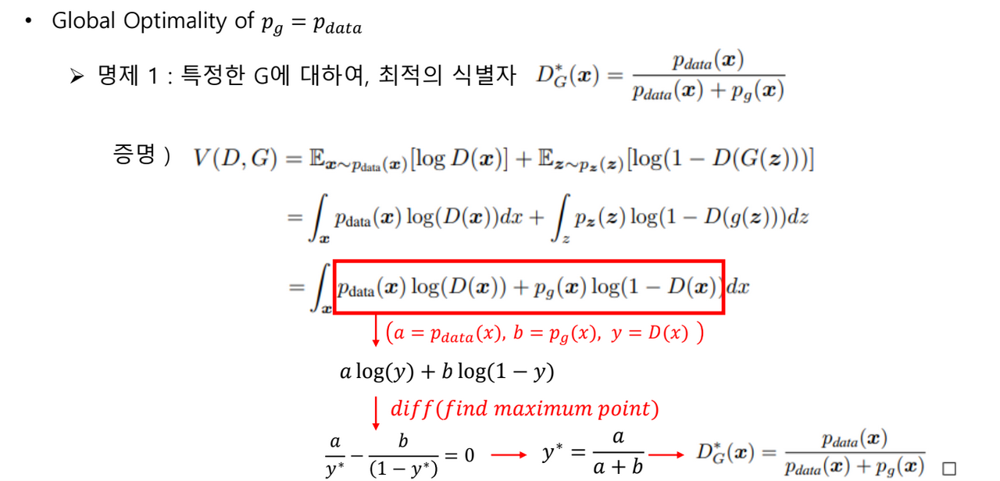

- $D^*$ 로 고정하고, Generator $G$ 에 대해서 loss fucntion 을 보면, 다음의 수식을 minimize 하는 것이 목적이 되고, $p_{data}(x)=p_{g}(x)$ 일 때, optimal $G^*$ 인 것을 알 수 있다.

$$ G^*: \ p_{data}(x)=p_{g}(x) $$

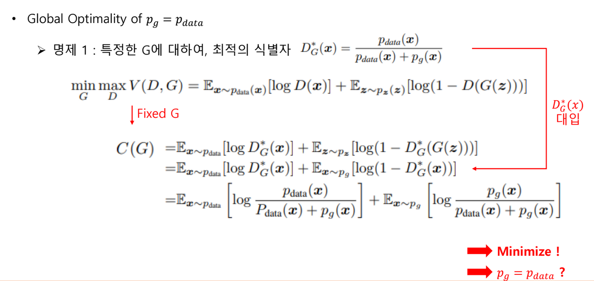

- 따라서, $G^*, \ D^*$ 일 때의 loss value 를 보면, $-\log{4}$ 일 때가 최솟값이다.

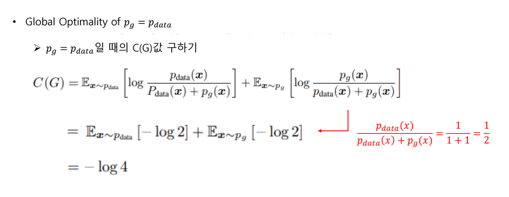

- 다음은 실제로 $-\log{4}$ 일 때가 최솟값인지 증명하는 수식이다.

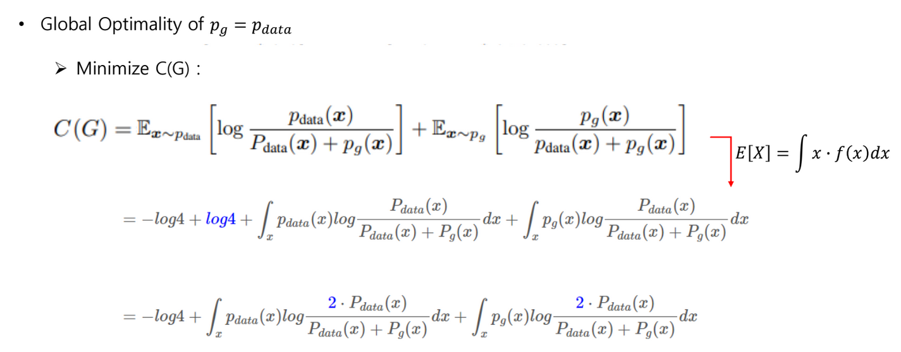

- $JSD$ 가 항상 $0$ 보다 큰 값을 가지니, $-\log{4}$ 일 때가 최솟값이라는 것을 알 수 있다. 

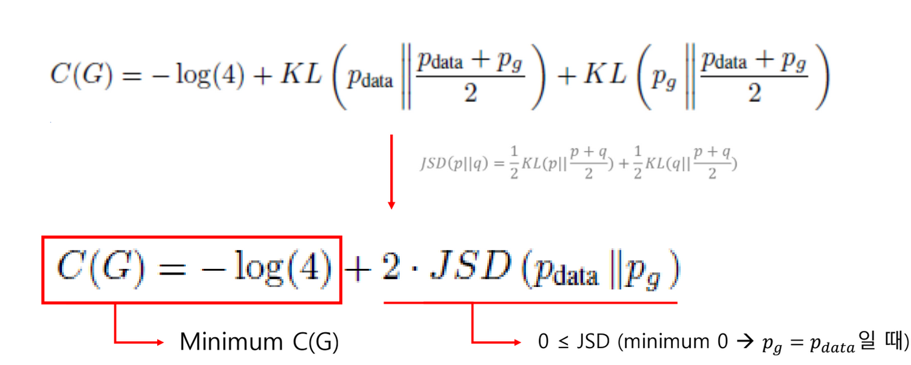

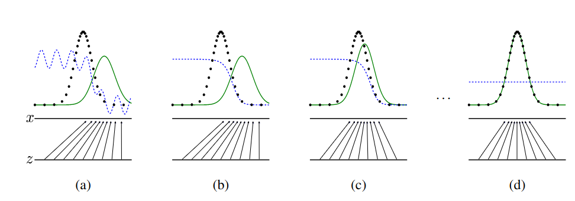

***

### <strong>Experiment</strong>

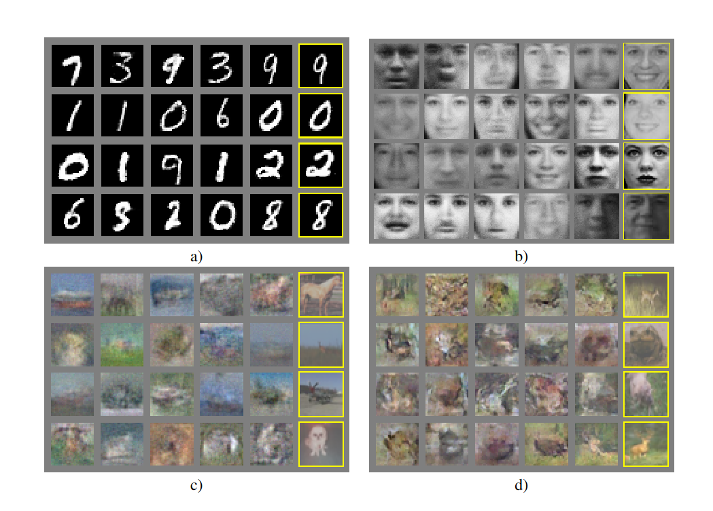

***

### <strong>Conclusion</strong>

***

### <strong>Question</strong>

