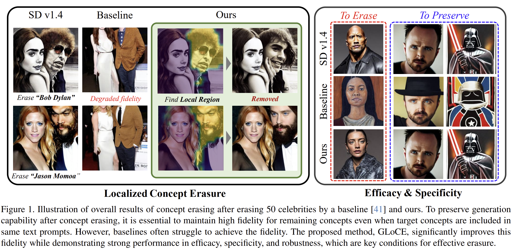
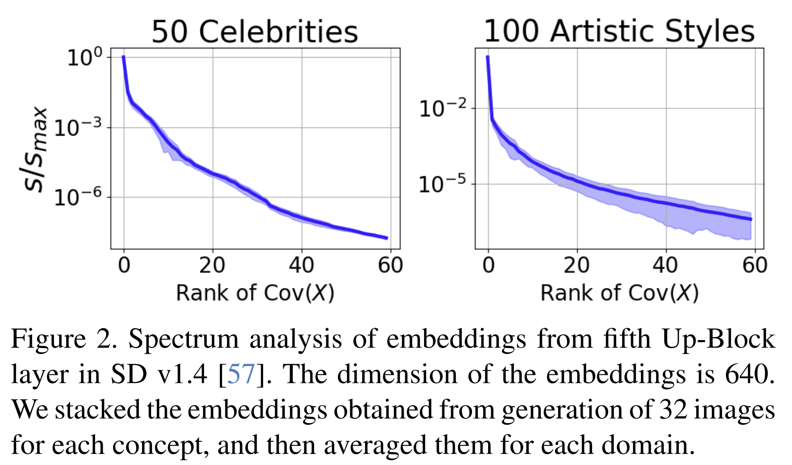

## GLoCE: Localized Concept Erasure for Text-to-Image Diffusion Models Using Training-Free Gated Low-Rank Adaptation
*CVPR(2025), 10 citation, Seoul National University, Review Data: 2026.02.19*

[Intro](#intro) 
[Related Work](#related-work) 
[Method](#method) 
[Experiment](#experiment) 
[Conclusion](#conclusion) 

> Core Idea

<strong>"test1"</strong> 

***

### <strong>Intro</strong>

- 대규모 텍스트-이미지(Text-to-Image, T2I) 확산 모델은 주어진 텍스트 프롬프트를 충실히 반영하는 정교한 이미지를 생성하는 데 있어 큰 성공을 거두었다. 그러나 이러한 성과에도 불구하고, 모델이 저작권이 있는 이미지, 공격적이거나 노골적인 콘텐츠 등 이른바 NSFW(Not Safe For Work) 이미지를 생성할 수 있다는 심각한 위험도 함께 제기되었다.

- 이러한 위험을 완화하기 위해, 기존 연구들은 악성 개념(malicious concepts)을 제거하기 위한 다양한 접근법을 제안해왔다. 예를 들어
    - 데이터셋을 사전에 정제하는 방법(dataset curation),
    - 생성 이후 결과를 필터링하는 방법(post-generation filtering),
    - 추론 과정에서 특정 생성을 유도하거나 억제하는 방법(guided inference) 등이 있다.

- 하지만 이러한 방법들은 막대한 계산 자원을 요구하거나, 새로운 편향(bias)을 유발할 수 있으며, 필터나 가이드를 우회하여 무력화될 가능성이 있다는 한계를 가진다.

- 이러한 취약점을 극복하기 위해, 최근에는 미세조정(fine-tuning) 기반 접근법이 다른 개념을 보존하면서 특정 개념만 제거하는 데 유망한 성과를 보이고 있다.

- Fine-tuning based concept erasing은 text-to-image diffusion model에서 특정 개념을 제거하면서도 나머지 개념은 유지하여, 유해 콘텐츠 생성을 방지하는 데 유망한 성과를 보였다. 

- 확산 모델이 개념 제거 이후에도 생성 능력을 유지하려면, 이미지 내에서 해당 개념이 국소적으로(local) 나타날 때 그 개념이 포함된 영역만 제거하고 다른 영역은 그대로 두는 것이 필요하다.

- 그러나 기존 연구들은 특정 위치에 나타난 목표 개념을 제거하기 위해 이미지의 다른 영역의 충실도(fidelity)까지 손상시키는 경우가 많았고, 그 결과 전체 이미지 생성 성능이 저하되는 문제가 있었다.

- 이러한 한계를 해결하기 위해, 우리는 Localized Concept Erasure라는 프레임워크를 처음으로 제안한다. 이 프레임워크는 이미지에서 목표 개념이 포함된 특정 영역만 선택적으로 삭제하고 나머지 영역은 보존할 수 있도록 한다.

- 이를 구현하기 위한 방법으로, 우리는 학습이 필요 없는(training-free) 접근법인
GLoCE (Gated Low-rank adaptation for Concept Erasure) 를 제안한다.
이 방법은 확산 모델 내부에 경량(lightweight) 모듈을 삽입하는 방식이다.

- GLoCE는 저랭크(low-rank) 행렬들과 간단한 게이트(gate)로 구성되며, 별도의 학습 없이 몇 번의 생성 단계만으로 개념을 결정한다.

- 또한 GLoCE를 이미지 임베딩에 직접 적용하고, 게이트가 목표 개념에서만 활성화되도록 설계함으로써, 하나의 이미지 안에 목표 개념과 다른 개념이 함께 존재하더라도 목표 개념이 포함된 영역만 선택적으로 제거할 수 있다.

- GLoCE는 소수의 이미지 생성만으로 파라미터를 결정하기 때문에, 그림과 같이 하나의 이미지 안에 목표 개념과 관련된 다른 개념들이 함께 존재하더라도 목표 개념만을 효율적으로 탐지하고 제거할 수 있다.
    - 광범위한 실험을 통해, GLoCE는 텍스트 프롬프트에 대한 이미지의 충실도를 유지하면서 나머지 개념이 포함된 영역의 품질 저하를 최소화했을 뿐 아니라, 효율성(efficacy), 특이성(specificity), 견고성(robustness) 측면에서 기존 방법들을 능가하는 성능을 보였다.

***

### <strong>Related Work</strong>

- Safe T2I image generation 
    - 최근 몇 년 동안 대규모 모델이 부적절한 콘텐츠를 생성할 수 있다는 위험성이 광범위하게 연구되었으며, 이러한 우려는 Stable Diffusion(SD)과 같은 텍스트-이미지(T2I) 확산 모델에도 동일하게 적용된다.
    - 안전한 이미지 생성을 위한 한 가지 전략은 데이터 검열(data censoring)이다. LAION-400M, LAION-5B와 같은 대규모 데이터셋에는 바람직하지 않은 콘텐츠가 포함되어 있는 것으로 알려져 있기 때문이다.
    - 그러나 검열된 데이터셋으로 모델을 재학습(retraining)하는 방식은 계산 자원이 많이 들고 시간이 오래 걸리며, 예상치 못한 편향을 유발하거나 원치 않는 콘텐츠를 완전히 제거하지 못할 가능성이 있다.
    - 또 다른 접근법은 생성 이후 결과를 걸러내는 사후 필터링(post-generation filtering) 이나, Safe Latent Diffusion과 같이 사전 학습된 모델이 유해 개념에 대해 가진 지식을 활용하여 생성 과정을 안전한 방향으로 유도하는 추론 가이드(inference-guided) 방식이다.
    - 하지만 이러한 방법들은 안전장치를 비활성화하는 것만으로 쉽게 우회될 수 있다는 한계를 가진다.

- Fine-tuning-based concept erasing
    - 이러한 한계를 해결하기 위해, 최근 연구들은 모델 출력에서 특정 개념을 제거하기 위한 미세조정 기법을 탐구해왔다.
        - Forget-Me-Not: cross-attention 층을 재지향 (redirecting)하여 개념을 제거
        - AblCon: 목표 개념을 지정된 매핑 개념으로 대체하도록 재학습
        - ESD: 목표 개념의 분포를 다른 개념 또는 “null” 문자열과 정렬
        - TIME: cross-attention 내부 key/value의 선형 사영을 조정
    - 개념 제거의 핵심 목표는 목표 개념을 제거하는 것이지만, 동시에 나머지 개념을 보존하는 것 역시 매우 중요하다. 이를 위해 다음과 같은 연구들의 제안되었다. 
        - SA: continual learning에서 영감을 받은 정규화 손실을 도입하여 다른 개념의 망각(forgetting) 완화
        - UCE: 나머지 개념 보존을 위한 효율적인 closed-form 해 제시
        - SPM: PEFT(Parameter-Efficient Fine-Tuning) 기법을 활용해 멀리 떨어진 개념의 망각 방지
        - MACE: LoRA를 활용하여 다수 개념 제거를 동시에 수행하면서 유사 개념 유지
        - CPE: fine-tuning 과정에 비선형성을 도입하면 남은 개념의 특이성(specificity)이 향상됨을 입증
        - 한편, 최근의 red-teaming 도구들은 이러한 개념 제거 방식이 적대적 공격(adversarial attack) 에 취약할 수 있음을 보여주었다. 즉, 미세조정된 모델에서도 제거된 개념이 다시 생성될 수 있다는 것이다.
        - 이를 해결하기 위해 RECE, Receler, AdvUnlearn, CPE 등은 개념 제거 학습과 적대적 방어 학습을 번갈아 수행하여 강건성(robustness)을 강화하였다.

- Parameter-Efficient Fine-Tuning (PEFT)
    - 최근 개념 제거를 위한 미세조정 전략들은 확산 모델의 특정 층에 LoRA(Low-Rank Adaptation) 를 적용하는 방식(예: MACE, SPM)을 활용하고 있다.
    - 자연어처리 (NLP) 분야에서는 다음과 같은 경량 미세조정 기법들이 사용된다. 
        - Prompt Tuning: 고정된 텍스트 토큰에 소수의 학습 가능한 연속 프롬프트를 추가 → 비전-언어 모델에서도 강력한 성능을 보임
        - Task Residual Learning: 학습 가능한 임베딩 시퀀스를 추가하여 원래 텍스트 임베딩에 더함
        - Adapter 기반 방법: 경량 어댑터를 삽입하여 잔차(residual) 값을 생성하고 기존 임베딩과 적응적으로 결합
        - 이러한 접근법들은 과적합 없이 새로운 작업을 효과적으로 학습할 수 있도록 해준다.

***

### <strong>Method</strong>

- 목표 개념의 임베딩을 해당 개념의 부분공간(subspace)에 사영(project)하여 주요 성분(principal components)을 제거하고,

- 그 축소된 임베딩을 의미적으로 멀지만 관련된 다른 개념의 저랭크 임베딩 공간으로 매핑하여 개념이 완전히 제거되도록 한다.

- 또한 목표 개념의 이미지 임베딩에서만 제거가 일어나도록, 목표 개념의 임베딩을 구별적으로 포착할 수 있는 저랭크 공간의 기저(basis)를 찾아 단순한 게이트 구조를 설계하였다.

$\textbf{Localized Concept Erasure}$

- 텍스트 프롬프트에 목표 개념(target concept)과 나머지 개념(remaining concepts)이 함께 포함되어 있고, 목표 개념이 이미지의 국소적인 영역(local region) 에 나타나는 경우에도 나머지 개념의 이미지 충실도(fidelity)를 유지하기 위한 프레임워크를 제안한다.

- 먼저, 기존 연구들에서 탐구된 효과적인 개념 제거의 기준을 정리하면 다음과 같다
    - Efficacy (효율성): 생성된 이미지에서 목표 개념을 완전히 제거할 수 있는 능력
    - Specificity (특이성): 나머지 개념을 보존하여, 그 특징이 사전학습(pre-trained) 모델과 가깝게 유지되도록 하는 것
    - Robustness (견고성): 표현을 바꾸거나 공격적인 프롬프트(rephrased/attack prompts)가 입력되더라도 모델이 쉽게 무너지지 않는 성질

- Specificity와 관련하여, 기존 연구들은 주로 목표 개념이 포함되지 않은 프롬프트에서 나머지 개념의 생성 성능을 평가해왔다.
- 그러나 실제로는 하나의 프롬프트 안에 목표 개념과 나머지 개념이 동시에 존재할 때에도 나머지 개념의 특징이 완전히 유지되도록 보장하는 것이 중요하다. 그래야 원치 않는 생성 결과를 방지할 수 있다.

- 특히 목표 개념이 이미지의 특정 국소 영역에만 나타나는 경우에는, 그 영역만 수정하고 나머지 부분은 그대로 유지해야 나머지 개념의 이미지 충실도를 높일 수 있다.

- 이를 위해 우리는 Localized Concept Erasure를 도입한다. 이 방법은 이미지의 제한된 영역에 존재하는 목표 개념만 제거하면서, 다른 영역의 무결성을 유지하고 입력 프롬프트에 대한 전체적인 충실도를 보존하는 데 초점을 둔다.

- 이를 구현하기 위해, 우리는 GLoCE (Gated Low-Rank Adaptation for Concept Erasing) 라는 방법을 제안한다. 이 방법은 추론 단계(inference-only adaptation)에서 결정되는 소수의 파라미터만을 모델에 주입하는 방식이다.

- 효과적인 개념 제거를 위해 우리는 주로 LEACE라는 방법에서 영감을 얻었다.
LEACE는 모델의 각 층 출력에 새로운 선형 사영(linear projection)을 삽입하여 목표 개념을 제거하는 일반적인 언러닝(unlearning) 접근법이다.

- LEACE는 guardedness 개념을 활용하여, 선형 사영을 통해 개념 정보를 제거하는 linear guardedness를 정의한다.

- 구체적으로, 이미지 생성의 특정 시점에서 한 층의 임베딩을 $X = [X_1, ..., X_T] \in \mathbb{R}^{D\times T}$
    - $D$: embedding dimension
    - $T$: token 수
    - $X_t$: image token 
    - 그리고 $Z$를 $X$와 대응되는 개념 정보 (concept-related information)라고 두자 
    - 선형 변환을 다음과 같이 정의한다. $P \in \mathbb{R}^{D\times D}, b\in \mathbb{R}^{D}$
    - $\tau(X; P,b) = PX+b$
    - 즉, 선형변환을 한 결과가 개념 정보를 제거한 상태지만 원래 임베딩을 최대한 유지하게끔 linear guardedness $P$와 $b$를 구한다.  

***

### <strong>Experiment</strong>

***

### <strong>Conclusion</strong>

***

### <strong>Question</strong>

<a href="">link</a>

> 인용구
