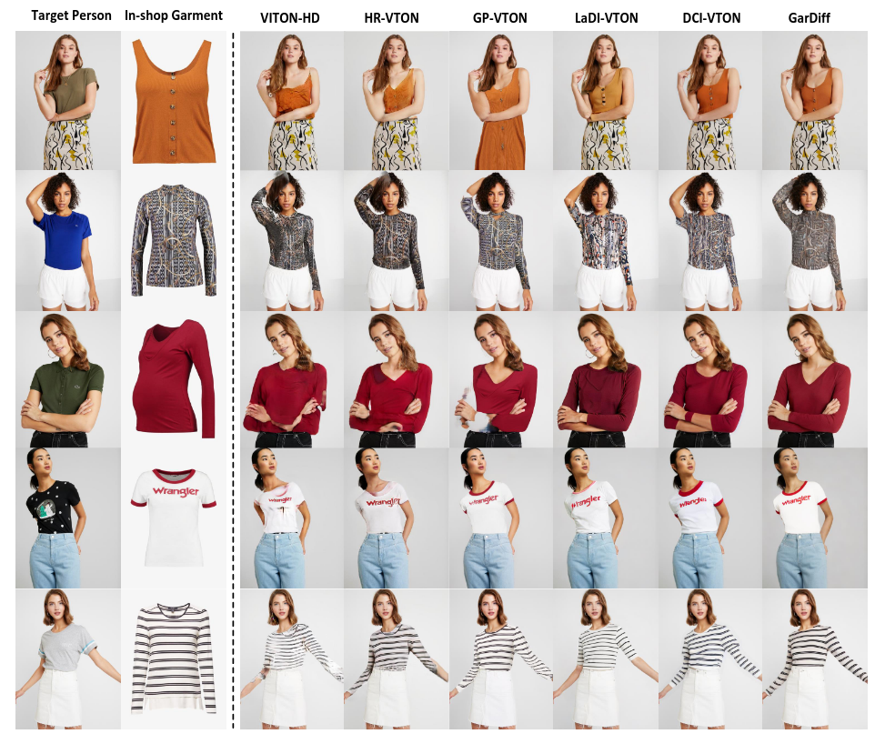
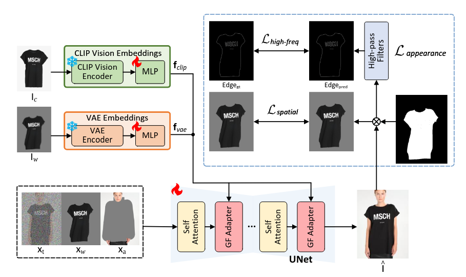
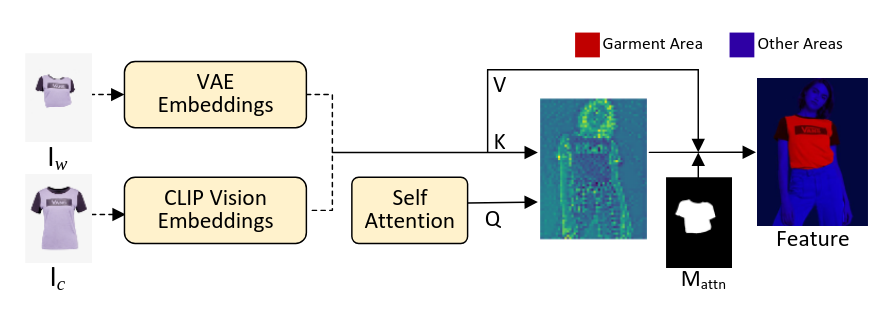
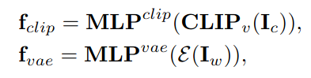
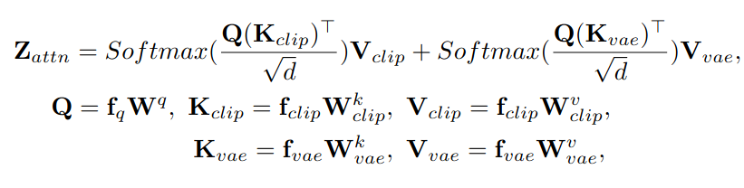
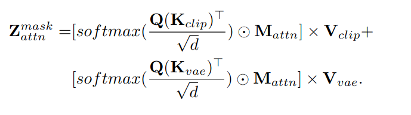
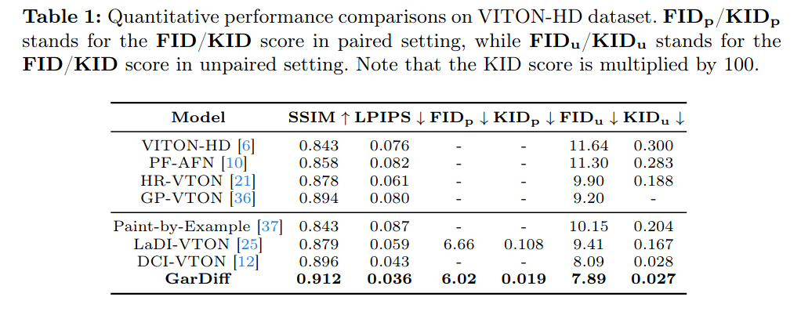
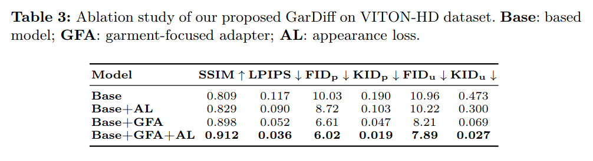

## GarDiff: Improving Virtual Try-On with Garment-focused Diffusion Models
*arXiv(2024), 0 citation, University of Science and Technology of China, Review Data: 2024.10.03*

[Intro](#intro) 
[Related Work](#related-work) 
[Method](#method) 
[Experiment](#experiment) 
[Conclusion](#conclusion) 

> Core Idea

<strong>"1) decoupled cross-attention 2) use DDIM sampler property > apply appearance loss"</strong> 

***

### <strong>Intro</strong>

$\textbf{이 주제의 정의 및 요구사항과 중요한 이유}$

- **이미지 기반 가상 착용(VTON)** 은 컴퓨터 비전 분야에서 두드러진 연구 주제로, 특정 인물이 원하는 매장 의상을 입고 있는 이미지를 합성하는 것을 목표로 합니다. 이러한 자동 생성된 인물 이미지는 실제 착용의 필요성을 피할 수 있으며, 이는 전자상거래와 메타버스의 새로운 창의성 시대를 열어줍니다. 실제 VTON 시스템은 온라인 쇼핑, 패션 카탈로그 제작 등과 같은 현실 세계의 응용 프로그램에 막대한 잠재적 영향을 미칩니다. VTON 작업의 목표는 세 가지입니다: 1) 인체 정렬: 합성된 인물 이미지는 주어진 특정 인물의 인체/포즈에 맞춰야 합니다; 2) 의상 충실도: 합성된 인물 이미지는 매장 의상의 모든 외관과 질감 세부 사항을 보존해야 합니다; 3) 품질: 합성된 인물 이미지는 고품질이어야 하며, 아티팩트가 거의 없어야 합니다.

$\textbf{이 주제의 문제점과 기존의 노력들}$

- VTON 작업을 해결하기 위해, 이전 연구들은 일반적으로 특정 인물의 포즈를 조건으로 매장 의상의 외관을 직접 변형하는 명시적인 왜곡 프로세스에 의존합니다. 그러나 이 방법은 왜곡된 의상과 목표 인물의 몸 사이의 불일치로 인해 종종 왜곡과 아티팩트가 발생하기 쉽습니다. 이러한 불일치 문제를 완화하기 위해, 몇몇 후속 연구들은 왜곡 프로세스를 추가 생성 프로세스로 업그레이드합니다. 이들은 전형적인 생성적 적대 신경망(GAN) 을 활용하여 왜곡된 의상과 인체와 같은 조건을 기반으로 최종 인물 이미지를 합성합니다. 효과적이긴 하지만, 합성된 인물 이미지는 여전히 도전적인 경우에서 만족스럽지 않은 경향이 있습니다. 이는 복잡한 패턴 의상과 가변적인 인간 포즈를 합성하는 기본 생성 모델(GAN)의 제한된 용량 때문일 수 있습니다.
 

$\textbf{최근 노력들과 여전히 남아있는 문제들}$

- 최근에는 확산 모델이 수많은 이미지 합성 작업에서 생성 모델링의 새로운 트렌드로 떠오르며, GAN 기반 솔루션보다 더 나은 확장성과 더 쉽고 안정적인 훈련을 보여줍니다. 이러한 동기에 의해, 최근의 발전은 왜곡된 의상을 확산 프로세스 동안 추가 조건으로 활용하여 사전 훈련된 잠재 확산 모델을 재구성하는 데 전념했습니다. 유망한 결과가 도출되었지만, 이러한 확산 기반 VTON 접근 방식은 여전히 매장 의상의 모든 세부 사항, 특히 복잡한 패턴/텍스트의 고주파 질감 세부 사항을 완전히 보존하지 못합니다. 우리는 이러한 열화된 결과가 복잡한 세부 사항을 기억할 수 없는 압축된 잠재 코드로 인해 잠재 공간에서의 전체적인 확산 과정으로 인해 발생할 수 있다고 추측합니다.

- 확산 모델이 수많은 이미지 합성 작업에서 생성 모델링의 혁신을 가져왔지만, VITON에 적용하는 것은 간단하지 않다. 
- 이는 확산 과정이 목표 인물의 전반적으로 높은 충실도의 사진처럼 사실적인 이미지를 생성해야 할 뿐만 아니라 주어진 의상의 모든 외관과 질감 세부 사항을 지역적으로 보존해야 한다는 점에서 어려움이 발생한다.

$\textbf{본 논문에서 해결하고자 하는 문제와 어떻게 해결하는지, 그 결과들}$

- 의상 중심의 확산 프로세스를 유도하는 GarDiff를 제안한다. 
  - 주어진 의상에서 파생된 기본 시각적 외관 (i.e., clothing)과 세부 질감 (i.e., 고주파 세부 정보)의 강화된 지도를 통해 작동한다. 
  - 먼저, reference 의상의 CLIP 및 VAE encoder에서 파생된 추가 외관 우선 순위를 사용하여 사전 훈련된 잠재 확산 모델을 재형성합니다.
  - 한편, 우리는 확산 모델의 UNet에 의상 중심의 새로운 어댑터를 통합하여 참고 의상의 시각적 외관과 인간 포즈와의 지역적 세밀한 정렬을 추구합니다. 우리는 합성된 의상에 대해 중요한 고주파 세부 정보를 강화하기 위해 외관 손실을 구체적으로 설계합니다.

***

### <strong>Related Work</strong>

- GAN 기반 가상 착용. VTON 작업을 해결하기 위해, 이전 연구들은 GAN을 활용하여 왜곡된 의상과 인체와 같은 조건을 바탕으로 최종 인물 이미지를 합성합니다. 
  - VITON은 TPS를 통해 생성된 왜곡된 의상을 목표 인물과 합성하기 위해 정제 네트워크를 사용하는 선구적인 연구입니다. 
  - CP-VTON은 목표 인물과 의상 간의 더 강력한 정렬을 달성하기 위해 업그레이드된 학습 가능한 TPS 변환을 도입합니다. 
  - VITON-HD는 다중 스케일 정제를 통해 의상 질감으로 불일치한 영역을 채우기 위한 정렬 인식 세그먼트 생성기를 설계했습니다. 
  - HR-VTON은 변형과 세분화 생성을 통합하여 불일치 및 가림 문제를 처리하기 위한 새로운 착용 조건 생성기를 제안합니다. 
  - GP-VTON은 새로운 DGT 훈련 전략으로 최적화된 변형 의상을 생성하기 위한 고급 LFGP 왜곡 모듈을 제시합니다.

- 확산 기반 가상 착용. 최근 확산 모델은 GAN 기반 모델에 비해 높은 충실도의 사실적인 이미지를 생성하는 뛰어난 능력 덕분에 자연 이미지 생성에서 지배적인 위치를 차지하기 시작했습니다. 이러한 영감을 받아, 일련의 확산 기반 가상 착용 모델들이 등장하기 시작했습니다. 
  - TryOnDiffusion은 의상 세부 사항을 보존하고 의상을 단일 네트워크에서 변형하기 위해 두 개의 UNet을 통합합니다. 
  - LaDI-VTON은 참고 의상의 시각적 특징을 CLIP 토큰 임베딩 공간으로 매핑하는 텍스트 역전 컴포넌트를 도입하여 확산 모델의 조건으로 사용합니다. 
  - DCI-VTON은 변형 네트워크를 활용하여 참고 의상을 변형하고, 이를 확산 모델에 추가적인 안내로 제공합니다. 
  - 유망한 결과가 도출되었지만, 이러한 확산 기반 VTON 접근 방식은 여전히 참고 의상의 모든 세부 사항을 완전히 보존하지 못하고 있습니다.

***

### <strong>Method</strong>

- 주어진 의상의 appearance detail을 유지하기 위해 이전의 work에서는 CLIP vision encoder를 사용했다. 
  - 하지만, CLIP은 coarse-level에서 image-text alignment에 대해 최적화되어있기에 fine-grained detail을 인지하기 어렵다. 
  - 본 논문에서는 실험에서, CLIP보다 VAE가 texture deatil을 보존하는데 더 강한 능력을 가지고 있음을 발견했다. 
  - 따라서, 추가적인 appearance prior로써 VAE를 포함시키는 게 더 이득이다.  

- 구체적으로, $2$개의 appearance prior를 입력으로 받게끔 cross-attention layer를 vision adapter로 교체했다. 
  - 생성된 이미지의 복잡한 패턴을 복구하기 위한 warped clothing $I_w$의 VAE embedding 
  - 전체 구조를 생성하기 위한 clothing의 CLIP visual embedding
  - 두 임베딩이 목표 의상의 서로 다른 세분화 수준에 초점을 맞추고 있음을 고려했다. 

- 최종적으로는 학습 과정에서 attention score가 관심 없는 영역인 배경에 할당되지 않게 조정한다. 

***

### <strong>Experiment</strong>

***

### <strong>Conclusion</strong>

- 결국 inference 시에, VAE embedding of warped clothing 이 필요하다는게 단점이다. 
- 학습 과정에서 attention score가 unmasked region에 할당되지 않게 하는 mask는 사실 큰 의미가 없다. 
  - 더 전문적이고 세분화된 loss가 필요
- Appearance Loss에서 $x_t$를 ddim을 활용해 $x_0$를 근사해서 original space상에서 손실 함수를 적용시킨다. 논문에 적을 수 있는 실제 적용 사례를 발견했다. 

***

### <strong>Question</strong>

