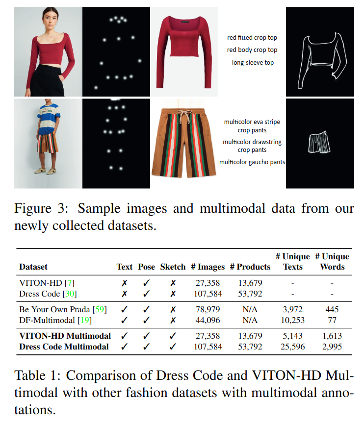

## Multimodal Garment-Designer: Human-Centric Latent Diffusion Models for Fashion Image Editing
*ICCV(2023), 8 citation*

[Intro](#intro) 
[Related Work](#related-work) 
[Method](#method) 
[Experiment](#experiment) 
[Conclusion](#conclusion) 

> Core Idea

<strong>"Garment-Design with Multimodal (text, pose map, sketch, etc.)"</strong> 

***

### <strong>Intro</strong>

- Garment: 의복
- Fashion illustration 에서의 fashion design process 를 개선하고자 한다. 이전 연구들이 주로 의류 가상 시착에 중점을 두었다면, 본 논문에서는 텍스트, human body poses 그리고 의류 스케치와 같은 다중 모달 prompt 를 따르는 방식으로 인간 중심의 패션 이미지 생성을 제안한다. 
- Task 에 적합한 기존 데이터셋이 부족하기 때문에 Dress Code 와 VITON-HD 라는 기존의 패션 데이터셋에 다중 모달 주석을 반자동적으로 수집하여 확장했다. 
- Computer vision 연구는 항상 인간과 관련된 패션 문제에 주목했다. 특히 의류 아이템의 인식 및 검색, 유사한 의류 추천, 의류 및 액세서리의 가상 시착에 집중했다. 
- 내가 이미지를 직접 주진 않는다. Text driven 임

***

### <strong>Related Work</strong>
1. Text-Guided Image Generation.
GAN $\rightarrow$ Diffuison-based models

2. Multimodal Image Generation with Diffusion Models.
   1. Stroke-based input
   2. ControlNet

본 논문은 fashion domain 에 중점을 두고 modality 를 조건으로 직접적으로 활용하는 인간 중심의 모델 구조이다. 

***

### <strong>Method</strong>

- Model Image $I \in R^{H \times W \times 3}$
- Pose Map $P \in R^{H \times W \times 18}$
  - 각 channel 은 human keypoint 를 나타낸다.
- Textual Description $Y$
- Sketch $S \in R^{H \times W \times 1}$
- New Image generated by Diffusion models $\tilde{I} \in R^{H \times W \times 3}$
- 본 논문에서 제안한 새로운 latent diffuison approach 를 Multimodal Garment Designer (MGD) 라고 부른다. 
- Encoder 가 image $I$ 를 압축해서 latent space 상의 vector 로 변환한다. $\in R^{h \times w \times 4}$
  - Width 와 Height 는 $\frac{1}{8}$ 로 압축
- Condition 은 time step $t$ 와 text embedding $T_E(Y)$ 이다. (Attention conditioning)
- Latent image & encoded masked image (원본 이미지에 masking 을 한 이미지를 encoder 에 태운 latent image) & resized binary inpainting mask $m$ (mask 이미지를 resize 한 이미지) & Pose Map & Sketch  (Spatial structure)
  - Inpainting 은 일반적으로 마스킹된 영역의 contents 를 제거하거나 완전히 대체하는 목적으로 수행된다. 그러나 본 논문에서는 모델이 입은 의류에 관한 모든 정보를 제거하면서 모델의 신체 정보와 정체성을 보존해야 한다. 따라서 mask 의 bounding box 와 신체 키포인트를 나타내는 pose map 정보를 이용하여 의류 inpainting process 를 개선한다. 

- Mask Composition: model identity 를 보존하기 위해서, diffusion model 의 output 을 decoder 에 태운 output image 와 원본 이미지의 모델의 얼굴을 교체

- Dataset 확장

***

### <strong>Experiment</strong>

- Text 를 condition 으로 받는 SDEdit 과 Stable Diffusion Inpainting 과 비교 
- Evaluation metric
  - FID, KID, CLIP
  - Pose Distance
  - Sketch Distance

***

### <strong>Conclusion</strong>

- Contribution
  - 1. Multimodal data 를 사용하여 multimodal-conditioned fashion image edting 을 제안한다.
  - 2. Latent diffusion model 에 기반하여 새로운 사람 중심의 생성 구조를 제안했다.
  - 3. 존재하는 두 가지 데이터 셋을 text 와 의복 스케치와 함께 확장했다. 

***

### <strong>Question</strong>

