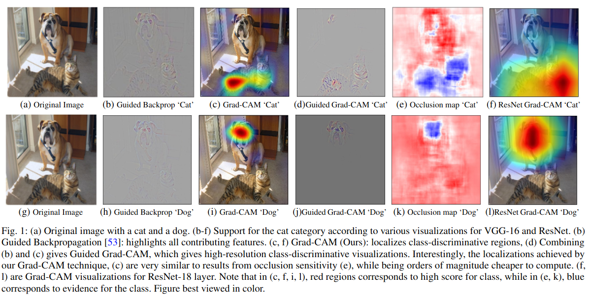
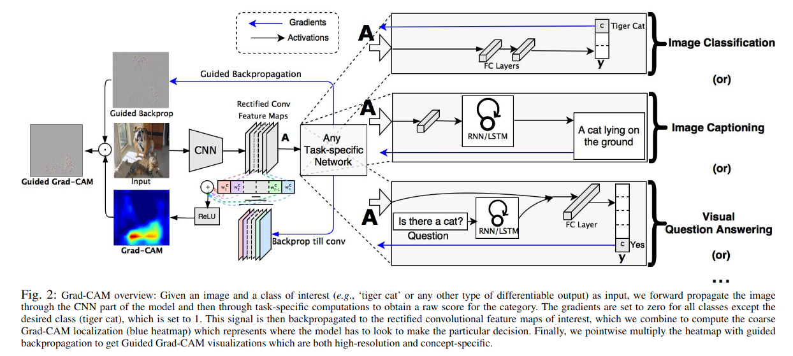
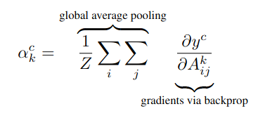
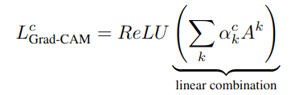
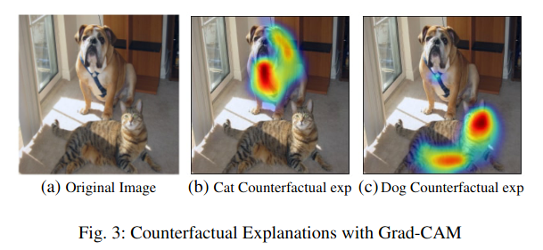

## Grad-CAM: Visual Explanations from Deep Networks via Gradient-based Localization
*ICCV(2017), 19262 citation*

[Intro](#intro) 
[Related Work](#related-work) 
[Method](#method) 
[Experiment](#experiment) 
[Conclusion](#conclusion) 

> Core Idea

<strong>"Visualize Attention Map via Gradients Equal to Importance of Channel like Weights"</strong> 

***

### <strong>Intro</strong>

***

### <strong>Related Work</strong>

***

### <strong>Method</strong>

- CAM 과 달리, GAP (Global Average Pooling) 에 구애받지 않고 사용할 수 있다. 즉, 모델 구조가 제한적이지 않음 

- 일반적으로 모델이 예측한 class 값을 마지막 feature map 에 대해 편미분을 진행한다. 
  - 특정 channel 의 activation value 가 바뀜에 따라 class $y^c$ 의 값이 많이 흔들린다는 얘기는, class $y^c$ 를 결정할 때 해당 channel 이 중요하다는 것과 동일하다. 
  - 즉, CAM 에서의 weight 와 동일한 역할을 제공한다. 

- Class $y^c$ prediction 할 때의 feature (channel) map 에다가, 각 channel 의 중요도와 동일한 의미를 가진 gradient 값들을 곱해줌으로써 중요도를 반영한 class activation map 을 만들 수 있다. 
  - ReLU 를 취해서 음의 값은 무시한다. 

***

### <strong>Experiment</strong>

***

### <strong>Conclusion</strong>

***

### <strong>Question</strong>

