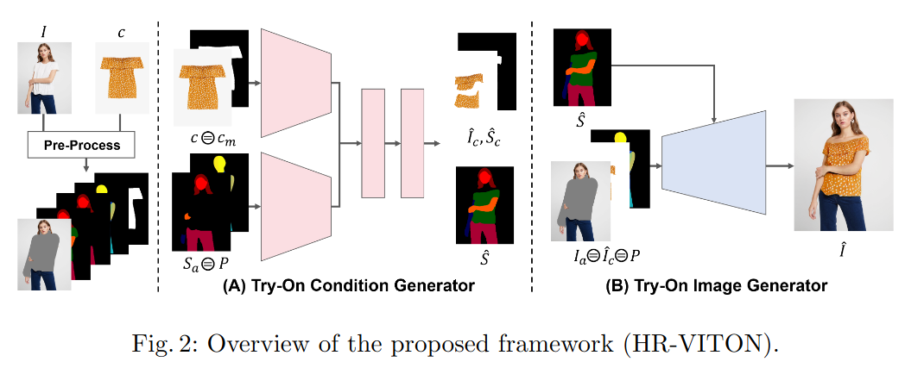
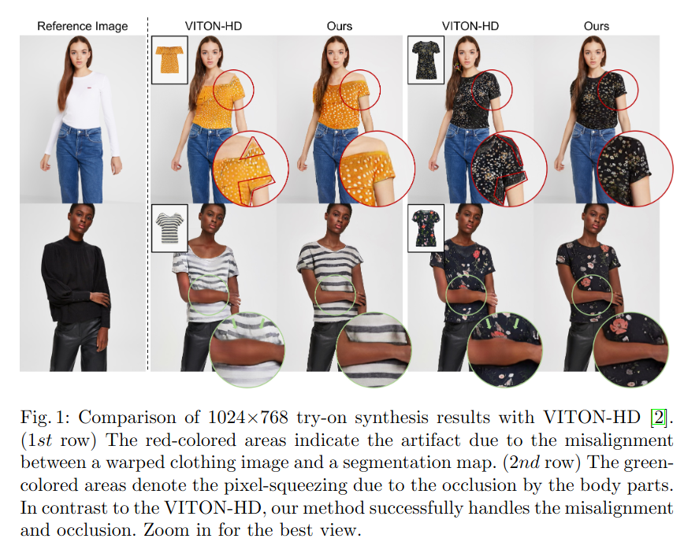
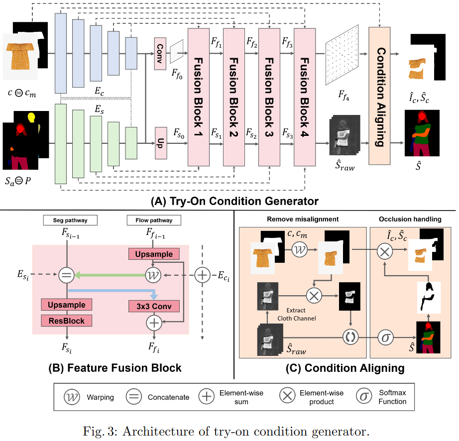
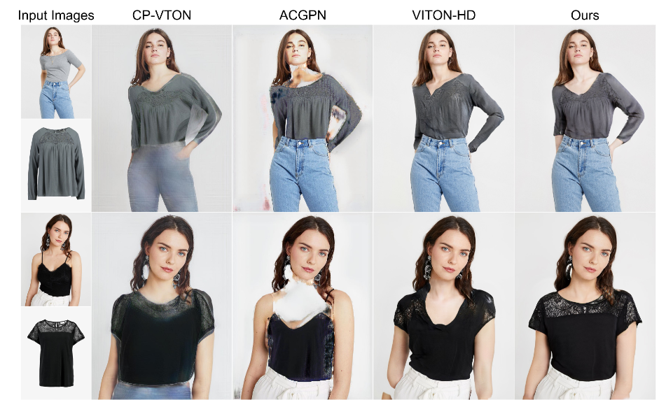
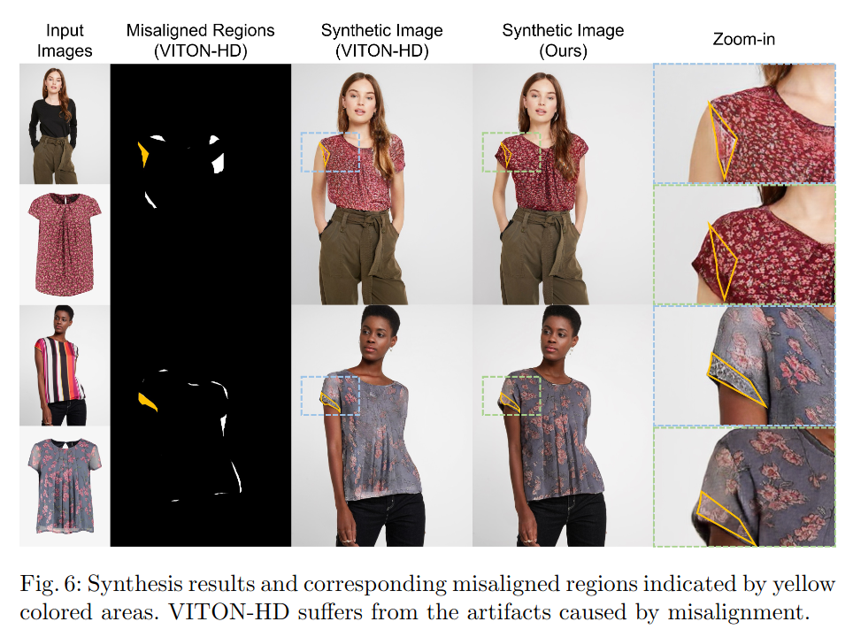
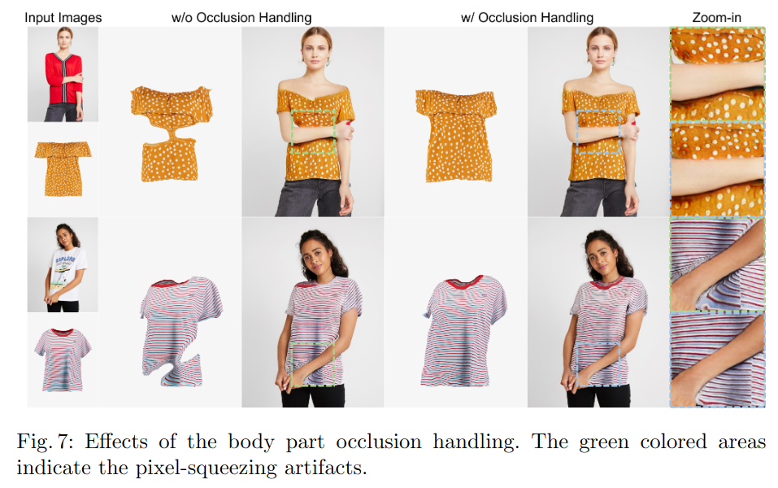
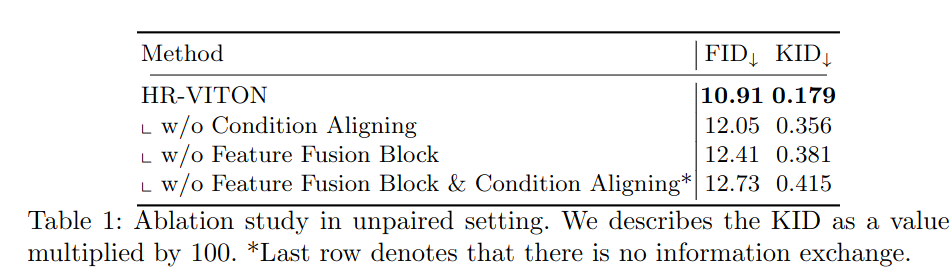
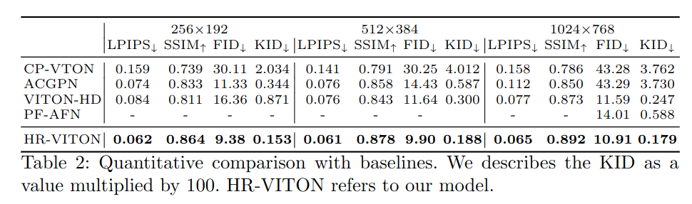

## HR-VITON: High-Resolution Virtual Try-On with Misalighment and Occlusion-Handled Conditions
*ECCV(2022), 46 citation*

[Intro](#intro) 
[Related Work](#related-work) 
[Method](#method) 
[Experiment](#experiment) 
[Conclusion](#conclusion) 

> Core Idea

<strong>"Introduce Feature Fusion Block and Discriminator Rejection to Solve Artifacts for Misalignment and Pixel-Squeeze in High-Resolution Synthesis"</strong> 

***

### <strong>Intro</strong>

- VITON-HD (같은 저자들) 와의 비교를 주로 한다.
  - $1024 \times 768$ synthesis results
  - Artifact in VITON-HD: 
    - First row: misalignment between a warped clothing image and a segmentation map
    - Second row: pixel-squeezing due to the occlusion by the body parts. 즉, 사람의 몸통이 가려져 있어서 이걸 고해상도 영역에서 예측하느라 pixel-squeezing 이 일어난 것이다.
  - 본 논문에선, VITON-HD 와의 비교를 하면서 misalignment & pixel-squeezing 을 다루고자 한다.

***

### <strong>Related Work</strong>

- 해당 연구 이전에는 clothing image 와 person's body 를 align 하는 explicit warping module 을 사용했다. 
- 더욱이, 최종 이미지의 segmentation map 을 예측함으로써 이미지 생성의 어려움을 완화했다.
  - 사람의 layout 을 알려주고 생성할 영역과 보존할 영역을 구분하기 때문이다. 
  - Segmentation map 의 중요성은 이미지 해상도가 커질수록 증가한다. 
  - 따라서, warping 및 segmentation map 의 출력은 최종 생성 결과에 큰 영향을 미친다. 
  - 하지만, warping 및 segmentation map 생성 module 로 이루어진 virtual try-on framework 는 warping cloth 와 segmentation map 사이에 정렬되지 않은 영역, 즉 불일치가 발생한다. 
  - 이러한 불일치는 불일치된 영역에서 artifact 를 초래하며 특히 고해상도에서 최종 결과물의 지각적 (시각적) 품질에 큰 영향을 미친다. 
  - 불일치의 주요 원인은 warping module 과 segmentation map generator 가 정보 교환 없이 별도로 작동하기 때문이다. 
    - 특히, 몸의 일부가 의상을 가릴 때 심각하게 손상된다.
    - 이러한 artifact 는 사람 이미지의 가능한 포즈를 제한하여 실제 환경에 가상 착용을 어렵게 만든다. 

1. Image-based Virtual Try-On
   1. Cloth Deformation: cloting item 을 person's body 에 맞추기 위해, explicit warping module 에 의존한다.
      1. VITON & CP-VTON 은 clothing item 을 변형시키기 위해 *thin plate spline (TPS) transformation* 의 parameter 를 예측한다. 
      2. Warping module 이 TPS transformation 에 기반하기 때문에 freedom 의 제약이 존재한다. 
   2. Segmentation Generation for Try-On Synthesis
      1. 최근의 연구들은 image 를 생성하기 위해 target cloth 를 입고있는 사람의 segmentation map 을 활용했다. 
      2. Segmentation map 은 appearance 와 shape 을 분리하여 모델이 공간적으로 더 일관된 결과를 생성할 수 있도록 한다. 특히, 고해상도 try-on 은 일반적으로 segmentation map generation module 을 포함하고 있는데 이미지 해상도가 커질수록 segmentation map 의 중요성이 커지기 때문이다. 
2. Rejection Sampling
   1. Sample 의 fidelity 를 향상시키기위해, low-quality generator output 을 거부하는 여러 연구들이 있다. 
   2. 본 연구에서는 low-quality output 을 걸러내기 위해 discriminator 를 사용한다. 

***

### <strong>Method</strong>

1. Try-on condition generator
2. Try-on image generator

- Pre-Processing: obtain segmentation map of the person, clothing mask, pose map
  - Off-the-shelf models 

***

### <strong>Experiment</strong>

- Comparison models
  - CP-VTON
  - ACGPN
  - VITON-HD

- Misalignment: vs VITON-HD

 

- Occlusion: pixel-squeezeing

 

- Ablation study

 

- Quantitative results

 

***

### <strong>Conclusion</strong>

- 본 논문에서는 two stage (i.e., warping and segmentation generation stages) 를 통합했다.
  - Warping 과 segmentation generation stage 정보 교환없이 독립적으로 이루어지기 때문에 앞서 말한 artifacts 가 발생했다고 가정. 
  - 새롭게 제안된 feature fusion block 에서 정보 교환을 구현했기에 misalignment/pixel-squeezing 이 발생하지 않는다. 
- 또한, 올바르지않은 segmentation map prediction 을 걸러내는 discriminator rejection 을 제안한다.

***

### <strong>Question</strong>

