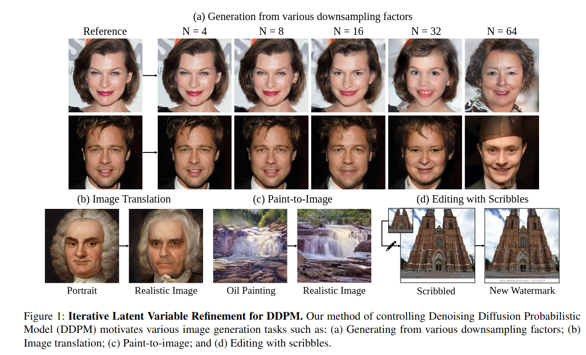
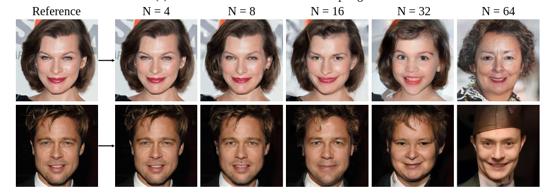
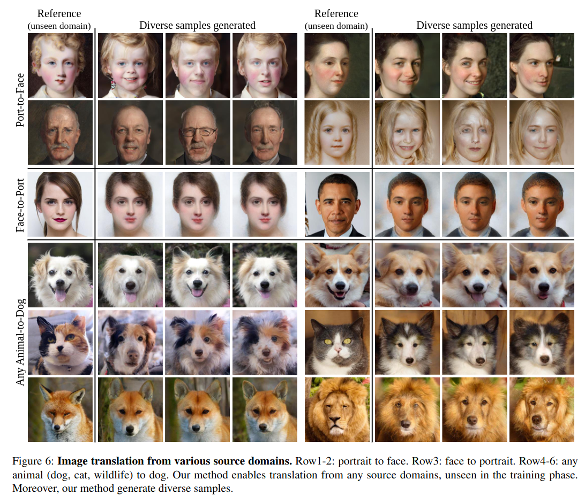
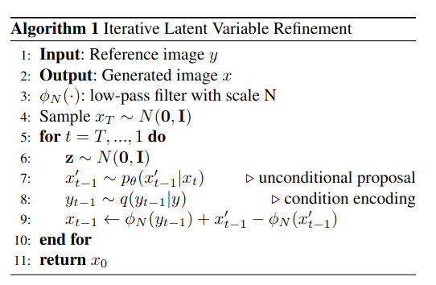
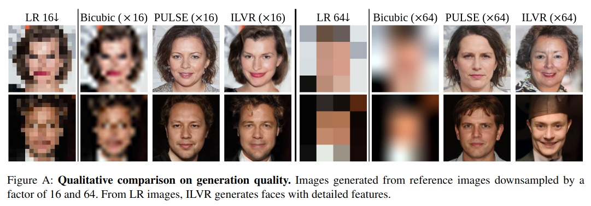

## ILVR: Conditioning Method for Denoising Diffusion Probabilistic Models
*arXiv(2021), 317 citation*

[Intro](#intro) 
[Related Work](#related-work) 
[Method](#method) 
[Experiment](#experiment) 
[Conclusion](#conclusion) 

> Core Idea

<strong>"Image Variation with Replacing Low Frequency"</strong> 

***

### <strong>Intro</strong>

- Image 의 variation 을 만들고자 한다. Iterative Latent Variable Refinement (ILVR) 을 통해 reference image 가 주어졌을 때, reference image 의 high-resolution variation 을 생성한다. 
- 추가적인 학습이 필요없다. 

***

### <strong>Related Work</strong>

***

### <strong>Method</strong>

- Image 의 low resolution 을 base 로 image variation 을 만들고자 했다.

- 중요한 hyper-parameter 는 downsampling 을 얼마나 할 것이냐이다. 

- Unseen domain 으로부터 온 image 도 image translation 도 할 수 있다. 이때, 당연하게도 diffusion model 이 학습한 분포로 끌고온다.
  - 강아지 데이터 분포를 학습한 diffusion model 이라면, 고양이 이미지가 들어왔을 때 course structure 는 유지하면서 강아지로 탈바꿈할 것이다. 

- Algorithm
  - 1. Standard Gaussian Noise 에서 sampling 해서 초기 noise 로 시작한다.
  - 2. Diffusion model 과 Reverse process 를 통해 noisy image 에서 less noisy image 를 만든다.
  - 3. Forward process 를 통해 reference image 에 perturbation 을 준 $y_{t-1}$ 을 만든다. (None model)
  - 4. $x_{t-1}$ 과 $y_{t-1}$ 을 low-pass filter $\phi_N(-)$ 에 통과시켜 low frequency 를 만든다.
  - 5. High frequency 는 그대로 두고, low frequency 만 reference image 의 low frequency 로 교체한다. 
    - Replace LF (low frequency)
  - 직관적으로 봤을 때, reference image 의 low frequency 를 유지하면서 high frequency 만 생성하기 때문에 다양한 variation 이 생성될 수 있다.
  - 하지만, low-pass filter 의 $N$ 을 크게 준다면 reference image 의 정보가 많이 사라지기에 아예 다른 이미지가 생성될 수 있다. 

***

### <strong>Experiment</strong>

- Low-pass filter 로 너무 많은 정보를 없애면 reference image 가 보존되지 않는다.

***

### <strong>Conclusion</strong>

***

### <strong>Question</strong>

