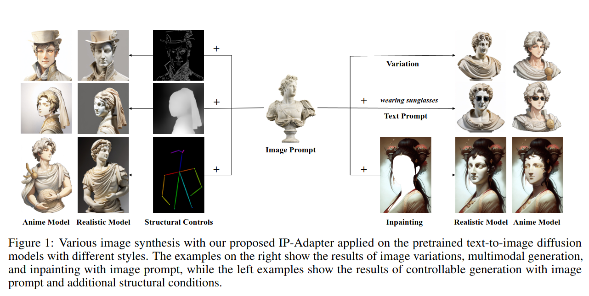
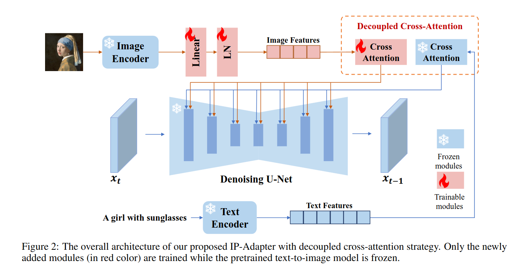
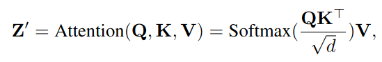
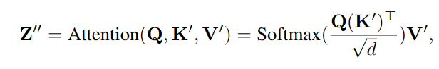
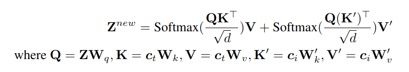

## [paper]
*arXiv(2023), 30 citation*

[Intro](#intro) 
[Related Work](#related-work) 
[Method](#method) 
[Experiment](#experiment) 
[Conclusion](#conclusion) 

> Core Idea

<strong>"test1"</strong> 

***

### <strong>Intro</strong>

- Original diffusion-based T2I model 을 수정하지 않고 image prompt 를 사용하고 싶다!

> An image is worth a thousand words

***

### <strong>Related Work</strong>

***

### <strong>Method</strong>

- Pre-trained diffusion model 에서 cross-attention layer 의 key 와 value projectrion weight 는 text feature 에 맞게 학습됐다. 결과적으로, image feature 와 text feature 를 cross-attetnion layer 에 병합하면 image feature 를 text feature 에 정렬하는 것만 달성되며 이로 인해 잠재적으로 일부 이미지 관련 정보가 누락되어 결국 reference image 를 사용한 제어 가능한 대략적인 생성만 가능하게 된다. 
  - 따라서 본 논문에서는 text feature 와 image feature 에 대해 decoupled cross-attention 을 제안한다. 
  - U-Net diffusio model 의 모든 cross-attention layer 중에서 image feature 에 대한 cross-attention layer 를 학습한다. 
  - 결과적으로 $2200$ 만 개의 parameter 만을 가진다. 

- Decoupled cross-attention
  - 원본 U-Net 의 각 cross-attetnion layer 에 대해 새로운 cross-attention layer 를 추가하여 image feature 를 삽입하면 된다. 
  - 각 cross-attention layer 에 두 개의 행렬 (weight) $W_k$', $W_v$' 만 추가하면 된다.
  - 논문에서는 수렴 속도를 높이기 위해 $W_k, W_v$ 의 값들로 초기화된다. 
  - 이후에는 image cross-attention output 을 text cross-attention output 에 더해주면 된다. 

- 기존의 text cross-attetion 수식

- 새롭게 추가된 image cross-attetion 수식

- 최종

***

### <strong>Experiment</strong>

***

### <strong>Conclusion</strong>

***

### <strong>Question</strong>
