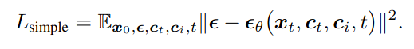
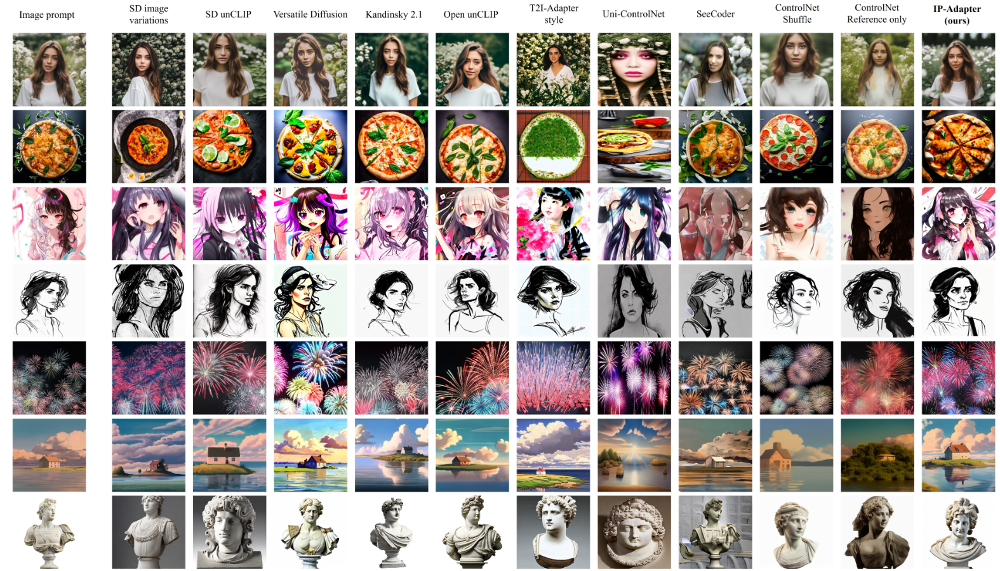
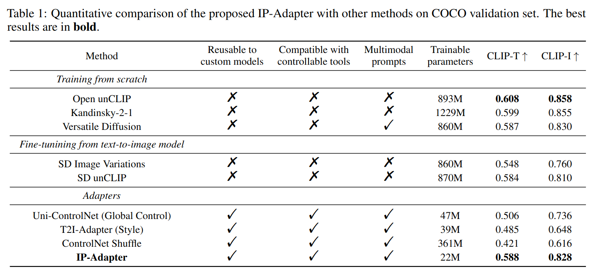
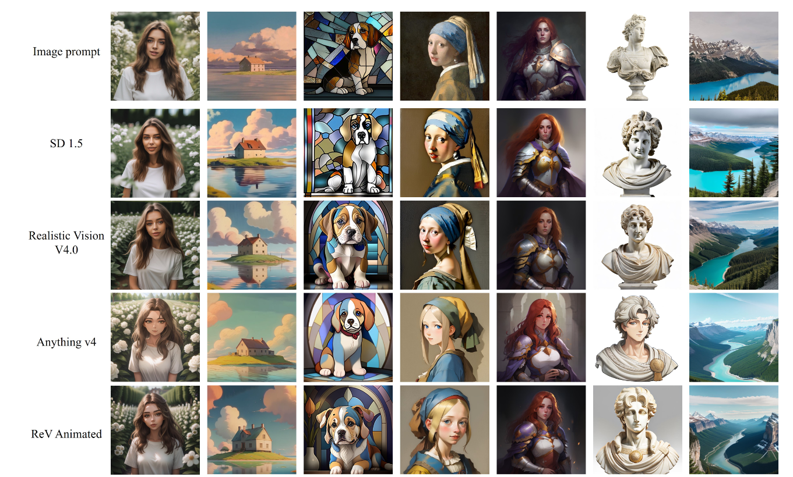
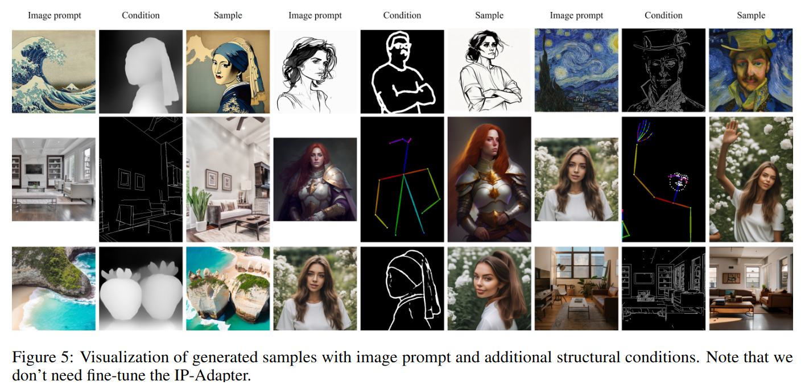
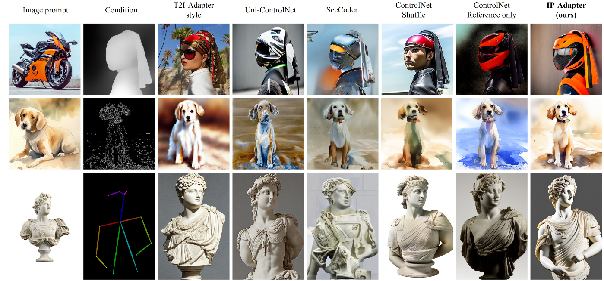

## [paper]
*arXiv(2023), 30 citation*

[Intro](#intro) 
[Related Work](#related-work) 
[Method](#method) 
[Experiment](#experiment) 
[Conclusion](#conclusion) 

> Core Idea

<strong>"test1"</strong> 

***

### <strong>Intro</strong>

- Text-to-Image diffusion model 은 안정적인 생성 능력으로 고화질 이미지를 생성할 수 있다는 것이 입증됐다. 
  - 하지만, text prompt 만 사용하여 원하는 이미지를 생성하는 것은 까다롭다. 복잡한 prompt engineering 을 포함하기 때문이다. 
  - "그림 한 장이 천 개의 말보다 가치가 있다" 라는 속담처럼 image prompt 를 사용한다. 
  - 기존의 사전 훈련된 모델에서 직접 미세 조정하는 기존 방법은 효과적이지만, text prmopt 및 구조적 제어가 제어가 되지 않는다.  

- Original diffusion-based T2I model 을 수정하지 않고 image prompt 를 사용하고 싶다!
  - Pre-trained diffusion model 을 고정시키기 때문에, 제안된 IP-Adapter 는 동일한 기본 모델에서 fine-tuning 된 다른 custom model 뿐만 아니라, 기존의 controllable tools 을 사용한 controllable generation 과도 호환이 된다. 

> An image is worth a thousand words

***

### <strong>Related Work</strong>

- SD Image Variations & Stable unCLIP: text-condition 대신 image-condtion 으로 변경
  - 1. Text 를 사용한 이미지 생성 능력을 없앤다. 또한, large computing resource 가 필요하다. 
  - 2. fine-tuned model 은 일반적으로 재사용이 불가능하다. 
  - 3. Controllable method 와 같이 쓸 수 없다. 
    - E.g., ControlNet 과 호환되지 않는다. 

***

### <strong>Method</strong>

- Pre-trained diffusion model 에서 cross-attention layer 의 key 와 value projectrion weight 는 text feature 에 맞게 학습됐다. 결과적으로, image feature 와 text feature 를 cross-attetnion layer 에 병합하면 image feature 를 text feature 에 정렬하는 것만 달성되며 이로 인해 잠재적으로 일부 이미지 관련 정보가 누락되어 결국 reference image 를 사용한 제어 가능한 대략적인 생성만 가능하게 된다. 
  - 따라서 본 논문에서는 text feature 와 image feature 에 대해 decoupled cross-attention 을 제안한다. 
  - U-Net diffusio model 의 모든 cross-attention layer 중에서 image feature 에 대한 cross-attention layer 를 학습한다. 
  - 결과적으로 $2200$ 만 개의 parameter 만을 가진다. 

- Image Encoder
  - CLIP image encoder 의 global image embedding 을 사용한다. 
  - Global image embedding 을 효과적으로 분해하기 위해, small trainable projection network 를 사용한다. (image embedding 을 $N=4$ 길이의 feature sequence 로 projection)
  - 최종 image feature dimension 은 text embedding 과 같다. (maybe $768$ in SD1.5)

- Decoupled cross-attention
  - 원본 U-Net 의 각 cross-attetnion layer 에 대해 새로운 cross-attention layer 를 추가하여 image feature 를 삽입하면 된다. 
  - 각 cross-attention layer 에 두 개의 행렬 (weight) $W_k$', $W_v$' 만 추가하면 된다.
  - 논문에서는 수렴 속도를 높이기 위해 $W_k, W_v$ 의 값들로 초기화된다. 
  - 이후에는 image cross-attention output 을 text cross-attention output 에 더해주면 된다. 

- 기존의 text cross-attetion 수식

- 새롭게 추가된 image cross-attetion 수식

- 최종

- Training and Inference 
  - Classifier-free guidance 를 사용하기 위해, CLIP image embedding 을 zero 로 한다.

***

### <strong>Experiment</strong>

$\textsf{Dataset}$

- $10$ million text-image pairs from two open source datasets (LAION-$2$B, COYO-$700$M)

$\textsf{Implementation Details}$

- SD v1.5
- OpenCLIP ViT-H/14
- DeepSpeed ZeRO-2
- $1$ M stpes
- AdamW optimizer with a fixed learning rate $0.0001$ and weight decay of $0.01$
- Resize the shortest side of the image to $512$ and then center crop the image with $512 \times 512$ resolution
- To enable classifier-free guidance: 
  - $0.05$ drop probaility for text
  - $0.05$ drop probaility for image
  - $0.05$ drop probaility for text and image
  - Guidance scale: $7.5$
 

***

### <strong>Conclusion</strong>

$\textsf{Limitation}$

- Textual Inversion 이나 Dreambooth 처럼 일관된 이미지를 생성할 순 없다. 

***

### <strong>Question</strong>
