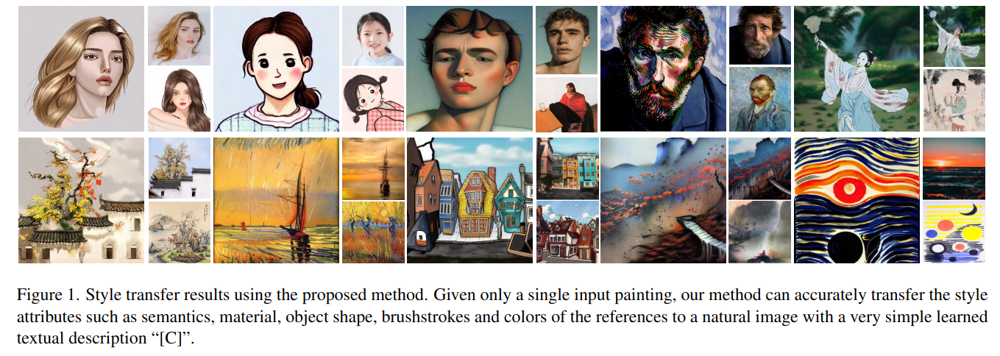
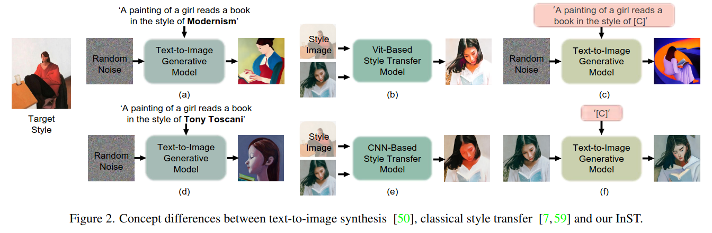
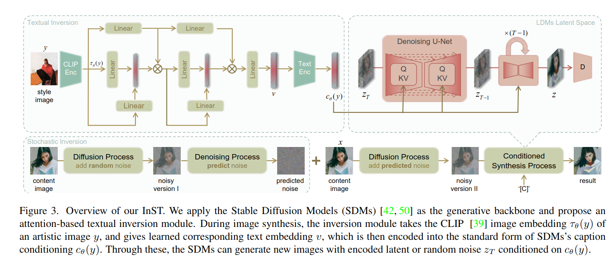
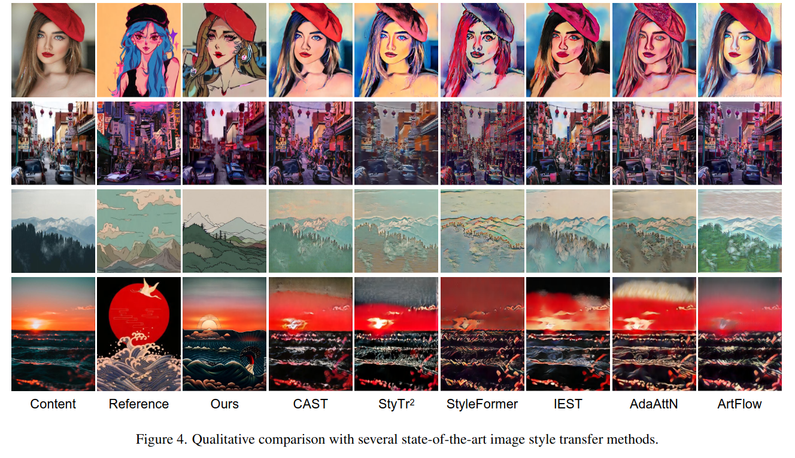
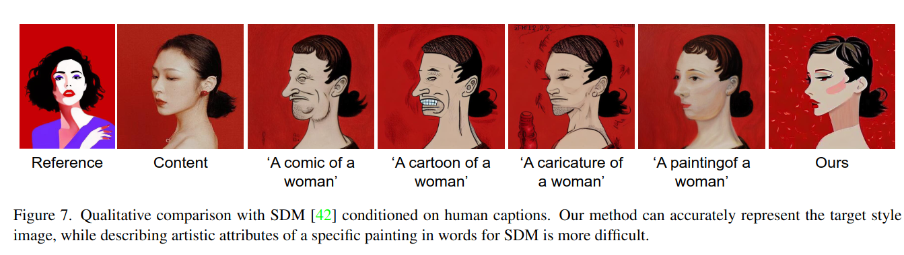

## Inversion-based Style Transfer with Diffusion Models
*CVPR(2023), 29 citation*

[Intro](#intro) 
[Related Work](#related-work) 
[Method](#method) 
[Experiment](#experiment) 
[Conclusion](#conclusion) 

> Core Idea

<strong>"test1"</strong> 

***

### <strong>Intro</strong>
- Art work(예술 작품) 의 독특함은 일반 언어로 충분히 설명할 수 없다.
- 본 논문의 핵심 아이디어는 artistic style 을 single painting 에서 학습하고 복잡한 텍스트 설명을 제공하지 않고도 합성하는 것이다. 
- 구체적으로는 그림의 artistic style 을 학습하는 *inversion-based style transfer method(INST)* 를 제안한다.

***

### <strong>Related Work</strong>
-  text guided stylization:
   -  StyleGAN-NADA: CLIP-guided domain adaptation of image generators
   -  Language-driven artistic style transfer
   -  StyleCLIP: Text-driven manipulation of stylegan imagery
   -  CLIPstyler: Image style transfer with a single text condition
-  style transfer
   -  ArtFlow: Unbiased image style transfer via reversible neural flows
   -  Arbitrary style transfer via multi-adaptation network
   -  Image style transfer using convolutional neural networks
   -  AdaAttN: Revisit attention mechanism in arbitrary neural style transfer
   -  Style-Former: Real-time arbitrary style transfer via parametric style composition
   -  Domain enhanced arbitrary image style transfer via contrastive learning
-  Diffusion-based method 
   -  Diffusion models beat GANs on image synthesis
   -  Draw your art dream: Diverse digital art synthesis with multimodal guided diffusion
   -  DiffStyler: Controllable dual diffusion for text-driven image stylization
   -  Imagic: Text-based real image editing with diffusion models
   -  GLIDE: Towards photorealistic image generation and editing with text-guided diffusion model

***

### <strong>Method</strong>

- Textual description $[C]$ 학습 
- Inference 시에, $[C]$ 와 content image 의 inversion 을 통해 생성

***

### <strong>Experiment</strong>

***

### <strong>Conclusion</strong>

***

### <strong>Question</strong>

