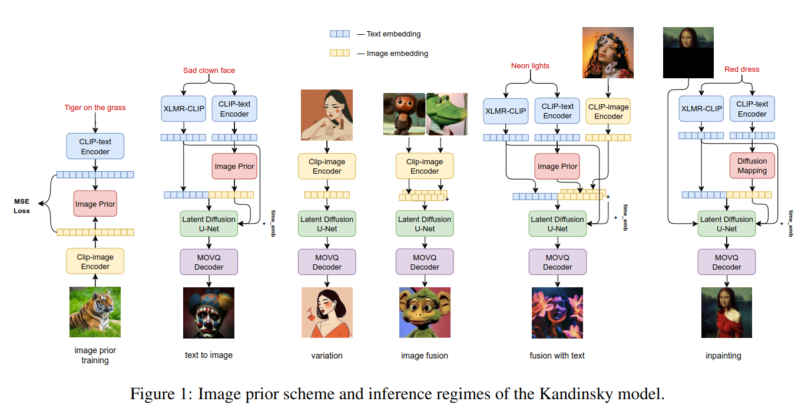

## Kandinsky: an Improved Text-to-Image Synthesis with Image Prior and Latent Diffusion
*arXiv(2023), 6 citation*

[Intro](#intro) 
[Related Work](#related-work) 
[Method](#method) 
[Experiment](#experiment) 
[Conclusion](#conclusion) 

> Core Idea

<strong>"Present First Text-to-Image Architecture Designed using a Combination of Image Prior and Latent Diffusion"</strong> 

***

### <strong>Intro</strong>

- Diffusion-based model 을 두 가지 category 로 나눌 수 있다.
  1. Pixel-level approaches
  2. Latent-level approaches 
   
- 본 논문에서 제안하는 Kandinsky 는 **latent-level approach** 이자, **latent diffusion technique 과 image prior models 의 원리를 결합** 했다.  
  - Image prior model 은 CLIP 의 text embedding 을 CLIP 의 image embedding 에 mapping 시키기 위해 별도로 학습됐다. 
  - 다른 구별되는 점은 image autoencoder 요소로서 제공되는, 변형된 MoVQ 구현이다. 
  - 전체적으로 설계된 model 은 $3.3$ B parameter 를 가진다. 
  - 또한, text-to-image generation, image fusion, text and image fusion, image variations generation, and text-guided inpainting/outpainting 과 같은 다양한 생성 모델을 제공하는 user-friendly demo system 을 개발했다. 

- 실험적으로, COCO-30K dataset 에 대해 top open-sourcer 로써, FID $8.03$ 을 달성했다. 
  - Stable Diffusion, IF, DALL-E 와 비교

***

### <strong>Related Work</strong>

- Text-to-Image generative models 
  - Autoregressive approache: DALL-E, CogView, or Parti, 종종 content-level artifact 가 발생한다. 
  - Diffusion-based models: DALL-E $2$, Imagen, and Stable Diffusion 
    - Pixel-level vs Latent-level 
- Application based on open-source generative models 
  - DreamBooth, DreamPose

***

### <strong>Method</strong>

- 해당 모델은 주요한 $3$ stage 이 있다: text encoding, embedding mapping (image prior), latent diffusion 

- 연구 초기에는 mT5, XLMR, XLMR-CLIP 과 같은 다국어 text encoder 를 사용하여 견고한 다국어 text 에서 실험을 했다. 그러나 독립적인 text encoder 대신 CLIP-Image embedding 을 사용하는 것이 이미지 품질을 향상시킨다는 걸 발견했다. 
  - Image prior approach (text encoding 할 때, image 라는 사전 지식을 활용) 를 채택했다.
  - 결과적으로는 XLMR 의 독립적인 text encoder 와 image prior 를 가지고 있는 CLIP-text encoder 를 사용한다. 
  - 이러한 encoder 들은 훈련 단계에서 freeze.

$\textsf{Embedding mapping (Image prior)}$

- Transformer-encoder model 을 사용한다. 이 모델은 CLIP-ViT-L14 model 이 제공한 text 와 image enbedding 에 대해 diffusion process 와 함께 학습됐다. 
- Training process 의 중요한 특징은 element-wise normalization of visual embeddings 이다. 이 정규화는 전체 데이터셋 통계에 기반하고 diffusion process 의 빠른 수렴을 도와준다.  
- Inference stage 에서는 original CLIP-image embedding 으로 돌아가는 inverse normalization 이 구현되어 있다. 

- Image autoencoder: modified MOVQ
- Image prior: CLIP-Image encoder 

***

### <strong>Experiment</strong>

- 다른 모델들과 COCO-30K validation set ($256 \times 256$ resolution) 에 대해서 FID score 를 측정한 결과이다. 
  - Open source model 들 중에서는 가장 좋은 성능을 거뒀다. (IF 논문을 쓴 저자들은 실험 결과에 $7.19$ 로 나왔지만 본 논문에서 실험해본 결과 $15.10$ 이 나왔다고 한다.)
  - Proprietary model 과 비교해도 우수한 성능을 가진다.

- 다 합쳐도 $3.3$ B parameter 이다. 

***

### <strong>Conclusion</strong>

***

### <strong>Question</strong>

