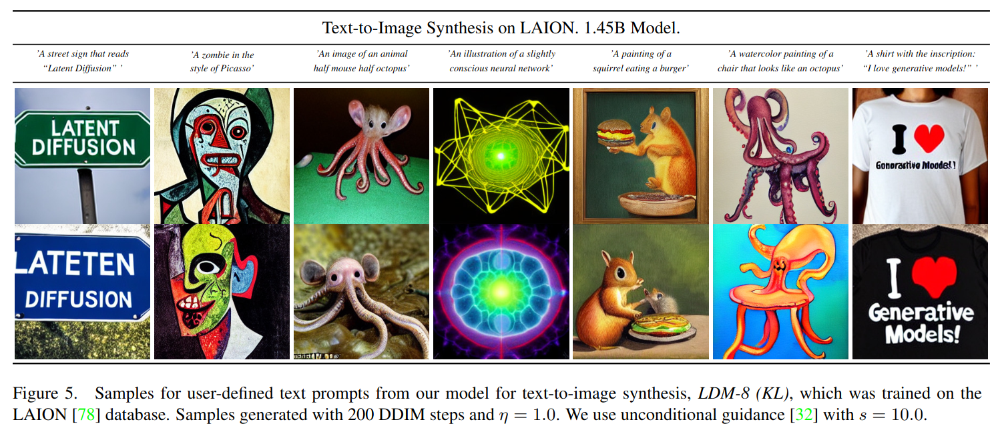
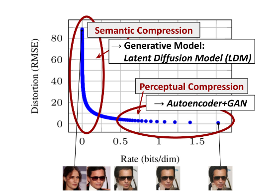
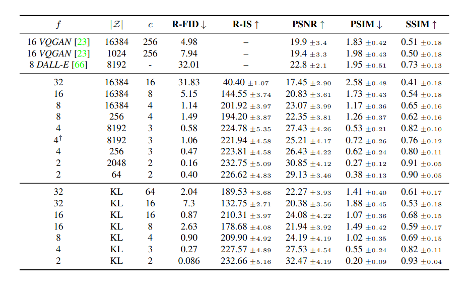
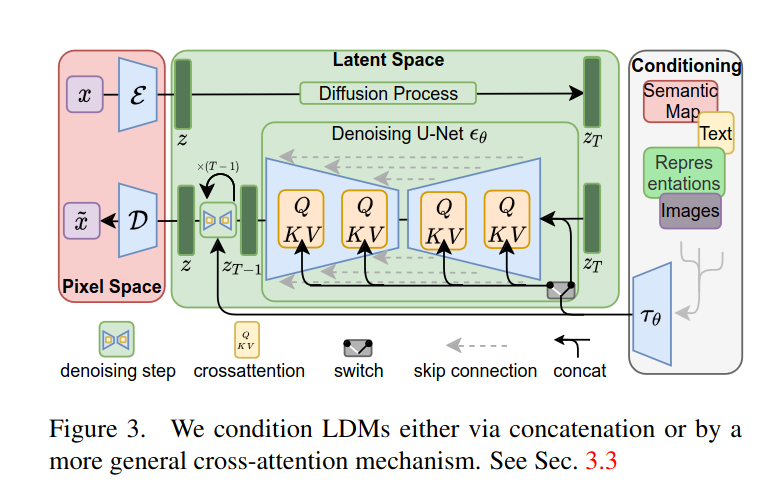
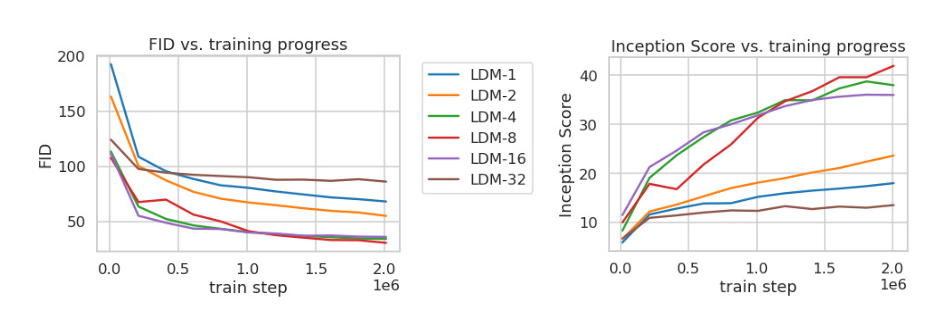
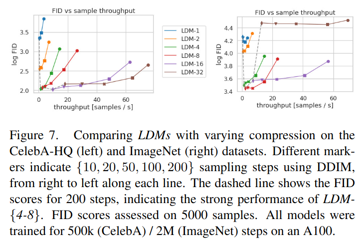
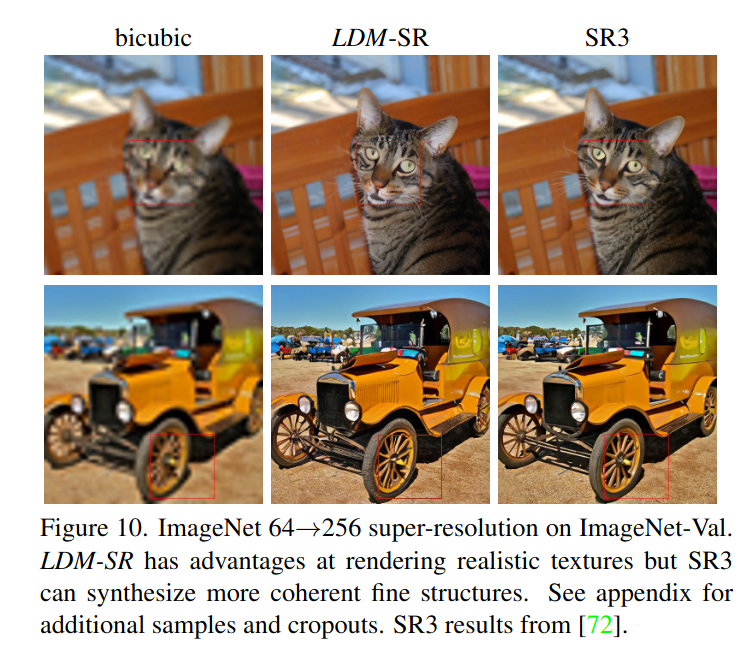

## LDM: High-Resolution Image Synthesis with Latent Diffusion Models
*CVPR(2022), 4667 citation*

[Intro](#intro) 
[Related Work](#related-work) 
[Method](#method) 
[Experiment](#experiment) 
[Conclusion](#conclusion) 

> Core Idea

<strong>"Sequential Denoising Autoencoder Process in Latent Space"</strong> 

***

### <strong>Intro</strong>
- Image synthesis 과정을 sequential denoising autoencoder 로 분해함으로써 Diffusion Model (DM) 은 SoTA 성능을 달성했다. 
- 또한, classifier-free guidance 로 인해 재훈련 없이 control 이 가능하다.

$\textbf{Problem}$

- 하지만, 일반적으로 이런 denosing process 는  pixel space 에서 작동하기 때문에, model optimization 에는 종종 수백 개의 GPU days 가 소모되고 inference 가 비싸다.

- 따라서, 본 논문에서는 제한적인 computational resource 상황에서 DM 의 quality 와 flexibility 를 유지하면서 학습시키기 위해 pre-trained autoencoder 를 활용하여 latent space 상에서 학습을 진행한다. 
- Latent space 상에서 학습을 하여, complexity reduction & detail preservation 사이의 sweet spot 에 도달했다. 
- 더불어서, cross-attention layer 를 model 구조에 도입하여 conditional input (e.g., text, bounding boxes) 으로부터 강력한 생성 능력을 갖췄다. 

***

### <strong>Related Work</strong>

***

### <strong>Method</strong>

- Rate (bits/dim)
  - 데이터의 비트 수를 해당 데이터의 차원으로 나눈 값
  - E.g., 이미지의 dim: $512$, 각 pixel 이 $8$ bit ($0$~$255$), Rate = $8$
  - Rate 값이 낮을수록 모델은 높은 압축률을 가지며, 주어진 차원당 소요되는 비트 수가 적어진다. 

- Perceptual (지각적) compression: 높은 주파수의 세부 사항을 제거하거나 줄이는 과정이다. 인간의 시각 체계에서 상대적으로 덜 중요하거나 감지하기 어려운 정보를 제거하여 크기를 줄인다. 인간 시각체가 일부 세부 사항을 무시하거나 줄이고도 이미지를 이해할 수 있는 능력을 기반으로 한다.
  - 불필요한 주파수가 제거되었지만, 중요한 시각적 특징을 보존한 공간이 perceptual compression space 이다. 
  - Learns little semantic variation
  - 낮은 주파수는 일반적으로 이미지나 신호에서 대상의 전체적인 구조와 큰 특징을 나타낸다.

- Semantic compression: 실제로 generative model 이 semantic (의미론적) 과 conceptual (개념적) composition 을 배운다.

- 본 논문에서는 지각적으로 동등하지만 계산적으로는 더 적합한 공간을 찾아서 훈련한다. 
  - Auto-encoder 를 활용하여 lower-dimensional representation sapce 를 얻고 (preceptrual compression) latent spcae 상에서 diffusion model 을 학습함으로써 semantic compression 을 한다. 
  - Downsampling 이 결국 high frequency 를 제거하는 연산이니 지각적으로 동일하면서 downsampling 으로 인해 dimension 이 줄어들었기에 계산적으로 더 적합하다.
  - Distortion (왜곡): downsampling 을 했으니 LDM 의 경우 distortion 이 높을 것이다.

$\textbf{Auto-encoder}$

- 일반적인 auto-encoder 를 한 번만 훈련해도 여러 diffusion model 에 재사용할 수 있다. 
- 일반적으로, auto-encoder 는 Prior ($Z$) 를 다변량 표준 정규 분포 $\sim N(0,I)$ 로 가정한다. 즉, 실제 이미지를 encoding 했을 때나 decoding 할 때 다변량 표준 정규 분포 $\sim N(0,I)$ 를 따라야 정상적으로 작동한다. 
- 이미지는 encoder 를 통해 encoding 되니까 실제 이미지의 encoded distribution 은 다변량 표준 정규 분포를 $\sim N(0,I)$따를 것이다. 
- True image 를 encoding 한 게 다변량 표준 정규 분포니까, model 이 학습후에 pure noise 로부터 생성한 이미지도 다변량 표준 정규 분포 $\sim N(0,I)$ 를 따를 것이다. 
- 이때, pure noise 의 분포와 인코더의 분포는 관련이 없다. 
- 본 논문에서는 perceptual loss & patch-based adversarial objective 로 학습된 auto-encoder 를 사용한다. 
  - Downsampling factor $f = \frac{H}{h}$, 
    - E.g., $f= 8$, $\frac{1}{8}$ 로 downsampling
  - 높은 분산의 latent space 를 피하기 위해, 두 가지 종류의 regularization 을 실험했다.
    - 1. KL-reg: VAE 와 비슷하게, standard normal 방향으로 약간의 KL-penalty 를 준다. 
    - 2. VQ-reg: vector quantization layer 를 decoder 에서 사용
  - 이후에 DM 이 latent space 의 $2$ 차원 구조에서 작동하도록 설계되었다. 이전의 연구인 $1$ 차원 구조 (e.g., VQGAN, DALL-E)는 latent space 의 내재된 구조의 많은 부분을 무시하는 반면, $2$ 차원 구조를 사용하여 $X$ 의 세부 사항을 잘 보존한다. 
  - 아래 table 에서 본 논문의 방법이 세부 사항을 더 잘 보존하는 것을 보여준다.
- Auto-encoder 를 통해, 감지하기 어려운 세부 사항 (고주파) 이 추상화된 효율적이고 저차원의 latent space 에 접근할 수 있게 된다. 고차원의 pixel space 와 비교해보자면 latent space 는 데이터의 중요하고 의미 있는 bit 에 집중할 수 있으며, 계산적으로 효율적인 공간입니다. 

- Model Overview

***

### <strong>Experiment</strong>

- Downsampling factor $f$ 
  - $4-16$ 이 일반적으로 좋음
  - $8$ 의 성능이 가장 좋다.

- Sampling speed 와 그에 따른 FID 를 보여준다.
  - LDM-{$4-8$} 이 좋다. $1$ (pixel-based) 과 비교했을 때 더 낮은 FID score 를 달성하면서 동시에 sampling 속도도 빠르다. 
  - Throughput: 초당 몇 개의 샘플을 뽑는다. (Different marker 를 고려해야한다)
  - 요약하자면, LDM-{$4 \ or  \ 8$} 이 가장 적합한 downsampling factor 를 가진다. 

- Super-resolution: vs SR3
  - $f=4$
  - IS 의 성능은 더 낮지만, FID 의 성능은 이김.

***

### <strong>Conclusion</strong>

- Limitation
  - CLIP text encoder 는 학습할 당시에, class token 만을 사용했기 때문에 다른 index 의 output vector 는 의미없는 정보라고 볼 수 있다. 
  - 그래서 LDM 이 생성 할 때, prompt 에 정보를 혼합해서 생성하는 것이다.
    - E.g., a red car and a white sheep: 양도 빨간색으로 나온다. 
    - LDM 은 class token 뿐만 아니라 다른 index token 도 사용을 하는데 이때, 다른 token 에는 정보가 무의미하고 class token 만을 사용하는데 class token 에는 모든 단어의 정보에 집중하고 있어서 섞인다. 
  - CLIP: Attribution 을 caption 에 추가해서 더 자세하게 retrieval 을 시도했더니, 오히려 성능이 떨어진다. CLIP 은 class token 만을 써서 학습했기에 모든 단어에 attention 이 걸려있다. 

***

### <strong>Question</strong>
