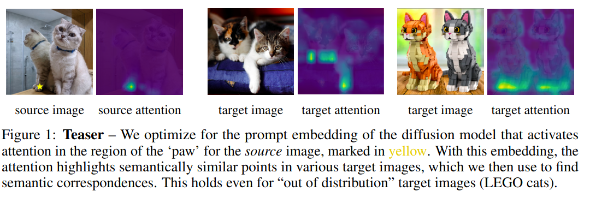
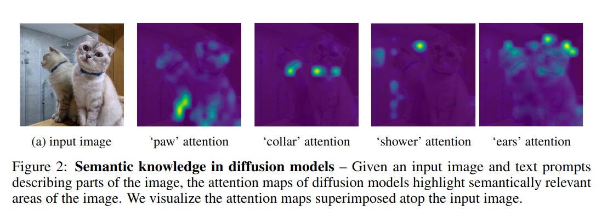
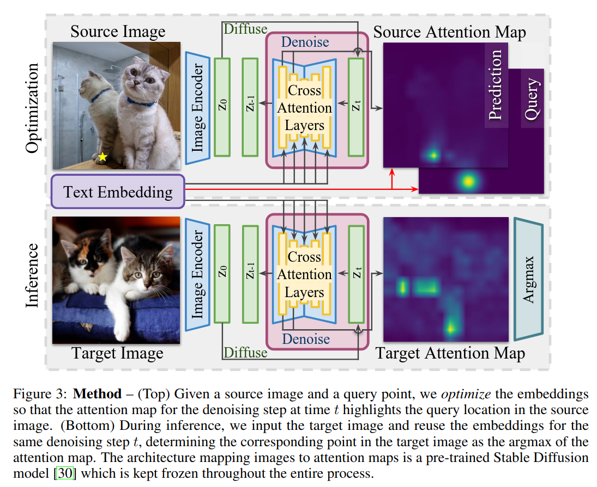
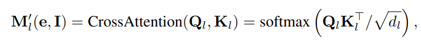
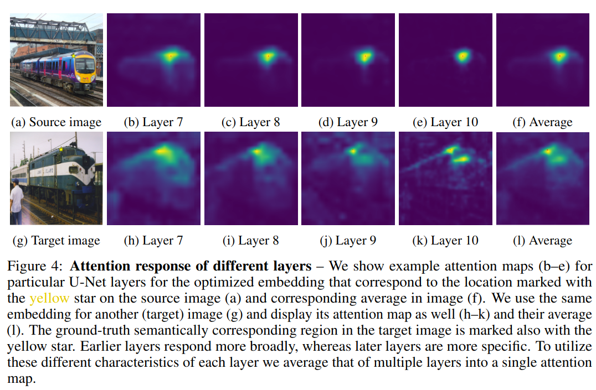
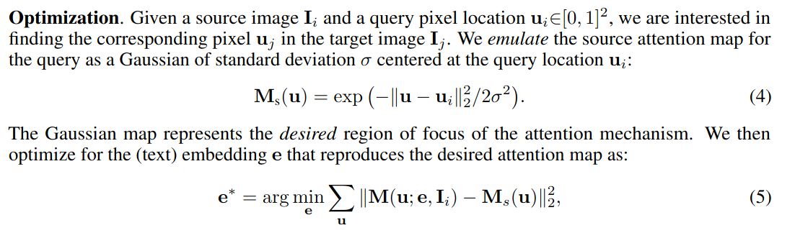
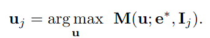
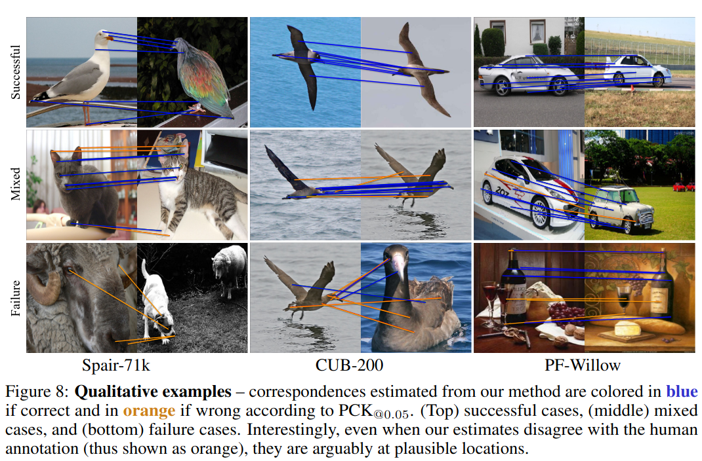
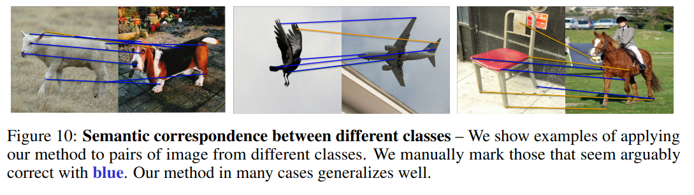

## Unsupervised Semantic Correspondence Using Stable Diffusion
*NeurIPS(2024), 27 citation, Universitiy of British Columbia, Google, University of Toronto, Review Data: 2024.07.05*

[Intro](#intro) 
[Related Work](#related-work) 
[Method](#method) 
[Experiment](#experiment) 
[Conclusion](#conclusion) 

> Core Idea

<strong>"test1"</strong> 

***

### <strong>Intro</strong>

$\textbf{이 주제의 정의 및 요구사항과 중요한 이유}$

- 이미지간의 point correspondence를 추정하는 것은 computer vision에서 image registration, obejct recognition, and 3D reconstruction과 같이 수많은 appliccation과 함께 근본적인 문제이다. 
- Correspondence는 크게 $\textit{geometric}$ 과 $\textit{semantic}$ correspondence로 분류할 수 있다. 
  - Geometric correspondence는 같은 object의 같은 물리적인 point와 일치하는 point를 찾는다. 또한, 일반적으로 local feature-based method와 optical flow method와 함께 푼다.
  - Semantic correspondence는 (이 논문에서 중요하게 보는) 비슷한 object나 비슷한 class (같지 않아도 된다)에 대해 의미론적으로 일치하는 point를 찾는 데 초점을 두고 있다. 

- 예를 들어, source image의 kitten paw (아기 고양이 발)이 주어졌을 때, 우리는 자동적으로 target image에서의 kitten paw를 확인하고 싶다. 
  - 같은 클래스이지만 다른 고양이도 동일하게 적용이 되고, 심지어는 out of distribution target image에도 적용이 된다. 

- T2I diffusion mdoel은 종종 실제 이미지와 구별하기 힘든 이미지를 생성하고 있다. 이런 이미지들을 생성하기 위해선, 생성되는 object의 semantic을 이해해야 한다. 

$\textbf{이 주제의 문제점과 기존의 노력들}$

- 학습 기반의 방법들은 우월한 성능을 제공하는 반면 종종 large supervised dataset을 필요로 한다. 
  - 기하학적 대응의 경우, 웹에 존재하는 방대한 양의 사진을 활용하여 기하학적 검증 과정을 통과하는 포이트를 사용하면 되기에 비교적 간단하다. 
  - 그러나 의미론적 대응의 경우, 더 높은 품질의 정답 데이터를 얻기 위해 단순히 더 많은 사진을 수집할 수 없기 때문에 더 어렵다. 의미론적 대응을 자동으로 검증하는 것은 어렵고, 사람의 라벨링 작업이 필요하다. 따라서, 비지도 학습의 의미론적 대응에 대한 연구가 증가하고 있다. 

$\textbf{본 논문에서 해결하고자 하는 문제와 어떻게 해결하는지, 그 결과들}$

- 본 논문에선 학습없이 semantic correspondence를 찾기 위해 diffusion model의 semantic knowledge를 이용한다. 텍스트 프롬프트만으로 사진과 같은 이미지를 생성할 수 있다는 점에서 의미론적 대응에 대한 지식을 내포하고 있을 것이라는 게 key insight이다. 
  - 구체적으로, 주어진 이미지에서 ROI (regions of interest)에 최대한의 주의를 기울이도록 model의 prompt embedding을 최적화한다. 
  - 최적화된 임베딩은 위치에 대한 의미론적 정보를 포착하며, 이를 다른 이미지로 전이할 수 있다. 

- Text 기반의 이미지 편집을 위한 prompt-to-prompt의 성공에 영감을 받아, LDM의 attention map을 활용하여 방법을 구축했다. 
  - Text prompt가 변경됨에 다라 이미지의 다른 부분에 주목한다. 예를 들어, 고양이 이미지와 text prompt "paw (발)"이 주어지면 attention map은 발을 주목하고 "목걸이 "collar" 가 주어지면 목걸이를 강조한다. 
  - 즉, 특정 이미지 위치에 해당하는 prompt를 식별할 수 있다면, LDM을 사용하여 새로운 미지의 이미지에서 의미론적으로 유사한 위치를 식별할 수 있다. 
  - 실제 단어에 해당하는 prompt를 찾는 것은 이산적인 문제이기에 해결하기 어렵지만, query된 이미지 위치를 강조하는 attention map을 생성하기만 하면 실제 단어에 해당할 필요가 없다. 즉, 연속적인 임베딩 공간에서 prompt를 조작할 때 위의 비유가 성립된다. 

- 이러한 통찰력을 바탕으로, LDM의 attention map이 관심 지점에 해당하도록 최적화하여 이러한 (지역화된) 임베딩을 찾을 것을 제안한다. 
  - Textual Inversion의 prompt를 찾는 것과 유사하다. 
  - Source image와 의미론적 대응을 찾고자 하는 query가 주어지면, LDM을 고정한 상태에서 query 위치에서 cross attention을 최대화하도록 무작위로 초기화된 text embedding을 최적화한다. 
  - 그런 다음 최적화된 text embedding을 target image에 적용하여 의미론적으로 대응되는 위치를 찾는다. 이는 target image 내에서 최대 attention map 값을 얻는 픽셀이다. 

- 핵심 기술적 기여 외에도, 단순 구현에서 발생할 수 있는 문제를 해결하기 위한 중요한 design choice를 도입한다. 
  1. 임베딩을 찾을 때, 단일 이미지에서 최적화하므로 overfitting을 방지하기 위해 random crop을 적용한다.
  2. Textual Inversion의 불안정성과 무작위성을 피하기 위해 무작위 초기화로 여러 임베딩을 찾는다.
  3. 의미론적 매칭의 다중 스케일 개념을 구축하기 위해, network의 다른 레이어에서 attention map을 활용한다. 

***

### <strong>Related Work</strong>

- Semantic correspondences
  - Geometric/Semantic correspondence가 있지만 여기서는 semantic correspondence에만 집중한다. 
  - 다른 방법론들은 대규모 데이터셋이 필요하며 이는 일반화와 확장성을 제한한다. 

- Learning semantic correspondences with less supervision 
  - Distilation 
  - DINO

- Utilizing pre-trained diffusion models 
  - LoRA, Textual Inversion, ControlNet
  - Prompt-to-Prompt

***

### <strong>Method</strong>

- LDM의 attention map을 활용하여 image 쌍의 semantic correspondence를 확인한다. 
- $2$ 가지 stage를 포함한다.
  - First stage (optimization): time $t$ 에서의 activation map을 조사하여 source image의 query region의 의미를 표현하는 embedding을 찾는다. 
  - Second stage (inference): source image로부터 찾은 embedding을 고정시키고 다시 time $t$ 에서의 target image의 attention map을 계산한다. 
  - 생성된 map에서 가장 높은 attention value를 갖는 위치가 우리가 원하는 의미론적 대응을 제공한다. 
  - **본 논문에서는 $T=50$ 에서 $t=8$ 을 선택했다.**

$\textbf{Attention masks}$

- Image $I$ 가 VAE encoder를 통과하면 $z(t)$ 가 된다. 
- 다음의 수식은 U-Net의 $l$ 번째 layer에서의 cross-attention을 구하는 수식이다. 
  - Attention map $M' \in \mathbb{E}^{C \times (h \times c) \times P}$
  - $P$: token 개수 (sequence length)
  - $C$: attention head 개수
  - $h, w$: height, width
  - $e$: text encoder를 통과한 text embedding
  - $Q \in \mathbb{E}^{(h \times w ) \times d_l}, K \in \mathbb{E}^{P \times d_l}$

- U-Net의 서로 다른 layer는 다른 수준의 semantic knowledge를 가진다. 
  - 따라서, 각 layer의 특성을 이용하기 위해 본 논문은 head 및 layer에 대해서 average한다. 
  - Layer는 $7 - 10$을 이용하고, 각 layer에서의 attention map의 크기가 다르기 때문에 bilinear interpolation을 이용한다. $P$ 는 고정이니 $h, w$에 대해서 한다.
  - $M^{''} \in \mathbb{E}^{(h \times w) \times P} = average_{c=1...C, l=7...10}(M'_l)$: head와 layer에 대해서 평균낸 attention map
  - $M(u; e, I) \in \mathbb{E}^{(h\times w)}$: 평균낸 attention map $M^{''}[1]$에서 pixel $u$를 indexing
    - $M^{''}[1]$은 $P$의 첫 번째 token. 즉, CLS token을 의미한다.
    - $u \in [0,1]^2$: $u$는 2차원 벡터 $(u_1, u_2)$ 인데 각각의 성분이 $[0,1]$ 구간에 있다. 즉, $h,w$ 에서의 좌표를 의미한다. $[0,1]$로 normalize한 이유는 추후에 attention score랑 비교하기 위함이다. 

$\textbf{Optimization}$

- Source image $I_i$와 query pixel location $u_i$가 주어졌을 때, 우리는 $u_i$와 일치하는 target image $I_j$의 pixel $u_j$를 찾아야 한다. 
  - Query location $u_i$: 원하는 point를 지정한다.
  - $M_s(u) \in \mathbb{E}^{(h \times w)}$: 지정한 point $u_i$를 중심으로 하고, 표준편차는 $\sigma$인 가우시안 분포를 만든다. 
  - 해당 point에서의 attention score가 높은 text embedding값을 찾는다. 당연하게도 $M_s(u)$는 query point의 위치가 가장 높은 값 $1$을 가지기 때문에, attention score도 query point에 모이는 text embedding을 찾을 것이다. 마치, $M_s(u)$와 비슷한 attention score 분포를 가지는 text embedding을 찾는 것이다.

$\textbf{Inference}$

- 이번엔 input을 target image로 넣고, optimization section에서 찾은 text embedding과 같이 넣은 후, attention score가 가장 높은 point를 고르면 된다. 

**Regularizations**

Single image에 대해서 text embedding을 optimization하는 것은 overfitting을 초래할 수 있기 때문에 여러가지 형태의 정규화 방법을 적용한다. 

$\textbf{Averaging across crops}$

$\textbf{Averaging across optimization rounds}$

***

### <strong>Experiment</strong>

- 주황색은 잘못된 위치와의 대응점인데, human annotation에 대해서 틀린 거지 실제로는 그럴듯한 위치에 존재한다. 
  - 코끼리 source image를 보면 다른 class인데도 대응하고 있다. 
  - Style이 달라도 적용이 된다. 

***

### <strong>Conclusion</strong>

***

### <strong>Question</strong>

