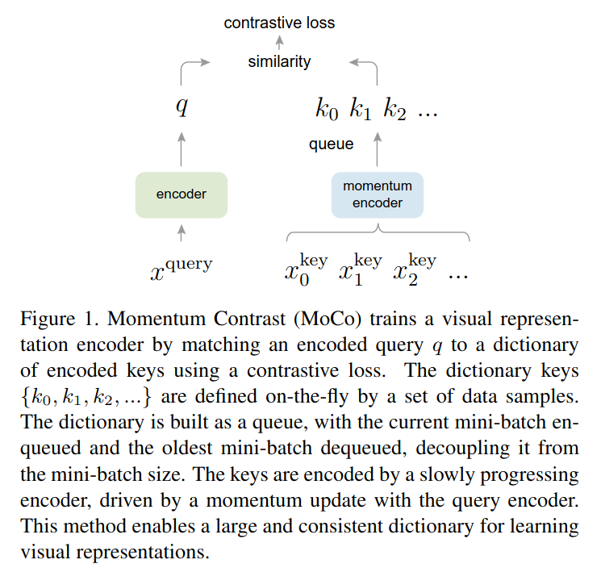
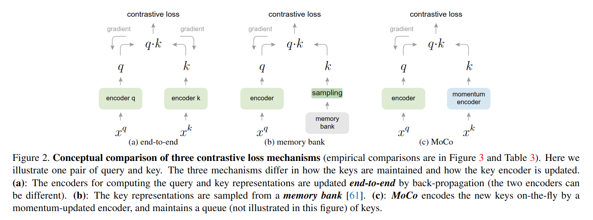
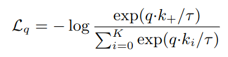
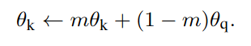
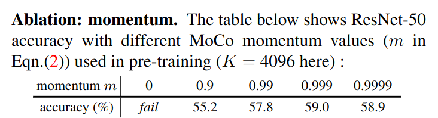
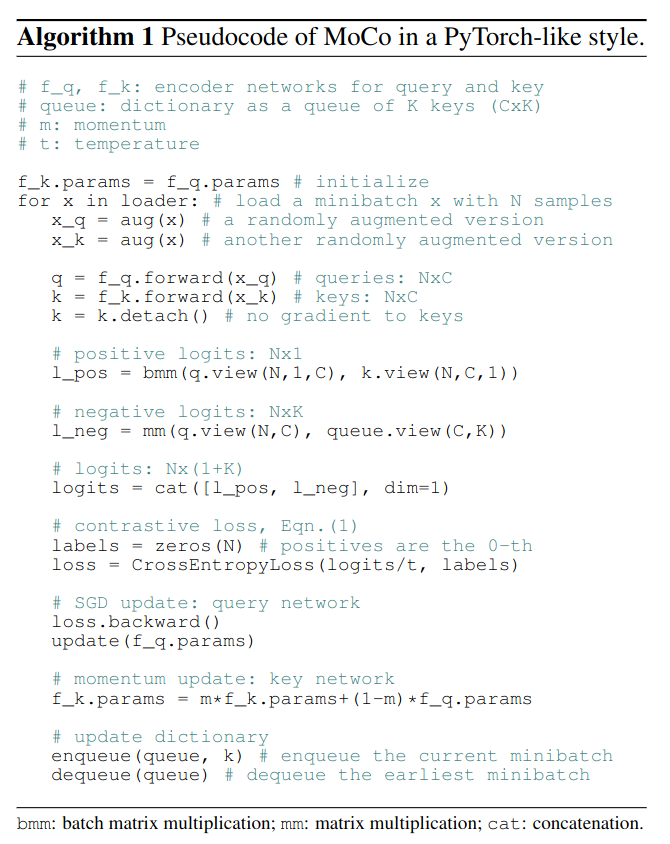
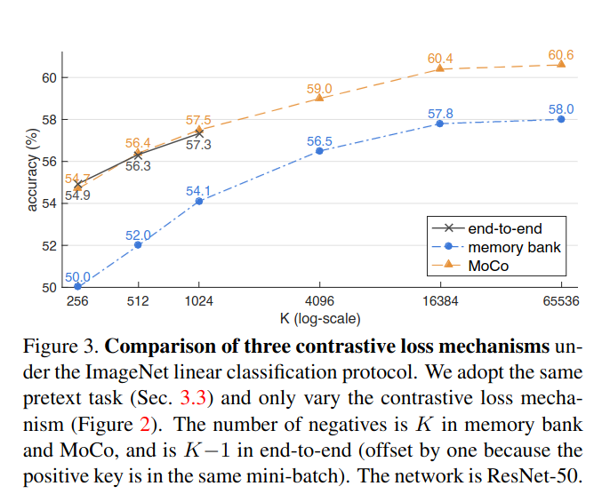
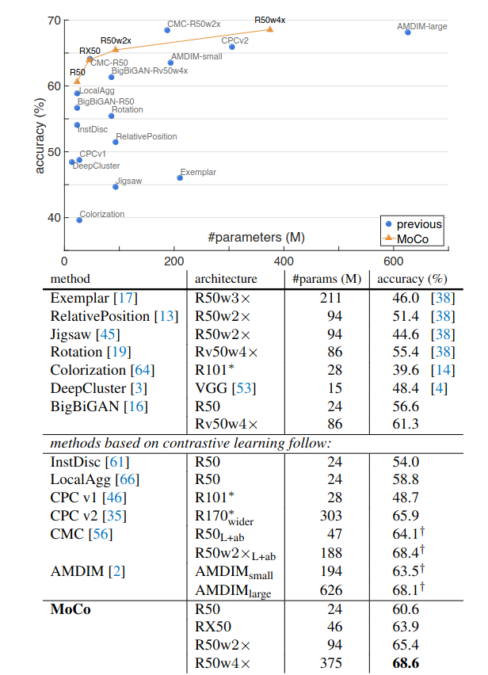

## MOCO: Momentum Contrast for Unsupervised Visual Representation Learning
*CVPR(2020), 10300 citation, Facebook AI Research*

[Intro](#intro) 
[Related Work](#related-work) 
[Method](#method) 
[Experiment](#experiment) 
[Conclusion](#conclusion) 

> Core Idea

<strong>"Contrastive learning via Dictionary with a Queue and Moving-Averaged Encoder for Unsupervised Visual Representation Learning"</strong> 

***

### <strong>Intro</strong>

- Unsupervised representation learning 은 natural language prcessing 에서 굉장히 성공적이였다. 
  - E.g., GPT, BERT
  - 하지만, computer vision 에서는 여전히 supervised pre-training 이 지배적이였다. 
  - 그 이유는, signal space 의 차이 때문이다.
    - language task 에서는 토큰화된 사전을 구축하기 위한 discrete signal space (e.g., words, sub-words units, etc.) 기반으로 이루어져 있다. 이를 기반으로 self-supervised learning 이 가능하다. 
    - Computer vision 은 연속적이고 고차원 공간에 raw signal (이미지는 고차원 공간에 있고 pixel 값은 연속적이여서)이 있으며 이는 단어와 같이 인간의 의사 소통을 위해 구조화되어있지 않다. 
    - 우리는 Language task 에 대해서, model 이 data (text) 에 대한 이해도를 높이기 위해 설계하기 직관적이지만, computer vision 에서는 model 이 data (image) 에 대한 이해도를 높이는 방법이 직관적이지 않다. 

$\textsf{Abstract}$

- Unsupervised visual representation learning 을 제안했다. 
  - Dictionary look-up contrastive learning  
  - Moving-averaged encoder 
    - For large and consistent dictionary
- Linear protocol on ImageNet classifiaction 에 대해서 좋은 성적을 거뒀다. 
  - MoCo 로 학습된 representation 을 통해 downstream task 에 적용을 했더니 $7$ detection/segmentation tasks on PASCAL VOC, COCO, and other datasets 에 대해서 supervised 로 학습한 모델보다 성능이 뛰어났다. 심지어는 큰 차이도 보였다. 
  - 이는 다양한 vision task 에서 unsupervised 와 supervised learning 간의 격차가 크게 감소했음을 의미한다. 

***

### <strong>Related Work</strong>

- Loss fucntion
- Pretext task
- Contrastive learning vs pretext task

***

### <strong>Method</strong>

$\textsf{Notation}$

- Encoder network: $f_q(x^q) = q$
- Query/Key: $q/k$
- Momentum network: $f_k(x^k) = k$
- Input: $x^q, x^k$ (can be images, patches, etc)
- Momentum update 를 해야하기에, $f_q$ 와 $f_k$ 는 동일한 구조를 가진다. 

$\textsf{Comparison of contrastive loss mechanisms}$

- Query 는 matching 되는 key 와는 유사도가 높게, 아니면 낮게 학습된다. (contrastive learning of this paper)
- Key 는 momentum encoder 를 통해 추출된 representation 이고 이는 mini-batch 단위로 queue 로 들어가고 가장 오래된 mini-batch 가 queue 에서 빠져나온다.
  - 이때의 mini-batch 는 가능한 크게 설정한다.  
  - 이때, mometum encoder 가 encoder 의 parameter 로 바로 교체가 된다면, 이전에 dictionary 에 저장되어 있던 key 와의 일관성이 깨지므로 학습이 제대로 진행되지 않는다. 
- Dictionary 는 최대한 커야하고 일관성을 유지해야 한다. 
  - 큰 dictionary 일수록 연속적이고 고차원 visual space 에서 더 잘 sampling 이 될 것이다. 
- Query 가 key 와 비교했을 때, 같은 이미지로부터 encoded view (e.g., different crops) 라면 positive pair 이다. 
- Dictionary 의 크기는 일반적으로 batch size 보다 크며 논문에서는 기본값으로 $K=65536$ 를 사용한다. 만약 $256$ batch size 로 학습을 진행한다고 가정한다면, 하나의 입력 이미지에 대해 query, key 를 생성하여 positive pair 를 이루고 dictionary 에 이미 들어있는 $65536$ 개의 key 와는 negative pari 를 이루게 된다. 
  - 이런 구조를 dynamic dictionary 라고도 부른다. 
  - 다시 말해 하나의 positive 와 $65536$ 개의 negative 를 보고 contrastive learning 을 진행한다. 

$\textsf{Loss}$

- InfoNCE
  - $\tau$: temperature hyper-parameter 
  - 분모에는 $K$ 개의 negative 와 $1$ 개의 positive 로 이루어져 있다. 

$\textsf{Momentum Update}$

- Momentum encoder 의 parameter 를 exponential moving average 로 update 한다.
  - $m \in [0,1)$
  - 일반적으로 $m=0.999$ 이다. 
  - Iteration 마다 update in pseudocode

- Momentum coefficient ablation study

$\textsf{Algorithm}$

- 여기서 중요하게 봐야 하는 건, l_pos & l_neg 이다. l_pos 에선 같은 이미지로부터 augmentation 된 건 positive (한 쌍의 positive pair 가 positive 만큼 존재한다) 로 보고, dictionary 에 들어있는 $65536$ 개의 data 는 negative 로 보고 contrastive learning 을 진행한다. 
  - 후에 사용된 각 key 값들은 다시 queue 에 들어가서 다른 data 에 대해서 negative sample 로 재사용된다. 

***

### <strong>Experiment</strong>

$\textsf{Dataset}$

- Pre-trained on ImageNet-1M (**IN-1M**) or one-billion Instagram image (**IG-1B**) set (can work well in a more real-world)
  - IN-1M: mini-batch size $256$, LR $0.03$, $200$ epochs
  - IG-1B: mini-batch size $1024$, LR $0.12$, $1.25$ M iterations

$\textsf{Implementation Details}$

- Encoder: ResNet (after global average pooling, last fully-connected layer has a fixed-dimensional output: $128$ - D)
- Temperature $\tau$: $0.07$
- Data augmentation: $224 \times 224$ pixel crop from randomly resized image $\rightarrow$ random color jittering, random horizontal flip, and random grayscale conversion
- SGD optimizer, weight decay $0.0001$, momentum $0.9$

$\textsf{Linear Classification Protocol}$

- Linear classification on frozen features
  
- Comparison of ImageNet linear classification protocol
  - $K$: the number of negative samples 
  - $K$ 가 크면 클수록 constrastive learning 의 특성에 맞게 성능이 증가한다. 

- Comparison on baseline
  - 동일한 parameter 수 대비, 성능이 우월하다.
  - 또한 적은 parameter 좋은 성능을 낸다. 

***

### <strong>Conclusion</strong>

***

### <strong>Question</strong>

