## MPC: Prompted LLMs as Chatbot Moduels for Long Open-domain Conversation
*arXiv(2023), 56 citation, CRAFTON, Review Data: 2025.01.17*

[Intro](#intro) 
[Related Work](#related-work) 
[Method](#method) 
[Experiment](#experiment) 
[Conclusion](#conclusion) 

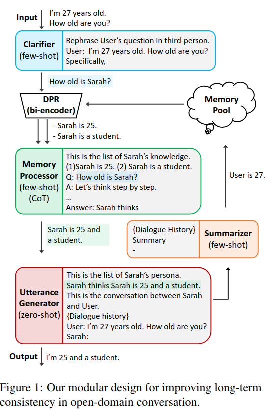

> Core Idea

<strong>"Introduce New Approach for Creating High-Quality Conversational Agents without Fine-Tuning"</strong> 

***

### <strong>Intro</strong>

$\textbf{이 주제의 정의 및 요구사항과 중요한 이유}$

- 수십억 개의 매개변수를 가진 언어 모델 (GPT-3 및 PaLM)은 많은 NLP 작업에서 최첨단 성능을 달성했다. 
  - 이러한 대규모 언어 모델(LLMs)을 오픈 도메인 챗봇 작업에 맞게 미세 조정하려면 대상 도메인을 대표하는 대화 데이터셋을 사용할 수 있다. 
  - 그러나 매개변수가 수십억 개에 달하는 모델을 업데이트하는 데 드는 계산 비용과 대화 도메인의 데이터 부족으로 인해 LLMs를 오픈 도메인 챗봇에 맞게 미세 조정하는 것은 어려울 수 있다.
  - 또한, 미세 조정은 모델을 특정 도메인에 제한함으로써 모델의 범용성을 저해할 수 있으며, Yang과 Ma(2022)의 보고에 따르면 사전 학습 중에 획득한 도메인 독립적 지식을 상실할 위험이 있다. 

$\textbf{이 주제의 문제점과 기존의 노력들}$

- Roller et al.(2021)이 제안한 대로 다양한 데이터셋을 사용한 멀티 태스크 학습은 범용성 문제를 해결할 수 있지만, 각 기술을 학습하기 위한 데이터 필요성과 오픈 도메인 챗봇에 필요한 기술을 결정하는 어려움과 같은 제한이 있다.
- 실제로 Blenderbot3(BB3)와 같은 챗봇 모듈의 증가 추세는 새로운 챗봇 모델에 대해 미세 조정을 수행할 때 데이터와 계산의 부담이 증가하고 있음을 보여준다.
- 흥미롭게도 일부 LLM은 context learning이라는 능력을 가지고 있다. 이는 추가적인 미세 조정 없이 짧은 지시문과 몇 가지 예시를 바탕으로 특정 작업에 신속하게 적응하고 이를 수행한다.
- 이를 활용하여 오픈 도메일 챗봇을 생성할 수 있으며, 몇 가지 예시를 LLM에 제공하여 현재 대화와 관련된 정보를 생성하도록 학습할 수 있다.

$\textbf{본 논문에서 해결하고자 하는 문제와 어떻게 해결하는지, 그 결과들}$

- 본 논문은 fine-tuning 없이 대화형 agent를 만드는 방법론 (MPC: Modular Prompted Chatbot)을 제시한다. 
  - 개별적인 module로써 pre-trained large language model을 활용한다. Few-shot prompting, chain-of-thought (CoT), external memory와 같은 기술을 사용하여 long-term consistency와 flexibility를 위함이다.  
  - Human evaluation에 따르면 MPC는 오픈 도메인 대화에서 fine-tuned chatbot model과 동등한 수준으로, 일관되고 매력적인 챗봇을 만드는 데 효과적인 solution이다. 

$\textbf{본 논문의 주요 기여점}$

- 미세 조정 없이 고품질 대화형 agent를 생성할 수 있는 새로운 접근 방식이다.
- 제안된 챗봇인 MPC는 Open-Source pre-trained LLM을 활용하여 open-domain chatbot module을 설계의 유연성을 증대한다.
- MPC는 LLMs를 통합한 모듈화된 agent를 few-shot ICL과 Chain-of-thought와 같은 prompt technique을 사용하여 다양한 대화형 능력을 향상시킨다.
- MPC는 이전의 chatbot이 겪었던 long-term consistency를 달성하기 위해 설계됐다.

***

### <strong>Related Work</strong>

***

### <strong>Method</strong>

- 대화 시작에서 미리 정의된 페르소나 (persona)는 memory pool에 저장된다. 
  - User가 message를 보내면 clarifier는 이를 다시 표현하여 모호성을 해결한 후, DPR model에 전달하여 memory pool에서 관련된 memory를 검색한다.
  - 검색된 memory와 clarifier 출력은 memory processor로 전달되어, 단일한 문맥 관련 메모리를 생성한다. (single context-relevant memory)
  - 이 메모리는 다시 utterance generator로 전달되어 챗봇의 응답을 생성한다. 
  - 몇 차례 대화 후에는 summarizer module을 호출하여 대화에서 중요한 정보를 추출하고, 이를 momory pool에 저장하여 향후 사용할 수 있도록 한다. 

$\textbf{Utterance Clarifier}$

- 대화가 종종 모호한 대명사 참조와 맥락적 단서로 혼란스워질 수 있기 때문에, clarifier module은 최근 대화를 입력으로 받아 모호성을 해결하는 LM으로 작동한다. 
  - E.g., 이전 맥락에 따라 사용자의 입력인 "Do you like working there?"은 "Does Sarah like working at ZYX company?"로 출력될 수 있다. 
  - 이러한 맥락적 모호성 해결을 통해 clarifier는 정보 밀도가 높은 쿼리를 제공하여 DPR model과 momory processor module이 관련 메모리를 검색하고 처리하도록 돕는다. 

- **즉, 사용자의 입력의 모호성을 없애고 3인칭으로 질문을 바꾼다.**
- Few-shot

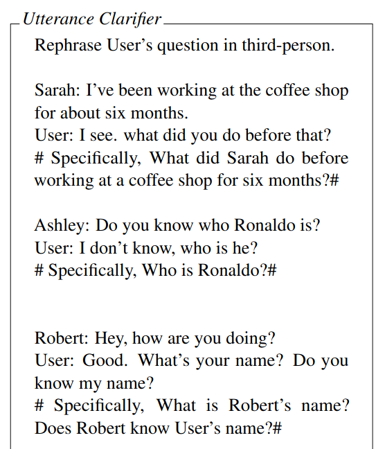

$\textbf{Memory Processor}$

- Clarifier의 출력 결과를 query로 사용 $\rightarrow$ DPR이 memory pool에서 상위 $k$개의 관련 memory를 검색 $\rightarrow$ memory processor는 하나의 정제된 memory로 압축

- Few-shot & CoT
  - DPR이 memory pool에서 관련된 memory를 memory processor에 전달하면, 다음과 같은 예제와 CoT를 보고 답할 것이다. 

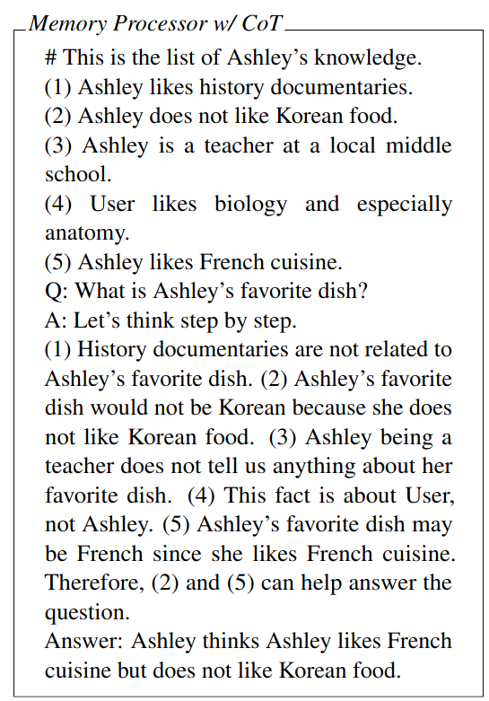

$\textbf{Utterance Generator}$

- 최근 대화 기록과 memory processor에서 제공된 memory를 바탕으로 chatbot의 최종 응답을 생성한다. 
- Prompt에는 0) 페르소나 (선택사항) 1) 대화 기록, 2) 정제된 메모리 by memory processor, 3) generation instruction (생성 지침)이 포함된다.
  - Generation instruction: "사용자에게 친근한 응답을 제공하세요", etc.
- Zero-shot

- 다음은 prompt가 어떻게 제공되는 지 보여준다.
- 첫 예시는 MPC의 persona가 일부 제공된 상태에서의 prompt 및 결과이다.

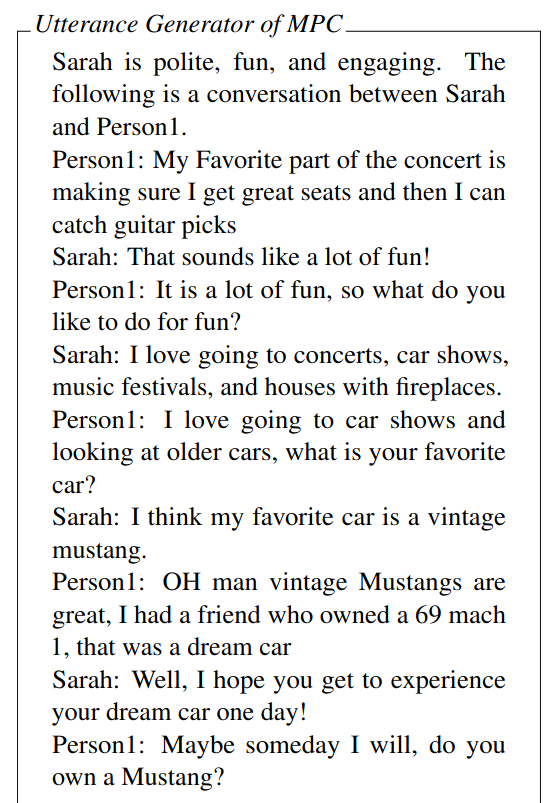

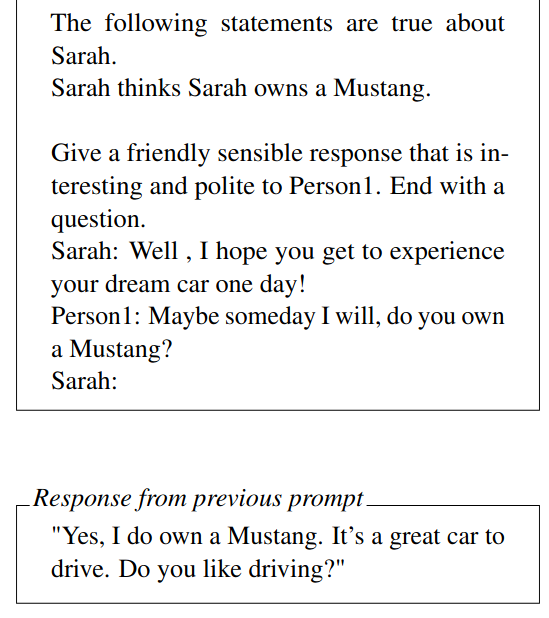

- 두 번째 예시는 persona가 모두 제공된 상태에서의 prompt 및 결과이다.

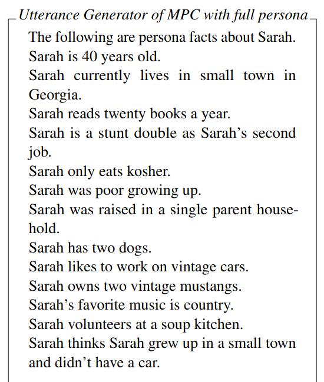

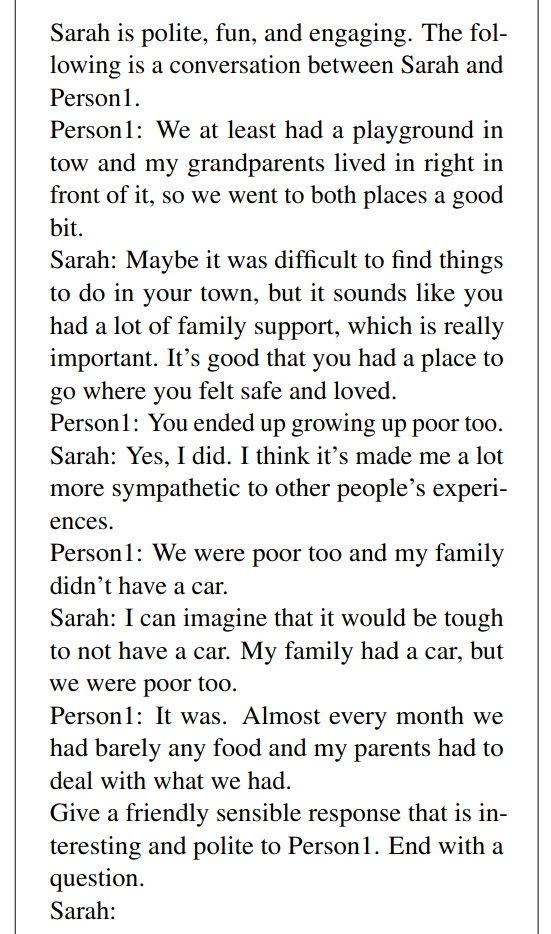

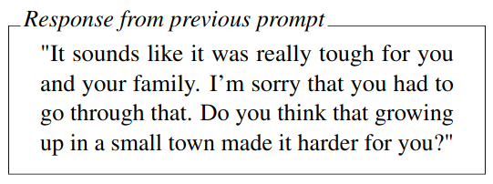

$\textbf{Dialogue Summarizer}$

- 대화와 사용자에 대한 구체적인 세부 정보를 기록하기 위해 few-shot prompt를 제공한다.

- Few-shot

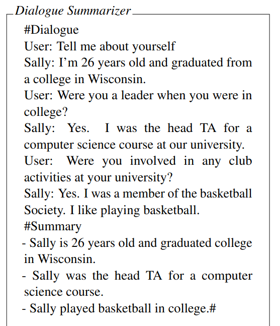

***

### <strong>Experiment</strong>

- 장기적인 대화에 필요한 핵심 기술을 평가하여 챗봇의 성능을 평가한다.
- 일관성을 평가하기 위해 PersonaChat에서 추출한 $12$개의 사실을 포함하는 $5$가지의 persona 중 하나를 선택하여 평가자들에게 제시했다.
- 각 실험에서 평가자별로 $20$개의 대화 turn을 수집했으며, 총 $500$개 이상의 턴을 Amazon Mechanical Turk와 대학생 그룹 두 하위 집단으로부터 수집했다. 

- Model은 총 $4$가지이다.
  - 1. Fine-tuned Chatbot model (BB3)
  - 2. Vanilla: 대화 기록에 페르소나를 전부 추가하거나, 페르소나를 추가하지 않고 단순히 문장을 생성하는 LM
  - 3. MPC: Utterance Generator에 전체 페르소나를 명시하지 않는 MPC
  - 4. MPC + 전체 페르소나: 전체 페르소나 추가

$\textbf{Single Model Evaluation}$

- 각 모델을 Sensibleness, Consistency, and Engagingness metrics (합리성, 일관성, 몰입도) 기준으로 별도로 평가했으며 최종 점수는 $5.0$ 만점이다. 
  - SCE-p: 모든 기준이 긍정적인 경우에만 긍정적인 응답으로 기록되는 완벽한 점수
  - SCE-w: SSI와 유사한 가중 점수

- MPC의 기본 언어 모델(LM)로는 다음을 사용했다:
  - OpenAI GPT-3 text-davinci-002(td2) 및 davinci
  - OPT 30B, 66B
  - GPT-JT-6B (Together, 2022)
  - BLOOM-176B (Scao et al., 2022)

- 파인튜닝 그룹에서는 BB3-30B를 사용했으며, 동일한 페르소나 설정이 적용되었습니다. BB3-175B의 경우, 크라우드워커들에게 온라인 데모를 평가하도록 요청하여 20개의 대화 턴을 수집했습니다.

> 대화 턴: 대화에서 한 쪽이 말하고, 그에 대해 다른 쪽이 응답하는 단위
> > 사용자: "안녕하세요, 오늘 날씨 어때요?", 챗봇: "안녕하세요! 오늘은 맑은 날씨입니다."

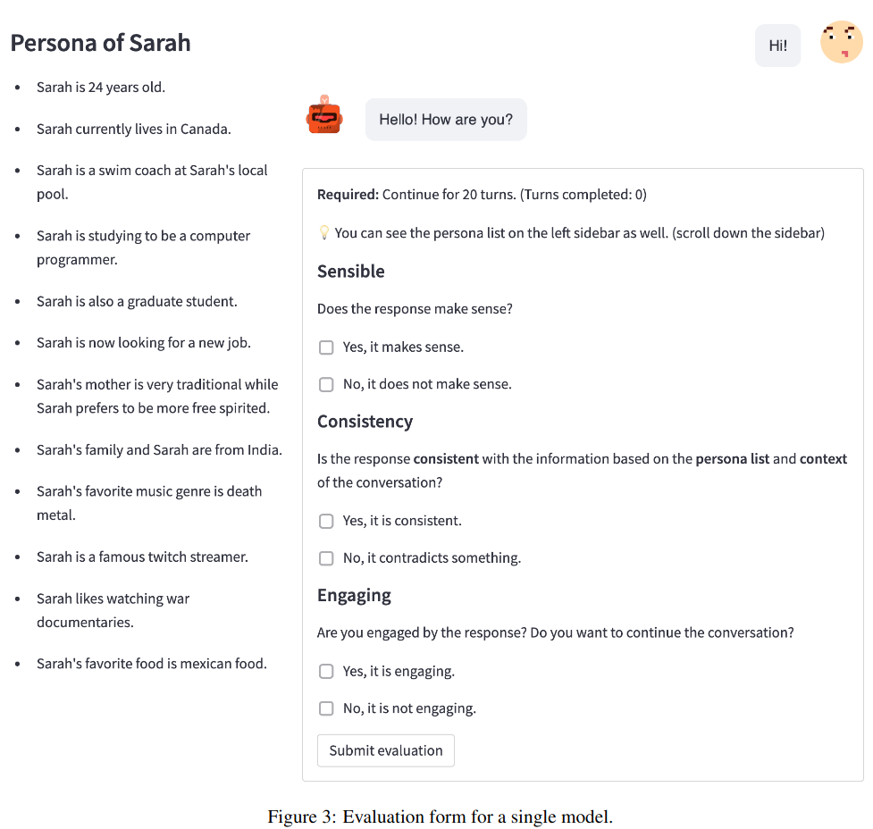

$\textbf{Pairwise Models Evaluation}$

- User에게 무작위로 제공된 $2$개의 응답 A와 B를 제공하고, 이를 합리성, 일관성, 흥미로움, 선호 기준으로 평가한다. 

- 구체적으로 두 가지 주요 실험을 수행한다:
  - MPC_OPT-30B vs. BB3-30B: 이 실험에서는 BB3의 인터넷 검색 기능을 비활성화하고 일관성에 집중합니다. BB3-30B는 OPT-30B의 파인튜닝된 버전이기 때문에 직접적인 비교가 가능합니다.
  - MPC_td2 vs. Vanilla td2 (전체 페르소나)

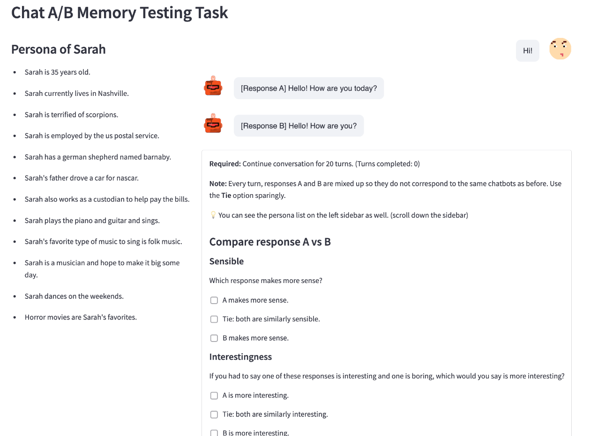

$\textbf{Results}$

- Single model evaluation
  - MPC가 모든 metric에서 fine-tuned model인 BB3-30B을 능가하고 있다.
  - **이때 BB3-30B는 연속하여 발화 반복 문제가 관찰되었다.** 

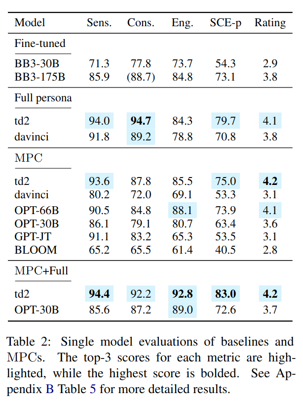

- MPC_{OPT-30B}와 BB3-30B을 비교하는 Pairwise Evaluation 결과이다.
  - 이는 상대적 성능을 평가한 것으로 예를 들어 Sensibleness는 $45.0 / 32.0 / 23.0$으로 MPC가 45%의 비율로 더 낫다는 평가를 받은 것이다. (Tie는 비김)
  - $p < 0.01$은 관찰된 차이가 유의미하며, 차이가 통계적으로 강하게 유의미하다는 것을 의미한다.
  - $p < 0.05$는 관찰된 차이가 유의미함을 의미한다. 
  - 반대로 $p >= 0.05$의 경우 차이가 통계적으로 유의미하지 않다고 해석되며, 관찰된 차이가 우연일 가능성이 높다는 걸 의미한다.
  - Single model evaluation과 동일하게, BB3-30B을 Sensibleness & Preference 측면에서 더 높은 점수를 기록했으며 나머지 값은 비슷하다.

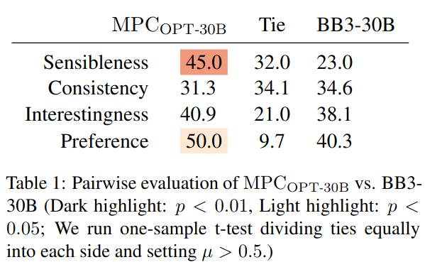

- 모듈형과 비모듈형의 비교이다.
  - Single model evaluation에서 MPC_{td2}가 vanilla (full persona)보다 성능이 낮음을 확인할 수 있다. 이는 persona의 차이로 MPC + Full에서 확인할 수 있다. 
  - 또한, persona가 없는 상태로 비교를 해도 MPC의 성능이 우월함을 알 수 있다. 

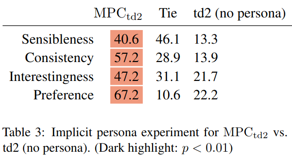

- 모델 크기의 효과
  - 다른 변수들이 동일할 때, 모델 크기가 긍정적인 평가와 비례한다는 것을 관찰했다. 가장 설득력있는 증거는 MPC_{OPT-66B}가 MPC_{OPT-30B}에 비해 모든 지표에서 우수한 성능을 보인다는 점에서 알 수 있다.
  - 두 모델의 base LM이 거의 동일하게 훈련되었기 때문에, 크기가 주요 요인으로 작용한 것으로 보인다. 
  - 그러나 모델 크기만이 유일한 요인은 아니다. 예를 들어 MPC_{BLOOM}은 가장 큰 모델 중 하나임에도 실험에서 가장 낮은 점수를 기록했다.

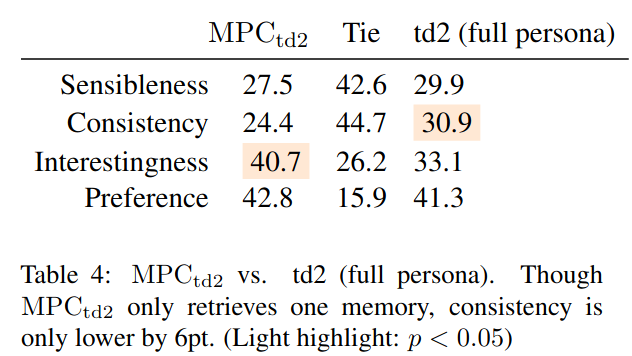

***

### <strong>Conclusion</strong>

$\textbf{Limitation}$

- 이 연구는 영어 장기 대화를 위한 pre-trained LM의 사용을 조사했다. 모듈형 접근법이 강력한 언어 모델을 사용할 경우, 다른 언어에도 효과적일 것으로 기대되지만, 이러한 결과를 다른 언어에 적용할 수 있는지는 추가 연구가 필요하다. 
- 한편 모듈형 시스템은 inference overhead나 오류 누적을 초래할 가능성이 있다. 각 모듈에 적합한 언어 모델을 선택해야 시스템 성능이 향상된다. 
- 현재로서는 최적의 챗봇 모델을 결정하는 확정적인 평가 방법이 없다. 

***

### <strong>Question</strong>

<a href="">link</a>

> 인용구
