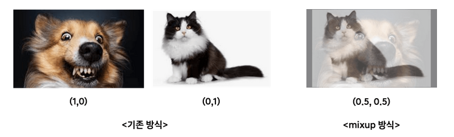
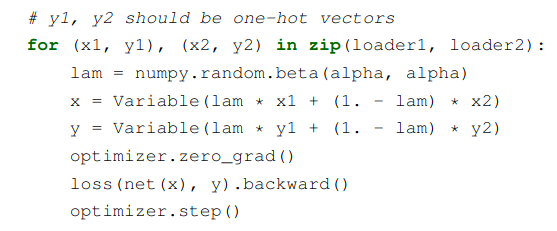
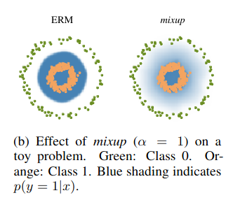
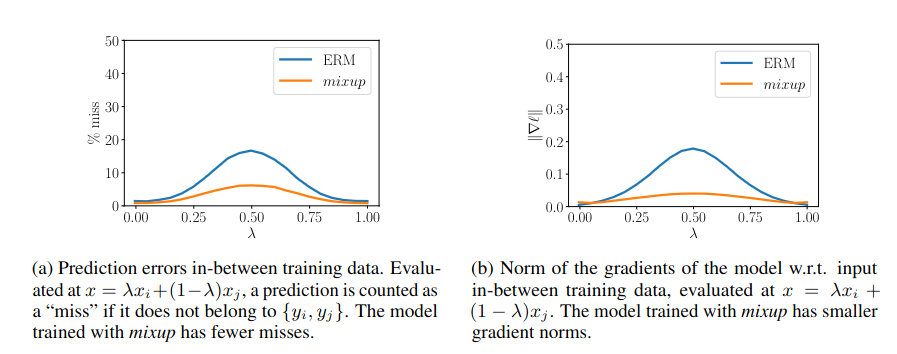
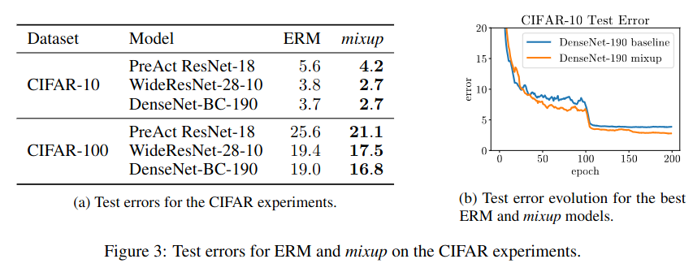

## Mixup: Beyond Empirical Risk Minimization
*arXiv(2017), 8198 citation*

[Intro](#intro) 
[Related Work](#related-work) 
[Method](#method) 
[Experiment](#experiment) 
[Conclusion](#conclusion) 

> Core Idea

<strong>"Improve generalization performance through interpolation data augmentation"</strong> 

***

### <strong>Intro</strong>
- 머신러닝과 딥러닝 모델은 복잡한 데이터 분포와 다양한 데이터셋에서 성능을 발휘해야 한다. 그러나 기존의 *Empirical Risk Minimization (ERM)* 방법은 이러한 복잡한 데이터 분포를 효과적으로 처리하는데 한계가 존재한다. 
- ERM: loss 들의 평균
- ERM 은 overfitting 의 위험을 내포하고 있으며, 데이터 포인트 간의 가정이 없어 복잡한 데이터 분포를 잘 처리하지 못한다. 
- 이러한 문제를 해결하기 위해, Mixup 이라는 새로운 학습 전략을 제시

***

### <strong>Related Work</strong>
- ERM: 경험적 위험 최소화라는 뜻으로, 우리는 일부 데이터만을 모아서 모델을 학습하게 된다. 결국 모델은 자신이 경험한 일부 데이터에 의존해 세상의 모든 데이터를 일반화하도록 학습이 된다. 
  - Overfitting: 일부 데이터가 전부인줄 알고 외우게 되면, test 시에는 성능이 떨어진다.
  - 데이터 포인트 간의 가정이 없다. 
    - label=0 이 강아지, label=1 이 고양이라면 그 중간은 없다. 즉, 고양이 같은 강아지는 고려하지 않는다.
  - 복잡한 데이터 분포 처리 능력이 떨어진다.
    - 문제가 복잡해질수록 개념이 분리되는 경계선에 걸쳐있는 데이터는 많을 것이다. 하지만 ERM 은 모 아니면 도로 이분법적 사고를 가진다. 특히 클래스 간의 경계가 복잡해질수록 취약하다.

***

### <strong>Method</strong>
- Train image $2$ 개를 interpolation 하여 하나의 data 를 만들어낸다. 
- 두 개의 data 를 섞었기 때문에 label 도 (0,1) 이나 (1,0) 이 아닌 (0.5,0.5) 이다. 
- 마치, 이 그림은 강아지면서 동시에 고양이야!

- Interpolation code in paper

***

### <strong>Experiment</strong>
- Mixup 을 통해 학습한 데이터 분포를 보면, 좀 더 넓게 분포하고 있다. 즉, 모델의 융통성이 좋아졌다고 볼 수도 있다. 

- Muxup 의 방식을 사용하면 prediction error 가 낮아질 뿐만 아니라, gradient norm 이 감소하여 일반화 성능이 올라간다. 

- CIFAR10/100 에 대해서 실험 시, 성능이 더 좋다.

***

### <strong>Conclusion</strong>
- Mixup 은 prediction error 와 gradient norm 을 줄이는 효과를 가진다.
- 모델의 일반화 성능을 향상시키고 데이터의 다양성을 증가시켜 과적합을 방지할 수 있다.
- Data augmentation 의 일종
- 단점으로는 interpolation 비율을 정해야 하므로 hyper-parameter 가 늘어나는 것과 augmentation 으로 인한 학습 시간 증가가 있다.

***

### <strong>Question</strong>

