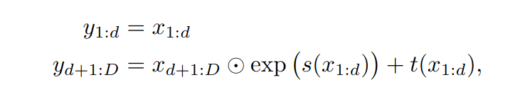
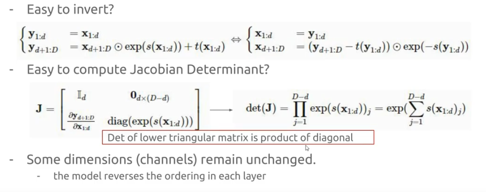
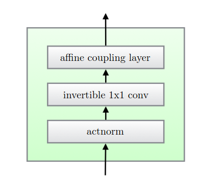
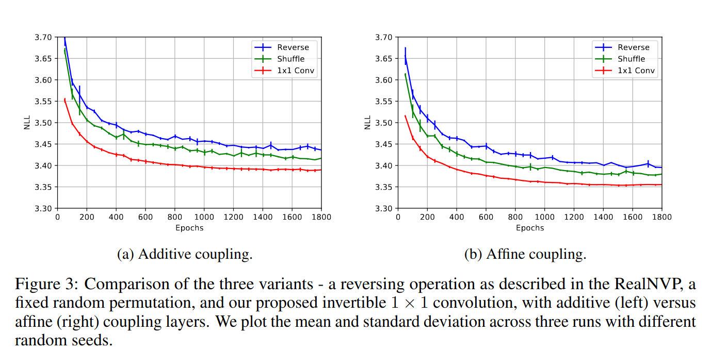

## NICE: Non-Linear Independent Components Estimation
*arXiv(2014), 2221 citation, Review Data: 2024.05.18*

[Intro](#intro) 
[Related Work](#related-work) 
[Method](#method) 
[Experiment](#experiment) 
[Conclusion](#conclusion) 

> Core Idea

<strong>"Represent Non-Linear Transformation with Coupling Layer"</strong> 

***

### <strong>Intro</strong>

$\textbf{이 주제의 정의 및 요구사항과 중요한 이유}$

- 알 수 없는 복잡한 data distribution 을 modeling 하는 것은 중요하다. 

$\textbf{이 주제의 문제점과 기존의 노력들}$

- 대부분의 딥러닝 모델에서 사용하는 함수들은 역함수가 존재하지 않는다. (ReLU, Pooling, Convolution)
- Jacobian 의 determinant 를 구하기 어렵다 (계산량 등)

$\textbf{본 논문에서 해결하고자 하는 문제와 어떻게 해결하는지, 그 결과들}$

- Motivation: data 의 분포가 modeling 되기 쉽게 바꾸자 using transformation 

- 복잡한 high-dimensional densities 를 modeling 하는 deep learning framework 를 제안한다.
  - Latent space 로 data 를 mapping 하는 non-linear deterministic transformation $f$ 를 학습한다. 
  - Transformed data 는 독립적인 latent variable 을 가지는 분포이다. (즉, 우리가 modeling 하기 쉬운 분포로 변환)
  - 본 논문에서는 Jacobian 과 역 Jacobian 의 determinant 계산이 쉬우면서도 복잡한 non-linear transformation 을 학습할 수 있도록 이 transformation 을 parameterize 했다. 
  - 학습은 정확한 log-likelihood (=tractable) 이다.
  - Generative model: $4$ 가지 image dataset (can be used for inpainting)

***

### <strong>Method</strong>

먼저 *Normalizing Flow* 의 기본 이론에 대해서 알아보자!!

- Inference: data $x$ 를 $h$ 로 mapping
- Generation (sampling): $h$ 에서 $x$ 로 mapping 

$\textbf{Change of Variable}$

- $x \sim p_X(x)$: data (random variable)
- $h \sim p_H(h)$: random variable and its known pdf (in this paper, prior distirbution $p_{H_N}$ 는 standard isotropic Gaussian)
- $f$: invertible transformation 
- $h = f(x), x = f^{-1}(h)$

- 여기서 알 수 있는건, 어떤 비선형 변환 $f$ 를 data $x$ 에 적용시켜 $h$ 를 만들었다는 것이다.  

- PDF 의 적분은 $1$ 임을 이용하여 전개한다.

$$ \int p_X(x) dx =  \int p_H(h) dh =1 $$

$$ \frac{d}{d x} \int p_X(x) dx = \frac{d}{d x} \int p_H(h) dh $$

$$ p_X(x) = \frac{d}{d x} \int p_H(h) \det{(\frac{dh}{dx})} dx = p_H(h) \det{(\frac{dh}{dx})}= p_H(f(x))\det(\frac{df(x)}{dx}) $$

- 결국엔 다음의 수식을 만족한다. 

$$ p_X(x) = p_H(f(x))\det(\frac{df(x)}{dx}) $$

- **NOTE**
  - $x$ 에 어떤 비선형 변환 $f$ 을 적용하여 $h$ 에 mapping 한다고 봤을때, 이는 미소 영역에 대해서 $x$ 와 Jacobian 행렬을 곱해서 선형 변환으로도 볼 수가 있다. 
  - 이때, Jacobian 의 determinant 는 $x$ 기저가 이루는 단위 면적이 $h$ 로 변환하면 얼마나 늘어나는 가를 나타낸다. 

$$ dh = \det{(\frac{dh}{dx})} dx = \det(\frac{df(x)}{dx})dx$$

- 보통 $x$ 는 매우 복잡한 분포를 갖는다. 따라서 $x$ 와 $z$ 는 하나의 함수로 연결하기는 어려워서 많은 함수를 이어서 연결해준다. 
  - 즉, DDPM 과 다르게 한 layer 가 transformation $f$ 을 담당한다. 

$$ 
p_X(x) = p_{H_1}(h_1) \det(\frac{dh_1}{dx}) 
$$

$$
p_{H_1}(h_1) = p_{H_2}(h_2) \det(\frac{dh_2}{dh_1}) 
$$

$$
p_{H_2}(h_2) = p_{H_3}(h_3) \det(\frac{dh_3}{dh_2}) 
$$

$$
.
$$

$$
.
$$
 
$$
.
$$

$$
p_{H_{N-1}}(h_{N-1}) = p_{H_N}(h_N) \det(\frac{dh_N}{dh_{N-1}}) 
$$

- So, 

$$ p_X(x) = p_{H_N}(h_N) \prod_{i=1}^N\det(\frac{dh_i}{dh_{i-1}}) \ , \text{if} \ \ i=1, \ h_0 = x $$

- $\log$ (최종적인 목적 함수)
  - Data $x$ 를 input 으로 $h$ 를 만들어서 아래의 함수를 maximize 하면, likelihood 를 maximize 하는 것이다. 

$$ \log p_X(x) = \log p_{H_N}(h_N) + \sum_{i=1}^N\log \det(\frac{dh_i}{dh_{i-1}}) \ , \text{if} \ \ i=1, \ h_0 = x $$

- 여기서 우리는 *normalizing flow* 를 구현하기 위해 $2$ 가지 조건이 필요함을 알 수 있다. 
  1. Transformation $f$ 의 역함수가 존재해야한다. 
  2. Jacobian 의 determinant 를 계산할 수 있어야 한다. 

$\textbf{Coupling Layer}$

- 본 논문의 핵심은 Jacobian 의 determinant 와 inverse $f^{-1}$ 을 쉽게 구할 수 있게 설계하는 것이다. 
  - Coupling layer 를 사용하여 $f$ 를 다음과 같이 구성하여 조건을 만족시킨다.
    - 이때, $f$ 와 $m$ 은 서로 다르고 $f$ 안에 network $m$ 이 있음을 상기해야한다.

- $x$ 를 $(x_1, x_2)$ 로 나누고 $(y_1, y_2)$ 의 form 으로 변환한다. 
  - $m$: 임의의 복잡한 함수 (E.g., ReLU MLP)
  - 즉 $m$ 에서만 neural network 가 존재한다. 

- 일반적인 coupling layer 

- 일반적인 coupling layer 에서, $g$ 를 additive coupling layer 로 본다면 다음과 같다.

$$ y_1 = x_1 \\ y_2 = x_2 + m(x_1) $$

- 이렇게 변환하면 어떤 $m$ 에 대해서도 Jacobian determinant 가 $1$ 이고 역함수도 다음과 같이 구하기 쉽다. 
  - $\frac{\partial y_{I_2}}{\partial x_{I_2}} = 1$
  - Triangular matrix 의 determinant 는 주대각 성분들의 곱으로 표현된다. 

$$ x_1 = y_1 \\ x_2 = y_2 - m(y_1) $$

$\textbf{Code Reivew}$

- Sampling 
  - $2$ 개의 prior distribution 중 선택해야한다. 이는 논문에도 나와있다. 
  - Input dim 의 size 로 생성할건데, grid size 는 args.nrows 와 args.ncols 로 결졍된다. 
  - nice.inverse 를 통해 sampling 된다. 

- Loss 

- Coupling layer
  - 항상 같은 위치의 $x_1$ 이 network input 으로 들어가는게아니라 'even', 'odd' 로 구분지어서 짝수 인덱스 열 또는 홀수 인덱스 열에 대해서 $x_1, x_2$ 가 선정된다.
  - Partition 이 even 이면 홀수 인덱스 열이 $x_1$ 이 되고 layer 의 input 으로 들어가서 수식이 전개된다.
  - 각 layer 는 ReLU 로 비선형성을 챙겼다.
  - Inverse 는 forward 의 반대순서로 간다. 
  - _get_even: 짝수 인덱스만 챙긴다.

$\textbf{Additional Paper Review}$

1. RealNVP

- Affine coupling layers 
  - NICE 에서는 coupling layer 를 사용하여 $f$ 의 역함수를 구하기 쉽고, Jacobian 의 determinant 를 쉽게 계산할수 있도록 구성했다. 
  - 하지만, NICE 에서는 내부의 $g$ function 으로 단순하게 additive function 을 사용했다. 이는 다양한 장점이 있지만 단순하게 $+$ 를 사용했기에 복잡한 데이터를 표현하기 어렵다. 
  - 따라서 Affine coupling layers 를 제안한다. ($Ax+b$)

- Affine coupling layer 로 구성해도 역함수를 구하기 쉽고, determinant 도 구하기 쉽다. 
  - $s, t$: DNN

2. GLOW 

- Flow 는 *Actnorm, Invertible $1\times1$ Conv, Affine coupling layer* 로 구성되어 있다. 
  - Actnorm: Activation output 에 affine transformation 을 적용하는 것이다. 
  - Invertivel $1 \times 1$ Conv: Coupling layer 의 input 을 split 하는 용도로 사용된다. 
    - 이는 coupling layer 의 input 의 split 할 때 항상 $y_1$ 에 대해선 어떠한 변환도 이루어지지 않기에 제안됐다. 
    - 극단적으로, 한 이미지의 반절이 그대로 남아있는데 $x \rightarrow h$ 로 mapping 했다는 것이다. 
    - 따라서 $x_1$ 이 고정된 channel 의 반절이 아니라 적절하게 섞어주는데 이전의 모델들은 (NICE, realNVP) 사용자가 임의로 설정했다. (e.g., 'even', 'odd' in NICE)
    - GLOW 에서는 이 섞는 과정조차 학습 대상으로 보고 $1 \times 1$ conv 로 channel 들을 섞어준 것이다. 
  - Affine coupling layer: 이는 batch normalization 과 유사하지만 batch size 1 에서 작동한다. 

***

### <strong>Experiment</strong>

***

### <strong>Conclusion</strong>

***

### <strong>Question</strong>

